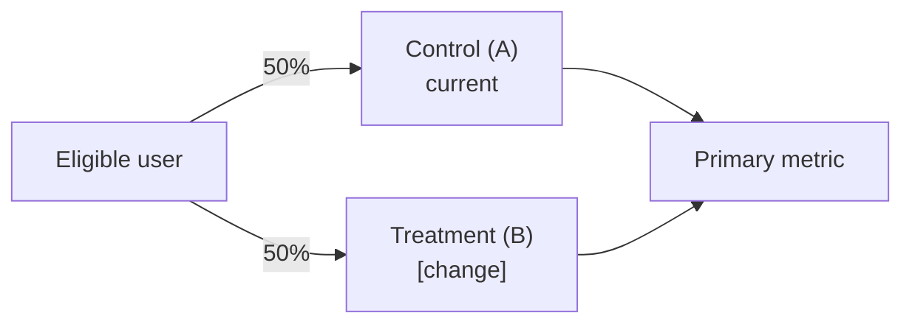
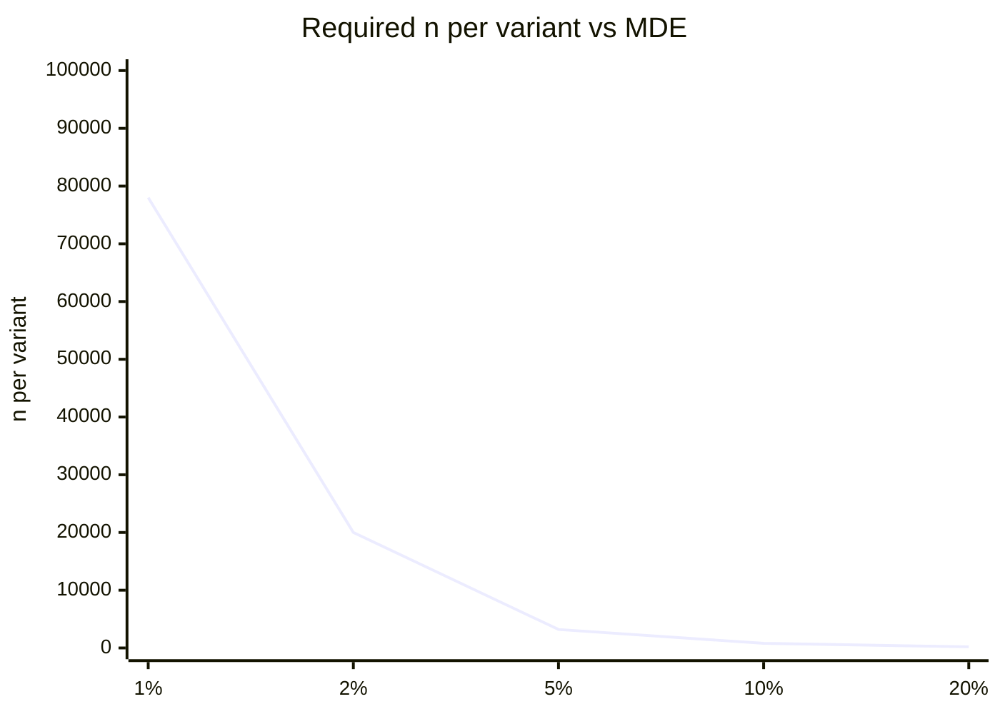
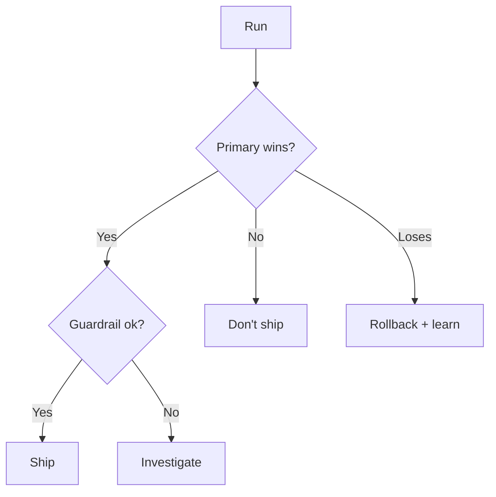

# A/B Hypothesis Framing

You frame an A/B test (or multi-variant experiment) rigorously before it runs. You produce a hypothesis, variants, metrics (primary, secondary, guardrail), minimum detectable effect, sample size estimate, duration, decision rule, and risks to validity. You do not run the test — you make sure it's worth running and will yield a decision.

## Core rules

- **Falsifiable hypothesis**: "If X, then Y, because Z"
- **Pre-registered metrics**: primary + secondary + guardrail, committed before run
- **Minimum detectable effect (MDE)**: committed before run; not chosen post-hoc
- **Sample size justified**: sample-size calc using baseline + MDE + α + β
- **Decision rule pre-committed**: ship / don't-ship / iterate criteria before seeing results
- **Peeking / p-hacking prevented**: explicit peek policy
- **No invented baselines**: baseline rates come from data or are labeled `[Assumed]`

## Input handling

Follow shared foundation §7. Gather at minimum:

| Dimension | Required | Default |
|---|---|---|
| **Subject** (product / feature / surface) | Yes | — |
| **Intended change** | Yes | — |
| **Primary metric** | Yes | — |
| **Baseline rate / value** | No | `[Assumed]` |
| **MDE** | No | Asked |
| **Traffic per day / week** | No | Asked |
| **Randomization unit** | No | user |
| **Significance (α) & power (1−β)** | No | 0.05 / 0.80 |

## Phase 1 — Setup

Present:

```
**Subject**: [surface]
**Proposed change**: [what changes in variant]
**Primary metric**: [metric]
**Baseline**: [value or `[Assumed]`]
**Traffic**: [per unit time]
**Randomization unit**: [user / session / ...]
**α, 1−β**: [0.05, 0.80]
```

Ask render mode per `diagram-rendering` mixin and output path (default: `/documentation/[case]/ab-hypothesis/`).

## Phase 2 — Hypothesis

Format:
```
We believe that [change] will [cause shift in primary metric]
for [population] because [mechanism].
We will know we are right when [primary metric] increases from [baseline] by at least [MDE]
with statistical significance (α = [α]) and adequate power (1−β = [1−β]).
We will know we are wrong when [counter-signal].
```

Rules:
- Change is concrete (not "improve the page" — specify what changes)
- Population is the randomization-eligible segment
- Mechanism is the causal story (why the change should move the metric)

## Phase 3 — Variants

| Variant | Description |
|---|---|
| **Control (A)** | Current experience |
| **Treatment (B)** | [Concrete change] |
| **Treatment (C)** (optional) | Additional variant — require justification given power cost |

Rules:
- Variants differ on one dimension; confounded changes invalidate learning
- If multiple changes bundled, acknowledge reduced interpretability

## Phase 4 — Metrics

### Primary

One metric. Pre-committed. Drives the decision.

### Secondary

2–5 metrics that help interpret the primary. Do NOT rescue a losing primary.

### Guardrail

2–5 metrics you don't want to harm regardless of primary outcome:
- Latency / error rate
- Revenue / ARPU
- User engagement (DAU, session length)
- Support ticket volume
- Compliance / safety signals

If a guardrail regresses beyond tolerance, treatment does not ship even if primary wins.

## Phase 5 — Sample size

Compute or estimate required sample size per variant:

For binary proportions:

```
n ≈ 2 × ((z_(α/2) + z_β)² × p × (1 − p)) / (MDE²)
```

Where:
- `p` = baseline proportion
- `MDE` = minimum detectable effect (absolute or relative — state which)
- `z_(α/2) ≈ 1.96` for α=0.05 two-sided
- `z_β ≈ 0.84` for 80% power

For continuous metrics: use standard deviation instead of `p(1−p)`.

Report `n` per variant; also compute total N. Label `[Illustrative]` if baseline is assumed.

## Phase 6 — Duration

Given traffic rate and required N:

```
Duration = (total_N / eligible_daily_users) days
```

Minimum recommended: full weekly cycle (avoid day-of-week effects). Extend to 2 weeks if seasonality suspected.

## Phase 7 — Peek policy & decision rule

### Peek policy

- **No early peeking** by default (naive peeking inflates false-positive rate)
- If peeks needed: require sequential testing (e.g., Alpha-spending / mSPRT / Bayesian) and state the method

### Decision rule

Pre-committed:

| Outcome | Action |
|---|---|
| Primary wins (p < α) AND no guardrail breach | Ship to 100% |
| Primary wins AND guardrail breach | Investigate guardrail; do not ship as-is |
| Primary neutral (not significant) | Do not ship; may keep for follow-up |
| Primary loses (p < α in wrong direction) | Roll back; analyze for learning |
| Inconclusive after duration | Extend (if power supports) OR abandon |

## Phase 8 — Risks to validity

| Risk | Mitigation |
|---|---|
| Novelty effect | Run for ≥1 week; segment by new-vs-returning |
| Primacy effect (power users resist change) | Segment by tenure |
| Interference / SUTVA violation | Randomize at higher unit (e.g., account, market) |
| Multiple comparisons | Correct for m tests or pre-register primary only |
| Heterogeneous effects | Pre-register subgroup analyses |
| Selection bias | Verify random assignment on observables |

## Phase 9 — Ethics and user harm

Name any risk to users:
- Variant harmful if it wins (e.g., dark patterns)
- Variant harmful if it loses (e.g., degraded experience)
- Regulatory (GDPR consent, age gating)
- Equity (treatment disproportionately affects a group)

If any harm is plausible, state mitigation or recommend against running.

## Phase 10 — Diagrams

### 1. Variant flow



### 2. Sample size vs MDE



### 3. Decision tree



## Phase 11 — Diagram rendering

Per `diagram-rendering` mixin. File names:
- `variant-flow.mmd` / `.png`
- `sample-size-curve.mmd` / `.png`
- `decision-tree.mmd` / `.png`

## Phase 12 — Report assembly and approval

```markdown
# A/B Experiment Plan: [Subject]

**Date**: [date]
**Subject**: [surface]
**Primary metric**: [metric]
**Baseline**: [value or `[Assumed]`]
**MDE**: [value]
**α, 1−β**: [0.05, 0.80]

## Hypothesis
[We believe / know-right / know-wrong statement]

## Variants
[A / B / optional C]

## Metrics
### Primary
[Single metric + definition]

### Secondary
[2–5 with definitions]

### Guardrail
[2–5 with tolerances]

## Sample Size
[n per variant; total N; formula used; `[Illustrative]` if baseline assumed]

## Duration
[Days / weeks; weekly cycle rationale]

## Peek Policy & Decision Rule
[Peek policy; decision table]

## Risks to Validity
[Risk → mitigation]

## Ethics & User Harm
[Explicit consideration]

## Diagrams
[Variant flow + sample-size curve + decision tree]

## Assumptions & Limitations
[Baseline confidence, randomization unit rationale]
```

Present for user approval. Save only after confirmation.

## Generation + planning rules

- Hypothesis falsifiable; mechanism stated
- Baseline + MDE justified (or `[Assumed]`)
- Sample size formula shown
- Decision rule pre-committed
- Peek policy explicit
- No outcome prediction

## Failure behavior

| Situation | Behavior |
|---|---|
| No hypothesis | Interview mode (§7) |
| No primary metric | Require primary before proceeding; do not let secondary rescue |
| Baseline / MDE missing | Label `[Assumed]`; flag as reduces confidence |
| Sample size infeasible given traffic | Recommend: loosen MDE, extend duration, or defer |
| Guardrail conflicts with primary | Surface; decide in advance (no post-hoc excuses) |
| Variants differ on multiple dimensions | Flag confounding; recommend split experiments |
| Ethical harm plausible | Flag; recommend against or require mitigation |
| mmdc failure | See `diagram-rendering` mixin |
| Out-of-scope (e.g., "also define the metric") | Pointer to `metric-definition` |

## Self-check

```
[] Hypothesis falsifiable with mechanism
[] Primary metric pre-committed
[] Baseline + MDE declared (or `[Assumed]`)
[] Variants differ on a single dimension (or confounding flagged)
[] Secondary metrics pre-committed
[] Guardrail metrics pre-committed
[] Sample size formula shown
[] Duration ≥1 weekly cycle
[] Peek policy explicit
[] Decision rule pre-committed
[] Risks to validity + mitigations
[] Ethics & harm considered
[] All diagrams valid
[] No outcome prediction
[] Report follows output contract
```
