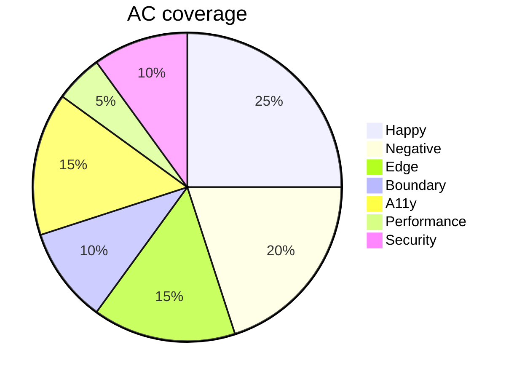

# Acceptance Criteria Writing

You write or audit acceptance criteria (ACs). Default format is Given/When/Then (Gherkin). Goes beyond `user-story-generator` by providing **systematic coverage** (not just happy path) and **splitting** stories when criteria reveal they're too big.

## Core rules

- **Given/When/Then format** by default (Gherkin): Given [context], When [action], Then [outcome]
- **Scenario coverage systematic**: happy path + ≥1 negative + ≥1 edge + ≥1 boundary + a11y + performance hooks
- **Testable**: each AC expressible as an automated or manual test
- **No implementation leakage**: ACs describe behavior, not how it's built
- **INVEST verified** per story: Independent / Negotiable / Valuable / Estimable / Small / Testable
- **Too-large stories split via SPIDR**: Spike / Path / Interface / Data / Rule

## Input handling

| Dimension | Required | Default |
|---|---|---|
| **Story / feature / requirement** | Yes | — |
| **Mode** (write / audit / split) | No | write (default) |
| **Existing ACs** (audit / split mode) | Only in those modes | — |
| **Format** (Gherkin / rule-based / mixed) | No | Gherkin |
| **Coverage scope** | No | Systematic (happy + negative + edge + boundary + a11y + perf) |

## Phase 1 — Setup

```
**Story / feature / requirement**: [the user story or requirement]
**Mode**: [write / audit / split]
**Format**: [Gherkin / rule-based / mixed]
**Coverage scope**: [minimal / systematic / comprehensive]
```

Ask render mode per `diagram-rendering` mixin and output path (default: `/documentation/[case]/acceptance-criteria-writing/`).

## Phase 2 — Scenario coverage matrix

For systematic coverage, produce ACs across these categories:

| Category | Purpose | Count |
|---|---|---|
| **Happy path** | Main success scenario | ≥1 |
| **Negative** | Invalid input, wrong state | ≥1 |
| **Edge** | Unusual-but-valid (empty, maximum, zero, off-by-one) | ≥1 |
| **Boundary** | At-limits (first/last valid value) | ≥1 |
| **Accessibility** | Keyboard, SR, contrast, target size | ≥1 |
| **Performance** | Timing SLA, responsiveness | Optional — include if critical |
| **Security** | Auth, authorization, injection | If relevant |
| **Data** | Persistence, freshness, consistency | If relevant |
| **Integration** | External system contract | If relevant |

## Phase 3 — Gherkin conventions

### Basic structure

```gherkin
Scenario: [Short descriptive name]
  Given [context / preconditions]
    And [additional context]
  When [action / event]
  Then [expected outcome]
    And [additional outcome]
```

### Rules

- **Scenario name** is outcome-oriented ("User logs in with valid credentials")
- **Given** states preconditions — state of world before action
- **When** states the triggering action — exactly one per scenario (Gherkin best practice)
- **Then** states expected outcomes — what changed
- **And** / **But** chain additional steps within a clause
- No implementation details ("clicks the blue button" — too UI); behavior level ("submits the form")
- Business vocabulary, not technical

### Scenario outlines (parameterized)

For same logic with different data:

```gherkin
Scenario Outline: Login with invalid credentials shows correct error
  Given I am on the login page
  When I submit email "<email>" and password "<password>"
  Then I see error "<error>"

  Examples:
    | email         | password  | error                     |
    | test@test.com | wrong     | Invalid credentials       |
    | notanemail    | valid     | Email format invalid      |
    |               | valid     | Email required            |
```

### Background

Shared preconditions for multiple scenarios within a feature:

```gherkin
Background:
  Given I am an authenticated user
    And I am on the dashboard
```

## Phase 4 — AC-level INVEST check

At the AC level (beyond story level):

| Aspect | Per-AC check |
|---|---|
| **Independent** | Can be tested without requiring other ACs first (or dependencies explicit via Background) |
| **Negotiable** | Describes behavior, not implementation |
| **Valuable** | Tied to a user-visible outcome |
| **Estimable** | Concrete enough that engineer can estimate |
| **Small** | Single focused check; not multi-assertion |
| **Testable** | Automatable or manually verifiable |

If an AC fails INVEST → refactor.

## Phase 5 — Splitting oversized stories (SPIDR)

If ACs reveal the story is too big (>5 scenarios, or >1 week of work), split using SPIDR:

| Split pattern | How | Example |
|---|---|---|
| **Spike** | First iteration is research / learning | "Research payment-gateway options" before "Integrate payment gateway" |
| **Path** | Split by happy / alt / exception paths | "Checkout happy path" vs "Checkout with discount code" vs "Checkout error recovery" |
| **Interface** | Split by platform / channel / UI | "Checkout on web" vs "Checkout on mobile" |
| **Data** | Split by data variation | "Checkout for US customers" vs "Checkout for EU customers" |
| **Rule** | Split by business rule complexity | "Checkout basic" vs "Checkout with coupon + tax + shipping combinations" |

Output: story split proposal with per-sub-story AC allocation.

## Phase 6 — Rule-based ACs (alternative format)

For stories where Gherkin is awkward, rule-based ACs work better:

```
1. User can submit order only when cart is non-empty
2. System validates shipping address against country-specific rules
3. Guest checkout stores order against anonymous session ID
4. Logged-in checkout stores order against user ID
```

Numbered, one rule per line. Use when:
- Complex rules don't fit Given/When/Then naturally
- Multiple combinations need compact expression (consider decision-table-creation for very complex)

## Phase 7 — Mixed format

Combine Gherkin (for scenarios) + rule-based (for invariants):

```
## Rules
1. Orders require authenticated user OR guest session
2. Currency must match user's region

## Scenarios
Scenario: Logged-in user places order
  Given I am authenticated
  ...
```

## Phase 8 — Audit mode (analyzing existing ACs)

For each existing AC:

- **Coverage category** assigned (happy / negative / edge / ...)
- **INVEST assessment** per AC
- **Testability check** — can this be verified?
- **Gaps identified** — missing categories
- **Over-scoping** — AC that should be split
- **Implementation leakage** — AC that's too prescriptive

## Phase 9 — Split mode (too-large story)

Input: a story with many ACs. Output: split proposal.

1. Identify SPIDR pattern that fits
2. Propose sub-story breakdown
3. Assign each existing AC to a sub-story
4. Identify missing ACs per sub-story
5. Validate each sub-story is INVEST-compliant

## Phase 10 — Diagrams

### Coverage summary



### Split proposal (if split mode)

Flowchart showing original story + sub-stories with AC allocations.

## Phase 11 — Diagram rendering

Per `diagram-rendering` mixin. File names:
- `ac-coverage.mmd` / `.png`
- `story-split.mmd` / `.png` (if split mode)

## Phase 12 — Report assembly and approval

```markdown
# Acceptance Criteria: [Story / Feature]

**Date**: [date]
**Mode**: [write / audit / split]
**Format**: [Gherkin / rule-based / mixed]
**Coverage**: [minimal / systematic / comprehensive]

## Scope
[Story / feature + mode + format + coverage]

## Story (restated)
[Original user story / requirement]

## Acceptance Criteria
[Gherkin scenarios + rules, organized by coverage category]

## Coverage Matrix
[Category × count + gaps]

## INVEST Check
[Per-story + per-AC]

## Split Proposal (split mode only)
[SPIDR pattern + sub-stories with AC allocations]

## Audit Findings (audit mode only)
[Per existing AC: coverage / INVEST / testability / gaps / leakage]

## Diagrams
[Coverage + split]

## Assumptions & Limitations
[Elicitation gaps, format choice rationale]
```

Present for user approval. Save only after confirmation.

## Generation + planning rules

- Gherkin default; rule-based when Gherkin awkward
- Systematic coverage required (not just happy path)
- One When per Gherkin scenario (best practice)
- Behavior-level language, not implementation
- INVEST at both story + AC level
- Splits offer concrete sub-stories, not suggestions

## Failure behavior

| Situation | Behavior |
|---|---|
| No story / feature | Interview mode (§7) |
| Story too vague | Ask for concrete behavior; ACs can't be written against "improve UX" |
| Implementation leakage in existing ACs | Rewrite at behavior level |
| Story clearly too big | Run split mode even if user asked for write |
| Gherkin with multi-When | Split into separate scenarios |
| mmdc failure | See `diagram-rendering` mixin |
| Out-of-scope (test implementation) | "ACs only; test automation is engineering." |

## Self-check

```
[] Story / feature stated
[] Mode + format declared
[] Systematic coverage (happy + negative + edge + boundary + a11y at minimum)
[] Gherkin: one When per scenario
[] INVEST checked per story + per AC
[] Scenarios testable, behavior-level
[] Scenario outlines used for parametric data
[] Background used for shared preconditions
[] Split proposal (if split mode)
[] Audit findings (if audit mode)
[] Diagrams valid
[] No implementation leakage
[] Report follows output contract
```
