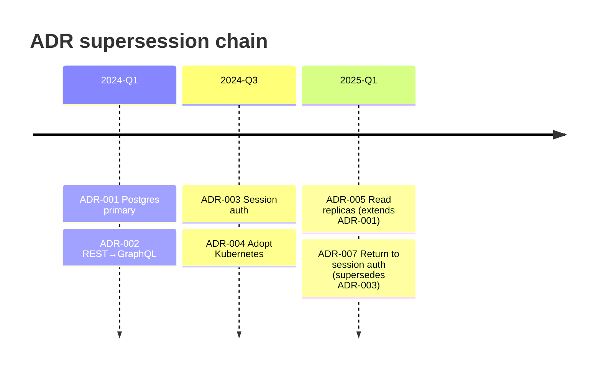
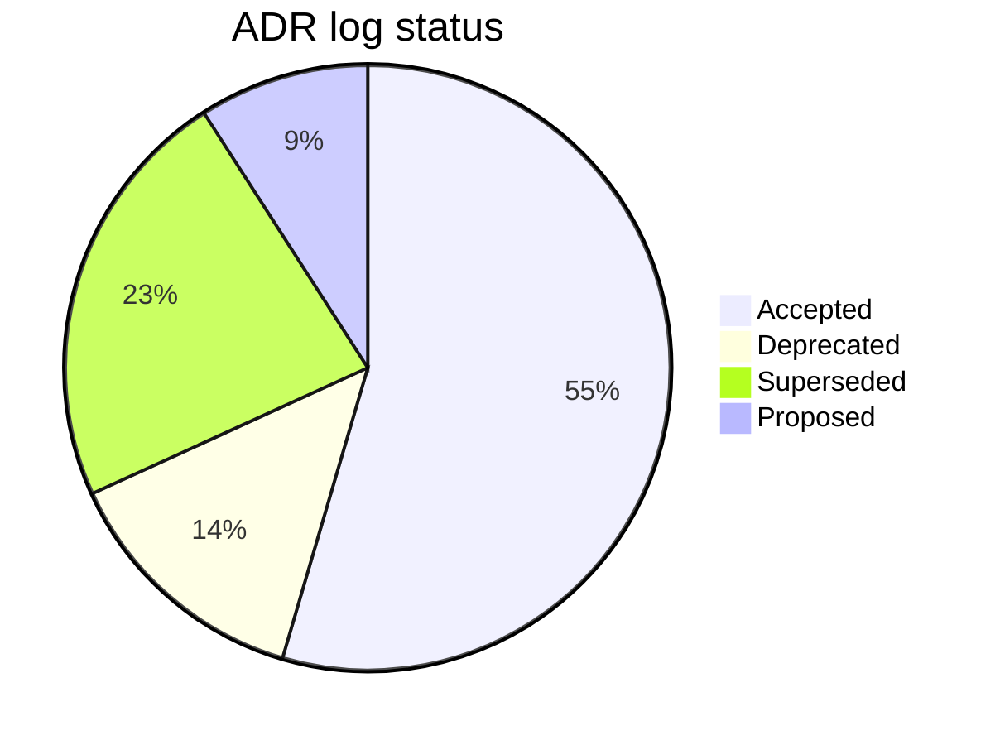

# Architecture Decision Record (ADR) Writing

You write, review, or index architecture decision records. ADRs are immutable once accepted — new decisions supersede rather than edit old ones. Log captures the *why* behind decisions that would otherwise be lost.

## Core rules

- **Immutable once accepted**: only status can change (→ deprecated / superseded); content preserved
- **Supersession chain**: new ADR references old by ID; old status becomes "superseded by N"
- **Format declared**: Nygard (default) or Y-statement (compact)
- **Context rich enough to stand alone**: reader in 2 years needs to understand why
- **Consequences honest**: both positive + negative + neutral
- **Stable IDs**: `ADR-NNN` (zero-padded); never reused
- **No fabricated decisions**: only record decisions that were actually made

## Input handling

| Dimension | Required | Default |
|---|---|---|
| **Mode** | No | write |
| **Decision subject** | Required in write mode | — |
| **Existing ADR log** | No | Elicit / assume first ADR |
| **Format** | No | Nygard |

Operations: `write` (new ADR) / `review` (status refresh across log) / `supersede` (new decision replacing existing) / `index` (produce / refresh ADR log).

## Phase 1 — Setup

```
**Mode**: [write / review / supersede / index]
**Subject** (if write/supersede): [decision being recorded]
**Existing ADR log**: [reference or "none — first ADR"]
**Format**: [Nygard / Y-statement]
```

Ask render mode per `diagram-rendering` mixin and output path (default: `/documentation/[case]/adr-writing/`).

## Phase 2 — Michael Nygard format (default)

Standard fields in this order:

```markdown
# ADR-[NNN]: [Short decision title]

## Status
[Proposed | Accepted | Deprecated | Superseded by ADR-XXX]

## Context
[The issue motivating this decision. What forces are at play — technical, political, social, organizational?
Include relevant constraints that limit choices.]

## Decision
[The change that we're proposing or have agreed to implement.]

## Consequences
[What becomes easier or more difficult because of this change? Include:
- Positive consequences
- Negative consequences / trade-offs
- Neutral consequences (often interesting side-effects)
- Risks accepted]
```

### Rules per section

**Title**: imperative, outcome-focused. ✅ "Use Postgres as primary datastore"; ❌ "Database decision".

**Status**: strict controlled vocabulary; changes trigger supersession chain updates.

**Context**: ≥3 factors; include dates if time-sensitive. Third-party reader must understand without prior knowledge.

**Decision**: 1–2 paragraphs. Includes what's being done + scope.

**Consequences**: always at least 1 negative OR trade-off. Absence of downside = probably missing analysis.

## Phase 3 — Y-statement format (compact alternative)

Olaf Zimmermann's template:

```
In the context of [use case / concern / user story],
facing [concern with issue / quality / trade-off],
we decided for [option chosen]
and neglected [options not chosen],
to achieve [benefit / quality addressed],
accepting [downside / consequence / trade-off],
because [additional rationale (optional)].
```

Use when a full Nygard ADR is overkill — one-sentence decisions for small teams / low-stakes.

Still requires stable ID + status.

## Phase 4 — Status lifecycle

```
Proposed → Accepted → Deprecated
                   \→ Superseded by ADR-XXX
```

| Status | Meaning |
|---|---|
| **Proposed** | Under review; not yet committed |
| **Accepted** | Decision stands; followed by teams |
| **Deprecated** | No longer current practice; nothing replaces it (often because the system evolved past it) |
| **Superseded by ADR-XXX** | Replaced by a new decision; content preserved |

Rules:
- Proposed ADRs can still change content
- Accepted ADRs are immutable — only status + supersession pointer can change
- Superseded status includes pointer to replacing ADR

## Phase 5 — Supersession

When a new decision replaces an existing one:

1. Write new ADR with status `Accepted`
2. Include reference to superseded ADR in Context + Decision sections
3. Mark old ADR status = `Superseded by ADR-NNN`
4. Preserve old ADR content — do not edit or delete
5. Add entry to ADR index / log

Rationale: lost decisions cause lost knowledge. Every "we used to do X, now we do Y" should be traceable.

## Phase 6 — ADR index / log

Maintain a log file listing all ADRs chronologically:

```markdown
# ADR Index

| ID | Title | Status | Date | Related |
|---|---|---|---|---|
| ADR-001 | Use Postgres as primary datastore | Accepted | 2024-03-14 | — |
| ADR-002 | Switch from REST to GraphQL for public API | Accepted | 2024-06-22 | — |
| ADR-003 | Abandon session-based auth in favor of JWT | Superseded by ADR-007 | 2024-08-10 | ADR-007 |
| ADR-004 | Adopt Kubernetes | Accepted | 2024-10-01 | — |
| ADR-005 | Move to read replicas for read-heavy workloads | Accepted | 2025-01-15 | ADR-001 |
| ADR-007 | Return to session-based auth using signed cookies | Accepted | 2025-04-03 | ADR-003 (supersedes) |
```

Index includes supersession chains visible.

## Phase 7 — Review mode

Periodically review ADR log to:
- Mark stale ADRs as `Deprecated` if system has moved past
- Verify `Superseded by` pointers still valid
- Flag ADRs missing consequences analysis
- Recommend new ADRs for decisions made informally (verbal / chat / PR-only)

Output: review summary with action list.

## Phase 8 — Integration with traceability

If `traceability-matrix` is in use, ADRs are linked entities:
- Requirement → ADR (via `decided-by` link)
- ADR → system components (via "affects" link)
- ADR → other ADRs (via `supersedes` / `related-to`)

Reference: ADRs become first-class traceability artifacts.

## Phase 9 — Diagrams

### ADR supersession timeline



### ADR status distribution



## Phase 10 — Diagram rendering

Per `diagram-rendering` mixin. File names:
- `adr-timeline.mmd` / `.png`
- `adr-status.mmd` / `.png`

## Phase 11 — Report assembly and approval

### Write mode output

```markdown
# ADR-[NNN]: [Title]

## Status
[Status]

## Context
[Rich context — 3+ factors]

## Decision
[What's being done]

## Consequences
- Positive: ...
- Negative / trade-offs: ...
- Neutral: ...
- Risks accepted: ...

## Related
[ADRs this relates to / supersedes / extends]
```

### Index / review mode output

```markdown
# ADR Management: [Subject]

**Date**: [date]
**Mode**: [write / review / supersede / index]
**ADRs reviewed**: [N]
**New ADRs**: [N]
**Superseded**: [N]
**Deprecated**: [N]

## ADR Index
[Table per Phase 6]

## Supersession Chains
[Per chain: ADR-A → ADR-B → ADR-C with rationale]

## Review Findings (review mode)
[Stale ADRs, missing consequences, informally-made decisions to record]

## New ADR (write mode)
[Full new ADR content]

## Diagrams
[Timeline + status distribution]

## Next Steps
[Actions from review — new ADRs to write, pointers to fix, traceability updates]
```

Present for user approval. Save only after confirmation.

## Generation + planning rules

- Format declared
- Immutable once accepted
- Supersession chain preserved
- Consequences include trade-offs
- Stable IDs
- No fabricated decisions

## Failure behavior

| Situation | Behavior |
|---|---|
| No subject in write mode | Interview mode (§7) |
| Supersede without target ADR | Ask which ADR to supersede |
| Content changes to accepted ADR | Block; require supersession |
| Missing consequences analysis | Require before accepting status |
| Informal decision never recorded | Recommend retroactive ADR |
| mmdc failure | See `diagram-rendering` mixin |
| Out-of-scope ("implement the decision") | "ADR only; implementation is engineering." |

## Self-check

```
[] Mode declared
[] Format chosen (Nygard / Y-statement)
[] Stable ID per ADR
[] Status from controlled vocabulary
[] Context rich (≥3 factors)
[] Decision clear
[] Consequences include trade-offs
[] Supersession chain preserved
[] ADR index updated
[] Diagrams valid
[] No content changes to accepted ADRs
[] No fabricated decisions
[] Report follows output contract
```
