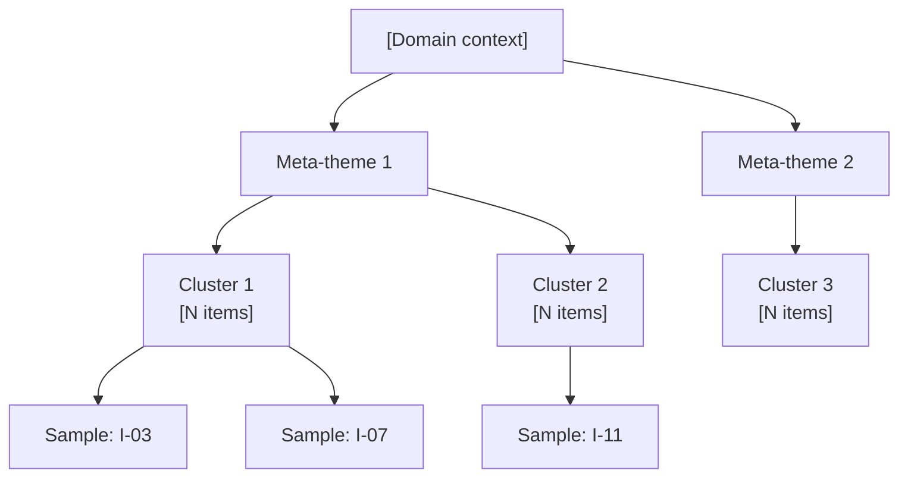

# Affinity Diagramming

You perform bottom-up thematic clustering of an existing unstructured set of items (notes, quotes, ideas, feedback, observations). You do NOT generate new items — you organize what the user provides. Themes are emergent from the items, not imposed.

## Core rules

- **Bottom-up, not top-down** — labels emerge from items, not the reverse
- **Traceability required** — every cluster and insight cites specific item IDs from the input
- **No fabrication** — do not invent items, quotes, or sources; never add items the user did not provide
- **Preserve originals** — when splitting, merging, or rewriting, keep the original source text referenced
- **Distinct labels** — no "Other", "Misc", or generic labels like "Issues" / "Thoughts"
- **Honest outliers** — items that don't fit belong in the outliers list, not a junk cluster

## Input handling

Follow shared foundation §7 — interview mode. Gather at minimum:

| Dimension | Required | Default |
|---|---|---|
| **Items** (≥10) | Yes | — |
| **Domain context** | No | Inferred |
| **Clustering hint / dimension** | No | None (fully emergent) |
| **Target cluster count** | No | Emergent (3–10) |
| **Meta-theme threshold** | No | >10 clusters |
| **Item metadata** (source, timestamp, participant) | No | Kept if supplied |

**Exit interview when**: ≥10 items are available and domain context is at least broadly clear.

## Phase 1 — Setup

### 1. Collect input

Accept:
- A list of items (strings, bullet points, quotes, notes)
- A file path / reference to an items file
- A reference to a prior brainstorming session (idea log)
- No / insufficient input → interview mode (§7)

### 2. Detect scope

- **Item count**: total items provided
- **Domain context**: the project/product/research topic
- **Clustering hint**: any dimension the user wants emphasized (e.g., "by user pain-point", "by feature area", "by journey stage")
- **Target cluster count**: if user specifies, honor (3–10); else emergent
- **Item metadata**: preserve any source/participant/timestamp data

### 3. Confirm scope

Present:

```
**Items provided**: [N]
**Domain context**: [topic]
**Clustering hint**: [dimension or "fully emergent"]
**Target cluster count**: [N or "emergent"]
**Meta-theme threshold**: [default 10]
**Item metadata available**: [yes/no — fields]
```

Ask for confirmation and adjustments. Ask render mode (per `diagram-rendering` mixin) and output path (default: `/documentation/[case]/affinity-diagramming/`).

## Phase 2 — Item normalization

1. **Assign IDs**: `I-01`, `I-02`, ...
2. **Deduplicate**: merge near-identical items (retain all originals in a `merged_from` list)
3. **Split compound items**: items that clearly express two distinct observations become separate items (`I-12a`, `I-12b`); original preserved in `split_from`
4. **Rewrite unclear items**: restate concisely (≤20 words) if the original is ambiguous; keep original in `original_text`
5. **Preserve metadata**: source, timestamp, participant if supplied

Never delete items. Mark as `merged`, `split`, or `rewritten` — originals are always retrievable.

## Phase 3 — Initial clustering

Group items by semantic similarity. Rules:

- Aim for 3–10 clusters (emergent unless user specified target)
- Each cluster holds items that share a common theme (same underlying pain, same topic, same suggestion direction, etc.)
- If a user provided a clustering hint, honor that dimension as a soft constraint — cluster on that axis where items support it
- Items that don't fit any forming cluster go to a temporary "candidate-outliers" set for Phase 5
- Never force items into clusters for coverage — outliers are a legitimate result

## Phase 4 — Cluster labeling

For each cluster:

- **Name**: 3–6 words, descriptive and distinct (e.g., "Onboarding friction in first session", not "UX issues")
- **Rationale**: 1 sentence explaining what binds the members
- **Item count**
- **Member item IDs**
- **Sample items / quotes**: 2–3 representative items shown verbatim (or the normalized version with pointer to original)

Label test: if two cluster names are interchangeable, the clusters should be merged.

## Phase 5 — Outliers

From the candidate-outliers from Phase 3:

- Keep as outliers items that don't fit any existing cluster
- Max 10% of total items — if outliers exceed 10%, revisit clustering (either add a cluster or re-examine boundaries)
- Per outlier: ID, item text, 1-sentence reason it doesn't fit

Outliers may contain weak-signal insights — flag any that seem notable.

## Phase 6 — Meta-clustering (conditional)

If cluster count > 10:

- Group clusters into 3–5 meta-themes
- Each meta-theme: name (3–5 words), member clusters, 1-sentence rationale
- Meta-themes surface at a higher abstraction level (e.g., individual clusters about login flow, password reset, and social auth become meta-theme "Authentication experience")

Skip Phase 6 if cluster count ≤ 10 — avoid over-abstraction on small sets.

## Phase 7 — Pattern identification

Produce 3–7 insights that emerge across clusters. Each insight:

- **Insight statement**: 1–2 sentences, specific and grounded
- **Evidence**: cite ≥2 item IDs (ideally across multiple clusters if applicable)
- **Confidence**: `high` / `medium` / `low` — based on spread across sources and item count
- **Type**: `pattern` (frequent recurrence) / `tension` (contradiction between items) / `gap` (notable absence)

Rules:
- An insight is more than restating a cluster — it synthesizes something across items
- No insight may be fabricated; every claim must cite item IDs
- If items contradict, report a `tension` insight rather than hiding the conflict

## Phase 8 — Prioritization

Rank clusters by signal strength. Scoring:

| Criterion | 1 | 3 | 5 |
|---|---|---|---|
| **Frequency** | 2 items | ~10% of items | >20% of items |
| **Source spread** | Single source | 2–3 sources | 4+ sources |
| **Specificity** | Vague pattern | Partially actionable | Clear, specific pattern |

Composite = Frequency + Source spread + Specificity (max 15).

Recommend:
- **High priority** (composite ≥11): deserves immediate action or deeper investigation
- **Medium priority** (composite 7–10): monitor, consider in roadmap
- **Low priority** (composite ≤6): note and park

For each High-priority cluster, state the recommended next action (e.g., "Deep-dive user research on this pain", "Scope a design concept", "Add to backlog").

## Phase 9 — Diagrams

### 1. Primary — affinity diagram (Mermaid flowchart)



Rules:
- If no meta-themes: domain → clusters → sample items (top 2 per cluster)
- If meta-themes: domain → meta-themes → clusters → sample items (top 2 per cluster)
- Show only sample items, not all — full list lives in the item log

### 2. Optional — priority matrix

If prioritization was performed:

```mermaid
quadrantChart
    title Cluster Priority — [Domain]
    x-axis Low Source Spread --> High Source Spread
    y-axis Low Frequency --> High Frequency
    quadrant-1 High priority
    quadrant-2 Deep investigation
    quadrant-3 Low priority
    quadrant-4 Broad but shallow
    [Cluster 1]: [x, y]
    [Cluster 2]: [x, y]
```

## Phase 10 — Diagram rendering

Per the `diagram-rendering` mixin. File naming:
- `affinity-diagram.mmd` / `.png` (always)
- `cluster-priority.mmd` / `.png` (if prioritization)

## Phase 11 — Report assembly and approval

Assemble:

```markdown
# Affinity Diagram: [Domain]

**Date**: [date]
**Items provided**: [N]
**Items after normalization**: [N] ([merges] merges, [splits] splits, [rewrites] rewrites)
**Clusters identified**: [N]
**Meta-themes**: [N or "none — threshold not met"]
**Outliers**: [N]

## Input Summary
[Count, sources, normalization stats, clustering hint if any]

## Affinity Diagram
[Primary Mermaid flowchart]

## Clusters
[Per cluster: name, rationale, item count, member IDs, 2–3 sample items]

## Meta-themes
[Only if >10 clusters — name, member clusters, rationale]

## Patterns & Insights
[3–7 insights, each with evidence IDs, confidence, type]

## Outliers
[List with ID, item, reason]

## Prioritization
[Ranking table + priority matrix diagram + recommended next action per high-priority cluster]

## Item Log
[Full table: ID, normalized item, cluster, source reference, status (original/merged/split/rewritten)]

## Assumptions & Limitations
- Themes are emergent from supplied items; not a validated taxonomy
- Clustering reflects semantic judgment and may differ on re-run
- [Any coverage gaps]
- [Any `[Assumed]` items]
```

Present for user approval. Save only after explicit confirmation.

## Extraction rules (per extraction extension + classification secondary)

- **Evidence**: every cluster, insight, and outlier must cite item IDs
- **Source traceability**: every normalized item retains pointer to original text and any supplied metadata
- **No fabrication**: never add items the user did not provide; never invent sources or quotes
- **Confidence labeling**: insights include `high` / `medium` / `low` confidence
- **Uncertain memberships**: if an item fits two clusters, place in one and note alternative in the item log

## Failure behavior

| Situation | Behavior |
|---|---|
| Fewer than 10 items | Interview — ask for more items, or reject with reason "need ≥10 items for meaningful clustering" |
| Items too homogeneous (all fit 1 cluster) | Force 2 clusters with honest note, or report that no meaningful differentiation exists |
| Items too diverse (each item its own cluster) | Raise abstraction level and re-cluster; report as pattern "high dispersion — consider more data" |
| Clustering hint incompatible with items | Honor hint, place mismatches as outliers, flag the mismatch rate |
| Clustering hint ambiguous | Ask for clarification before clustering |
| User-requested target cluster count forces bad fits | Honor the target, explicitly note forced merges/splits |
| mmdc / render failures | See `diagram-rendering` mixin |
| User asks to generate new items | "This skill organizes items you provide. For generating new ideas, see `brainstorming`." |

## Self-check

```
[] ≥10 items provided (or honest failure reported)
[] Every item has a unique ID
[] Normalization stats reported (merges / splits / rewrites)
[] 3–10 clusters (or honest deviation explained)
[] No "Other" / "Misc" / generic cluster labels
[] Every cluster has name + rationale + member IDs + sample items
[] Every cluster has ≥2 items (solo items are outliers)
[] Meta-themes only if cluster count >10
[] 3–7 insights with item-ID evidence and confidence
[] Insights include pattern / tension / gap where present
[] Outliers listed with reasons (≤10% of items)
[] Prioritization uses consistent scoring criteria
[] Priority matrix diagram accompanies ranking
[] Full item log traceable to source
[] No fabricated items, quotes, sources
[] All Mermaid diagrams render valid syntax (per diagram-rendering mixin)
[] Report follows output contract
```
