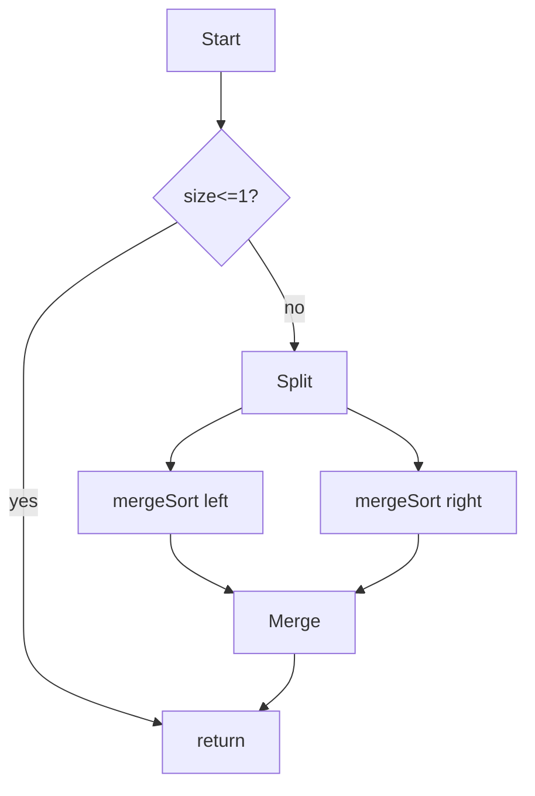
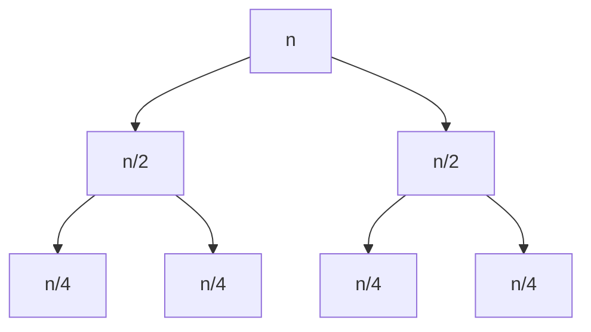

# Algorithm Design

You design an algorithm before writing production code. The output is a reasoning artifact — reviewable, testable, honest about trade-offs.

## Core rules

- **Problem first, then approach** — state inputs / outputs / constraints precisely
- **Multiple candidates** — consider more than one approach; compare
- **Complexity honest** — worst case, average case, space; don't hide lower-order terms that matter at scale
- **Invariants stated** — the spine of the correctness argument
- **Edge cases listed** — empty / size-1 / overflow / duplicates / unsorted / negative / unicode
- **Pseudocode, not production code** — precise enough to be implemented, not a finished implementation
- **No fabricated constraints** — work from supplied facts

## Input handling

| Dimension | Required | Default |
|---|---|---|
| **Problem statement** | Yes | — |
| **Inputs + outputs** | Yes | — |
| **Constraints** (size, latency, memory) | Yes | — |
| **Correctness criteria** | No | Asked if not clear from problem |
| **Target language / runtime** | No | Language-agnostic pseudocode |

## Phase 1 — Problem framing

```
**Problem**: [one-paragraph precise statement]
**Inputs**:
  - [name : type, shape, valid range]
**Outputs**:
  - [name : type, guarantees]
**Constraints**:
  - [size bounds, time budget, memory cap, stability requirements]
**Correctness**: [how do we know the result is right?]
**Assumptions**: [anything taken as given]
```

Ask render mode per `diagram-rendering` mixin and output path (default: `/documentation/[case]/algorithm-design/[problem-name]/`).

## Phase 2 — Candidate approaches

At least two candidates — compare.

### Candidate A — [name]

- **Idea**: one paragraph
- **Time**: O(...)
- **Space**: O(...)
- **Stability**: stable / unstable (for sorts)
- **In-place**: yes / no
- **Parallelizable**: yes / no / partially
- **Trade-offs**: what it gives up

### Candidate B — [name]

Same structure.

### Candidate C (only if materially different)

### Comparison table

| Candidate | Time | Space | In-place | Parallel | Notes |
|---|---|---|---|---|---|
| A | O(n log n) | O(1) | yes | limited | ... |
| B | O(n) average | O(n) | no | yes | hash collisions |

## Phase 3 — Chosen approach

Pick one; justify based on constraints.

## Phase 4 — Invariants

What holds before, during, and after? These are the scaffolding for the correctness argument.

- **Loop invariant**: [e.g. "at start of iteration k, arr[0..k) is sorted"]
- **Data-structure invariant**: [e.g. "heap property: parent ≤ children"]
- **Global invariant**: [e.g. "total balance preserved across all accounts"]

## Phase 5 — Pseudocode

Language-neutral; precise.

```
function mergeSort(arr, lo, hi):
    # precondition: 0 <= lo <= hi <= len(arr)
    # postcondition: arr[lo..hi) is sorted, permutation of original
    if hi - lo <= 1: return
    mid = lo + (hi - lo) // 2
    mergeSort(arr, lo, mid)
    mergeSort(arr, mid, hi)
    merge(arr, lo, mid, hi)

function merge(arr, lo, mid, hi):
    # buf : temporary array of size (hi - lo)
    # invariant after kth write to buf:
    #   buf[0..k) is sorted, min of remaining in arr
    ...
```

Annotate loops + recursion with invariants.

## Phase 6 — Correctness argument

One of:
- **Loop invariant proof** — initialization / maintenance / termination
- **Structural induction** — base case + inductive step
- **Preservation of invariant** — show each operation preserves invariants
- **Reduction** — show problem reduces to a solved one

Brief + honest; formal proofs only when warranted.

## Phase 7 — Edge cases

| Case | Input | Expected |
|---|---|---|
| Empty | `[]` | `[]` |
| Single | `[5]` | `[5]` |
| Already sorted | `[1,2,3]` | `[1,2,3]` |
| Reverse | `[3,2,1]` | `[1,2,3]` |
| All equal | `[2,2,2]` | `[2,2,2]` |
| Large | 10^7 elements | succeeds within budget |
| Overflow-prone | `INT_MAX, INT_MAX` | no overflow |
| Unicode / nulls | ... | ... |
| Negative / zero | ... | ... |

## Phase 8 — Complexity analysis

- **Time**: worst / average / best with justification
- **Space**: auxiliary + in-place qualifier
- **Amortized analysis** if relevant (e.g. dynamic array push = O(1) amortized)
- **Hidden constants** if they matter (cache behavior, branch predictor)

## Phase 9 — Failure + numerical concerns

- Overflow / underflow — typed arithmetic or big-int required?
- Floating-point — precision, epsilon, NaN handling, order of operations
- Cancellation — order operations to preserve stability
- Determinism — reproducible across runs / platforms?
- Concurrency — safe under races? requires lock / CAS / immutability?

## Phase 10 — Test strategy

- Property-based tests: invariants hold across random inputs
- Boundary tests: every edge case above
- Performance tests: confirm target at scale
- Fuzz / differential tests: compare vs reference impl if any
- Regression tests: any historical bug inputs pinned

Examples:
```
PROPERTY: for any list xs, sort(sort(xs)) == sort(xs)
PROPERTY: sort(xs) is a permutation of xs
PROPERTY: adjacent elements satisfy ≤
```

## Phase 11 — Parallelization + scale considerations

- Divide-and-conquer break points
- Memory bandwidth vs CPU
- Out-of-core (spill to disk) if input exceeds memory
- Streaming variant if input arrives incrementally
- Distributed variant boundary

## Phase 12 — Alternative approaches + rejections

Same list as Phase 2 with explicit reject rationale. Keep short.

## Phase 13 — Diagrams

### Flow (control)



### Recursion / divide



## Phase 14 — Diagram rendering

Per `diagram-rendering` mixin.

## Phase 15 — Report assembly and approval

```markdown
# Algorithm Design: [Problem]

**Date**: [date]

## Problem
## Inputs + Outputs + Constraints
## Candidate Approaches
## Comparison
## Chosen Approach
## Invariants
## Pseudocode
## Correctness Argument
## Edge Cases
## Complexity Analysis
## Failure + Numerical Concerns
## Test Strategy
## Parallelization + Scale
## Alternatives + Rejections
## Diagrams
## Hand-offs
## Assumptions & Limitations
```

Present for user approval. Save only after confirmation.

## Assessment + planning rules

- Problem + constraints explicit
- Multiple candidates compared
- Invariants stated
- Correctness argued
- Edge cases listed
- Complexity honest
- Test strategy included
- No fabricated constraints

## Failure behavior

| Situation | Behavior |
|---|---|
| No constraints | Interview mode (§7) |
| One candidate only | Ask for at least one alternative |
| Complexity glossed | Require worst / average / space |
| Edge cases missing | Generate from category list |
| Problem already has a known library | Surface — "use X; here's why" |
| mmdc failure | See `diagram-rendering` mixin |
| Implementation request | "Design only; impl is engineering." |

## Self-check

```
[] Problem + constraints stated
[] ≥2 candidate approaches
[] Complexity per candidate
[] Invariants for chosen approach
[] Correctness argued
[] Edge cases covered
[] Numerical + concurrency concerns considered
[] Test strategy proposed
[] Pseudocode precise
[] Alternatives rejected with rationale
[] Diagrams valid
[] No fabricated constraints
[] Report follows output contract
```
