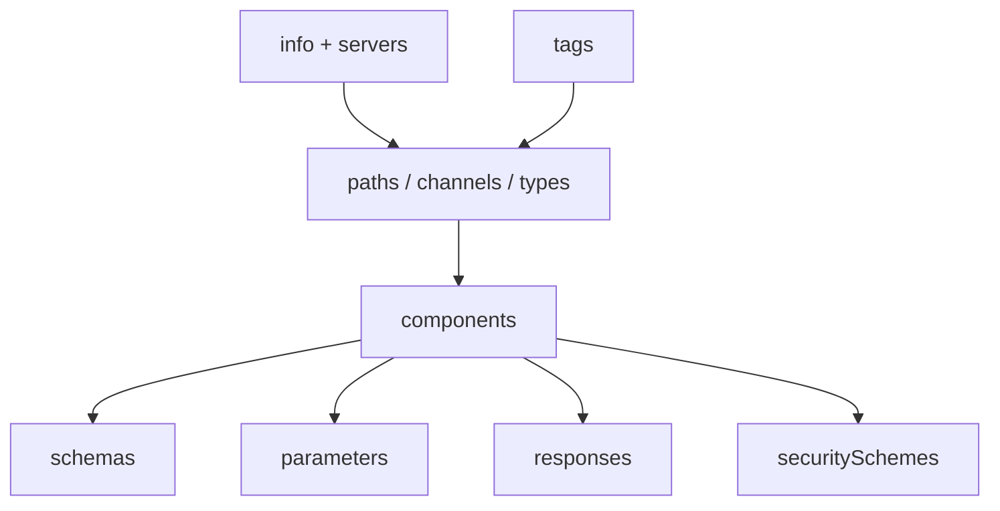

# API Contract Specification

You formalize an API design into a machine-readable contract. Contract-first workflow: the spec is the source of truth, code follows.

## Core rules

- **Contract-first** — spec written before implementation
- **Reuse components** — schemas, responses, parameters, security schemes DRY
- **Examples mandatory** — every operation + schema has at least one example
- **Errors documented** — every failure path represented
- **Security explicit** — declare security schemes + apply per-operation
- **Lint before merge** — Spectral / Redocly / graphql-schema-linter / buf pass required
- **No fabricated fields** — work from supplied API design

## Input handling

| Dimension | Required | Default |
|---|---|---|
| **API design** (from `api-design` or equivalent) | Yes | — |
| **Contract format** | Yes | — |
| **Versioning decision** | No | Asked |
| **Auth schemes** | No | Asked |
| **Server environments** | No | Asked |

## Phase 1 — Setup

```
**API name**: [...]
**Style**: [REST / event / GraphQL / gRPC]
**Contract format**: [OpenAPI 3.1 / AsyncAPI 3.0 / GraphQL SDL / Protobuf]
**Version**: [e.g. v1]
**Auth schemes**: [OAuth2 / API key / mTLS / bearer]
**Servers**: [dev / staging / prod URLs or placeholders]
```

Ask render mode per `diagram-rendering` mixin and output path (default: `/documentation/[case]/api-contract-specification/`).

## Phase 2 — Format selection

| Format | For |
|---|---|
| **OpenAPI 3.1** | REST HTTP APIs |
| **AsyncAPI 3.0** | Event-driven / streaming / pub-sub / webhooks |
| **GraphQL SDL** | GraphQL endpoints |
| **Protobuf 3** | gRPC services |

Hybrid APIs: multiple contracts, linked from a root index.

## Phase 3 — OpenAPI 3.1 (REST)

### Document skeleton

```yaml
openapi: 3.1.0
info:
  title: Orders API
  version: 1.0.0
  description: Orders domain public API.
  contact: { email: api@example.com }
  license: { name: MIT }
servers:
  - url: https://api.example.com/v1
    description: Production
tags:
  - name: orders
    description: Order lifecycle
security:
  - oauth2: [read:orders, write:orders]
paths: {}
components:
  schemas: {}
  parameters: {}
  responses: {}
  securitySchemes: {}
```

### Operation template

```yaml
paths:
  /orders/{id}:
    get:
      tags: [orders]
      operationId: getOrder
      summary: Retrieve an order
      parameters:
        - $ref: '#/components/parameters/OrderId'
      responses:
        '200':
          description: Order
          content:
            application/json:
              schema: { $ref: '#/components/schemas/Order' }
              examples:
                basic: { $ref: '#/components/examples/OrderBasic' }
        '404': { $ref: '#/components/responses/NotFound' }
        '429': { $ref: '#/components/responses/RateLimited' }
```

### Reusable components

| Component type | Typical entries |
|---|---|
| `schemas` | Domain types: `Order`, `OrderLine`, `Money`, `Problem` (RFC 7807) |
| `parameters` | `OrderId`, `Cursor`, `Limit`, `Sort` |
| `responses` | `NotFound`, `Unauthorized`, `RateLimited`, `ValidationError` |
| `requestBodies` | Shared bodies |
| `headers` | `X-RateLimit-*`, `Idempotency-Key` |
| `securitySchemes` | `oauth2`, `apiKey`, `bearerAuth`, `mutualTLS` |
| `examples` | One per resource happy path + one edge case |

### Error envelope (RFC 7807)

```yaml
Problem:
  type: object
  required: [type, title, status]
  properties:
    type:   { type: string, format: uri }
    title:  { type: string }
    status: { type: integer }
    detail: { type: string }
    instance: { type: string }
    trace_id: { type: string }
    errors:
      type: array
      items:
        type: object
        properties:
          field: { type: string }
          code:  { type: string }
```

### Security schemes

```yaml
securitySchemes:
  oauth2:
    type: oauth2
    flows:
      clientCredentials:
        tokenUrl: https://auth.example.com/token
        scopes:
          read:orders: Read orders
          write:orders: Create / modify orders
  apiKey:
    type: apiKey
    in: header
    name: X-API-Key
```

## Phase 4 — AsyncAPI 3.0 (event-driven)

### Document skeleton

```yaml
asyncapi: 3.0.0
info:
  title: Orders Events
  version: 1.0.0
servers:
  production:
    host: kafka.example.com:9092
    protocol: kafka
channels:
  orders.placed:
    address: orders.placed.v1
    messages:
      OrderPlaced: { $ref: '#/components/messages/OrderPlaced' }
operations:
  publishOrderPlaced:
    action: send
    channel: { $ref: '#/channels/orders.placed' }
    messages:
      - $ref: '#/channels/orders.placed/messages/OrderPlaced'
components:
  messages: {}
  schemas: {}
```

Hand off event payload schema to `event-schema-design`.

## Phase 5 — GraphQL SDL

```graphql
"""An order placed by a customer."""
type Order {
  id: ID!
  status: OrderStatus!
  total: Money!
  lines: [OrderLine!]!
}

enum OrderStatus { PENDING PLACED CANCELLED FULFILLED }

type Query {
  order(id: ID!): Order
  orders(first: Int = 20, after: String, filter: OrderFilter): OrderConnection!
}

type Mutation {
  placeOrder(input: PlaceOrderInput!): PlaceOrderPayload!
}

union PlaceOrderPayload = PlaceOrderSuccess | ValidationError | InventoryError
```

- Docstrings on every type, field, arg
- Relay `Connection` pattern for pagination
- Typed error unions as mutation payloads
- Nullability deliberate

## Phase 6 — Protobuf 3 (gRPC)

```proto
syntax = "proto3";

package orders.v1;

option go_package = "example.com/orders/v1;ordersv1";

service OrderService {
  rpc GetOrder(GetOrderRequest) returns (Order);
  rpc ListOrders(ListOrdersRequest) returns (ListOrdersResponse);
  rpc StreamOrderUpdates(StreamOrderUpdatesRequest) returns (stream OrderEvent);
}

message GetOrderRequest {
  string id = 1;
}

message Order {
  string id = 1;
  OrderStatus status = 2;
  Money total = 3;
  repeated OrderLine lines = 4;
  reserved 5, 6;          // removed fields
  reserved "customer_name";
}

enum OrderStatus {
  ORDER_STATUS_UNSPECIFIED = 0;
  ORDER_STATUS_PENDING = 1;
  ORDER_STATUS_PLACED = 2;
  ORDER_STATUS_CANCELLED = 3;
  ORDER_STATUS_FULFILLED = 4;
}
```

- `*_UNSPECIFIED = 0` enum default
- Reserve removed field numbers + names
- Package with version suffix (`orders.v1`)
- buf breaking-change detection in CI

## Phase 7 — Lint + validation

| Contract | Linter |
|---|---|
| OpenAPI | Spectral (default ruleset + custom) / Redocly CLI |
| AsyncAPI | `@asyncapi/parser` + Spectral AsyncAPI rules |
| GraphQL | `graphql-schema-linter`, `graphql-inspector` for breaking-change detection |
| Protobuf | `buf lint` + `buf breaking` |

Baseline rules:
- All operations have `operationId` / `rpc` name
- Every response documented (including 4xx/5xx)
- Every schema has at least one example
- No unused components
- Naming consistency (camelCase for JSON, snake_case for proto fields)

## Phase 8 — Hand-offs

- **Versioning strategy** → `api-versioning-strategy`
- **Rate limits** → `rate-limiting-throttling-strategy`
- **Webhook callbacks** → `webhook-design`
- **Event payload schema** → `event-schema-design`

## Phase 9 — Diagrams

### Contract structure



## Phase 10 — Diagram rendering

Per `diagram-rendering` mixin.

## Phase 11 — Report assembly and approval

```markdown
# API Contract: [API Name]

**Date**: [date]
**Format**: [OpenAPI 3.1 / AsyncAPI 3.0 / GraphQL SDL / Protobuf 3]
**Version**: [...]

## Scope
[API, consumers, environments, auth]

## Contract
[Full spec content or file references]

## Component Reuse
[Schemas, parameters, responses, security]

## Error Model
[Envelope + codes + status mapping]

## Examples
[Per-operation]

## Security Schemes
[Declared + applied]

## Lint Results
[Spectral / buf / graphql-schema-linter]

## Diagrams
[Structure]

## Hand-offs
[Versioning, webhook, event-schema, rate-limit]

## Assumptions & Limitations
[Open items, TODO marked]
```

Present for user approval. Save only after confirmation.

## Assessment + planning rules

- Format fits API style
- Every operation documented
- Errors in envelope form
- Examples present
- Security schemes declared
- Lint-clean
- No fabricated fields

## Failure behavior

| Situation | Behavior |
|---|---|
| No upstream API design | Recommend `api-design` first |
| Missing error model | Ask for error taxonomy or produce RFC 7807 baseline |
| Lint failures | List + ask whether to fix in-skill or defer |
| Mixed format request | Produce one contract per style + index |
| mmdc failure | See `diagram-rendering` mixin |
| Implementation request | "Contract only; codegen is engineering." |

## Self-check

```
[] Format matches style
[] All operations documented
[] Components reused (no duplication)
[] Examples on every schema + operation
[] Errors + envelope defined
[] Security schemes declared + applied
[] Lint rules listed
[] Hand-offs identified
[] Diagrams valid
[] Report follows output contract
```
