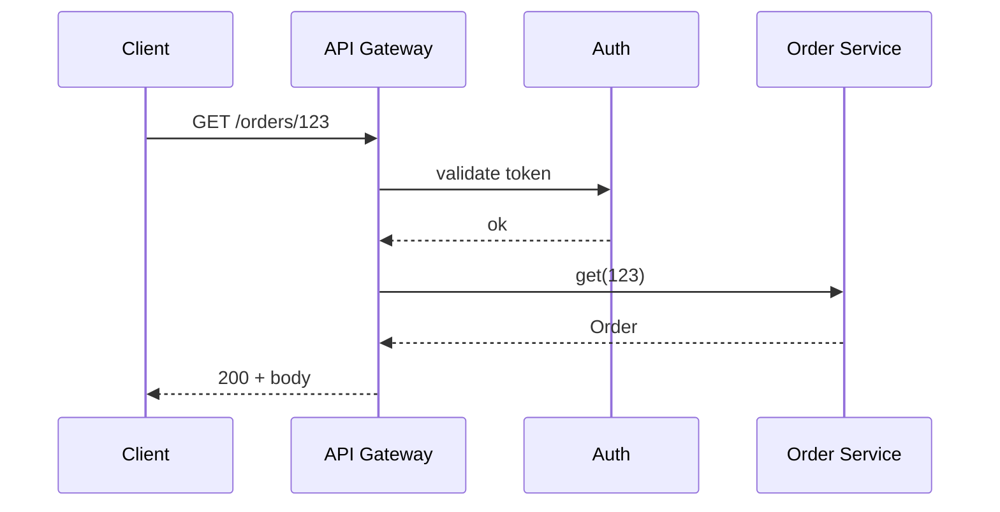

# API Design

You design an API: pick a style that fits consumers + constraints, then design surface (resources or schema), error model, pagination, filtering, sorting. No fabricated consumer list.

## Core rules

- **No default style** — pick based on consumer profile + coupling + payload shape
- **Consumer-first** — design from outside-in: what do callers need?
- **Evolvable** — plan for change before v1 ships
- **Errors are part of the contract** — design them, don't improvise
- **No fabricated endpoints** — work from supplied domain facts
- **Hand off versioning** to `api-versioning-strategy`; rate limits to `rate-limiting-throttling-strategy`; contract spec to `api-contract-specification`

## Input handling

| Dimension | Required | Default |
|---|---|---|
| **API purpose** (what problem it solves) | Yes | — |
| **Consumers** (internal / external / partner / mobile / web / batch) | Yes | — |
| **Domain entities or operations** | Yes | — |
| **Latency / throughput targets** | No | Asked |
| **Auth model** | No | Asked |
| **Existing style in ecosystem** | No | Asked |
| **Real-time needs** | No | Asked |

## Phase 1 — Setup

```
**API purpose**: [what problem]
**Consumers**: [who — internal services, external partners, public, mobile, web, batch]
**Domain entities / operations**: [list]
**Latency target**: [p99]
**Throughput**: [req/s peak]
**Auth**: [API key / OAuth2 / mTLS / session]
**Real-time needs**: [none / bidirectional / server-push]
**Existing ecosystem style**: [REST dominant / GraphQL federated / gRPC internal / mixed]
**Constraints**: [binary payload / browser-reachable / polyglot clients / low-bandwidth]
```

Ask render mode per `diagram-rendering` mixin and output path (default: `/documentation/[case]/api-design/`).

## Phase 2 — Style catalog

### REST (HTTP + resources)

**When to use**: public API / broad consumer reach / caching-friendly reads / simple CRUD / browser-reachable
**When not**: chatty fine-grained clients / strict typed contracts / high-throughput internal / bidirectional needs
**Key trade-offs**: universal tooling + cacheable + simple vs over/under-fetching, verbose for nested graphs
**Reversibility**: low switching cost for consumers if URL design is stable
**Examples**: Stripe, GitHub, Twilio public APIs

### GraphQL

**When to use**: diverse clients with varied needs / aggregation over multiple domains / mobile bandwidth-sensitive / federation across teams
**When not**: simple CRUD / heavy caching needs / public API with untrusted query shape
**Key trade-offs**: single endpoint + client-driven shape + introspection vs complexity-budget discipline needed, N+1 risk, caching harder
**Reversibility**: medium — clients couple to schema
**Examples**: GitHub v4, Shopify Admin, Netflix internal

### gRPC (HTTP/2 + protobuf)

**When to use**: internal service-to-service / polyglot / streaming / strict typed contracts / high-throughput low-latency
**When not**: browser-direct (needs gRPC-Web bridge) / public API with broad consumer reach / human-readable debugging priority
**Key trade-offs**: compact binary + codegen + streaming + deadlines vs tooling friction outside backend ecosystems, binary opacity
**Reversibility**: medium — regenerate clients when proto changes; wire-compat via proto rules
**Examples**: Google internal, most service meshes

### WebSocket

**When to use**: bidirectional streaming / low-latency push / interactive (chat, gaming, collaborative editing)
**When not**: request-response / cacheable reads / firewall-hostile environments
**Key trade-offs**: persistent bi-di + low latency vs sticky sessions, scaling complexity, reconnection handling
**Reversibility**: hard — clients built around streams
**Examples**: Slack messages, Figma collaboration, trading platforms

### SSE (Server-Sent Events)

**When to use**: server-to-client push only / text-based / fallback-friendly (HTTP)
**When not**: client-to-server high-frequency / binary payloads
**Key trade-offs**: simple + HTTP-native + auto-reconnect vs unidirectional, text-only
**Reversibility**: medium
**Examples**: live feeds, AI token streaming, notifications

### tRPC

**When to use**: TypeScript monorepo / full-stack type safety / tightly coupled client-server teams
**When not**: polyglot clients / public API / external consumers
**Key trade-offs**: end-to-end types + no schema file vs TS-only, not for external clients
**Reversibility**: hard — swap means a full client refactor
**Examples**: Next.js apps with shared types

### Hybrid

- **REST public + gRPC internal** — common pattern
- **GraphQL gateway over REST / gRPC services** — federation
- **REST + SSE for streams** — easy streaming without WS complexity
- **REST + WebSocket channel** — request-response plus live subscriptions

## Phase 3 — Decision factors

| Factor | What it captures |
|---|---|
| **Consumer diversity** | Public / partner / internal / mobile / batch |
| **Payload shape** | Graph / flat / binary / stream |
| **Caching** | CDN / HTTP cache / none |
| **Real-time** | Unidirectional / bidirectional / none |
| **Tooling maturity** | Consumer ecosystem support |
| **Observability** | Can we inspect in browser / curl / Wireshark easily? |
| **Browser reachability** | Must work from JS in browser without proxy? |
| **Strict typing** | Codegen + compile-time safety needed? |
| **Team expertise** | Team fluent in style? |

## Phase 4 — Recommendation

One paragraph:
- **Chosen style (or hybrid)**
- **Why**: top 2–3 factors
- **Trade-offs accepted**
- **Hand-offs**: what follow-up skills pick up (`api-contract-specification`, `api-versioning-strategy`, `rate-limiting-throttling-strategy`, `webhook-design` if async callbacks)

## Phase 5 — Surface design (REST path)

### Resource modeling

| Entity | URI | Supported methods | Notes |
|---|---|---|---|
| Order | `/orders` (collection), `/orders/{id}` (item) | GET, POST, PATCH, DELETE | Use nouns, plural |
| Order line | `/orders/{id}/lines` | GET, POST | Sub-resource when lifecycle bound |

**Conventions**:
- Nouns for resources, plural collections
- Verbs only as last-resort actions (`/orders/{id}/cancel`) when REST verbs insufficient
- `GET` safe + idempotent, `PUT` idempotent, `PATCH` partial, `DELETE` idempotent
- Status codes: `200/201/202/204 · 400/401/403/404/409/422/429 · 500/503`
- Use `Idempotency-Key` header for `POST` retry safety on money-moving ops

### Pagination

| Style | When |
|---|---|
| **Cursor-based** | Default; stable across insertions, scales |
| **Offset/limit** | Only for small + static datasets |
| **Keyset** | Variant of cursor on indexed columns |

Response envelope includes `next_cursor` + `has_more`. Avoid total counts on large sets.

### Filtering + sorting

- `?filter[status]=open&filter[owner]=me` or RFC-style `?status=open`
- `?sort=-created_at,name` (minus prefix = desc)
- Reserved: `page`, `limit`, `cursor`, `sort`, `filter`, `include`, `fields`

### Sparse fields + includes

- `?fields[order]=id,status,total` — field projection
- `?include=customer,lines.product` — compound documents

### Error taxonomy (RFC 7807 Problem Details)

```json
{
  "type": "https://errors.example.com/validation",
  "title": "Validation failed",
  "status": 422,
  "detail": "Field 'email' is not a valid email address",
  "instance": "/orders/123",
  "errors": [
    {"field": "email", "code": "invalid_format"}
  ],
  "trace_id": "01HX..."
}
```

Stable error codes; machine-readable `code`, human `detail`, traceable `trace_id`.

### Content negotiation

- `Accept: application/json` default
- Support `application/problem+json` for errors
- Consider `application/vnd.{org}.{resource}.v1+json` if media-type versioning (hand off to versioning skill)

## Phase 5B — Surface design (GraphQL path)

### Schema

```graphql
type Order {
  id: ID!
  status: OrderStatus!
  total: Money!
  lines: [OrderLine!]!
  customer: Customer!
}

type Query {
  order(id: ID!): Order
  orders(first: Int, after: String, filter: OrderFilter): OrderConnection!
}

type Mutation {
  placeOrder(input: PlaceOrderInput!): PlaceOrderPayload!
}
```

- Relay-style connections for pagination (`edges`, `pageInfo`, `cursor`)
- Errors as typed payload unions (not just GraphQL errors array)
- Nullability deliberate — non-null where absent is an error, nullable where absence is semantic
- Depth + complexity limits to protect server
- DataLoader per request to batch N+1
- Persisted queries for production clients (narrow attack surface)

## Phase 5C — Surface design (gRPC path)

```proto
service OrderService {
  rpc GetOrder(GetOrderRequest) returns (Order);
  rpc ListOrders(ListOrdersRequest) returns (ListOrdersResponse);
  rpc StreamOrderUpdates(StreamOrderUpdatesRequest) returns (stream OrderEvent);
}

message Order {
  string id = 1;
  OrderStatus status = 2;
  Money total = 3;
  repeated OrderLine lines = 4;
}
```

- Fields numbered + never renumbered
- Wire compatibility rules: never remove required, add new as optional, reserve removed tags
- Deadlines propagated; cancellation honored
- Status codes from `google.rpc.Code`
- Streaming modes: server / client / bidirectional — pick deliberately

## Phase 6 — Cross-cutting

| Concern | Guidance |
|---|---|
| **Auth** | OAuth2 / OIDC for public; mTLS for internal; API key for partner low-risk |
| **Idempotency** | `Idempotency-Key` on money-moving POST |
| **Concurrency** | ETag + `If-Match` for optimistic; `If-None-Match` for caching |
| **Rate limiting** | Hand off to `rate-limiting-throttling-strategy` |
| **Versioning** | Hand off to `api-versioning-strategy` |
| **Async callbacks** | Hand off to `webhook-design` |
| **Contract** | Hand off to `api-contract-specification` (OpenAPI / AsyncAPI) |

## Phase 7 — Diagrams

### Style-fit radar

```mermaid
xychart-beta
    title "Styles across decision factors (1-5)"
    x-axis ["Consumer diversity", "Caching", "Real-time", "Strict typing", "Tooling", "Browser"]
    y-axis "Score" 0 --> 5
    bar [5, 5, 2, 2, 5, 5]
    bar [4, 2, 3, 4, 4, 4]
    bar [2, 1, 5, 5, 3, 2]
```



Bars = REST / GraphQL / gRPC.

### Request flow



## Phase 8 — Diagram rendering

Per `diagram-rendering` mixin. File names:
- `style-fit.mmd` / `.png`
- `request-flow.mmd` / `.png`

## Phase 9 — Report assembly and approval

```markdown
# API Design: [API Name]

**Date**: [date]
**Purpose**: [what problem]
**Consumers**: [who]
**Selected style**: [REST / GraphQL / gRPC / hybrid]

## Scope
[Consumers, operations, latency, throughput, auth, constraints]

## Style Catalog
[Styles evaluated with when-to-use / when-not / trade-offs]

## Decision Factors
[Per-factor analysis]

## Recommendation
[Chosen + rationale + trade-offs + hand-offs]

## Surface Design
[Resources / schema / RPCs as applicable]

## Error Taxonomy
[Codes + envelope + trace id]

## Pagination / Filtering / Sorting
[Conventions chosen]

## Cross-cutting
[Auth + idempotency + concurrency]

## Diagrams
[Style-fit + request-flow]

## Hand-offs
[Versioning, rate-limiting, webhook, contract-spec skills]

## Assumptions & Limitations
[Consumer assumptions, missing info]
```

Present for user approval. Save only after confirmation.

## Assessment + planning rules

- Style choice justified by consumer profile
- Trade-offs explicit
- Error model designed
- Pagination + filtering + sorting defined
- Hand-offs listed
- No fabricated endpoints

## Failure behavior

| Situation | Behavior |
|---|---|
| No consumer context | Interview mode (§7) |
| "Just pick REST" without analysis | Ask consumer profile first |
| Public GraphQL without complexity limits | Flag risk, recommend persisted queries |
| Browser client + raw gRPC | Flag — needs gRPC-Web or REST gateway |
| mmdc failure | See `diagram-rendering` mixin |
| Implementation request | "Design only; implementation is engineering." |

## Self-check

```
[] Consumers + purpose declared
[] Style recommended with trade-offs
[] Surface designed (resources / schema / protos)
[] Error taxonomy defined
[] Pagination + filtering conventions
[] Hand-offs identified
[] Diagrams valid
[] No fabricated endpoints
[] Report follows output contract
```
