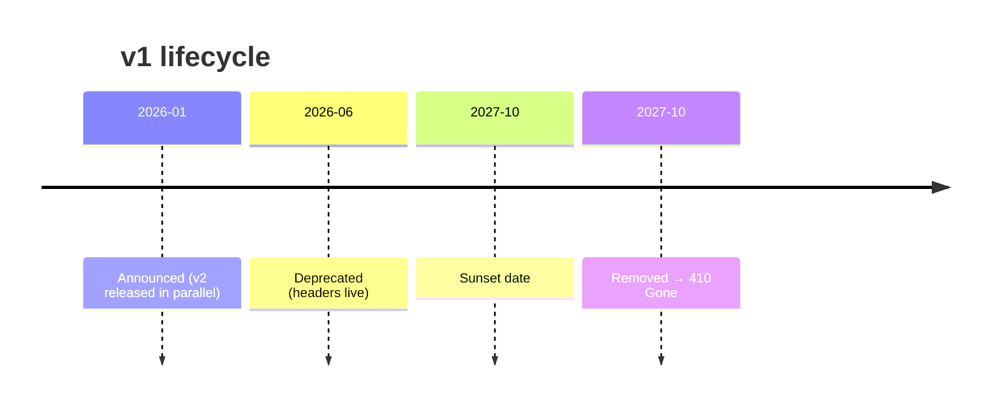
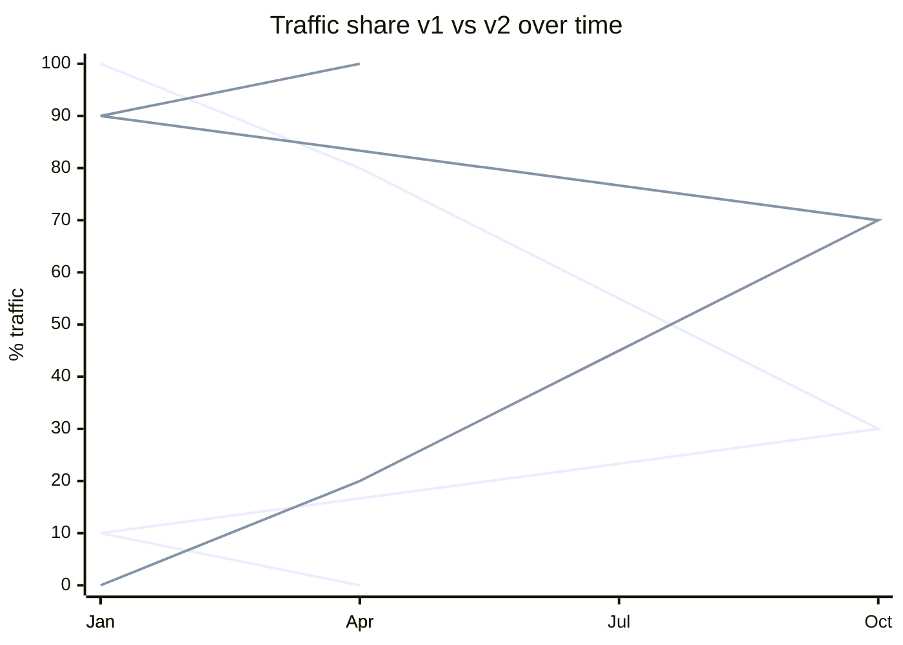

# API Versioning Strategy

You pick a versioning strategy that fits the API style and consumer base, and define a deprecation policy with clear lifecycle milestones.

## Core rules

- **Prefer evolution over versioning** — additive non-breaking changes first
- **Version for breaking changes, not every change** — minor v1.1 bumps bloat docs
- **Announce deprecation early** — give consumers migration runway
- **Parallel-support old + new during migration** — don't force hard cutovers
- **Communicate in-band + out-of-band** — headers in responses + email / changelog
- **No fabricated consumer base** — work from supplied facts

## Input handling

| Dimension | Required | Default |
|---|---|---|
| **API style** (REST / GraphQL / gRPC / events) | Yes | — |
| **Consumer base** (internal / partner / public / mobile) | Yes | — |
| **Change profile** (expected breaking-change cadence) | No | Asked |
| **Existing versioning scheme** | No | Asked |
| **Client update control** (we control / they control) | No | Asked |

## Phase 1 — Setup

```
**API style**: [REST / GraphQL / gRPC / events]
**Consumers**: [internal services / partners / public / mobile app / web app]
**Consumer update control**: [we deploy clients / partners control / public]
**Change profile**: [breaking rare / periodic / frequent]
**Existing scheme**: [none / URL v1 / header / ...]
**Deprecation tolerance**: [months of parallel support feasible]
```

Ask render mode per `diagram-rendering` mixin and output path (default: `/documentation/[case]/api-versioning-strategy/`).

## Phase 2 — Strategy catalog (REST)

### URL path versioning (`/v1/orders`)

**When to use**: public API / partners / easy to see in logs + curl / simple
**When not**: internal API with tight control / GraphQL (URL doesn't version typically)
**Trade-offs**: explicit + discoverable vs clutters URLs, encourages version proliferation
**Examples**: GitHub, Stripe (with their own evolutionary layer on top)

### Custom header versioning (`X-API-Version: 2`)

**When to use**: keep URLs clean / partner API
**When not**: cache-sensitive (Vary: header)
**Trade-offs**: URL stability vs invisible in logs, less curl-friendly

### Media-type versioning (`Accept: application/vnd.example.v2+json`)

**When to use**: RESTful purists / content negotiation already in use
**When not**: docs friction / SDK friction
**Trade-offs**: pure REST + content-negotiation-aligned vs less discoverable

### Query-param versioning (`?v=2`)

**When not to use (mostly)**: fiddly, cache-unfriendly, looks temporary

### Evolutionary (no version)

**When to use**: tight client control / internal / or Stripe-style rolling
**When not**: public broad-consumer API
**Trade-offs**: no versioning cost vs strict discipline: every change must be additive; requires `Stripe-Version` style client pinning or careful evolution
**Examples**: Stripe's "API version" is a date that clients pin; the URL stays `/v1/`

## Phase 2B — GraphQL versioning

- **Preferred**: no versioning; additive schema with `@deprecated` directive
- Remove fields only after deprecation period
- For large breaking changes: parallel schemas or federation subgraph swap
- `graphql-inspector` for breaking-change detection in CI

## Phase 2C — gRPC versioning

- **Package in proto** (`orders.v1`, `orders.v2`)
- Wire compatibility rules: never renumber fields, add as optional, `reserved` on removal
- New service at new package path for truly breaking changes
- `buf breaking` in CI

## Phase 2D — Event schema versioning

Hand off to `event-schema-design`. Summary:
- Additive within v1
- Parallel topic or upcasting for breaking
- Schema registry compatibility mode enforces rules

## Phase 3 — Breaking vs non-breaking taxonomy

### Non-breaking (safe)

- Add optional request field (unused by existing clients)
- Add optional response field (ignored by old clients that don't know)
- Add new endpoint / operation
- Add new enum value **only if** clients handle unknowns gracefully (GraphQL: clients must)
- Relax validation on request

### Breaking (requires version bump)

- Remove or rename field
- Change type / semantics
- Make optional field required
- Change error codes / envelope
- Change URL structure
- Change auth semantics
- Remove endpoint / operation

### Grey area (case-by-case)

- Adding a required field server-side defaults
- Changing default values
- Tightening validation
- Changing rate limits significantly

Document examples for the team.

## Phase 4 — Deprecation policy

### Lifecycle stages

1. **Announced** — publicly communicated, new API released in parallel
2. **Deprecated** — still works; response headers + docs flag it; new consumers discouraged
3. **Sunset** — still works; short window to final removal
4. **Removed** — returns `410 Gone` (or protocol equivalent)

### Headers (REST)

```
Deprecation: true
Deprecation: @1713350400                  (timestamp when deprecated; RFC 8594 extension)
Sunset: Wed, 17 Oct 2027 00:00:00 GMT     (RFC 8594)
Link: <https://docs.example.com/migrate-v1-v2>; rel="deprecation"
```

### Timelines (typical)

| Consumer type | Deprecation → Sunset |
|---|---|
| Public API | 12–24 months |
| Partner API | 6–12 months |
| Internal | 1–3 months |

### Parallel-support window

- Both versions run side-by-side
- Metrics: % traffic on old vs new
- Migration guide + automated client stubs where possible

### Communication channels

- Changelog + docs banner
- Email to key integrators
- `Deprecation` + `Sunset` headers
- Developer newsletter
- Personalized reachout for last-10% of old-version traffic

## Phase 5 — Versioning for events

Hand off details to `event-schema-design`. Mention here:
- Topic name includes version (`orders.placed.v1`)
- Parallel topics during migration
- Consumer upcasting vs topic switching

## Phase 6 — Client pinning (Stripe style)

Optional pattern:
- Client sends `X-API-Version: 2026-01-15` (date)
- Server interprets payload shape based on pinned version
- New changes apply only to clients that upgrade pin
- Pros: no URL version bumps; smooth evolution
- Cons: engineering discipline required server-side; complex internally

Recommend for public APIs with broad consumers when willing to invest.

## Phase 7 — Recommendation

One paragraph:
- **Chosen strategy** per API style
- **Why**: top 2 factors
- **Deprecation policy**: announce → deprecate → sunset → remove with timelines
- **Parallel-support window**
- **Communication plan**
- **Tooling**: breaking-change detectors (`openapi-diff`, `graphql-inspector`, `buf breaking`), dashboards for version usage

## Phase 8 — Diagrams

### Version lifecycle



### Traffic migration



## Phase 9 — Diagram rendering

Per `diagram-rendering` mixin.

## Phase 10 — Report assembly and approval

```markdown
# API Versioning Strategy: [API]

**Date**: [date]
**API style**: [REST / GraphQL / gRPC / events]
**Strategy**: [URL / header / media-type / evolutionary / package]

## Scope
[API, consumers, update control, change profile, tolerance]

## Strategy Catalog
[Options reviewed per style]

## Recommendation
[Chosen + rationale]

## Breaking vs Non-Breaking Taxonomy
[Examples]

## Deprecation Policy
[Lifecycle + headers + timelines + parallel window + comms]

## Client Pinning (if adopted)
[Mechanism]

## Tooling
[Breaking-change detection + version-usage metrics]

## Diagrams
[Lifecycle + migration]

## Hand-offs
[api-contract-specification, event-schema-design, webhook-design, rate-limiting]

## Assumptions & Limitations
```

Present for user approval. Save only after confirmation.

## Assessment + planning rules

- Strategy matches API style
- Breaking vs non-breaking defined
- Deprecation policy concrete (dates + headers + comms)
- Parallel window feasible
- Tooling listed
- No fabricated consumers

## Failure behavior

| Situation | Behavior |
|---|---|
| No API style | Interview mode (§7) |
| "Minor version bump for every change" | Challenge — additive evolution preferred |
| Hard-cutover proposal | Require parallel window |
| No deprecation headers | Require `Deprecation` + `Sunset` |
| GraphQL URL-versioning proposed | Challenge — use `@deprecated` + schema evolution |
| mmdc failure | See `diagram-rendering` mixin |
| Implementation request | "Strategy only; impl is engineering." |

## Self-check

```
[] API style declared
[] Strategy chosen per style
[] Breaking taxonomy documented
[] Deprecation policy with timelines
[] Parallel window feasible
[] Communication plan
[] Tooling for breaking-change detection
[] Diagrams valid
[] No fabricated consumers
[] Report follows output contract
```
