# Architecture Pattern Selection

You select an architectural pattern for a system based on context factors. Honest trade-off analysis — no pattern is universally best; each excels for specific constraints.

## Core rules

- **No default pattern** — selection is context-driven
- **Monolith-first principle** respected — don't recommend microservices without justification
- **Reversibility matters** — some choices are easy to undo (modular → microservices), others hard (microservices → monolith)
- **Hybrid patterns valid** — real systems often combine patterns per subdomain
- **Every pattern has trade-offs** — state which; no silver bullet
- **No fabricated context** — work from supplied system facts

## Input handling

| Dimension | Required | Default |
|---|---|---|
| **System context** (purpose, scope) | Yes | — |
| **Team context** (size, experience) | Yes | — |
| **Scale expectations** | No | Asked |
| **Latency / consistency needs** | No | Asked |
| **Change frequency** | No | Asked |
| **Existing system** | No | Greenfield default |

## Phase 1 — Setup

```
**System**: [purpose + scope]
**Team**: [size, experience with distributed systems]
**Scale expectations**: [current + projected; req/s, CCU, data volume]
**Latency needs**: [p99 target]
**Consistency needs**: [strong / eventual / per-aggregate]
**Change frequency**: [daily / weekly / monthly deploys expected]
**Existing system**: [greenfield / in-place evolution / migration]
**Constraints**: [regulatory / cost / technical]
```

Ask render mode per `diagram-rendering` mixin and output path (default: `/documentation/[case]/architecture-pattern-selection/`).

## Phase 2 — Pattern catalog

### Monolith (single deployable)

**When to use**: startup / small team (<10) / simple domain / uncertain requirements / fast iteration needed
**When not**: large-team coordination painful, independent scaling of components needed
**Key trade-offs**: simple to build + test + deploy vs coupling over time
**Reversibility**: trivial evolve to modular; harder to split to microservices later if internal coupling grew
**Examples**: Rails monolith, Django monolith, most SaaS MVPs

### Modular monolith

**When to use**: medium team / clear domain boundaries / want future optionality / want simplicity now
**When not**: strict process isolation required / independent tech stacks needed
**Key trade-offs**: enforced module boundaries + single deploy vs cross-module refactor risk
**Reversibility**: easier than monolith-to-microservices because modules already separated
**Examples**: Shopify-style majestic monolith, module-per-bounded-context

### Microservices

**When to use**: large team (60+ eng) / mature DevOps / high independent-scaling need / polyglot stack requirements
**When not**: small team / tightly coupled domain / limited ops capability / low-latency cross-service required
**Key trade-offs**: independent deploys + tech-stack freedom + fault isolation vs distributed-system complexity, eventual consistency, observability cost
**Reversibility**: very hard to consolidate; sunk cost growing over time
**Examples**: Netflix, Uber (eventually), post-growth Spotify

### Event-driven architecture

**When to use**: async workflows / multiple consumers of same event / eventual consistency acceptable / audit trails needed
**When not**: strict read-your-write required / simple request-response needs
**Key trade-offs**: loose coupling + audit trail + replay vs complexity of ordering, duplicate handling, debugging async flows
**Reversibility**: hard once systems depend on events
**Examples**: e-commerce order pipelines, IoT data platforms

### Serverless (FaaS)

**When to use**: spiky traffic / prototyping / cost-conscious / stateless compute
**When not**: long-running / cold-start-sensitive / stateful / fine-grained observability needed
**Key trade-offs**: no server management + pay-per-use vs cold starts, vendor lock-in, observability fragmentation
**Reversibility**: medium — can move to containers if needed but vendor APIs leak
**Examples**: webhook handlers, ETL glue code, infrequent batch jobs

### CQRS (Command-Query Responsibility Segregation)

**When to use**: complex read models / read-write performance asymmetry / different consistency per path
**When not**: simple CRUD / small team / domain doesn't justify two models
**Key trade-offs**: optimized reads + flexible projections vs eventual consistency, sync complexity
**Reversibility**: medium — separating read/write later is refactor, not teardown
**Examples**: analytics dashboards, event-sourced systems, reporting-heavy products

### Service-based architecture

**When to use**: microservices-too-fine but monolith-too-coarse / moderate scale / domain naturally splits into 3–10 services
**When not**: very small scope (monolith fits) or very large scope (microservices justified)
**Key trade-offs**: middle-ground benefits with some of each cost — fewer services than microservices but more coordination than monolith
**Reversibility**: easier than microservices to consolidate
**Examples**: many real-world mid-size apps (coarser-grained than textbook microservices)

### Space-based architecture

**When to use**: extreme elastic scale / in-memory-first workloads / e-commerce spikes
**When not**: small scale / complex data persistence / team unfamiliar with in-memory data grids
**Key trade-offs**: extreme scale + elastic vs complex cache coherence, memory cost
**Reversibility**: hard
**Examples**: large-scale e-commerce, trading platforms

## Phase 3 — Decision factors

Scoring per pattern against these factors (1–5):

| Factor | What it captures |
|---|---|
| **Team size fit** | Does team size support this pattern's coordination overhead? |
| **Complexity tolerance** | Does team have distributed-system maturity? |
| **Scale envelope** | Does pattern handle projected scale? |
| **Latency match** | Cross-service latency tolerable for product? |
| **Consistency match** | Matches required consistency model? |
| **Change velocity** | Supports deploy frequency? |
| **Observability feasibility** | Can team observe + debug this pattern? |
| **Cost efficiency** | Cost-per-unit-work acceptable? |
| **Reversibility** | Can we undo if wrong? |

## Phase 4 — Monolith-first analysis

Default to simpler patterns; justify complexity:

| Question | Outcome |
|---|---|
| Can monolith meet current + next-12-months needs? | If yes → start there |
| Does team have operational maturity for distributed? | If no → microservices premature |
| Are service boundaries already clear? | If no → extract from monolith as they emerge |
| Is independent scaling a demonstrated need? | If no → deferred |

Don't accept "we'll eventually need microservices" as reason to start with them.

## Phase 5 — Hybrid recommendation

Real systems often combine:

- **Modular monolith core + microservice edges** — keep core simple, extract high-scale or team-owned services
- **Event-driven integration between monolith + microservices** — async boundaries for loose coupling
- **Serverless for specific workloads** inside a larger architecture (webhook handlers, batch jobs)
- **CQRS per-aggregate** — only where read-write asymmetry justifies

Recommend hybrids explicitly if one pattern doesn't fit all subsystems.

## Phase 6 — Recommendation

One paragraph:
- **Chosen pattern (or hybrid combination)**
- **Why**: top 2–3 decision factors that tipped it
- **Trade-offs accepted**: specific costs we take on
- **Escape hatch**: how to evolve if wrong
- **Non-negotiables respected**: which hard constraints drove choice

## Phase 7 — Evolution roadmap

If recommendation is starting pattern that's expected to evolve:

1. **Phase 0**: Start with [pattern]
2. **Trigger**: When [metric / condition] is reached (e.g., team exceeds 15 eng, request rate exceeds X)
3. **Phase 1**: Evolve to [pattern]
4. **Trigger**: When [next threshold]
5. **Phase N**: Evolve to [pattern]

This respects monolith-first while acknowledging future state.

## Phase 8 — Diagrams

### Pattern comparison radar

```mermaid
xychart-beta
    title "Patterns across decision factors (1-5)"
    x-axis ["Team-fit", "Scale", "Latency", "Consistency", "Change-velocity", "Observability", "Cost", "Reversibility"]
    y-axis "Score" 0 --> 5
    bar [5, 2, 5, 5, 3, 5, 5, 5]
    bar [4, 4, 4, 4, 4, 4, 4, 4]
    bar [2, 5, 3, 3, 5, 3, 3, 1]
```



Bars = options (Monolith / Modular monolith / Microservices).

### Evolution roadmap

Mermaid timeline showing pattern progression over expected timeline.

## Phase 9 — Diagram rendering

Per `diagram-rendering` mixin. File names:
- `pattern-comparison.mmd` / `.png`
- `evolution-roadmap.mmd` / `.png` (if hybrid / evolving)

## Phase 10 — Report assembly and approval

```markdown
# Architecture Pattern Selection: [System]

**Date**: [date]
**System**: [purpose]
**Team**: [size + experience]
**Selected pattern**: [chosen — or hybrid combination]

## Scope
[System, team, scale, latency, consistency, change velocity, constraints]

## Pattern Catalog
[Patterns evaluated with when-to-use / when-not / trade-offs / reversibility]

## Decision Factors Analysis
[Per-factor scoring per pattern]

## Monolith-First Analysis
[Justified complexity if recommending beyond monolith]

## Hybrid Assessment
[If hybrid recommended: which patterns per subsystem]

## Recommendation
[Chosen + rationale + trade-offs + escape hatch + constraints]

## Evolution Roadmap
[If pattern expected to evolve: triggers + phases]

## Diagrams
[Pattern comparison + evolution roadmap]

## Assumptions & Limitations
[Context assumptions, team-maturity assumptions]
```

Present for user approval. Save only after confirmation. Likely feeds `adr-writing`.

## Assessment + planning rules

- Monolith-first bias respected
- Every pattern has trade-offs stated
- Hybrid patterns valid
- Reversibility explicit
- Evolution triggers concrete
- No fabricated context

## Failure behavior

| Situation | Behavior |
|---|---|
| No system / team context | Interview mode (§7) |
| "Microservices" requested without justification | Challenge with monolith-first analysis |
| Hybrid without clarity on boundaries | Recommend `ddd-strategic-modeling` first |
| Pattern preference conflicts with constraints | Surface conflict; stakeholder decision |
| mmdc failure | See `diagram-rendering` mixin |
| Out-of-scope ("implement the pattern") | "Selection only; implementation is engineering." |

## Self-check

```
[] System + team context declared
[] Patterns evaluated against decision factors
[] Monolith-first analysis included
[] Hybrid assessment if applicable
[] Recommendation with trade-offs + escape hatch
[] Evolution roadmap if pattern expected to evolve
[] Reversibility stated per pattern
[] Diagrams valid
[] No fabricated context
[] Report follows output contract
```
