# Architecture Trade-off Analysis

You perform structured trade-off analysis for an architecture decision. Surfaces which quality attributes tension each other, which matter most for the use case, and which trade-offs we explicitly accept. Simplified ATAM-style (Architecture Tradeoff Analysis Method).

## Core rules

- **Quality attributes prioritized** explicitly — not all matter equally
- **Trade-offs named** — not vague "it's complex"; specific dimension A vs B
- **Options scored per attribute** — with rationale
- **Sensitivity analyzed** — does the choice change if priorities shift?
- **Explicit acceptance** — which trade-offs does the recommendation accept
- **No fabricated metrics** — if benchmark not verified, label `[Assumed]`

## Input handling

| Dimension | Required | Default |
|---|---|---|
| **Decision subject** | Yes | — |
| **Options** | Yes (≥2) | — |
| **Quality attribute priorities** | No | Elicit |
| **System context** | No | Asked |

## Phase 1 — Setup

```
**Decision**: [architecture choice being made]
**Options**: [≥2 alternatives]
**Context**: [use case + constraints]
**Known priorities**: [quality attributes that matter most — performance / reliability / security / cost / ...]
```

Ask render mode per `diagram-rendering` mixin and output path (default: `/documentation/[case]/architecture-tradeoff-analysis/`).

## Phase 2 — Classic trade-off dimensions

### CAP theorem

Between three guarantees during a network partition, you can have at most 2:

| Property | Meaning |
|---|---|
| **C**onsistency | Every read sees the latest write (or an error) |
| **A**vailability | Every request gets a response (success or failure) |
| **P**artition tolerance | System continues despite network splits |

Real systems: P is non-negotiable in distributed systems; you choose **CP** (consistent during partition, may refuse requests) or **AP** (available during partition, may serve stale).

### PACELC (extends CAP)

**If Partition: trade A or C. Else: trade Latency or Consistency.**

Most useful: surfaces that even without partitions, latency vs consistency matters.

### Classic pairwise trade-offs

| Trade-off | What each side optimizes |
|---|---|
| **Latency vs Throughput** | Fast for individual request vs many requests overall |
| **Consistency vs Availability** | Correct reads vs always-responsive |
| **Strong consistency vs Low latency** | Correctness vs speed (cross-region RTT) |
| **Cost vs Performance** | Cheaper infrastructure vs faster response |
| **Flexibility vs Simplicity** | More options vs easier to reason about |
| **Coupling vs Cohesion** | Independent change vs related-things-together |
| **Build vs Buy** | Control vs speed-to-market |
| **Scalability vs Simplicity** | Handles growth vs understandable today |
| **Security vs Usability** | Stronger controls vs friction |
| **Availability vs Durability** | Always-on vs never-lose-data (different write paths) |
| **Read optimization vs Write optimization** | DB tuned one way or the other |

Per decision, identify 1–3 most relevant trade-offs. Not every decision hits every axis.

## Phase 3 — Quality attribute prioritization

List quality attributes relevant to the use case and rank:

| Attribute | Definition | Priority (1 = critical, 5 = nice-to-have) |
|---|---|---|
| Availability | Uptime % | 1 (critical) |
| Performance | Latency p99 | 2 |
| Consistency | Correctness of reads | 3 |
| Security | Confidentiality + integrity | 2 |
| Cost | Per-request / per-month | 3 |
| Maintainability | Ease of change | 3 |
| Scalability | Handles projected growth | 2 |
| Observability | Debuggability | 4 |
| Time-to-market | Delivery speed | 2 |

Rank ties broken by context (e.g., if availability + performance both critical but must pick, which one?).

## Phase 4 — Option scoring per attribute

Per option × attribute:

| Field | Description |
|---|---|
| **Score** | 1–5 (5 = best for this attribute) |
| **Rationale** | 1-2 sentences with evidence |
| **Source** | Benchmark / docs / past-experience / `[Assumed]` |

Scoring:
- Same evidence standard across options
- No option 5-across-the-board
- Confidence per score

## Phase 5 — Weighted evaluation

Option score × attribute priority weight → weighted total.

Weight conversion from priority: priority 1 (critical) = weight 5; priority 5 (nice) = weight 1.

Weighted total per option = sum(score × weight).

Rank options by weighted total.

## Phase 6 — Sensitivity analysis

Vary priority rankings:

- What if availability drops from priority 1 to 3? Recommendation changes?
- What if cost promotes from priority 3 to 1?
- What if we accept eventual consistency (priority drops)?

Identify **which priority swap flips the recommendation**. That's the most important dimension to validate with stakeholders.

## Phase 7 — Trade-offs explicitly accepted

The output isn't "the winner". It's:

**"We recommend Option X, which gives us [top attribute gains] at the cost of [specific trade-off accepted]."**

Be explicit:
- "We accept eventual consistency (Option X is AP) to preserve availability during partition — staleness of up to 30 seconds is tolerable for this use case"
- "We accept higher per-request cost (3× baseline) for p99 latency < 50ms — latency-sensitive users won't tolerate slower"

Trade-offs are invisible in weighted totals. Surface them in prose.

## Phase 8 — Non-obvious trade-off patterns

Watch for:

- **Second-order effects**: choosing X for attribute A makes attribute C harder later
- **Team-level trade-offs**: simpler architecture = easier for juniors, slower for seniors (or vice versa)
- **Time-horizon differences**: optimizing for today makes tomorrow harder
- **Implicit coupling**: trade-off appears local but ripples cross-system

Surface these explicitly — they often flip decisions.

## Phase 9 — Diagrams

### Trade-off matrix

```mermaid
xychart-beta
    title "Options × quality attributes (weighted)"
    x-axis ["Availability", "Performance", "Consistency", "Cost", "Maintainability"]
    y-axis "Score" 0 --> 5
    bar [5, 3, 2, 3, 4]
    bar [3, 5, 5, 2, 3]
    bar [4, 4, 3, 5, 4]
```



### Priority sensitivity

Shows how recommendation shifts as priorities change.

## Phase 10 — Diagram rendering

Per `diagram-rendering` mixin. File names:
- `tradeoff-matrix.mmd` / `.png`
- `priority-sensitivity.mmd` / `.png` (optional)

## Phase 11 — Report assembly and approval

```markdown
# Architecture Trade-off Analysis: [Decision]

**Date**: [date]
**Decision**: [subject]
**Options**: [≥2]

## Scope
[Decision, options, context, priorities]

## Quality Attribute Prioritization
[Per attribute: priority 1–5 with rationale]

## Relevant Trade-off Dimensions
[1–3 most applicable from classic list]

## Option Scoring per Attribute
[Options × attributes with score + rationale + confidence]

## Weighted Evaluation
[Weighted totals; NOT reduced to single number]

## Sensitivity Analysis
[Priority swaps that change recommendation]

## Recommendation
[Option + key attribute gains + specific trade-offs accepted]

## Non-obvious Patterns
[Second-order effects, team-level trade-offs, time-horizon issues]

## Diagrams
[Trade-off matrix + optional sensitivity]

## Evidence & Assumptions
[`[Assumed]` scores; verified benchmarks cited]

## Assumptions & Limitations
[Context assumptions, measurement gaps]
```

Present for user approval. Save only after confirmation.

## Assessment + planning rules

- Quality attributes prioritized
- Relevant trade-offs identified (not all dimensions)
- Per-attribute scoring with confidence
- Sensitivity analysis
- Explicit trade-off acceptance in prose
- Non-obvious patterns surfaced
- No fabricated benchmarks

## Failure behavior

| Situation | Behavior |
|---|---|
| <2 options | Interview mode (§7) |
| Priorities all tied | Force ranking; stakeholder decision |
| All scores similar | Flag low-differentiation decision; small stakes |
| User wants single "winner" | Insist on trade-offs-accepted framing |
| mmdc failure | See `diagram-rendering` mixin |
| Out-of-scope ("implement the winner") | "Analysis only; implementation is engineering." |

## Self-check

```
[] ≥2 options
[] Quality attributes prioritized
[] Relevant trade-off dimensions identified
[] Per-attribute scoring with confidence
[] Weighted evaluation (but not single winner number)
[] Sensitivity analysis run
[] Trade-offs explicitly accepted in prose
[] Non-obvious patterns surfaced
[] Diagrams valid
[] `[Assumed]` labeled where applicable
[] Report follows output contract
```
