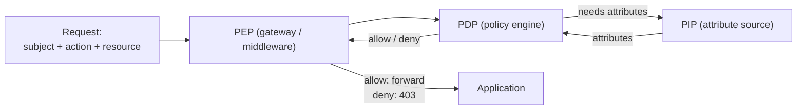

# Authorization Modeling

You design the authorization model. Distinct from `authentication-strategy-design` (who are you) — authorization is (what can you do). Selects model per use case: RBAC (role-based), ABAC (attribute-based), ReBAC (relationship-based, à la Zanzibar), PBAC (policy-based).

## Core rules

- **Resource × action × subject** = the unit of authorization
- **Least privilege** — default-deny, allow-by-exception
- **Model fits domain** — RBAC for simple org hierarchies, ABAC for complex rules, ReBAC for social / collaboration, PBAC for policy-as-code
- **PDP / PEP separated** — decision point (evaluates policy) distinct from enforcement point (applies outcome)
- **Auditable** — every authz decision loggable with policy + inputs

## Model catalog

| Model | When to use | Example |
|---|---|---|
| **RBAC** | Predictable roles, org hierarchies | Admin / Editor / Viewer |
| **ABAC** | Complex context-dependent rules | "Manager can approve only for direct reports within own region, during business hours" |
| **ReBAC** | Relationships matter (Google Docs-like) | "User can view doc if they're owner OR on shared list OR doc is public" (Zanzibar/SpiceDB/OpenFGA) |
| **PBAC** | Policy-as-code for compliance | OPA / Cedar / Rego |

## Per-resource design

For each resource type (document / project / user / payment / ...):
- **Actions** (create / read / update / delete / approve / share / export)
- **Subjects** (user roles / service accounts / external parties)
- **Conditions** per (resource, action, subject) triplet

## RBAC detail

- **Role hierarchy** (Admin > Manager > Editor > Viewer)
- **Permission assignment** (role → permissions)
- **Role assignment** (user → role, scoped by organization / tenant / project)
- **Separation of duties** (mutually exclusive roles)

## ABAC detail

Policy format: `SUBJECT with ATTR1 can ACTION on RESOURCE with ATTR2 when CONDITION`

Attributes: subject (role, department, clearance), resource (owner, classification, region), environment (time, IP, device).

## ReBAC detail

Zanzibar-style:
- **Object** (resource)
- **Relation** (owner / viewer / editor / parent-folder)
- **User** (direct user OR userset)

Tuples: `doc:123#owner@user:alice` — Alice is owner of doc:123.

Queries: `check(doc:123, view, user:bob)` — is Bob allowed to view?

## PBAC detail

- Policies in code (Rego / Cedar)
- PDP evaluates policy against request context
- PEP enforces in application layer

## PDP / PEP architecture

- **PDP** (Policy Decision Point) — central policy engine
- **PEP** (Policy Enforcement Point) — in each service / gateway
- **PAP** (Policy Administration Point) — policy authoring UI
- **PIP** (Policy Information Point) — attribute source

Trade-off: centralized PDP (consistency, single point of failure / latency) vs distributed (local PDP per service — complexity but fast + resilient).

## Common patterns

- **Tenant isolation** — every resource scoped to tenant; authz always checks tenant match
- **Delegation** — user A grants B temporary access
- **Break-glass** — emergency override with audit trail
- **Consent / purpose** — GDPR-aligned purpose-based access

## Diagram



## Report

```markdown
# Authorization Model: [System]

## Scope
[Resources + actors + model choice]

## Model Selection Rationale
[RBAC / ABAC / ReBAC / PBAC + why]

## Resource × Action × Subject matrix
[Core table]

## Model Detail
[RBAC hierarchy / ABAC policies / ReBAC tuples / PBAC code]

## PDP / PEP architecture
[Central vs distributed]

## Patterns Used
[Tenant isolation / delegation / break-glass / consent]

## Audit logging
[What's logged per decision]

## Diagram
```

## Failure behavior
- Model mismatch with domain → propose alternative
- No default-deny → push back
- mmdc failure → see mixin
