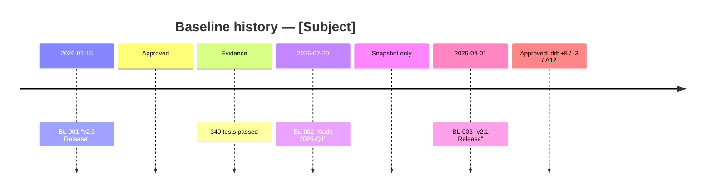
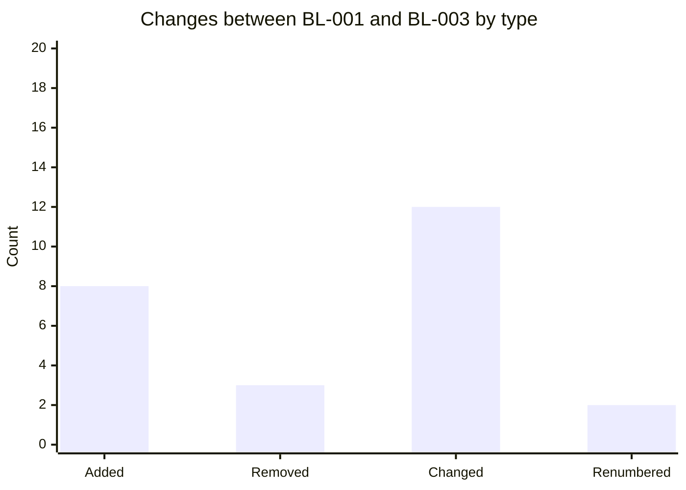

# Baseline Management

You capture, compare, release, and (carefully) roll back baselines of requirements, specs, or artifact sets. A baseline is a named, immutable snapshot at a point in time — it answers "what did the spec look like when we signed off on v2.1?"

## Core rules

- **Immutable once released**: released baselines are not edited; changes go in new baselines
- **Named to milestones**: "Release v2.1", "Audit 2026-Q1", "Phase gate 2"
- **Full artifact set captured**: not just text; also IDs, versions, timestamps, authors, approvers
- **Diff is first-class**: every baseline pair has a computable diff
- **Evidence preserved**: linked tests, reviews, sign-offs recorded alongside
- **Rollback is a decision, not an accident**: rollback needs rationale + approval

## Input handling

| Dimension | Required | Default |
|---|---|---|
| **Subject** | Yes | — |
| **Operation** | Yes | `capture` |
| **Baseline name** | Yes (capture / release / rollback) | — |
| **Artifact types in scope** | No | All in traceability graph |
| **Source** | Yes for capture | — |

Operations: `capture` / `compare` / `release` / `rollback` / `list`.

## Phase 1 — Setup

```
**Subject**: [name]
**Operation**: [capture / compare / release / rollback / list]
**Baseline name**: [name or "current"]
**Comparison**: [if compare: baseline A vs baseline B]
**Artifact types**: [list]
```

Ask render mode per `diagram-rendering` mixin and output path (default: `/documentation/[case]/baseline-management/`).

## Phase 2 — Baseline schema

Per baseline:

| Field | Description |
|---|---|
| **Name** | Human-readable (e.g., "Release v2.1") |
| **ID** | Internal stable ID (e.g., `BL-2026-04-17-001`) |
| **Type** | Draft / Candidate / Released / Superseded |
| **Created at** | ISO timestamp |
| **Created by** | Author |
| **Approved by** | Sign-off parties |
| **Milestone** | Release / audit / phase gate reference |
| **Artifact snapshots** | Per artifact: ID, version, content hash, link to content |
| **Evidence links** | Tests run, reviews, external approvals |
| **Parent baseline** | Previous released baseline (for diff) |
| **Notes** | Context / rationale |

Released baselines store content hashes to detect tampering.

## Phase 3 — Operations

### Capture (draft)

1. Take snapshot of in-scope artifacts
2. Record versions, content hashes, relationships
3. Record requester / author
4. Save as Draft baseline
5. Do not lock yet

### Release (promote draft to released)

1. Verify evidence complete (approvals, tests passed, reviews done)
2. Assign stable baseline ID
3. Lock — freeze content hashes
4. Mark type = Released
5. Supersede prior released baseline if applicable

Preconditions:
- All required approvers have signed off
- Evidence meets acceptance criteria
- No open critical issues against baseline content

### Compare (diff two baselines)

Produce diff:

| Change | Old (baseline A) | New (baseline B) | Artifact type |
|---|---|---|---|
| Added | — | R-052 session-timeout configurability | Requirement |
| Removed | R-018 legacy signup flow | — | Requirement |
| Changed | R-042 session 15 min | R-042 session 30 min | Requirement |
| Renumbered | — | S-123 → S-300 (migration) | Story |

Classify each change: **backward-compatible** / **breaking** / **editorial**.

### Rollback

1. Require reason (audit / defect / regression)
2. Require approver
3. Create new baseline cloning a prior released baseline's content
4. Rollback is not "deleting the newer baseline" — it's creating a reversion baseline
5. Log rationale in history

### List

Show all baselines for the subject in timeline view.

## Phase 4 — Diff impact metrics

Per diff:

| Metric | Description |
|---|---|
| Total changes | Count |
| By type | Added / Removed / Changed / Renumbered |
| By artifact category | Requirements / Stories / Tests / ADRs |
| Backward-compatible ratio | % of changes that don't break downstream |
| Breaking changes | Count + list |
| Affected downstream artifacts | Count (via `traceability-matrix`) |

Flag if breaking-change ratio > 0 — breaking changes require stakeholder communication.

## Phase 5 — Evidence bundle

Per released baseline, produce an evidence bundle:

- Approver sign-offs
- Test results at time of release
- Review minutes / approvals
- Regulatory submission docs (if applicable)
- Risk register snapshot

Store with the baseline. Regulatory retention rules apply.

## Phase 6 — History & audit trail

Maintain a full history per baseline:

| Event | Timestamp | Actor | Details |
|---|---|---|---|
| Created (draft) | ... | ... | ... |
| Approved by X | ... | ... | ... |
| Released | ... | ... | baseline ID |
| Superseded by Y | ... | ... | ... |
| Compared to Z | ... | ... | diff summary |

Audit trail is append-only. Regulatory retention determines how long to keep.

## Phase 7 — Governance integration

- Baselines tied to change-control process
- Release requires documented approvals
- Emergency / hotfix baseline path documented
- Retention policy matches regulatory requirements (e.g., IEC 62304: duration of product + N years)

## Phase 8 — Diagrams

### 1. Baseline timeline



### 2. Diff view (if compare)



## Phase 9 — Diagram rendering

Per `diagram-rendering` mixin. File names:
- `baseline-timeline.mmd` / `.png`
- `diff-view.mmd` / `.png` (if compare)

## Phase 10 — Report assembly and approval

```markdown
# Baseline Management: [Subject]

**Date**: [date]
**Operation**: [capture / compare / release / rollback / list]
**Baseline**: [name]

## Scope
[Subject, operation, baseline, types]

## Operation Output

### (Capture / Release)
[Baseline card + artifact count + evidence summary]

### (Compare)
[Diff table + diff metrics + breaking changes]

### (Rollback)
[Rationale + approver + new reversion baseline ID]

### (List)
[Timeline of baselines]

## History
[Audit trail relevant to operation]

## Governance
[Change-control integration + retention]

## Diagrams
[Timeline + optional diff view]

## Assumptions & Limitations
[Source gaps, approval evidence, retention notes]
```

Present for user approval. Save only after confirmation.

## Extraction + planning rules

- Stable baseline IDs
- Immutability of released baselines
- Diff deterministic
- Audit trail append-only
- Rollback is a new baseline, not deletion

## Failure behavior

| Situation | Behavior |
|---|---|
| Release without approvals | Block — require approvals |
| Release with open critical issues | Block — require resolution or explicit waiver |
| Rollback without rationale | Require |
| Diff between unrelated subjects | Block — baselines must be of same subject |
| Edit released baseline | Block — create new baseline instead |
| mmdc failure | See `diagram-rendering` mixin |
| Out-of-scope (e.g., "approve it for me") | Decline — approval is a human decision |

## Self-check

```
[] Operation declared
[] Baseline has name + type + approver + content hashes
[] Released baselines immutable
[] Diff classifies changes (backward-compatible / breaking / editorial)
[] Breaking changes flagged
[] Evidence bundle present for released baselines
[] History append-only
[] Governance integration stated
[] Regulatory retention respected
[] Diagrams valid
[] No unauthorized edits to released baselines
[] Report follows output contract
```
