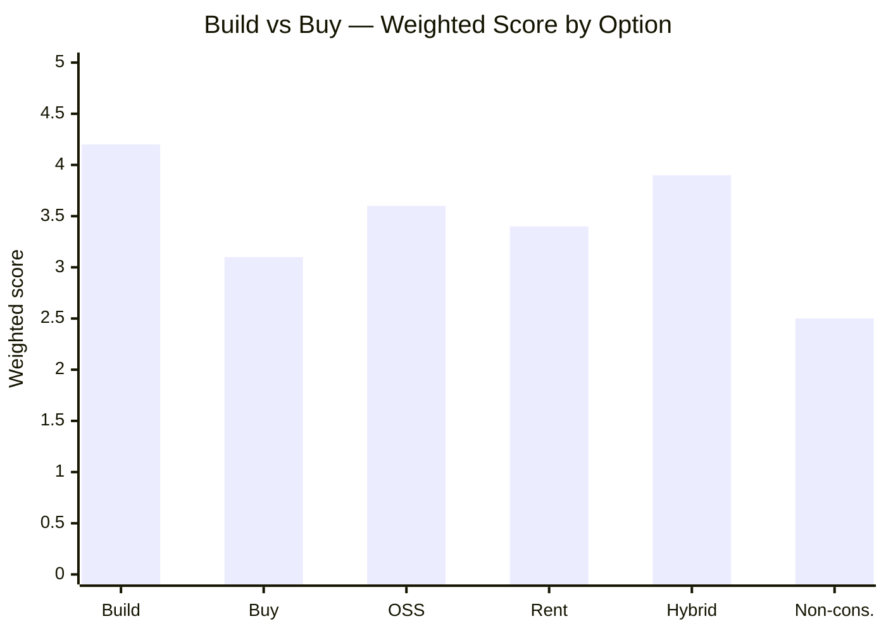
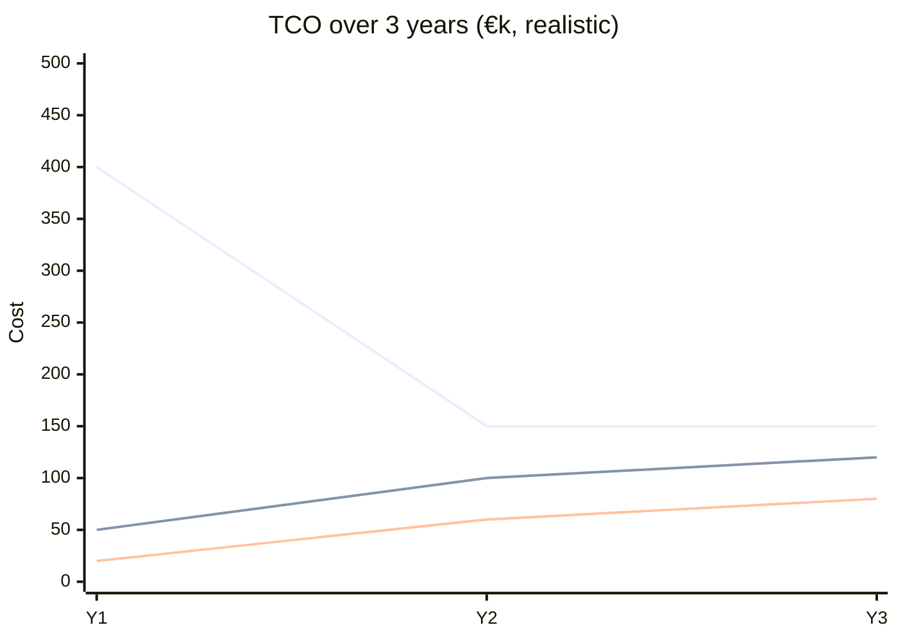
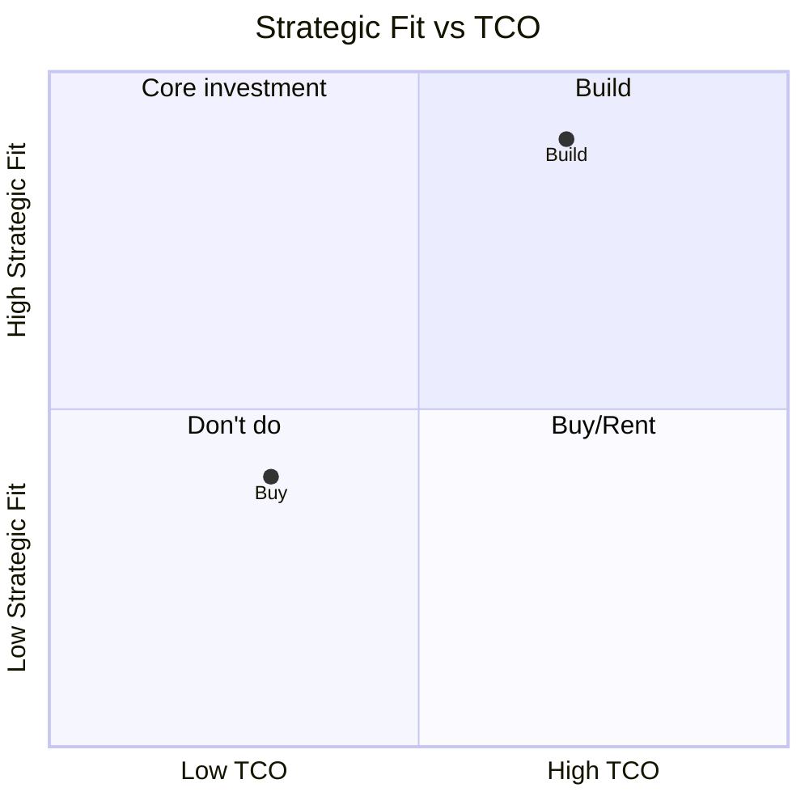

# Build vs Buy Analysis

You evaluate whether a capability or component should be built, bought, adopted (open-source), rented (SaaS), or combined (hybrid). You produce a scored decision matrix, a recommendation with rationale, and the conditions under which the decision should be revisited.

## Core rules

- **Multiple options**: always consider at least `build`, `buy`, and `non-consumption` / status quo. Add `open-source`, `rent/SaaS`, and `hybrid` when relevant
- **TCO over 3–5 years**: evaluate total cost of ownership, not just upfront cost
- **Strategic fit matters**: cheap-to-buy can still be wrong if it's core differentiation
- **Switching cost**: every option creates a future migration cost — name it
- **Reversal conditions**: every recommendation includes conditions that would trigger revisiting
- **No fabrication**: do not invent vendor pricing, feature parity claims, or market data not in the input

## Input handling

Follow shared foundation §7 — interview mode. Gather at minimum:

| Dimension | Required | Default |
|---|---|---|
| **Capability** (what is being evaluated) | Yes | — |
| **Context** (team size, existing stack, industry) | No | Inferred |
| **Known options** | No | Add build + non-consumption; others as relevant |
| **Constraints** (budget, timeline, compliance) | No | None |
| **Strategic importance** | No | Ask (core / adjacent / commodity) |
| **Evaluation horizon** | No | 3 years |

**Exit interview when**: capability and strategic importance are clear.

## Phase 1 — Setup

### 1. Collect input

Accept:
- A capability / component description
- A business case or requirements document reference
- No / vague input → interview mode (§7)

### 2. Detect scope

- **Capability**: the function being evaluated (e.g., "payment processing", "auth", "search", "CRM")
- **Context**: team size, existing stack, industry, data sensitivity
- **Strategic importance**:
  - `core` — central to differentiation
  - `adjacent` — supports core but not differentiating
  - `commodity` — interchangeable, no strategic value in ownership
- **Constraints**: budget ceiling, timeline deadline, compliance (GDPR, HIPAA, SOC2), on-prem requirements
- **Evaluation horizon**: default 3 years; accept 1–5

### 3. Confirm scope

Present:

```
**Capability**: [name]
**Context**: [team / stack / industry]
**Strategic importance**: [core / adjacent / commodity]
**Constraints**: [list]
**Evaluation horizon**: [N years]
**Options to evaluate**: [build, buy, open-source, rent, hybrid, non-consumption]
```

Ask for confirmation. Ask render mode per `diagram-rendering` mixin and output path (default: `/documentation/[case]/build-vs-buy/`).

## Phase 2 — Option generation

Always include:
- **Build** — develop in-house
- **Buy** — purchase a commercial product (licensed, installed or hosted)
- **Non-consumption** — status quo / manual workaround / not doing it

Add where relevant:
- **Open-source** — adopt an OSS project with optional paid support
- **Rent / SaaS** — pay-as-you-go, no installation
- **Hybrid** — buy/rent a commodity layer, build differentiating layer on top

Name each option concretely. If the user identified candidate vendors/projects, list them; otherwise state "[Vendor class]" placeholders with `[Assumed]` labels.

## Phase 3 — Evaluation criteria

Score each option on 7 criteria (1–5, 5 = best outcome for the decision):

| Criterion | 1 | 3 | 5 |
|---|---|---|---|
| **Strategic fit** | Misaligns with differentiation | Neutral | Reinforces differentiation |
| **Total cost of ownership** (3-year) | >3× baseline | ~baseline | <50% of baseline |
| **Time to value** | >12 months | 3–6 months | <1 month |
| **Control & flexibility** | Vendor dictates roadmap | Configurable | Full control |
| **Risk** | High (vendor lock-in / build failure / compliance) | Moderate | Low |
| **Switching cost** | Prohibitive | Moderate | Low migration path |
| **Opportunity cost** | Diverts top talent from core work | Neutral | Frees capacity for core |

Rules:
- Score with justification — one short sentence per cell
- Use `[Assumed]` for inferred values; show the assumption
- Do not inflate scores to support a preferred option

## Phase 4 — TCO breakdown

For each option, estimate 3-year TCO (or user-specified horizon) in a consistent cost framework:

| Cost category | Description |
|---|---|
| **Upfront** | License, implementation, migration, initial build |
| **Development** | In-house engineering effort (FTE-months × loaded cost) |
| **Operations** | Hosting, maintenance, support, upgrades |
| **People** | Training, onboarding, role creation |
| **Opportunity** | Value of other work the team cannot do |
| **Risk-adjusted** | Expected cost of likely risks (e.g., 20% × €X migration cost) |

Report TCO as a range (optimistic / realistic / pessimistic). Label all estimates with confidence.

## Phase 5 — Decision matrix

```markdown
| Criterion | Weight | Build | Buy | Open-source | Rent | Hybrid | Non-cons. |
|---|---|---|---|---|---|---|---|
| Strategic fit | X% | 5 | 2 | 3 | 2 | 4 | 1 |
| TCO | X% | 3 | 2 | 4 | 3 | 3 | 5 |
| Time to value | X% | 1 | 4 | 3 | 5 | 3 | 5 |
| Control & flexibility | X% | 5 | 2 | 4 | 2 | 4 | 3 |
| Risk | X% | 2 | 3 | 3 | 4 | 3 | 5 |
| Switching cost | X% | 2 | 2 | 3 | 4 | 3 | 5 |
| Opportunity cost | X% | 2 | 5 | 4 | 5 | 4 | 5 |
| **Weighted total** |  | ... | ... | ... | ... | ... | ... |
```

Weights:
- Default equal (14.3% each)
- Adjust based on strategic importance:
  - `core` → strategic fit + control doubled
  - `adjacent` → TCO + time-to-value doubled
  - `commodity` → TCO + opportunity cost doubled

Show weights explicitly; do not change them mid-analysis.

## Phase 6 — Recommendation

One paragraph:
- **Chosen option** and weighted score
- **Runner-up** and where it's strong
- **Key trade-off** accepted
- **Biggest risk** and how it's mitigated

## Phase 7 — Reversal conditions

List 3–5 conditions that would trigger revisiting the decision:

- "If open-source project X stops releasing security patches for >6 months, re-evaluate."
- "If vendor raises prices >25% at renewal, re-evaluate."
- "If internal team capacity changes (±30% FTE), re-evaluate."
- "If the capability becomes core differentiation, shift toward build/hybrid."

Reversal conditions prevent the decision from becoming invisible inertia.

## Phase 8 — Diagrams

### 1. Decision matrix (quadrant or xychart)



### 2. Cost over time



One line per option (top 3–4 by weighted score).

### 3. Strategic fit matrix (optional)



## Phase 9 — Diagram rendering

Per `diagram-rendering` mixin. File names:
- `decision-matrix.mmd` / `.png`
- `cost-over-time.mmd` / `.png`
- `strategic-fit-matrix.mmd` / `.png` (optional)

## Phase 10 — Report assembly and approval

```markdown
# Build vs Buy Analysis: [Capability]

**Date**: [date]
**Capability**: [name]
**Strategic importance**: [core / adjacent / commodity]
**Evaluation horizon**: [N years]
**Options evaluated**: [list]

## Context
[Team, stack, industry, data sensitivity, constraints]

## Options
[Per option: description, concrete candidates, key characteristics]

## Evaluation Criteria & Weights
[Weights table with rationale from strategic importance]

## Decision Matrix
[Scored matrix]

## TCO Breakdown
[Per option: upfront / development / operations / people / opportunity / risk-adjusted, over horizon, with ranges]

## Diagrams
[Decision matrix + cost over time + (optional) strategic fit matrix]

## Recommendation
[Chosen option + rationale + trade-off + risk]

## Reversal Conditions
[3–5 triggers that would revisit the decision]

## Evidence & Assumptions
[All `[Assumed]` items with rationale and confidence]

## Limitations
[Data gaps, vendor info not verified, sensitivity of result to weights]
```

Present for user approval. Save only after confirmation.

## Assessment + planning rules

**Assessment (primary)**:
- Every score must be justified (one sentence per cell)
- Confidence per estimate: `high` / `medium` / `low`
- Assumptions labeled `[Assumed]` — never fabricate pricing or vendor feature claims
- Same input should produce the same scores (determinism)

**Planning (secondary)**:
- Recommendation grounded in decision matrix
- Reversal conditions are concrete and observable
- Sensitivity: if the recommendation changes with a 20% weight shift, state this explicitly

## Failure behavior

| Situation | Behavior |
|---|---|
| No capability specified | Interview mode (§7) |
| Strategic importance unclear | Ask; if declined, use `adjacent` default with `[Assumed]` label |
| No vendor/OSS options known | Use vendor-class placeholders, flag need for procurement research |
| Budget/timeline not provided | Proceed with open ranges, flag as assumption |
| Weights produce tie | Report tie honestly; offer to run sensitivity analysis |
| mmdc failure | See `diagram-rendering` mixin |
| Out-of-scope (e.g., "pick a vendor") | "This skill structures the build-vs-buy decision. Vendor selection is a follow-up — see future `vendor-evaluation` skill or procurement process." |

## Self-check

```
[] Capability clearly defined
[] ≥3 options (minimum: build, buy, non-consumption)
[] Every option scored on all 7 criteria with justification
[] Weights shown and tied to strategic importance
[] TCO breakdown per option with cost categories
[] Estimates have confidence labels and ranges
[] `[Assumed]` values labeled and justified
[] Recommendation names trade-off and risk
[] Reversal conditions concrete and observable
[] All Mermaid diagrams render valid syntax
[] Sensitivity noted if recommendation flips within 20% weight shift
[] No fabricated pricing, vendor claims, or market data
[] Report follows output contract
```
