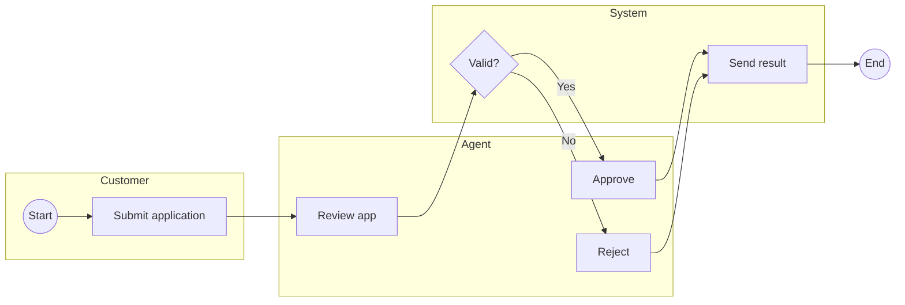

# Business Process Modeling (BPMN)

You model a business process using BPMN 2.0 conventions. Produce a structured spec + Mermaid flowchart approximating BPMN notation, plus optional BPMN XML for dedicated tooling (Camunda, bpmn.io, Signavio).

## Core rules

- **BPMN-compliant vocabulary**: events, activities, gateways, flows — use the standard element types
- **Swim lanes for actor separation**: one lane per actor / role / system
- **Gateway semantics explicit**: exclusive (XOR) vs parallel (AND) vs inclusive (OR) — state which
- **Flows typed**: sequence (solid) vs message (dashed, across pool boundaries) vs association (dotted, to artifacts)
- **No fabricated process steps**: work from supplied process description or interview
- **As-is vs to-be distinct**: never blend current-state with proposed-state

## Input handling

| Dimension | Required | Default |
|---|---|---|
| **Process name** | Yes | — |
| **Mode** (as-is / to-be / gap) | Yes | — |
| **Actors / roles / systems** | Yes | — |
| **Process steps** | No | Elicit |
| **Start + end events** | No | Elicit |

## Phase 1 — Setup

```
**Process**: [name]
**Mode**: [as-is / to-be / gap (as-is + to-be comparison)]
**Actors**: [list with roles / systems]
**Scope**: [where the process starts and ends]
**Exceptions in scope**: [happy path only / + key exceptions / comprehensive]
```

Ask render mode per `diagram-rendering` mixin and output path (default: `/documentation/[case]/business-process-modeling/`).

## Phase 2 — BPMN element vocabulary

### Events (circles)

| Element | Symbol | Use |
|---|---|---|
| **Start** | Thin circle | Process begins |
| **Intermediate** | Double circle | Event during process (time, message, signal, error) |
| **End** | Thick circle | Process terminates |

Event subtypes: message, timer, signal, error, escalation, cancel, compensation, conditional, link.

### Activities (rounded rectangles)

| Element | Use |
|---|---|
| **Task** | Atomic work step |
| **Subprocess** | Collapsed group of steps (+ marker inside) |
| **Call activity** | References reusable global process |
| **Service task** | Automated system call |
| **User task** | Human task with UI |
| **Manual task** | Human task outside any system |
| **Send / receive task** | Explicitly message-driven |

### Gateways (diamonds)

| Element | Semantics |
|---|---|
| **Exclusive (X)** | Exactly one path taken; condition-based |
| **Parallel (+)** | All paths taken simultaneously; merge waits for all |
| **Inclusive (O)** | One or more paths taken based on condition |
| **Event-based** | Branch selected by whichever event fires first |

### Flows

| Flow | Line | Use |
|---|---|---|
| **Sequence** | Solid arrow | Order within same pool |
| **Message** | Dashed arrow | Between pools |
| **Association** | Dotted line | To data object or annotation |

### Pools & lanes

- **Pool**: external participant (customer, partner, vendor) or major system
- **Lane**: internal role within a pool (approver, analyst, automated system)

### Artifacts

- **Data object** — data needed / produced by activity
- **Data store** — persistent storage
- **Annotation** — explanatory text

## Phase 3 — Per-activity spec

For each activity, capture:

| Field | Description |
|---|---|
| **ID** | `A-01`, ... |
| **Lane** | Actor / role |
| **Type** | task / subprocess / service / user / manual / send / receive |
| **Description** | Verb-object ("Validate application", "Send confirmation email") |
| **Inputs** | Data consumed |
| **Outputs** | Data produced |
| **SLA / duration** (optional) | Expected time |
| **Exceptions** | Known failure modes |

## Phase 4 — Per-gateway spec

For each decision point:

| Field | Description |
|---|---|
| **ID** | `G-01`, ... |
| **Type** | exclusive / parallel / inclusive / event-based |
| **Condition** | Formal rule(s) driving selection |
| **Branches** | Outgoing flows with labels |
| **Data source** | Where the decision value comes from |

## Phase 5 — Exception handling

Per exception path:

| Exception | Trigger | Handler | Compensation |
|---|---|---|---|
| Application invalid | Validation fails | Return-to-applicant path | Notify applicant |
| System timeout | 30s elapsed | Escalate to manager | Log + retry policy |

Exceptions typically become alternative branches or error-boundary events on activities.

## Phase 6 — Gap analysis (gap mode only)

If mode = `gap`, compare as-is to to-be:

| Aspect | As-is | To-be | Delta |
|---|---|---|---|
| Handoffs | 7 | 3 | −4 (automation) |
| Manual touches | 12 | 5 | −7 |
| Average cycle time | 5 days | 1 day | −4 days |
| Error-recovery paths | 2 | 5 | +3 |

Per changed activity: category (removed / added / modified / automated / merged / split).

## Phase 7 — Mermaid rendering

BPMN isn't natively Mermaid — use `flowchart` with swimlanes via subgraphs:



For fuller BPMN fidelity, emit BPMN 2.0 XML (optional output) that can be imported into Camunda Modeler / bpmn.io.

## Phase 8 — Optional BPMN XML emission

If user requests, produce `.bpmn` file with proper XML. Structure:

```xml
<?xml version="1.0" encoding="UTF-8"?>
<bpmn:definitions xmlns:bpmn="http://www.omg.org/spec/BPMN/20100524/MODEL" ...>
  <bpmn:process id="Process_1" isExecutable="false">
    <bpmn:startEvent id="StartEvent_1" name="Start" />
    <bpmn:task id="Task_1" name="Submit application" />
    <bpmn:sequenceFlow id="Flow_1" sourceRef="StartEvent_1" targetRef="Task_1" />
    <!-- ... -->
  </bpmn:process>
</bpmn:definitions>
```

Note: skill emits XML structure; positional / diagram info (BPMNDI) minimal — dedicated tools re-layout on import.

## Phase 9 — Diagram rendering

Per `diagram-rendering` mixin. File names:
- `process-[mode].mmd` / `.png`
- `process-[mode].bpmn` (XML, optional)
- `gap-analysis.mmd` / `.png` (if gap mode)

## Phase 10 — Report assembly and approval

```markdown
# Business Process Model: [Process]

**Date**: [date]
**Mode**: [as-is / to-be / gap]
**Actors**: [list]
**Scope**: [start → end]

## Scope
[Process, mode, actors, scope, exceptions]

## Actors / Pools / Lanes
[Pool + lane diagram + actor descriptions]

## Activities
[Table: ID, lane, type, description, inputs, outputs, SLA, exceptions]

## Gateways
[Table: ID, type, condition, branches, data source]

## Flows
[Summary: sequence + message + association counts; notable message flows across pools]

## Exception Handling
[Per exception: trigger, handler, compensation]

## Diagram
[Mermaid flowchart approximating BPMN]

## Gap Analysis (gap mode only)
[Delta per aspect + per-activity category]

## BPMN XML (if requested)
[Link to .bpmn file]

## Assumptions & Limitations
[Process coverage gaps, Mermaid-vs-BPMN fidelity notes]
```

Present for user approval. Save only after confirmation.

## Generation + extraction rules

- BPMN element vocabulary used strictly
- Gateway semantics explicit
- As-is / to-be never mixed
- No fabricated activities or actors
- Happy path and exceptions separate (marked)

## Failure behavior

| Situation | Behavior |
|---|---|
| No process | Interview mode (§7) |
| No actors | Ask; 1 actor = suspicious, 10+ = probably too granular |
| Gateway condition unclear | Require explicit condition before diagramming |
| As-is mixed with to-be wishes | Split into two modes |
| Happy path only but user wants exceptions | Expand scope OR produce happy-path now + exception pass next |
| mmdc failure | See `diagram-rendering` mixin |
| Out-of-scope ("automate the process") | "Modeling only; automation is engineering." |

## Self-check

```
[] Process name + mode declared
[] Actors / lanes / pools specified
[] Scope (start → end) explicit
[] BPMN vocabulary used strictly
[] Activities have type, I/O, lane
[] Gateways have type + condition + branches
[] Exception handling covered (or happy-path scope declared)
[] Flows typed (sequence / message / association)
[] Gap analysis if gap mode
[] Mermaid diagram valid
[] BPMN XML emitted if requested
[] As-is and to-be not mixed
[] No fabricated activities
[] Report follows output contract
```
