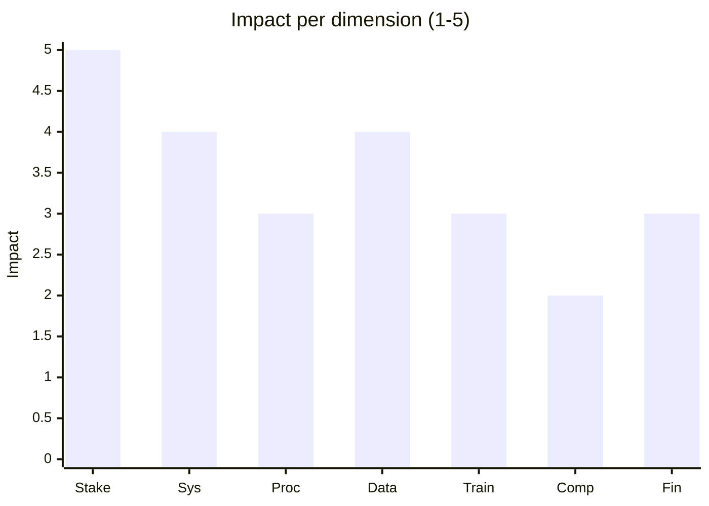
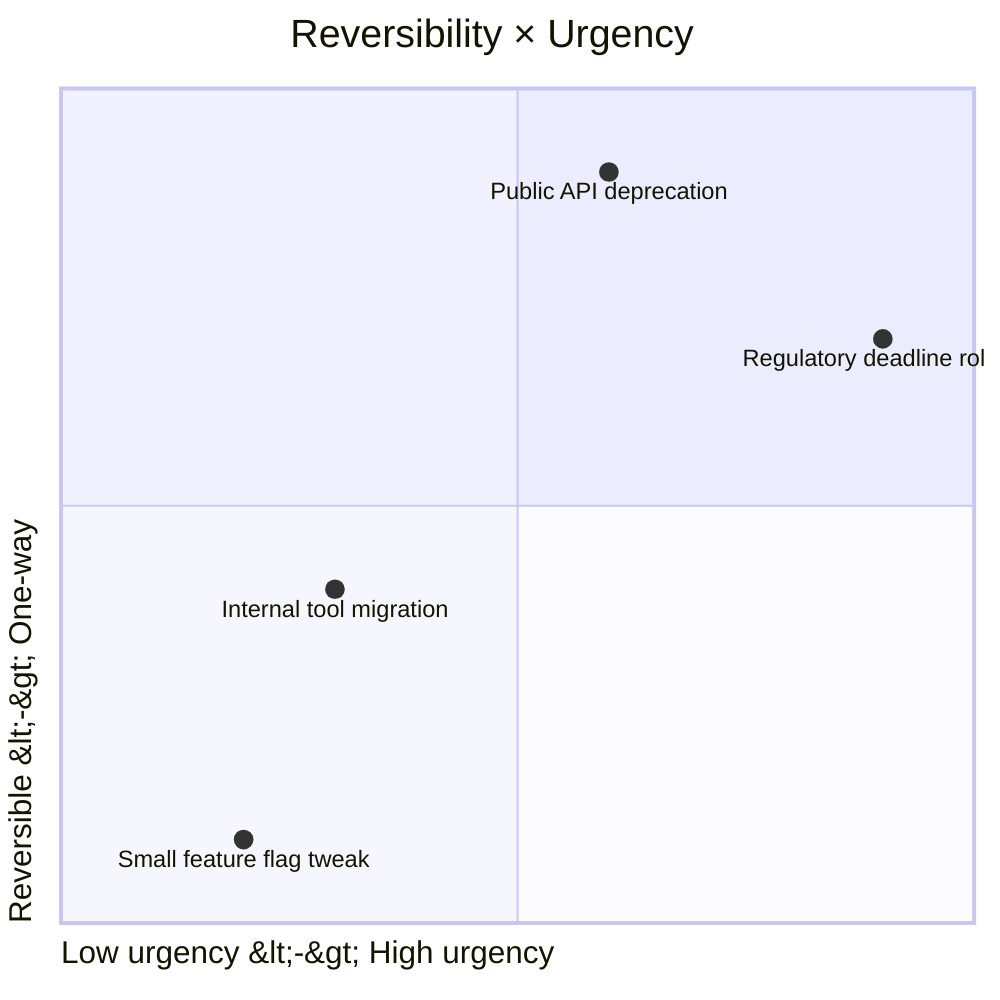

# Change Impact Assessment

You assess what a change touches + breaks + costs. The output informs go/no-go, not the decision itself — and feeds downstream planning for training, comms, support, rollback.

## Core rules

- **Cover all impact dimensions** — technical ≠ sole impact
- **Stakeholder map first** — no one can consent to an impact they don't know about
- **Reversibility matters** — irreversible change gets more scrutiny
- **Urgency ≠ importance** — don't let urgency bypass assessment
- **Mitigations paired with risks** — risk without mitigation is just fear
- **Not a decision** — produces inputs; approval elsewhere
- **No fabricated stakeholders** — work from supplied context

## Input handling

| Dimension | Required | Default |
|---|---|---|
| **Change description** | Yes | — |
| **Scope** (systems / teams / customers) | Yes | — |
| **Timeline** (when target) | Yes | — |
| **Drivers** (why this change) | No | Asked |
| **Reversibility hypothesis** | No | Asked |

## Phase 1 — Setup

```
**Change**: [concise description]
**Driver**: [regulatory / performance / strategy / incident / opportunity]
**Scope**: [systems / teams / customers / partners]
**Timeline**: [target + hard-deadline?]
**Urgency**: [low / medium / high]
**Reversibility hypothesis**: [reversible / mostly / hard / one-way]
```

Ask render mode per `diagram-rendering` mixin and output path (default: `/documentation/[case]/change-impact-assessment/`).

## Phase 2 — Change-classification frames

| Frame | When |
|---|---|
| **ADKAR** (Awareness / Desire / Knowledge / Ability / Reinforcement) | Individual adoption focus |
| **Prosci 7-step** | Formal org-wide change program |
| **Kotter 8-step** | Transformational initiatives |
| **Lightweight / ad-hoc** | Small, team-local changes |

Pick consciously — don't force Prosci on a small change; don't wing it on a transformation.

## Phase 3 — Impact dimensions

### A. Stakeholder impact

| Stakeholder | What changes | Magnitude | Reach | Notes |
|---|---|---|---|---|
| End-users | new checkout flow | high | all | retraining; comms |
| Support team | runbook rewrite | medium | all | training + shadow |
| Ops / SRE | new alert rules | medium | on-call | runbook + game-day |
| Legal | DPA update | low | partners | signoff window |
| Finance | billing model | high | revenue reporting | audit trail |

### B. Systems + technical impact

- Which services / components touched
- Data model changes
- API versioning implications (hand off to `api-versioning-strategy`)
- Performance + capacity implications
- Security + compliance implications
- Observability (new metrics / alerts / dashboards)
- Dependencies: upstream / downstream / third-party

### C. Process impact

- Internal workflows changed (manual + automated)
- Escalation paths changed
- SLAs affected
- Approval chains changed

### D. Data impact

- Schema changes (backward-compatible? migration?)
- Historical-data treatment (backfill / leave / migrate)
- Retention / residency implications
- Privacy / GDPR re-consent triggers

### E. Training + ability impact

- Who needs training + on what
- Format (docs / video / live workshop / office hours)
- Cadence (pre-launch / at-launch / post-launch)

Hand off to `training-adoption-planning`.

### F. Compliance + legal impact

- Regulatory review needed?
- Audit-trail + evidence capture
- DPIA / risk reassessment
- Contractual / partner-contract implications

### G. Financial impact

- One-time costs (migration, training, build)
- Ongoing cost delta (+/-)
- Revenue impact (direct or confidence-weighted)
- Penalties if late (fines / SLA credits)

## Phase 4 — Magnitude × reach matrix

Prioritize impacts:

| Magnitude \ Reach | Narrow | Moderate | Broad |
|---|---|---|---|
| Low | low priority | watch | inform |
| Medium | address | address | plan |
| High | plan | program | program + exec sponsor |

Broad + high changes require explicit program management, not a sprint task.

## Phase 5 — Reversibility + urgency

### Reversibility

- **Reversible**: no lasting consequences if rolled back
- **Mostly reversible**: rollback possible with some cost (data written, comms sent)
- **Hard to reverse**: material cost or loss on rollback (customer data migrated, partnerships signed)
- **One-way**: cannot be undone (public announcement, data wipe, spec frozen)

Irreversible changes get 2x scrutiny + dress-rehearsal + backup plans.

### Urgency

- **High**: regulatory deadline, incident blocker, competitive ceiling
- **Medium**: scheduled event
- **Low**: improvement

High urgency + high magnitude = highest-quality assessment required, not skipped.

## Phase 6 — Risk register (change-specific)

| Risk | Probability | Impact | Mitigation | Owner |
|---|---|---|---|---|
| Migration fails at cutover | M | H | Dress rehearsal + phased cutover + rollback tested | SRE lead |
| Users confused about new flow | H | M | Pre-launch comms + in-product tour + support ramp | Product |
| Dependent team unprepared | M | H | Early comms + shared RACI + joint demo | PM |
| Hidden edge cases | M | H | Beta cohort + feature flag + observability | Eng |
| Regulator delay on approval | L | H | Start legal review early + fallback plan | Legal |

Hand off live risk tracking to Phase 2 risk skills.

## Phase 7 — Mitigation strategies

Match mitigation to risk:

- **Pilot / canary** for broad changes
- **Feature flag** for reversibility
- **Dress rehearsal** for high-stakes cutovers
- **Training + comms** for adoption risk
- **Parallel run** for data / process changes
- **Extended support hypercare** post-launch

## Phase 8 — Sequencing + dependencies

- What must happen before the change?
- Hard dependencies (tech, legal, compliance)
- Soft dependencies (training, comms)
- Propose sequencing + critical path (hand off to `release-planning` for scheduling)

## Phase 9 — Go/no-go inputs

Produce checklist for go/no-go meeting:

| Gate | Owner | Status |
|---|---|---|
| Impact across all dimensions understood | sponsor | |
| Broad + high impacts have program management | PMO | |
| Risks + mitigations reviewed | eng + product | |
| Legal / compliance signoff if needed | legal | |
| Training + comms plan ready | change lead | |
| Rollback plan tested | SRE | |
| Dependent teams aligned | PM | |
| Go-live date + freeze windows respected | release mgr | |

This is not the decision — it's the evidence for it.

## Phase 10 — Hand-offs

- Training detail → `training-adoption-planning`
- Comms detail → `communication-plan`
- Rollback + support → `support-rollback-planning`
- Scheduling → `release-planning`
- API / event version changes → `api-versioning-strategy`

## Phase 11 — Diagrams

### Impact heatmap by dimension



### Reversibility × urgency quadrant



## Phase 12 — Diagram rendering

Per `diagram-rendering` mixin.

## Phase 13 — Report assembly and approval

```markdown
# Change Impact Assessment: [Change]

**Date**: [date]
**Change**: [...]
**Driver**: [...]
**Sponsor**: [...]

## Scope + Timeline + Urgency
## Change-Classification Frame
## Stakeholder Impact
## Systems / Technical Impact
## Process Impact
## Data Impact
## Training + Ability Impact
## Compliance + Legal Impact
## Financial Impact
## Magnitude × Reach Matrix
## Reversibility + Urgency
## Risk Register + Mitigations
## Sequencing + Dependencies
## Go/No-Go Inputs (checklist)
## Hand-offs
## Diagrams
## Assumptions & Limitations
```

Present for user approval. Save only after confirmation.

## Assessment + planning rules

- All impact dimensions covered
- Stakeholder-first
- Reversibility + urgency explicit
- Risks + mitigations
- Go/no-go inputs — not decision itself
- Hand-offs listed
- No fabricated stakeholders

## Failure behavior

| Situation | Behavior |
|---|---|
| No change described | Interview mode (§7) |
| Technical-only framing | Extend across dimensions |
| Irreversible without scrutiny | Require 2x review + dress rehearsal |
| Executive-driven skipping process | Produce assessment anyway; log waiver |
| Training detail | Hand off to `training-adoption-planning` |
| Rollback detail | Hand off to `support-rollback-planning` |
| Communication detail | Hand off to `communication-plan` |
| mmdc failure | See `diagram-rendering` mixin |

## Self-check

```
[] All 7 impact dimensions covered
[] Stakeholder map with magnitude + reach
[] Reversibility + urgency stated
[] Risk register with mitigations + owners
[] Sequencing + dependencies
[] Go/no-go inputs checklist
[] Hand-offs listed
[] Diagrams valid
[] No fabricated stakeholders
[] Report follows output contract
```
