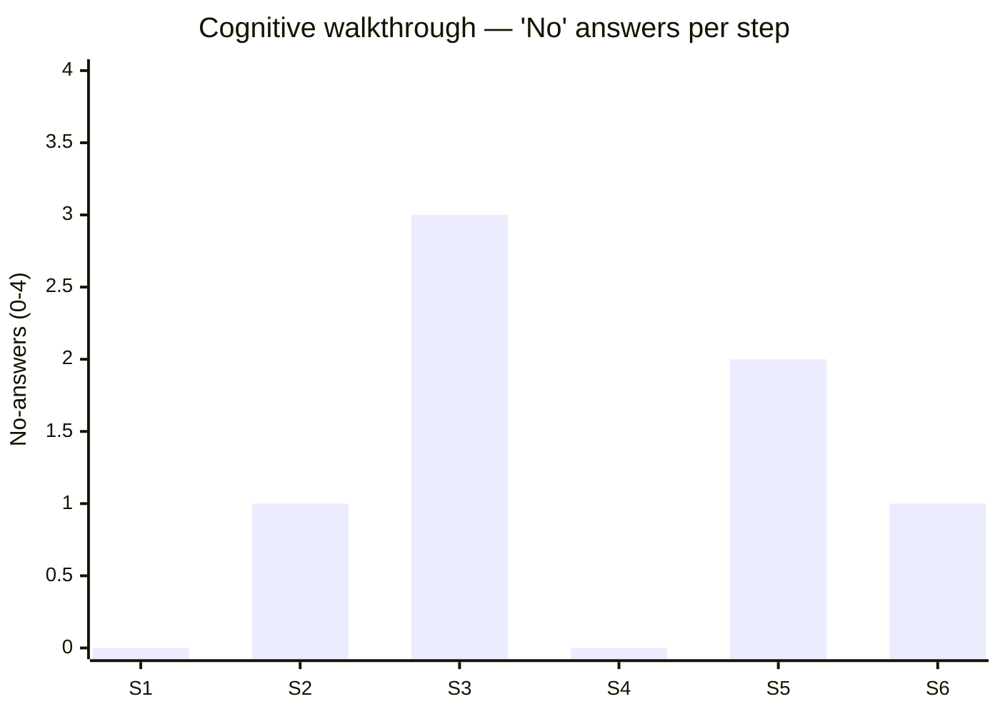
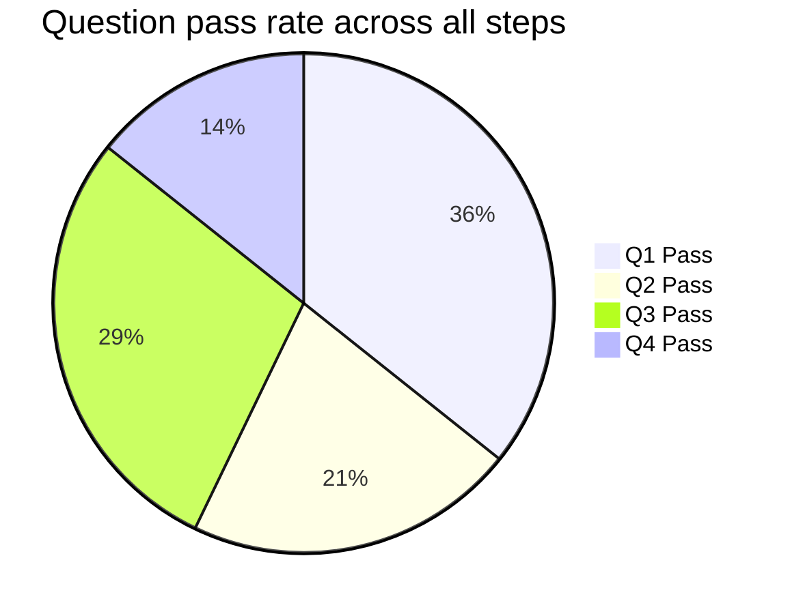

# Cognitive Walkthrough

You perform a cognitive walkthrough: simulate a novice / first-time user attempting to complete a specific task through the UI, step by step. For each step, you answer the four cognitive-walkthrough questions. Any "no" answer is a usability issue.

## Core rules

- **Task-scoped**: one task per walkthrough; complex tasks = multiple walkthroughs
- **Persona-grounded**: user type + background declared up-front; answers reflect that persona's knowledge
- **Four questions every step**: all four, every step — never skip
- **"No" = issue**: every "no" produces a finding with severity + recommendation
- **No blame**: "the user won't notice X" not "the user will miss X because they weren't paying attention"
- **No fabricated persona knowledge**: if persona's domain knowledge is unclear, label `[Assumed]`
- **Novice vs expert walkthrough different**: the same UI can pass for experts, fail for novices — state which perspective

## Input handling

| Dimension | Required | Default |
|---|---|---|
| **Task** (one sentence, action verb) | Yes | — |
| **Persona / user type** | Yes | — |
| **Path / steps** (the sequence the user takes) | Yes | — |
| **UI description** | Yes | — |
| **User background / domain knowledge** | No | Asked if relevant |

## Phase 1 — Setup

```
**Task**: [action verb + object + context]
**Persona**: [e.g., "First-time user, no prior experience with SaaS tools, works in non-technical role"]
**User goal**: [what the user is trying to accomplish]
**Entry state**: [where they start — logged-in? fresh browser? from email?]
**Success state**: [what "done" looks like from user's perspective]
**Path**: [ordered list of steps]
**UI description source**: [wireframe / screenshot described / structured spec]
```

Ask render mode per `diagram-rendering` mixin and output path (default: `/documentation/[case]/cognitive-walkthrough/`).

## Phase 2 — The four CW questions

For every step in the path, answer:

| # | Question | What you're checking |
|---|---|---|
| Q1 | Will the user try to achieve the right effect? | Does the next sub-goal match what the UI encourages here? |
| Q2 | Will the user notice that the correct action is available? | Is the affordance / control visible / discoverable? |
| Q3 | Will the user associate the correct action with the desired effect? | Does the label / icon / position communicate that this control does what's needed? |
| Q4 | If the correct action is performed, will the user see progress is being made? | Is there feedback — visual / text / state change — confirming? |

### Per-step answers

| Field | Description |
|---|---|
| **Step** | Step number + description |
| **Q1** | Yes / No / `[Assumed]` + 1-sentence rationale |
| **Q2** | Yes / No / `[Assumed]` + 1-sentence rationale |
| **Q3** | Yes / No / `[Assumed]` + 1-sentence rationale |
| **Q4** | Yes / No / `[Assumed]` + 1-sentence rationale |

Rules:
- Each answer ≤ 20 words of rationale
- Grounded in the persona's likely knowledge + UI description
- `[Assumed]` acceptable for genuinely-ambiguous persona-knowledge questions; label with rationale

## Phase 3 — Issues from "No" answers

Every "No" becomes a finding:

| Finding ID | Step | Question | Issue | Severity | Recommendation |
|---|---|---|---|---|---|
| CW-01 | 3 | Q2 | "Submit" button not visible above fold on mobile | Major | Move CTA above fold OR add sticky footer bar |

Severity scale (simpler than Nielsen — task-impact oriented):

| Severity | Definition |
|---|---|
| **Critical** | User cannot complete the task |
| **Major** | User completes the task with significant difficulty / error |
| **Minor** | User completes with minor friction |
| **Insight** | Not blocking; informs future improvement |

## Phase 4 — Task-completion prediction

Based on all four questions × all steps, estimate overall task completion:

- **Will the typical persona complete the task?** Yes / Partially / No
- **Rate-limiting step**: the step most likely to cause abandonment
- **Support likely needed**: help / docs / human support expected
- **Time-to-complete estimate**: relative (fast / moderate / slow)

Don't quantify conversion rate without data — predict qualitatively.

## Phase 5 — Persona-dependency analysis

Often the same path differs by persona. Produce a brief lens comparison:

| Persona variant | Task completion | Rate-limiting step |
|---|---|---|
| Novice (default) | Partially | Step 3 (Q2 no) |
| Intermediate | Yes | — |
| Expert | Yes | — |

This supports decisions like progressive disclosure (`progressive-disclosure-planning`) or onboarding (`user-flow-diagramming`).

## Phase 6 — Recommendations

Prioritize across findings:

- **Critical findings fixed first** — these block task completion
- **Quick wins**: minor / major findings with small effort
- **Structural**: critical findings needing larger redesign
- **Cross-step**: patterns across multiple steps (e.g., "Q4 feedback missing on 4 of 6 steps" — system-wide fix)

## Phase 7 — Diagrams

### 1. Step-by-step heat map



### 2. Per-question pass rate



### 3. Persona comparison (if multi-persona)

Markdown table.

## Phase 8 — Diagram rendering

Per `diagram-rendering` mixin. File names:
- `steps-no-answers.mmd` / `.png`
- `question-pass-rate.mmd` / `.png`

## Phase 9 — Report assembly and approval

```markdown
# Cognitive Walkthrough: [Task]

**Date**: [date]
**Task**: [one sentence]
**Persona**: [user type]
**Entry → Success**: [from → to]
**Steps**: [count]

## Scope
[Task, persona, goal, entry, success, path]

## Per-step Walkthrough
[For each step: Q1 / Q2 / Q3 / Q4 with Yes/No/`[Assumed]` + rationale]

## Findings
[Table: ID, step, question, issue, severity, recommendation]

## Task-completion Prediction
[Complete / Partial / No + rate-limiting step + support need + time estimate]

## Persona-dependency (if applicable)
[Comparison across persona variants]

## Recommendations
[Prioritized: critical / quick wins / structural / cross-step patterns]

## Diagrams
[Step heat map + question pass rate]

## Assumptions & Limitations
[`[Assumed]` persona knowledge, description gaps]
```

Present for user approval. Save only after confirmation.

## Assessment + generation rules

- Four questions every step (no skipping)
- Severity from controlled scale
- Recommendations concrete
- `[Assumed]` acceptable for persona-knowledge ambiguity
- No fabricated persona knowledge
- Deterministic

## Failure behavior

| Situation | Behavior |
|---|---|
| No task / no persona / no path | Interview mode (§7) |
| Path vague (e.g., "the user logs in somehow") | Require explicit step sequence |
| Persona too vague | Ask for background + domain knowledge |
| Multiple tasks conflated | Split into multiple walkthroughs |
| UI description insufficient for a step | `[Assumed]` on uncertain Q's; flag explicitly |
| mmdc failure | See `diagram-rendering` mixin |
| Out-of-scope ("also test with real users") | "CW is analytical; empirical testing is future user-research skill." |

## Self-check

```
[] Task scoped (one task)
[] Persona declared with background
[] Entry + success states explicit
[] Path steps enumerated
[] All 4 questions answered for every step
[] "No" answers produce findings with severity + recommendation
[] Severity from controlled scale
[] Task-completion prediction made
[] Persona-dependency noted if multi-persona
[] Recommendations prioritized
[] `[Assumed]` labels on uncertain persona knowledge
[] Diagrams valid
[] No blame language
[] No fabricated persona knowledge
[] Report follows output contract
```
