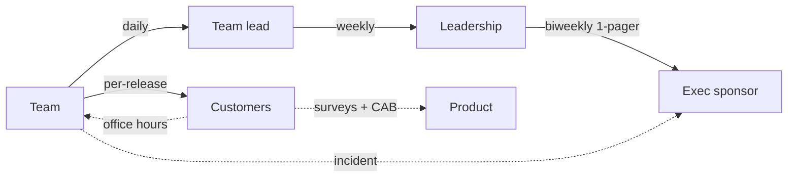
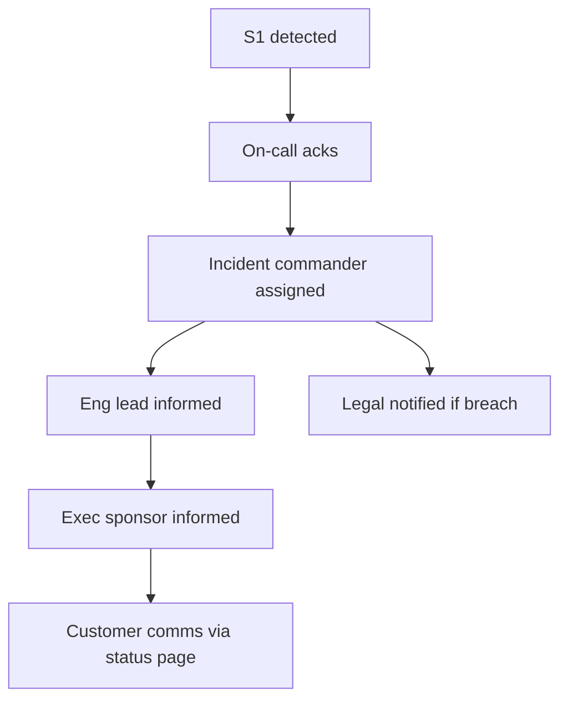

# Communication Plan

You design how information flows between project + its stakeholders so the right people get the right information at the right time — not firehose, not silence.

## Core rules

- **Audience-first** — executives + sponsors + teams + customers + regulators need different things
- **Cadence + channel chosen per audience** — weekly exec 1-pager ≠ daily standup ≠ quarterly customer release
- **Status is short + structured** — RAG + highlights + risks + asks beats narrative essays
- **Escalation routes named** — who to call when + about what
- **Feedback loops are bidirectional** — plan the receiving too
- **No fabricated stakeholders** — work from supplied map (hand-off to `stakeholder-mapping` if needed)

## Input handling

| Dimension | Required | Default |
|---|---|---|
| **Project / program** | Yes | — |
| **Stakeholders** (groups + key individuals) | Yes | — |
| **Phase** (discovery / build / launch / hypercare / run) | Yes | — |
| **Existing comms practice** | No | Asked |
| **Constraints** (regulatory reporting, NDA, tooling) | No | Asked |

## Phase 1 — Setup

```
**Project / program**: [name]
**Phase**: [discovery / build / launch / hypercare / run]
**Stakeholders**:
  - exec sponsor
  - product + eng leadership
  - delivery team(s)
  - customer-facing teams (sales / support / CS)
  - customers (internal + external)
  - partners / vendors
  - regulators (if applicable)
  - legal / compliance
**Existing comms practice**: [none / ad-hoc / documented]
**Constraints**: [regulatory reporting / NDA / tooling restrictions]
```

Ask render mode per `diagram-rendering` mixin and output path (default: `/documentation/[case]/communication-plan/`).

## Phase 2 — Communication matrix

| Audience | Purpose | What (topic) | Cadence | Channel | Owner | Template |
|---|---|---|---|---|---|---|
| Exec sponsor | decision + risk visibility | status + top risks + asks | biweekly | 1-pager email | PM | exec-update |
| Leadership (product+eng) | coordination + trade-offs | scope + timeline + dependencies | weekly | meeting + doc | PM | leadership-update |
| Delivery team | daily ops | progress + blockers | daily | standup + chat | Team lead | — |
| Customer-facing teams | enablement | upcoming launches + talking points | biweekly | broadcast + enablement session | PMM | enablement-update |
| External customers (beta) | co-creation | what's new + how to give feedback | biweekly | email + private community | PM / CS | beta-newsletter |
| External customers (GA) | awareness + value | release notes + changelog | per-release | newsletter + in-product | PMM | release-notes |
| Partners | integration ops | schema / API / breaking-change | as needed + roadmap | API docs + partner portal | DevRel | deprecation-notice |
| Regulators | compliance obligations | filings / reports | per regulation | formal channels | Legal / Compliance | reg-report |
| Legal / compliance | risk + approvals | change impact + evidence | per change | review docs | PM / Legal | legal-review |

Keep it short; don't add rows without a real need.

## Phase 3 — Per-audience style + tone

| Audience | Style |
|---|---|
| Executives | outcomes + risks + asks; short; no jargon |
| Leadership | trade-offs + decisions + dependencies |
| Team | concrete, actionable, chatty allowed |
| Customer | benefits + how-to; avoid roadmap speculation |
| Regulator | precise, formal, evidenced |
| Partner | technical + predictable + backward-compatible-first |

## Phase 4 — Reporting cadence

Suggested defaults (adapt):

- **Daily** — team standup (15 min)
- **Weekly** — team retro-light + leadership update
- **Biweekly** — exec 1-pager, customer-facing enablement
- **Monthly** — program review + roadmap refresh
- **Quarterly** — business review, OKR checkpoint, strategy alignment

Match cadence to decision pace. Don't over-report.

## Phase 5 — Status-report templates

### Exec update (1-pager)

```
# [Project] — Week of [date]

**RAG**: 🟢 / 🟡 / 🔴
**Executive summary**: [1-2 sentences]

## Highlights
- [recent wins]

## Risks + Mitigations
- [top 3 risks + what we're doing]

## Asks
- [decisions / resources / unblocks we need from the exec]

## Metrics snapshot
- [e.g. burn-up, quality, cost]
```

### Leadership update

Adds: scope changes, dependencies, trade-offs, upcoming decisions.

### Team update

Daily: yesterday / today / blockers. Weekly: retro actions + theme.

### Customer release notes

What's new + why it matters + how to try it + known issues.

### Regulator report

Whatever the regulation requires; produced through Legal.

## Phase 6 — Dashboard design principles

Per audience:

- **Exec dashboard**: 5–8 metrics, leading + lagging, clear targets + actuals
- **Operational dashboard**: SLO burn, error rate, queue depths, on-call
- **Customer-facing dashboard**: status page, uptime, upcoming changes
- **Program dashboard**: scope / schedule / quality / cost (classic four corners)

Dashboards show trends, not single values; annotate significant events.

## Phase 7 — Escalation

Named routes for common escalations:

| Trigger | Route | Timeline |
|---|---|---|
| S1 incident | on-call → eng lead → exec sponsor → customer comms | minutes |
| Schedule slip > 2 weeks | PM → leadership → sponsor | within 3 bd |
| Budget overrun > 10% | PM → finance → sponsor | within 5 bd |
| Scope change requested | PM → sponsor via change-impact-assessment | within 1 week |
| Security finding critical | security lead → CTO → legal (if breach) | within 24 h |
| Regulatory finding | Legal → CEO + board | per regulation |

No silent escalations; escalations are a tool, not an embarrassment.

## Phase 8 — Feedback loops

Plan the **incoming** direction too:

- **Office hours** for open questions
- **Retrospectives** inside teams
- **Pulse surveys** quarterly
- **Listening channels** — dedicated Slack / Teams spaces for concerns
- **1:1 cadence** manager ↔ report
- **Customer advisory board** for strategic input
- **Post-incident reviews** with stakeholders

Close the loop: acknowledge feedback + say what you'll do + report back on what happened.

## Phase 9 — Crisis / incident communication

When it goes wrong:

- **Speed over polish** — "we know + investigating" within minutes
- **Single source of truth** — status page or incident doc
- **Named incident commander** — one voice
- **Regular updates** — even "no new info" is valuable
- **Post-mortem** published after resolution (for customers affected)

Hand off operational detail to `support-rollback-planning`.

## Phase 10 — Tone + translation for sensitive topics

- **Layoffs / reorgs / cuts**: clear, humane, with FAQ + 1:1 time for those affected
- **Security incidents**: factual + reassuring + specific
- **Breaking changes**: ample runway + migration guide + live support
- **Bad news**: deliver before rumors; don't sugarcoat; give path forward

## Phase 11 — Anti-patterns

| Anti-pattern | Fix |
|---|---|
| Status report as narrative essay | Use structured RAG + highlights + risks |
| Same report for all audiences | Tailor per audience |
| No ask section in exec update | Name what you need |
| Dashboard with 30 metrics | Focus on 5–8 that matter |
| Escalations viewed as failure | Frame as tool, named routes |
| Feedback solicited + ignored | Close the loop |
| Silent bad-news delay | Deliver early + humanely |

## Phase 12 — Diagrams

### Communication flow



### Escalation tree (S1)



## Phase 13 — Diagram rendering

Per `diagram-rendering` mixin.

## Phase 14 — Report assembly and approval

```markdown
# Communication Plan: [Project]

**Date**: [date]
**Project**: [...]
**Phase**: [...]
**Version**: v1.0

## Scope
## Communication Matrix
## Per-Audience Style + Tone
## Reporting Cadence
## Status-Report Templates
## Dashboard Design Principles
## Escalation Routes
## Feedback Loops
## Crisis / Incident Communication
## Tone for Sensitive Topics
## Anti-Patterns to Avoid
## Diagrams
## Hand-offs
## Assumptions & Limitations
```

Present for user approval. Save only after confirmation.

## Assessment + planning rules

- Audience-first
- Cadence + channel matched
- Templates structured
- Dashboards focused
- Escalation routes named
- Feedback loops bidirectional
- Crisis comms preconfigured
- No fabricated stakeholders

## Failure behavior

| Situation | Behavior |
|---|---|
| No stakeholders | Interview mode (§7) or recommend `stakeholder-mapping` |
| One-size-fits-all report | Tailor per audience |
| No escalation defined | Add |
| No feedback loop | Add |
| Demo / showcase detail | Redirect to `demo-showcase-planning` |
| Change comms heavy | Hand off to `training-adoption-planning` |
| mmdc failure | See `diagram-rendering` mixin |

## Self-check

```
[] Communication matrix (who/what/when/how/owner)
[] Style + tone per audience
[] Cadence matches decision pace
[] Status templates for each audience
[] Dashboards focused
[] Escalation routes named
[] Feedback loops closed
[] Crisis / incident comms plan
[] Anti-patterns addressed
[] Diagrams valid
[] No fabricated stakeholders
[] Report follows output contract
```
