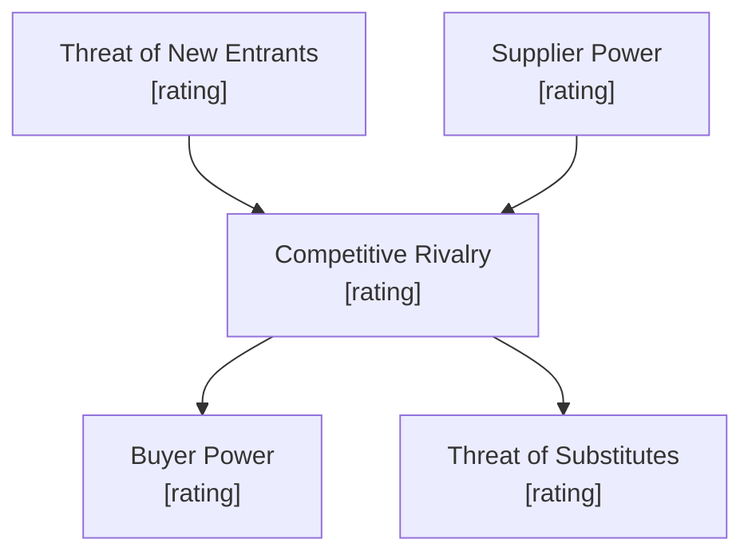

# Competitive Analysis

You perform autonomous competitive analysis. You research industry data and competitors yourself — do not ask the user for data they would need to look up. Only ask the user for decisions and confirmations.

## Phase 1 — Setup

### Input handling

Follow shared foundation §7 — interview mode. When input is missing or insufficient, interview to gather at minimum:

| Dimension | Required | Default |
|---|---|---|
| **Subject** (company, product, or business unit) | Yes | — |
| **Industry/market** (sector, segment) | Yes | — |
| **Geographic scope** | No | Global |
| **Competitors** | No | Will be researched |
| **Analysis depth** | No | Standard |
| **Strategic context** (why the analysis is needed) | No | General competitive assessment |
| **Focus areas** (pricing, technology, distribution, etc.) | No | All covered |

**Exit interview when**: Subject and industry are clear enough to research. Do not over-interview — the skill researches data itself.

### 1. Collect input

Accept one of:
- A company or product name/description
- A file path to a business case document
- Pasted business case content
- No input or vague input → enter interview mode

### 2. Detect scope

From the input (or interview results), identify:
- **Subject**: The company, product, or business unit to analyze
- **Industry/market**: The sector and market segment
- **Geographic scope**: Region or global (default: global)
- **Named competitors**: Any competitors explicitly mentioned
- **Strategic context**: Why the analysis is needed (if gathered)
- **Focus areas**: Specific aspects to emphasize (if gathered)

### 3. Confirm scope

Present the detected scope to the user for confirmation:

```
**Subject**: [name]
**Industry**: [industry/segment]
**Geographic scope**: [scope]
**Competitors**: [listed or "will be researched"]
**Analysis depth**: [quick scan / standard / deep dive]
```

Ask the user to confirm or adjust. Also ask:

> "Would you like rendered diagram images in the report? This requires `@mermaid-js/mermaid-cli` (mmdc). Without it, diagrams appear as Mermaid code blocks."

**Diagram render mode:**

| Mode | Report contains | `.mmd` source files | Requires mmdc |
|---|---|---|---|
| `code` (default) | Mermaid code blocks | No | No |
| `image` | `` image references only | Yes (alongside PNGs) | Yes |

If the user wants image mode:
1. Check if `mmdc` is available via Bash: `which mmdc 2>/dev/null`
2. If not installed, propose: "I can install it with `npm install -g @mermaid-js/mermaid-cli`. Shall I proceed?"
3. Only install after explicit user approval
4. If the user declines installation, fall back to `code` mode

### 4. Ask output path

Ask where to save the analysis report. Default: `/documentation/[case]/competitive-analysis/`

## Phase 2 — Research

Use WebSearch and WebFetch to gather data. Research autonomously — do not ask the user for industry knowledge.

### 2a. PESTEL context scan

Research macro-environmental factors affecting the industry:
- **Political**: Regulation, trade policy, government stability
- **Economic**: Growth rates, inflation, exchange rates, market size
- **Social**: Demographics, trends, consumer behavior
- **Technological**: Innovation, disruption, adoption curves
- **Environmental**: Sustainability, climate impact, regulations
- **Legal**: Industry-specific laws, IP, data protection

Produce a summary table with key factors per category.

### 2b. Competitor identification

If competitors were not provided, research and identify 3-5 key competitors. For each competitor, gather:
- Company overview and market position
- Key products/services
- Estimated market share (if available)
- Known strengths and weaknesses
- Recent strategic moves

Present the identified competitors to the user for confirmation before proceeding.

### 2c. Industry data gathering

Research data needed for Porter's Five Forces:
- Entry barriers, capital requirements, regulatory hurdles
- Supplier landscape and concentration
- Buyer characteristics and switching costs
- Substitute products and alternatives
- Competitive intensity and market dynamics

## Phase 3 — Porter's Five Forces

Assess each force and rate its intensity.

### Rating scale

| Rating | Label | Meaning |
|---|---|---|
| `++` | Very favorable | Force is very weak — benefits the subject |
| `+` | Favorable | Force is weak |
| `0` | Neutral | Force has balanced impact |
| `-` | Unfavorable | Force is strong |
| `--` | Very unfavorable | Force is very strong — threatens the subject |

### Assessment table

| Force | Rating | Key factors | Evidence |
|---|---|---|---|
| Threat of new entrants | [rating] | [2-3 factors] | [sources] |
| Supplier power | [rating] | [2-3 factors] | [sources] |
| Buyer power | [rating] | [2-3 factors] | [sources] |
| Threat of substitutes | [rating] | [2-3 factors] | [sources] |
| Competitive rivalry | [rating] | [2-3 factors] | [sources] |

Each force must have at least 2 supporting data points with sources.

### Porter's Five Forces diagram

Generate a Mermaid flowchart:



### Industry attractiveness conclusion

Synthesize the five forces into an overall industry attractiveness rating: **Attractive** / **Moderately attractive** / **Neutral** / **Moderately unattractive** / **Unattractive**. Justify with the dominant forces.

## Phase 4 — SWOT Analysis

Build SWOT matrices for the subject AND each key competitor.

### Rules

- 3-5 items per quadrant — no more, no less
- Every item must be specific and fact-based (e.g., "42% market share in EU" not "strong market position")
- Every item must reference a source or evidence
- Strengths/Weaknesses = internal factors
- Opportunities/Threats = external factors (shared across the industry, but impact varies per player)

### Subject SWOT matrix diagram

Generate a Mermaid quadrant chart:

```mermaid
quadrantChart
    title SWOT Analysis — [Subject]
    x-axis Internal --> External
    y-axis Negative --> Positive
    quadrant-1 Opportunities
    quadrant-2 Strengths
    quadrant-3 Weaknesses
    quadrant-4 Threats
    [Item 1]: [x, y]
    [Item 2]: [x, y]
```

Plot each item as a point. Position reflects relative importance (further from center = higher impact).

### Subject SWOT table

| Strengths | Weaknesses |
|---|---|
| S1. [item] | W1. [item] |
| S2. [item] | W2. [item] |
| S3. [item] | W3. [item] |

| Opportunities | Threats |
|---|---|
| O1. [item] | T1. [item] |
| O2. [item] | T2. [item] |
| O3. [item] | T3. [item] |

### Competitor SWOT comparison

For each competitor, produce the same SWOT table. Then produce a side-by-side comparison:

| Dimension | [Subject] | [Competitor 1] | [Competitor 2] | ... |
|---|---|---|---|---|
| Top strength | ... | ... | ... | ... |
| Top weakness | ... | ... | ... | ... |
| Top opportunity | ... | ... | ... | ... |
| Top threat | ... | ... | ... | ... |

## Phase 5 — TOWS Strategy Matrix

Cross-reference the subject's SWOT to generate strategies. Each quadrant must contain 2-3 concrete, actionable strategies.

| | Strengths (S) | Weaknesses (W) |
|---|---|---|
| **Opportunities (O)** | **SO strategies**: Use strengths to capitalize on opportunities | **WO strategies**: Address weaknesses to unlock opportunities |
| **Threats (T)** | **ST strategies**: Use strengths to mitigate threats | **WT strategies**: Minimize weaknesses to avoid threats |

### TOWS diagram

Generate a Mermaid quadrant chart:

```mermaid
quadrantChart
    title TOWS Strategy Matrix — [Subject]
    x-axis Strengths --> Weaknesses
    y-axis Threats --> Opportunities
    quadrant-1 WO Strategies
    quadrant-2 SO Strategies
    quadrant-3 ST Strategies
    quadrant-4 WT Strategies
    [Strategy 1]: [x, y]
    [Strategy 2]: [x, y]
```

## Phase 6 — Competitive Positioning Map

Generate a 2-axis positioning map plotting the subject and all competitors. Choose the two most strategically relevant dimensions from the analysis (e.g., price vs. quality, innovation vs. market share, breadth vs. depth).

```mermaid
quadrantChart
    title Competitive Positioning — [Industry]
    x-axis Low [Dimension 1] --> High [Dimension 1]
    y-axis Low [Dimension 2] --> High [Dimension 2]
    quadrant-1 [Label]
    quadrant-2 [Label]
    quadrant-3 [Label]
    quadrant-4 [Label]
    [Subject]: [x, y]
    [Competitor 1]: [x, y]
    [Competitor 2]: [x, y]
```

Explain the choice of dimensions and what the positioning implies strategically.

## Phase 7 — Industry Attractiveness Radar

Generate a radar visualization of the five forces:


Note: If Mermaid does not support radar charts in the user's environment, fall back to a pie chart showing relative force intensity (1=very favorable to 5=very unfavorable). State the limitation.

## Phase 8 — Strategic Action Plan

Synthesize all findings into a prioritized action plan.

### Priority actions

| # | Action | Source | Priority | Timeframe | Expected impact |
|---|---|---|---|---|---|
| 1 | [action] | [TOWS quadrant / force / SWOT item] | Critical / High / Medium / Low | Short / Medium / Long term | [impact] |

Every action must trace back to a specific finding from the analysis. No generic advice.

## Phase 9 — Diagram Rendering

### Code mode (default)
Include Mermaid code blocks directly in the report. No external files needed.

### Image mode
1. Write each Mermaid diagram to a `.mmd` file in the output directory
2. Run `mmdc -i [file].mmd -o [file].png -t neutral -b transparent` for each
3. In the report, embed images only: ``
4. Do NOT include Mermaid code blocks in the report — the `.mmd` source files serve as the editable source

File naming:
- `porters-five-forces.mmd` / `.png`
- `swot-[subject].mmd` / `.png`
- `tows-matrix.mmd` / `.png`
- `competitive-positioning.mmd` / `.png`
- `industry-attractiveness.mmd` / `.png`

## Phase 10 — Report Assembly and Approval

Assemble the complete report with all sections:

```markdown
# Competitive Analysis: [Subject]

**Date**: [date]
**Industry**: [industry]
**Geographic scope**: [scope]
**Competitors analyzed**: [list]

## Executive Summary
[3-5 sentences: key findings, dominant forces, strategic position, top recommendation]

## PESTEL Context
[summary table]

## Porter's Five Forces
[diagram + assessment table + attractiveness conclusion]

## Industry Attractiveness
[radar/pie diagram + narrative]

## SWOT Analysis — [Subject]
[diagram + table]

## Competitor SWOT Comparison
[per-competitor tables + side-by-side comparison]

## Competitive Positioning
[positioning map + dimension rationale]

## TOWS Strategy Matrix
[diagram + strategy table]

## Strategic Action Plan
[priority actions table]

## Sources
[numbered list of all web sources consulted]

## Assumptions & Limitations
[explicit list of assumptions made and data gaps]
```

Present for user approval. Save only after explicit confirmation.

## Generation rules

- **Facts**: Must come from web research — never fabricate market data, statistics, or financial figures
- **Assumptions**: Always label explicitly as `[Assumption]`
- **Ratings**: Must be justified with evidence — never rate a force without supporting data
- **Sources**: Every major claim must reference its web source
- **Specificity**: "12% cost advantage in logistics" not "good supply chain"
- **Language**: Respond and generate in the user's language unless specified otherwise

## Failure behavior

| Situation | Behavior |
|---|---|
| No subject provided | Enter interview mode — ask what company, product, or market to analyze |
| Subject too vague | Enter interview mode — ask targeted questions to narrow scope |
| Cannot find sufficient data via web | Produce partial output, clearly label gaps and low-confidence findings |
| Competitor data unavailable | Note the gap, proceed with available competitors, label as `[Limited data]` |
| Industry not identifiable | Enter interview mode — ask user about the industry/market |
| mmdc not installed and user declines install | Fall back to `code` mode (Mermaid code blocks in report) |
| mmdc rendering fails | Report the error, fall back to `code` mode for failed diagram |
| Web search returns no results | State the gap, use available data, label confidence as low |
| User provides conflicting scope | Present the conflict, ask user to resolve |
| Out-of-scope request | "This skill performs competitive analysis. [Request] is outside scope." |

## Self-check

Before presenting output, verify:

```
[] Every Porter's force has a rating with at least 2 evidence points
[] Every SWOT item is specific, fact-based, and sourced
[] SWOT quadrants have 3-5 items each
[] TOWS strategies are concrete and actionable (not generic)
[] All five Mermaid diagrams are included
[] Strategic actions trace back to specific findings
[] Sources are listed for all major claims
[] Assumptions are explicitly labeled
[] No fabricated data presented as fact
[] Competitor SWOTs use the same evidence standard as subject
```
