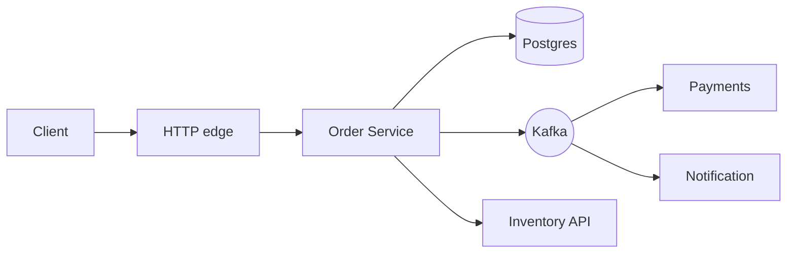
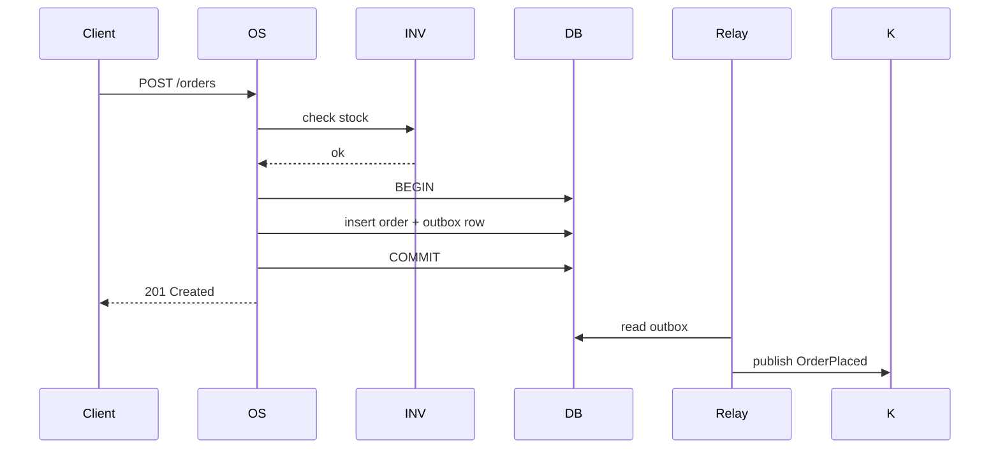

# Component Design Documentation

You write a design doc for a component before it's built (or before a significant refactor). The doc is for reviewers — clarity over length.

## Core rules

- **Single component per doc** — if you're documenting two, write two
- **Public interface before internals** — reviewers care about the contract
- **Responsibilities are bounded** — if the list runs long, the component is too big
- **Trade-offs explicit** — what you chose + what you rejected
- **Open questions listed** — don't pretend to have all answers
- **No fabricated dependencies** — work from supplied facts

## Input handling

| Dimension | Required | Default |
|---|---|---|
| **Component name + type** (service / module / library) | Yes | — |
| **Purpose** | Yes | — |
| **Context** (where it sits in the system) | Yes | — |
| **Public interface shape** | No | Asked |
| **Primary collaborators** | No | Asked |
| **Non-functional targets** (latency, throughput, availability) | No | Asked |

## Phase 1 — Setup

```
**Component**: [name]
**Type**: [service / module / library]
**Purpose**: [one sentence]
**Context**: [system / domain it belongs to; upstream / downstream]
**Owner**: [team / person]
**Non-functional targets**: [latency, throughput, availability]
**Constraints**: [tech stack, existing conventions, deadlines]
```

Ask render mode per `diagram-rendering` mixin and output path (default: `/documentation/[case]/component-design/[component-name]/`).

## Phase 2 — Responsibilities

Bulleted list, imperative:
- Accept orders via REST
- Validate order against inventory
- Publish `OrderPlaced` event on success
- Reject with structured error on validation failure

Out-of-scope list — stated explicitly:
- Does not reserve inventory (fulfilment service does)
- Does not charge payment (payment service does)

If the "does" list exceeds ~7 items, flag cohesion concern.

## Phase 3 — Public interface

### API surface

Tables per kind:

**HTTP (if applicable)**
| Method | Path | Purpose | Auth |
|---|---|---|---|
| POST | /orders | Place order | OAuth2 scope write:orders |
| GET | /orders/{id} | Retrieve order | OAuth2 scope read:orders |

**Module functions (if applicable)**
```typescript
export interface OrderService {
  placeOrder(cmd: PlaceOrderCommand): Promise<Result<Order, PlaceOrderError>>;
  getOrder(id: OrderId): Promise<Order | null>;
}
```

**Events published**
| Event | When |
|---|---|
| `orders.placed.v1` | After successful validation + persistence |
| `orders.cancelled.v1` | After cancellation recorded |

**Events consumed**
| Event | Why |
|---|---|
| `payments.captured.v1` | Update order to `paid` |

Hand off contract details to `api-contract-specification` / `event-schema-design`.

## Phase 4 — Internal structure

### High-level structure

```
order-service/
├── http/              # controllers, DTOs, error mapping
├── domain/            # aggregates, value objects, domain services
├── application/       # use cases / commands
├── infrastructure/    # persistence, messaging adapters
└── config/            # wiring
```

### Key types (sketch)

```typescript
// Domain
type OrderId = Branded<string, 'OrderId'>;
class Order {
  // invariants listed here
}
type OrderStatus = 'pending' | 'placed' | 'paid' | 'cancelled' | 'fulfilled';
```

### Dependencies (internal)

- `OrderRepository` (port) → PostgresOrderRepository (adapter)
- `EventPublisher` (port) → KafkaEventPublisher (adapter)
- `Clock` (port) → SystemClock (adapter) — swappable for tests

## Phase 5 — Collaborators

| Collaborator | Direction | Protocol | Purpose |
|---|---|---|---|
| Inventory service | outbound sync | HTTP | check stock at order-placement time |
| Payment service | outbound async | event (`OrderPlaced`) | trigger capture |
| Postgres | outbound sync | SQL | aggregate persistence |
| Kafka | outbound async | events | outbound event stream |
| Notification service | outbound async | event | downstream consumer of our events |

Sequence diagram for the primary flow in Phase 9.

## Phase 6 — Data + state

### Persistent data

| Store | Schema | Ownership |
|---|---|---|
| Postgres `orders` table | columns listed or referenced | owned by this component |
| Postgres `outbox` table | for transactional outbox | owned by this component |

Hand off schema detail to `conceptual-data-modeling` / `data-dictionary-definition`.

### In-memory / caches

- None / short-lived per-request
- If cache: what's cached, TTL, invalidation

### State machine (if any)

```
pending → placed → paid → fulfilled
           ↓        ↓
       cancelled  cancelled (refund)
```

Document transitions + allowed actor per transition.

## Phase 7 — Errors

| Error | Trigger | External code | Internal handling |
|---|---|---|---|
| `ValidationError` | Invalid input | 422 | No retry |
| `InventoryUnavailable` | Stock insufficient | 409 | No retry; user-visible |
| `PaymentPreauthDeclined` | Payment not approved | 402 | No retry; user-visible |
| `PersistenceError` | DB transient | 500 + retry | Retried at call site; circuit breaker |
| `EventPublishError` | Broker unreachable | 503 | Outbox + relay retry |

Hand off cross-system strategy to `system-error-handling-strategy`.

## Phase 8 — Concurrency + ordering

- Thread-safety expectations
- Idempotency keys at boundary
- Optimistic vs pessimistic locking on aggregates
- Ordering guarantees per event partition key
- Backpressure response

## Phase 9 — Observability hooks

- Structured logs at: request in, validation outcome, persistence outcome, event publish
- Metrics: `orders.placed.count`, `orders.placed.latency`, `validation.errors.count`, `outbox.backlog.depth`
- Traces: span per external call; baggage carries `correlation_id`, `tenant_id`
- Health endpoints: `/healthz` liveness, `/readyz` readiness (DB + broker reachability)

Hand off to `logging-tracing-design` / `observability-strategy`.

## Phase 10 — Non-functional characteristics

| Property | Target | Strategy |
|---|---|---|
| p99 latency | 200 ms for place-order | connection pool sized, index present, outbox async |
| Throughput | 500 req/s sustained | horizontal scale + read replicas |
| Availability | 99.9% | multi-AZ, graceful degradation on inventory unavailability |
| Recovery | RTO 15m, RPO 5m | WAL backups + hot replica |
| Scalability | 5x forecast | stateless service + DB partitioning plan |

Hand off to `disaster-recovery-planning` / `cloud-architecture-design` where deeper.

## Phase 11 — Security

- AuthN: OAuth2 bearer at API edge
- AuthZ: scopes `read:orders` / `write:orders`, row-level tenant isolation
- Data classification: PII fields (email, address) marked; encryption at rest + in transit
- Secrets: injected via env/KMS; rotated per platform policy

Hand off to `threat-modeling` / `authentication-strategy-design` / `authorization-modeling`.

## Phase 12 — Configuration + feature flags

Hand off details to `configuration-management-design`. Summary here:
- Config keys: DB URL, broker URL, timeouts, feature flags
- Precedence: env > file > defaults
- Hot-reloadable vs restart-required marked

## Phase 13 — Tests

- Unit: domain invariants, command handlers
- Integration: adapters against real DB / broker in docker-compose
- Contract: provider contract (Pact) for consumers
- Load: peak + sustained at target throughput
- Chaos: dependency failure injection

Test-write hand off to separate skills — here list what suffices.

## Phase 14 — Trade-offs + rejected alternatives

Short list. For each rejected option: why rejected in one line.

- Chose outbox over dual-write: avoids message loss on crash
- Chose Postgres over DynamoDB: existing ops expertise + relational queries
- Chose per-aggregate ordering over global: scales + avoids contention

## Phase 15 — Open questions

- Do we need multi-region active-active on day one?
- Who owns the bulk-import pathway — this service or an ingest worker?
- What's the retention for the outbox table?

## Phase 16 — Diagrams

### Component context



### Primary sequence



## Phase 17 — Diagram rendering

Per `diagram-rendering` mixin.

## Phase 18 — Report assembly and approval

```markdown
# Component Design: [Name]

**Date**: [date]
**Type**: [service / module / library]
**Owner**: [team]

## Purpose
## Context
## Responsibilities (in / out of scope)
## Public Interface
## Internal Structure
## Collaborators
## Data + State
## Errors
## Concurrency + Ordering
## Observability
## Non-Functional Characteristics
## Security
## Configuration
## Tests
## Trade-offs + Rejected Alternatives
## Open Questions
## Diagrams
## Hand-offs
## Assumptions & Limitations
```

Present for user approval. Save only after confirmation.

## Assessment + planning rules

- Purpose + context + responsibilities stated
- Public interface before internals
- Trade-offs + rejected alternatives listed
- Open questions surfaced
- Hand-offs rather than duplicated scope
- No fabricated dependencies

## Failure behavior

| Situation | Behavior |
|---|---|
| No purpose / context | Interview mode (§7) |
| Responsibilities long / scattered | Flag cohesion; suggest split |
| Internals first, interface later | Reorder |
| Data schema deep inside doc | Hand off to data-modeling skill |
| mmdc failure | See `diagram-rendering` mixin |
| Implementation request | "Design doc only; impl is engineering." |

## Self-check

```
[] Purpose + context clear
[] Responsibilities bounded
[] Public interface before internals
[] Collaborators with protocol
[] Errors mapped to external codes
[] NFR targets + strategy
[] Security considerations
[] Trade-offs + rejected alternatives
[] Open questions listed
[] Diagrams valid
[] No fabricated deps
[] Report follows output contract
```
