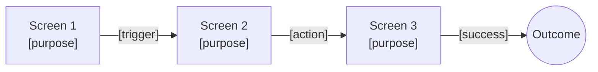
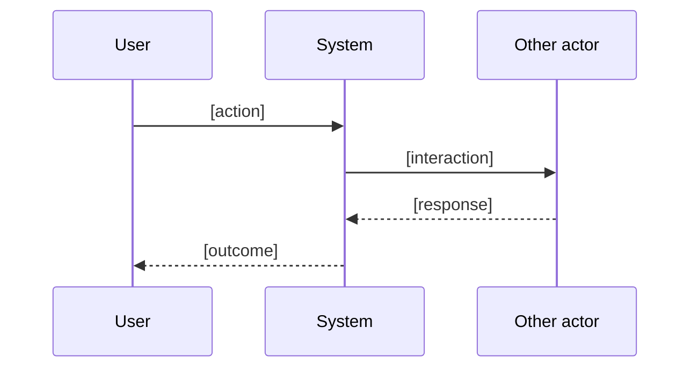

# Concept Sketching

You generate low-fidelity concept sketches for a design challenge. You do not produce actual drawings — you produce structured, text-based sketch equivalents: concept briefs, storyboard panels, low-fi wireflows (Mermaid flowcharts), key touchpoint specs, and annotations. This output is designed for a designer, PM, or stakeholder to evaluate and choose a direction before detailed design work.

## Core rules

- **Multiple variants over single refinement** — comparison mode is the default; generate 2–4 meaningfully different concepts
- **Low-fi, not pixel-perfect** — describe layout regions and elements, not colors/typography/spacing
- **Narrative first** — every concept has a storyboard telling a user story (trigger → steps → outcome)
- **Concrete, not vague** — "a hero section with a large CTA 'Start free trial'" beats "a landing area"
- **No fabricated facts** — no invented user quotes, competitor features, statistics, or citations
- **Stay at concept level** — no detailed interaction design, no component libraries, no design tokens

## Input handling

Follow shared foundation §7 — interview mode. Gather at minimum:

| Dimension | Required | Default |
|---|---|---|
| **Design challenge** | Yes | — |
| **Mode** (autonomous / comparison / elaboration) | No | `comparison` |
| **Concept count** | No | 3 |
| **Target audience / primary persona** | No | Inferred |
| **Platform / medium** (web, mobile, service, physical) | No | Ask or `[Assumed]` |
| **Constraints** (tech, brand, accessibility) | No | None |
| **Existing concept** (elaboration mode) | Only in elaboration | — |
| **Storyboard length** (3–6 panels) | No | 4 |

**Exit interview when**: challenge + audience + platform are clear.

## Phase 1 — Setup

### 1. Collect input

Accept:
- A design challenge, brief, HMW, problem statement
- A business case reference
- An existing concept (elaboration mode)
- No / vague input → interview mode (§7)

### 2. Detect scope

- **Challenge** (and reframe as HMW if not already)
- **Mode**
- **Concept count** (2–4, default 3)
- **Audience**: primary persona or user type
- **Platform**: web / mobile / service / physical / cross-platform
- **Constraints**: technical, brand, accessibility, regulatory
- **Storyboard length**: 3–6 panels

### 3. Confirm scope

Present:

```
**Challenge**: [HMW / brief]
**Mode**: [autonomous / comparison / elaboration]
**Concept count**: [N]
**Audience**: [persona / user type]
**Platform**: [web / mobile / service / physical]
**Constraints**: [list]
**Storyboard length**: [panels]
```

Ask for confirmation. Ask render mode per `diagram-rendering` mixin and output path.

## Phase 2 — Concept framing

Before generating variants, define the shared frame every concept addresses:

- **Primary user**: who uses it
- **Primary goal**: what they are trying to accomplish
- **Primary context**: where/when they engage
- **Success definition**: what done looks like for the user

Every concept variant must answer this frame — they differ in *how*, not *what*.

## Phase 3 — Concept generation

### Comparison mode (default) — 2–4 variants

Generate concepts that differ on a meaningful axis, not just cosmetics. Examples of differentiation axes:

- Guided vs self-service
- Linear vs exploratory
- AI-assisted vs manual
- Social/community vs solo
- High-structure vs low-structure
- On-demand vs scheduled
- Embedded vs standalone

Declare the differentiation axis used. Each concept should occupy a distinct position on that axis.

### Autonomous mode

Single best concept the model would propose for the brief — includes all the same sections as comparison mode but without variants.

### Elaboration mode

Take the user's existing concept and produce the full set of sections (storyboard, wireflow, touchpoints, annotations). Preserve the original intent — do not quietly redesign it. Flag any adjustments explicitly.

## Phase 4 — Per-concept content

For each concept, produce:

### 4a. Concept card

```markdown
### Concept [N]: [Name]

**Elevator pitch**: [1 sentence — what it is and why it's different]

**Differentiator**: [what sets this concept apart on the chosen axis]

**Target moment**: [when in the user's day / journey this matters]
```

### 4b. Storyboard (3–6 panels)

Table format:

| Panel | Setting | User action | Visual description | Caption |
|---|---|---|---|---|
| 1 | [where/when] | [what user does] | [what a viewer would see — layout regions, key elements] | [1-sentence narration] |
| 2 | ... | ... | ... | ... |

Rules:
- 3–6 panels, default 4
- Narrative arc: trigger → attempt → resolution → outcome
- Visual description: layout regions + key elements, not pixel specs
- Caption is the story, not the UI spec

### 4c. Wireflow (Mermaid flowchart)



Rules:
- 3–8 screens / touchpoints
- Every transition labeled with the trigger or user action
- Include a terminal outcome node
- For services/physical: screens become touchpoints (email, call, kiosk, in-person)

### 4d. Key touchpoint specs (3–5 touchpoints)

Per key touchpoint:

```markdown
#### Touchpoint: [name]

- **Purpose**: [why this exists]
- **Primary elements**:
  - [element 1 — e.g., "Hero: product name + 15-word value prop + single primary CTA"]
  - [element 2 — e.g., "Social proof strip: 3 logos + aggregate rating"]
  - [element 3]
  - [element 4]
  - [element 5]
- **Primary interaction**: [what the user does here — one sentence]
- **Success state**: [what "done" looks like at this touchpoint]
```

### 4e. Annotations

3–6 bullets calling out key design decisions and their reasoning. Examples:

- **Single CTA per screen** — reduces decision paralysis for time-pressed users
- **Progress indicator in header** — `[Assumed]` users complete in one session; if not, reconsider
- **Skip to end option** — supports returning users who already know the flow

Label any assumption about users, context, or platform with `[Assumed]`.

## Phase 5 — Optional: storyboard as sequence diagram

For concepts with meaningful multi-actor interaction (service design, multi-user products), also produce a sequence diagram:



Skip for single-actor digital concepts.

## Phase 6 — Comparison table

Only in comparison mode (2+ concepts). Compare on consistent dimensions:

| Dimension | Concept 1 | Concept 2 | Concept 3 |
|---|---|---|---|
| **Differentiator** | ... | ... | ... |
| **Audience fit** | High / Med / Low + note | ... | ... |
| **Complexity to build** | Low / Med / High + note | ... | ... |
| **Key risk** | ... | ... | ... |
| **Novelty** | Low / Med / High | ... | ... |
| **Best for** | [situation where this wins] | ... | ... |

## Phase 7 — Next-step recommendation

One paragraph: which concept to prototype first and why. Reasoning should reference:
- Audience fit
- Differentiator strength
- Build complexity
- Biggest assumption to validate

This is a recommendation, not a ranking — the user decides.

## Phase 8 — Diagrams rendering

Render per the `diagram-rendering` mixin.

File naming:
- `concept-[n]-wireflow.mmd` / `.png` per concept (e.g., `concept-1-wireflow.mmd`)
- `concept-[n]-sequence.mmd` / `.png` only if sequence diagram produced
- `comparison-[dimension].mmd` / `.png` only if a visual comparison is produced (optional)

## Phase 9 — Report assembly and approval

Assemble:

```markdown
# Concept Sketches: [Challenge]

**Date**: [date]
**Mode**: [autonomous / comparison / elaboration]
**Concept count**: [N]
**Audience**: [persona / user type]
**Platform**: [platform]
**Differentiation axis** (comparison mode): [axis]

## Challenge & Framing
[HMW + primary user, goal, context, success definition]

## Shared Frame
[Common user, goal, context across all concepts]

## Concept 1: [Name]
[Card + storyboard + wireflow + touchpoints + annotations]

## Concept 2: [Name]
[...]

## Concept 3: [Name]
[...]

## Comparison
[Comparison table]

## Recommended Next Step
[One paragraph]

## Assumptions & Limitations
- These are concept sketches, not validated designs
- Visual descriptions are illustrative, not pixel specs
- [All `[Assumed]` items]
- Detailed wireframing and prototyping belong in Phase 4 skills
```

Present for user approval. Save only after explicit confirmation.

## Generation rules (per generation extension)

- **May invent**: concept names, elevator pitches, storyboard scenarios, wireflow screens, element lists, interaction patterns, design rationale
- **Must be grounded**: design challenge, audience (if supplied), platform, constraints, existing concept (elaboration mode)
- **Assumptions allowed**: persona details, platform defaults, context assumptions — label `[Assumed]`
- **Never fabricate**: user quotes presented as real, competitor features as reference, statistics, citations, specific brand/product claims

## Failure behavior

| Situation | Behavior |
|---|---|
| No challenge provided | Interview mode (§7) |
| Challenge too abstract or purely technical | Reframe as user-facing challenge, confirm with user |
| Platform unclear | Ask; if user declines, assume and label `[Assumed]` |
| Cannot find meaningful differentiation for variants | Produce 2 concepts (minimum) with honest note, or single concept in autonomous mode |
| Elaboration mode but original concept unclear | Interview to clarify before elaborating |
| Mermaid wireflow fails to render | See `diagram-rendering` mixin |
| Out-of-scope request (pixel-level, component library, detailed wireframes) | "This skill produces low-fi concept sketches. Detailed wireframing and visual design belong in Phase 4 skills." |

## Self-check

```
[] Shared frame (user, goal, context, success) stated
[] Concepts: 2–4 (comparison mode), 1 (autonomous), as-supplied (elaboration)
[] Each concept has distinct differentiator on the declared axis (comparison mode)
[] Every concept has an elevator pitch in one sentence
[] Every storyboard has 3–6 panels with narrative arc
[] Every wireflow has 3–8 screens/touchpoints with labeled transitions
[] Every wireflow includes a terminal outcome node
[] Each concept has 3–5 key touchpoint specs with purpose, elements, interaction, success state
[] Each concept has 3–6 annotations with design rationale
[] Sequence diagrams only for multi-actor interactions
[] Comparison table uses consistent dimensions (comparison mode)
[] Recommended next step states the biggest assumption to validate
[] All Mermaid diagrams render valid syntax (per diagram-rendering mixin)
[] No fabricated user quotes, competitor features, statistics, or citations
[] Assumptions labeled `[Assumed]`
[] Visual descriptions describe layout regions + key elements, not pixel specs
[] Report follows output contract
```
