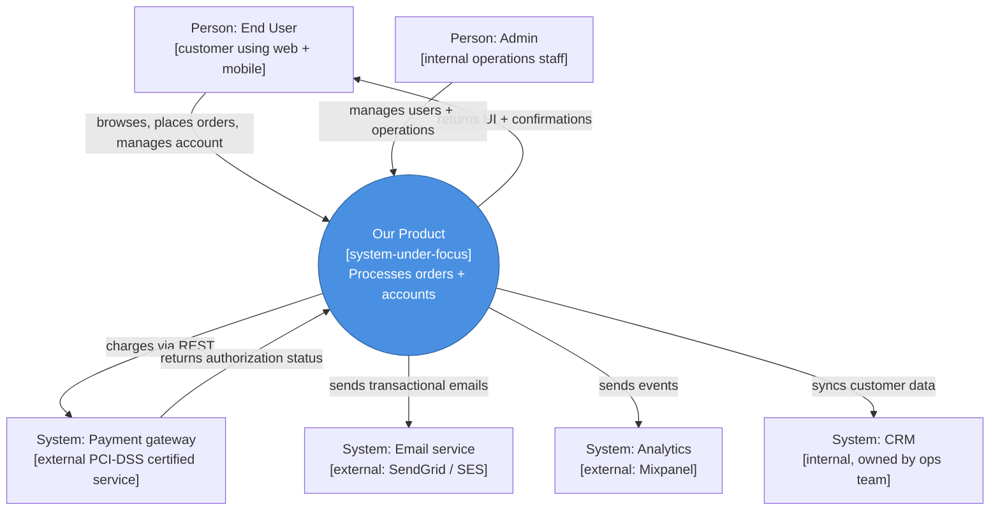
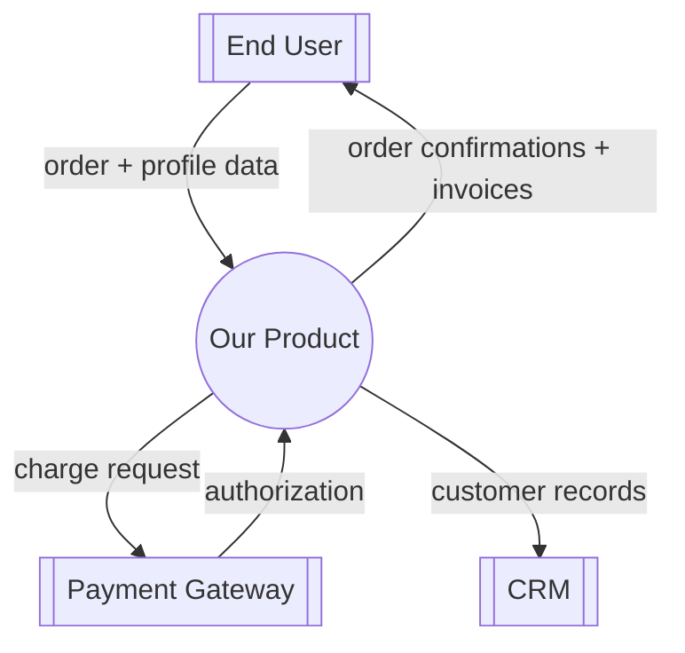

# Context Diagramming

You produce a system context diagram — a single-box-plus-surroundings view that makes the system's boundary, external participants, and inbound / outbound flows crystal clear. Aligns with C4 Level 1 (system context) and classic DFD Level 0.

## Core rules

- **One system per diagram**: the system is a single opaque box; internals are out of scope
- **External entities classified**: person / user-group / system / organization
- **Every flow labeled**: purpose + data / interaction type
- **In-scope vs out-of-scope explicit**: the diagram itself is the scope statement
- **No internal details**: resist urge to "peek inside" the system — that's a container / component diagram
- **No fabricated entities**: work from supplied actors + systems or elicit

## Input handling

| Dimension | Required | Default |
|---|---|---|
| **System name** | Yes | — |
| **System purpose** (1 sentence) | Yes | — |
| **External entities** | Yes (≥2) | Elicit |
| **Known flows** | No | Elicit |
| **Style** | No | `C4` (C4 model Level 1) |

## Phase 1 — Setup

```
**System**: [name]
**Purpose**: [one-sentence what-it-does]
**Style**: [C4 / classic / DFD-level-0]
**Scope clarification**: [what's inside the system box vs outside]
```

Ask render mode per `diagram-rendering` mixin and output path (default: `/documentation/[case]/context-diagramming/`).

## Phase 2 — Entity classification

Every external entity gets a type:

| Type | Symbol convention (C4) | Examples |
|---|---|---|
| **Person / User** | Stick figure or person icon | End customer, administrator, support agent |
| **User group** | Group icon | "Developers at partner company", "Mobile app users" |
| **Software system** | Rectangle | "Payment gateway", "CRM", "Email service" |
| **Organization** | Rectangle with org label | "Regulator", "Partner company", "Data provider" |

Per entity:
- **Name** — human-readable
- **Type** — from above
- **Role** — what it does relative to our system
- **Internal or external to organization** — for C4 we typically show only external to the system's boundary; internal actors who use the system also count as external to the box
- **Variation** (optional) — if multiple sub-types exist (e.g., "Registered customer" vs "Guest customer")

Rule: 3–8 entities typical. Fewer = probably missing; more = probably showing internal details.

## Phase 3 — Flow specification

Per flow (arrow between entity and system, or system and entity):

| Field | Description |
|---|---|
| **From → To** | Direction |
| **Purpose** | Why this flow exists (1 sentence) |
| **Type** | interaction / data / notification / control / payment / ... |
| **Protocol / channel** (optional) | REST API, email, file transfer, webhook, UI |
| **Frequency** (optional) | Synchronous / async / batch |
| **Data** (optional) | What's carried |
| **Direction** | In / out / both |

Rules:
- Every flow has clear purpose
- Avoid "data" as a flow name — say what data and why
- Bidirectional interactions can be one arrow labeled "interacts with" or two arrows (preferred for clarity)

## Phase 4 — Scope statement

Explicit in-scope / out-of-scope list:

| In scope (inside the system box) |
|---|
| [Feature / capability 1] |
| [Feature / capability 2] |

| Out of scope (external entities or separate systems) |
|---|
| [External entity 1] — [reason it's external] |
| [Adjacent system] — [why it's not in this system] |

Rule: if scope is ambiguous on any item, ask user to place it explicitly.

## Phase 5 — Constraints & assumptions

Surface key constraints shaping the boundary:

- **Regulatory** — "Payment data must be processed by PCI-certified external provider" → payment gateway external
- **Organizational** — "CRM owned by another team" → external system
- **Technical** — "Legacy mainframe can't be modified" → external integration
- **Business** — "Partner API is a commercial contract" → external organization

## Phase 6 — C4 Level 1 conventions (if style=C4)

C4 model Level 1 (System Context):
- The system under focus is drawn prominently in the center
- External systems and personas drawn around it
- Relationships labeled with purpose + optionally protocol
- Color coding: system under focus often filled, externals outlined
- A brief description shown under each entity

Recommended: for each entity, add `[Description: 8 words]` and `[Technology: REST API / SaaS / ...]` annotations.

## Phase 7 — DFD Level 0 (if style=DFD)

Data Flow Diagram conventions:
- System drawn as a single process (circle or rounded rect)
- External entities as squares
- Data stores usually appear at Level 1 only (not Level 0)
- Labeled data flows (nouns, not verbs)

Use DFD style when emphasizing **data** flows; use C4 when emphasizing **system architecture** including both human and machine actors.

## Phase 8 — Diagram

### C4 Level 1 example



### Classic / DFD Level 0 example



## Phase 9 — Diagram rendering

Per `diagram-rendering` mixin. File names:
- `context-diagram.mmd` / `.png`

## Phase 10 — Report assembly and approval

```markdown
# Context Diagram: [System]

**Date**: [date]
**System**: [name]
**Purpose**: [one sentence]
**Style**: [C4 / classic / DFD-Level-0]

## Scope
[System + one-sentence purpose + style]

## External Entities
[Table: name, type, role, description, technology (if C4)]

## Flows
[Table: from → to, purpose, type, protocol, frequency, data, direction]

## Scope Statement
### In scope
[List of capabilities within system boundary]

### Out of scope
[Entities / systems that are external, with reason]

## Constraints & Assumptions
[Regulatory / organizational / technical / business drivers]

## Diagram
[Mermaid flowchart]

## Assumptions & Limitations
[`[Assumed]` entities or flows, description gaps]
```

Present for user approval. Save only after confirmation.

## Generation + extraction rules

- One system, one diagram
- Every external entity typed
- Every flow has purpose + direction
- In/out of scope explicit
- No internal details shown
- No fabricated entities

## Failure behavior

| Situation | Behavior |
|---|---|
| No system name | Interview mode (§7) |
| Fewer than 2 external entities | Ask; system-in-a-vacuum is unusual |
| Internal component surfaced as "external" | Reclassify; probably belongs inside system box (show later in Level 2) |
| Many flows with same direction and purpose | Consolidate (single entity, multiple actions) |
| Scope ambiguity on specific items | Force user to place explicitly |
| mmdc failure | See `diagram-rendering` mixin |
| Out-of-scope (decomposition to components) | "Context diagram is Level 1. For decomposition, see future C4-modeling skill / data-flow-diagramming." |

## Self-check

```
[] One system under focus
[] One-sentence purpose
[] Style declared
[] ≥2 external entities, each typed
[] Every flow has from / to / purpose / type / direction
[] In-scope and out-of-scope explicit
[] Constraints & assumptions surfaced
[] No internal details shown
[] Diagram valid
[] No fabricated entities
[] Report follows output contract
```
