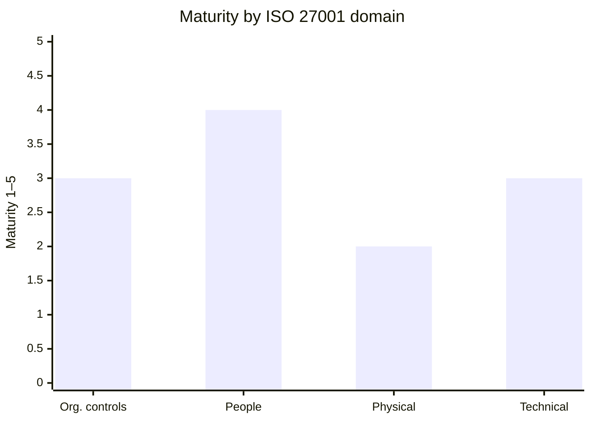
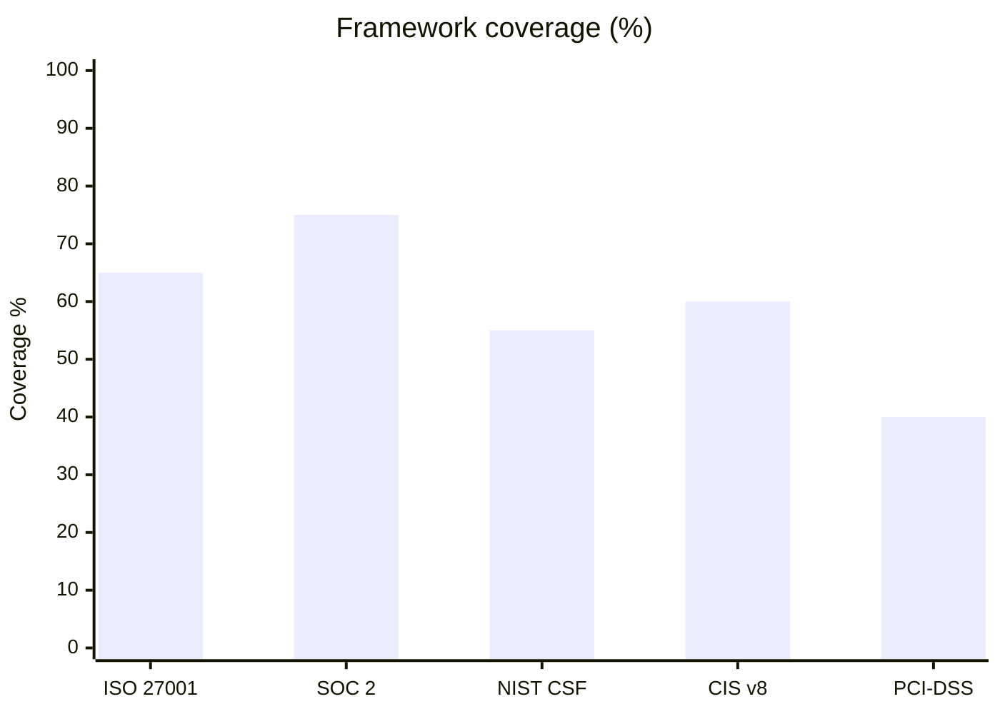
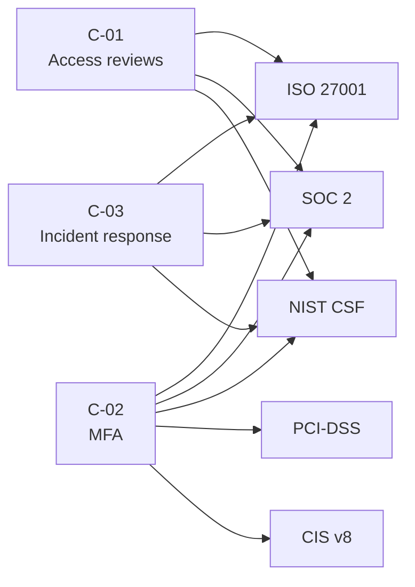

# Control Framework Mapping

You map controls to one or more control frameworks to produce a coverage matrix, gap analysis, evidence mapping, and cross-framework consolidation. Goal: a single control inventory that satisfies multiple frameworks without duplicate work.

## Core rules

- **Not an audit**: output is a mapping, not a certified audit opinion
- **Evidence-oriented**: every "control in place" claim must point to evidence type (not fabricated evidence)
- **Framework-accurate**: reference real control IDs from the target frameworks; never invent IDs
- **Honest gaps**: if a control is missing or partial, say so; do not hide for appearances
- **Cross-framework leverage**: when a control satisfies multiple framework cells, surface it — this is the main efficiency win

## Input handling

Follow shared foundation §7. Gather at minimum:

| Dimension | Required | Default |
|---|---|---|
| **Scope** (org / system / service) | Yes | — |
| **Target frameworks** | Yes | — |
| **Current controls (inventory or reference)** | No | Interview for top controls |
| **Evidence sources** | No | `[Assumed]` unless supplied |
| **Maturity model** | No | `1–5` (Initial → Optimized) |

**Exit interview when**: scope and ≥1 target framework are clear.

## Phase 1 — Setup

### 1. Collect input

- Scope description (org / system / service boundary)
- Target framework(s)
- Current control inventory or references (policies, configs, tools)
- Reference to prior `data-flow-diagramming` or `regulatory-landscape-mapping` outputs
- No / vague input → interview mode (§7)

### 2. Detect scope

- **Scope**: what the mapping covers
- **Target frameworks** (choose ≥1):

| Framework | Typical use |
|---|---|
| **ISO 27001 / 27002 (Annex A)** | Information security management |
| **SOC 2 Trust Services Criteria** | Service organizations, vendor trust |
| **NIST CSF** | Risk-based security program |
| **NIST 800-53** | US federal systems, high-assurance |
| **CIS Controls v8** | Practical implementation guidance |
| **PCI-DSS v4** | Payment card environments |
| **HIPAA Security Rule** | US healthcare |
| **NIS2** | EU essential/important entities |
| **ISO 27701** | Privacy (PIMS, extension to 27001) |
| **ISO 42001** | AI management systems |

- **Current controls**: list or reference
- **Maturity model**: 1 (Initial) → 2 (Repeatable) → 3 (Defined) → 4 (Managed) → 5 (Optimized)

### 3. Confirm scope

Present:

```
**Scope**: [boundary]
**Target frameworks**: [list]
**Current controls**: [N items or "to be elicited"]
**Maturity model**: [1–5]
```

Ask for confirmation. Ask render mode per `diagram-rendering` mixin and output path (default: `/documentation/[case]/control-framework-mapping/`).

## Phase 2 — Framework clause inventory

For each target framework, list the clauses / control IDs that apply to the scope. Do NOT include framework text verbatim — reference IDs and short descriptions.

| Framework | Clause / Control ID | Short description | In scope? |
|---|---|---|---|
| ISO 27001 | A.5.1 | Policies for information security | Yes |
| SOC 2 | CC6.1 | Logical access controls | Yes |
| NIST CSF | PR.AC-1 | Identities and credentials managed | Yes |
| CIS v8 | 6.1 | Establish access granting process | Yes |

Use widely-known IDs. If unsure, label `[Assumed]`.

## Phase 3 — Control inventory

For each control the organization has (or plans):

| ID | Control name | Description | Owner | Type | Maturity (1–5) | Evidence source type |
|---|---|---|---|---|---|---|
| C-01 | Access review cadence | Quarterly review of user access to production | Security Ops | Detective | 3 | Ticket system + evidence of completed reviews |
| C-02 | MFA enforcement | MFA required for all production access | Platform | Preventive | 4 | IdP config + audit logs |

Types: `Preventive` / `Detective` / `Corrective` / `Directive` / `Compensating`.

Evidence source types (not the evidence itself):
- Policy / procedure document
- Configuration / IaC / code
- Log / telemetry
- Ticket / workflow record
- Screenshot / attestation
- External audit / pentest report

If the user does not have controls, produce a recommended starter set based on target frameworks.

## Phase 4 — Mapping

Build the mapping matrix:

| Control ID | ISO 27001 | SOC 2 | NIST CSF | CIS v8 | ... |
|---|---|---|---|---|---|
| C-01 | A.5.15, A.5.18 | CC6.3 | PR.AC-4 | 6.2 | ... |
| C-02 | A.5.17, A.8.5 | CC6.1 | PR.AC-7 | 6.3, 6.5 | ... |

Rules:
- Reference real framework IDs
- If a control partially satisfies a framework cell, use `(partial)` suffix
- If a control compensates for a missing primary control, mark `(compensating)`

## Phase 5 — Coverage matrix

Per framework, compute coverage:

| Framework | Total in-scope clauses | Fully covered | Partial | Not covered |
|---|---|---|---|---|
| ISO 27001 | 40 | 26 | 6 | 8 |
| SOC 2 | 33 | 25 | 4 | 4 |

List per framework:
- **Covered**: controls satisfying the clause fully
- **Partial**: controls partially satisfying
- **Gaps**: clauses with no mapped control

## Phase 6 — Gap analysis

Per gap:

| Gap | Framework clauses | Why it matters | Recommended control | Effort estimate |
|---|---|---|---|---|
| No formal incident response plan | ISO A.5.24, SOC 2 CC7.4, NIST RS.RP-1 | Required for certification; cross-framework | Adopt IR playbook + annual tabletop | Medium (4–8 weeks) |

Prioritize gaps by framework criticality + cross-framework impact (gap affecting ≥3 frameworks = high priority).

## Phase 7 — Maturity scoring

Per framework domain (or per control), score maturity 1–5 with justification.



## Phase 8 — Cross-framework consolidation

Identify controls that serve multiple framework cells. Example:

> **C-02 MFA enforcement** — satisfies ISO A.5.17 + A.8.5, SOC 2 CC6.1, NIST CSF PR.AC-7, CIS 6.3 + 6.5, PCI-DSS 8.4. Centralizing evidence (IdP config + audit log) covers 5 frameworks in one.

High-leverage controls (satisfy ≥5 cells across frameworks) are flagged. Typical examples: MFA, access reviews, logging/monitoring, encryption at rest/in transit, vulnerability management, patching, incident response, vendor risk management, background checks.

## Phase 9 — Recommendations

- **Quick wins**: gaps that close multiple framework cells with one control
- **Evidence consolidation**: where one evidence set serves multiple audits
- **Tooling**: GRC platforms, continuous-controls monitoring
- **Roadmap**: 3–6 month control-addition plan with priorities

## Phase 10 — Diagrams

### 1. Coverage heatmap



### 2. Cross-framework leverage



### 3. Maturity radar (optional)

Approximated with xychart across domains (see Phase 7).

## Phase 11 — Diagram rendering

Per `diagram-rendering` mixin. File names:
- `coverage-heatmap.mmd` / `.png`
- `cross-framework-leverage.mmd` / `.png`
- `maturity-chart.mmd` / `.png` (optional)

## Phase 12 — Report assembly and approval

```markdown
# Control Framework Mapping: [Scope]

**Date**: [date]
**Disclaimer**: Structured mapping. Not a certified audit. Requires qualified auditor for attestation.
**Target frameworks**: [list]

## Scope
[Boundary, frameworks, maturity model]

## Framework Clause Inventory
[Per framework: in-scope clauses]

## Control Inventory
[Per control: ID, name, description, owner, type, maturity, evidence source type]

## Mapping Matrix
[Control × framework matrix]

## Coverage
[Per framework: counts + gaps list]

## Gap Analysis
[Per gap: clauses, impact, recommended control, effort]

## Maturity Scoring
[Per domain: score + justification; maturity chart]

## Cross-framework Consolidation
[High-leverage controls + diagram]

## Recommendations
[Quick wins, evidence consolidation, tooling, 3–6 month roadmap]

## Evidence & Assumptions
[`[Assumed]` items with rationale]

## Limitations
[Freshness, framework-version caveats, specialist input needs]
```

Present for user approval. Save only after confirmation.

## Extraction + assessment rules

**Extraction (primary)**:
- Framework IDs must be real — no invention
- Controls mapped with confidence labels
- Evidence source types specified (not fabricated evidence content)

**Assessment (secondary)** — coverage, gaps, maturity:
- Gaps named honestly
- Maturity scores justified
- Deterministic

## Failure behavior

| Situation | Behavior |
|---|---|
| No scope / no framework | Interview mode (§7) |
| Framework not in known set | Flag; ask for a pointer or proceed with `[Assumed]` framework structure with caveat |
| No current controls | Produce recommended starter set + baseline mapping |
| Asked for certification opinion | Decline — not an audit. Offer mapping + readiness assessment pointers. |
| Evidence not supplied | Mark evidence type only, not content; recommend evidence collection |
| mmdc failure | See `diagram-rendering` mixin |
| Out-of-scope (e.g., "implement the controls") | "This skill maps controls. Implementation requires engineering + policy work beyond scope." |

## Self-check

```
[] Disclaimer present
[] Scope and frameworks stated
[] Framework clause inventory uses real IDs
[] Control inventory has ID, owner, type, maturity, evidence source type
[] Mapping matrix covers every control × framework cell where applicable
[] Partial and compensating flags used where accurate
[] Coverage counts per framework
[] Gaps listed with framework clauses, impact, recommended control, effort
[] Maturity scored per domain with justification
[] Cross-framework high-leverage controls flagged (≥5 cells)
[] Recommendations include quick wins and evidence consolidation
[] All Mermaid diagrams render valid syntax
[] No fabricated framework IDs or evidence content
[] Report follows output contract
```
