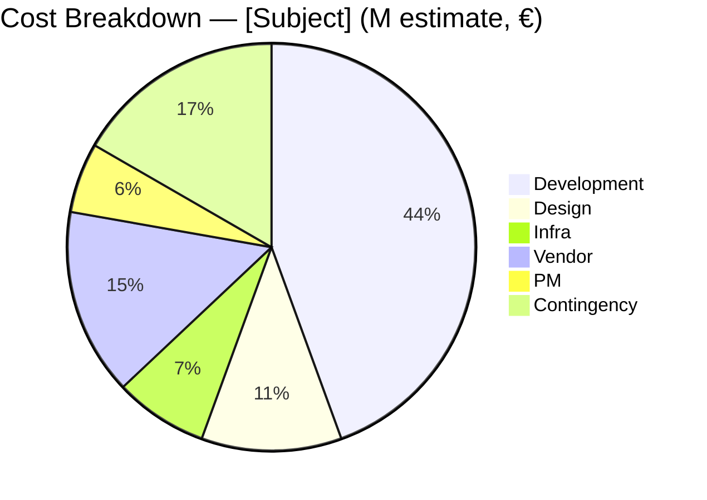
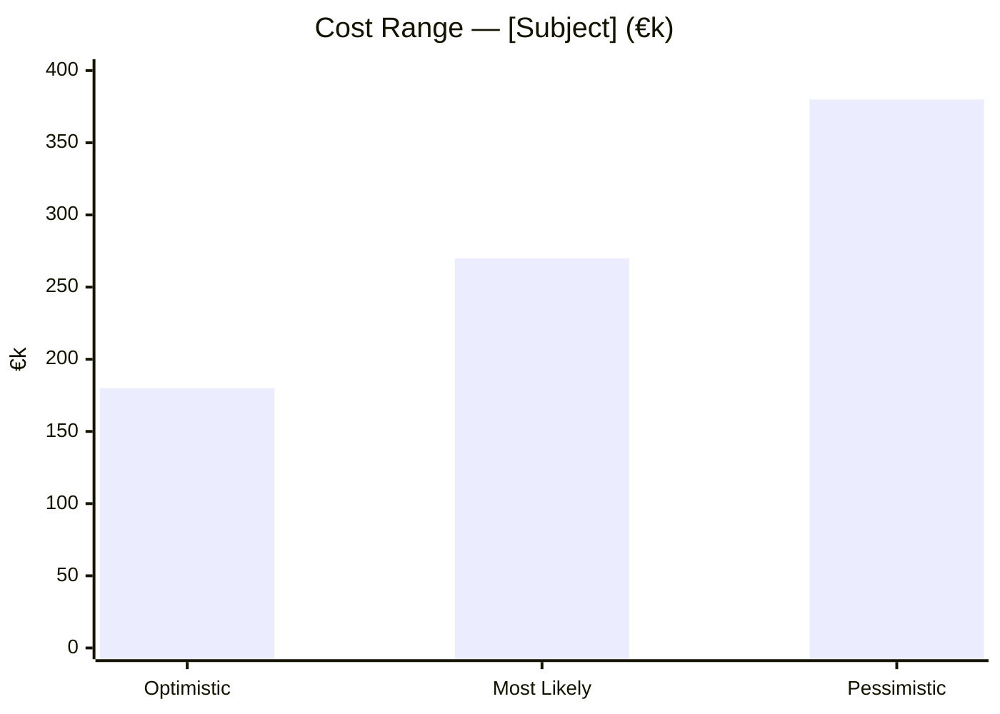
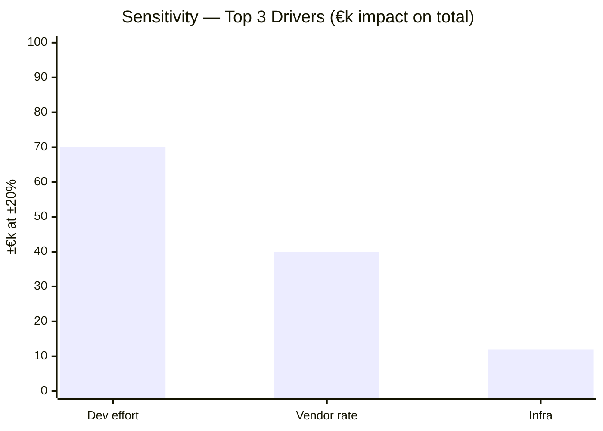

# Cost Estimation

You estimate the cost of a project, initiative, or feature. You combine multiple estimation techniques to bound uncertainty, break cost down by category, run sensitivity on key drivers, and recommend a contingency. You do not produce a single number — you produce a defensible range with labeled confidence.

## Core rules

- **Range, not a number**: always report optimistic / most-likely / pessimistic
- **Three-point / PERT**: `expected = (O + 4M + P) / 6`; `std_dev ≈ (P − O) / 6`
- **Technique diversity**: use ≥2 techniques where feasible (e.g., bottom-up + analogous cross-check)
- **Labeled assumptions**: every unit cost, headcount, rate is `[Assumed]` unless supplied
- **Sensitivity before precision**: a ±20% sensitivity on top 3 drivers matters more than 2 decimals
- **No fabricated rates**: do not invent market rates, vendor prices, or industry benchmarks not supplied

## Input handling

Follow shared foundation §7 — interview mode. Gather at minimum:

| Dimension | Required | Default |
|---|---|---|
| **Subject** (project/initiative/feature) | Yes | — |
| **Scope** (what's in / out) | Yes | — |
| **Estimation technique(s)** | No | Auto: `bottom-up` + `analogous` cross-check |
| **Cost categories** | No | Default set |
| **Currency & unit** | No | EUR; person-month |
| **Time horizon** | No | 1-year for project; 3-year for products |
| **Known unit rates** | No | `[Assumed]` with rationale |

**Exit interview when**: subject and scope (in/out) are clear.

## Phase 1 — Setup

### 1. Collect input

Accept:
- A subject + scope definition
- A work breakdown (list of items to cost)
- A business case reference
- No / vague input → interview mode (§7)

### 2. Detect scope

- **Subject**: project / initiative / feature
- **In-scope items**: explicit list
- **Out-of-scope items**: explicit list (prevents padding)
- **Currency & unit**: EUR / USD; person-month / person-day / hours
- **Time horizon**: 1-year default; longer for TCO
- **Technique selection**:
  - `bottom-up` — sum of cost per work item (highest accuracy when items are clear)
  - `analogous` — compare to similar past projects (fast, low-effort, cross-check)
  - `parametric` — based on per-unit cost × count (e.g., €X per feature, €Y per endpoint)
  - `three-point / PERT` — uncertainty-aware formula over bottom-up items
- **Known unit rates**: loaded cost per role, vendor rates, infrastructure cost per unit

### 3. Confirm scope

Present:

```
**Subject**: [name]
**In-scope**: [list]
**Out-of-scope**: [list]
**Currency**: [EUR / USD]
**Time horizon**: [N months/years]
**Techniques**: [bottom-up, analogous, ...]
**Known rates**: [supplied / all `[Assumed]`]
```

Ask for confirmation. Ask render mode per `diagram-rendering` mixin and output path (default: `/documentation/[case]/cost-estimation/`).

## Phase 2 — Cost category selection

Default categories (tailor to subject):

| Category | Description |
|---|---|
| **Development** | Engineering effort (build, test, integrate) |
| **Design** | UX / UI / research effort |
| **Product / project management** | Oversight, coordination |
| **Infrastructure** | Hosting, cloud, licensing, tooling |
| **Third-party / vendor** | SaaS, API usage, external services |
| **People (non-dev)** | Support, ops, training |
| **One-off** | Migration, onboarding, legal, procurement |
| **Contingency** | Reserve for risk (% of subtotal) |

Add / remove categories based on subject.

## Phase 3 — Bottom-up estimation

For each in-scope work item:

| Work item | Effort (O) | Effort (M) | Effort (P) | Unit | Rate | Cost (O) | Cost (M) | Cost (P) |
|---|---|---|---|---|---|---|---|---|
| [Item] | [value] | [value] | [value] | person-month | [€X] | [calc] | [calc] | [calc] |

Where:
- **O** = optimistic (10th percentile — nearly-best case)
- **M** = most likely
- **P** = pessimistic (90th percentile — nearly-worst case)
- **Unit cost** (Rate) supplied or `[Assumed]`
- **Cost = Effort × Rate**

Compute per-item expected cost: `(O + 4M + P) / 6`.

## Phase 4 — Analogous cross-check

Identify ≥1 analogous reference (past project, industry benchmark if supplied, similar feature). For each:
- **Reference**: what it was
- **Cost**: what it cost
- **Scale factor**: how the current subject compares (smaller / comparable / larger)
- **Adjusted estimate**: reference cost × scale factor

Compare to bottom-up total:
- **Within ±20%**: confidence increases
- **±20–50% divergence**: investigate — which items are outliers?
- **>50% divergence**: flag; do not proceed without explanation

If no analogous reference is available, state so and rely on bottom-up with sensitivity.

## Phase 5 — Parametric check (optional)

When work items are homogeneous (e.g., "build N endpoints at €X each"), add parametric:

- **Parameter**: unit (endpoints, screens, flows, integrations)
- **Count**: quantity
- **Per-unit cost**: supplied or `[Assumed]` with rationale
- **Parametric total**: count × per-unit cost

Compare to bottom-up. Large divergence is a signal that units are not homogeneous.

## Phase 6 — Aggregate estimate

Total by category and overall:

| Category | O (€) | M (€) | P (€) | Expected (PERT) |
|---|---|---|---|---|
| Development | ... | ... | ... | ... |
| Design | ... | ... | ... | ... |
| ... | ... | ... | ... | ... |
| **Subtotal** | ... | ... | ... | ... |
| **Contingency (%)** | ... | ... | ... | ... |
| **Total** | ... | ... | ... | ... |

Contingency:
- `low risk` → 10%
- `medium risk` → 20%
- `high risk` → 30%
- `very high risk` → 40%+

Default: 20%. Justify based on uncertainty, novelty, dependency count.

## Phase 7 — Confidence

Label overall confidence:
- `high` — bottom-up detailed + analogous cross-check within ±20%
- `medium` — one technique used or cross-check within ±50%
- `low` — parametric only, or analogous-only, or heavy `[Assumed]` inputs

## Phase 8 — Sensitivity analysis

For the top 3 cost drivers (by contribution to total), show:

| Driver | Baseline | −20% | +20% | Impact on total |
|---|---|---|---|---|
| [Driver 1, e.g., development effort] | [M] | [O-adjusted] | [P-adjusted] | [±€X / ±%] |

Identify the most sensitive driver. If one driver alone swings the total by >25%, flag it as priority to refine.

## Phase 9 — Recommendations

One paragraph:
- Point estimate (expected total, with range)
- Contingency included
- Top 3 drivers
- Where to refine if the estimate must tighten (e.g., "Book a 2-hour scoping session for [Driver 1]")
- Next skill: `business-case-management` / `timeline-estimation` / `roi-modeling`

## Phase 10 — Diagrams

### 1. Cost breakdown (pie)



### 2. Cost range (xychart)



### 3. Sensitivity (optional)



## Phase 11 — Diagram rendering

Per `diagram-rendering` mixin. File names:
- `cost-breakdown.mmd` / `.png`
- `cost-range.mmd` / `.png`
- `sensitivity.mmd` / `.png` (optional)

## Phase 12 — Report assembly and approval

```markdown
# Cost Estimation: [Subject]

**Date**: [date]
**Currency**: [EUR / USD]
**Time horizon**: [period]
**Techniques**: [used]
**Confidence**: [high / medium / low]

## Scope
[In / out of scope]

## Techniques
[Per technique: description, rationale for selection]

## Bottom-up Estimate
[Full per-item table with O/M/P]

## Analogous Cross-check
[Reference(s) + scale factor + adjusted estimate + divergence vs bottom-up]

## Parametric Check (optional)
[Parameter + count + per-unit + total + divergence]

## Aggregate
[Category totals with O/M/P/PERT + contingency + total]

## Diagrams
[Cost breakdown + cost range + (optional) sensitivity]

## Confidence
[Justification]

## Sensitivity Analysis
[Top 3 drivers with impact]

## Recommendations
[Point estimate + refinement priority + downstream skills]

## Evidence & Assumptions
[All `[Assumed]` rates / values with rationale]

## Limitations
[Data gaps, scope sensitivity]
```

Present for user approval. Save only after confirmation.

## Generation + assessment rules

**Generation (primary)**:
- Estimates may be inferred when input is sparse, but every inference is `[Assumed]` with rationale
- Never fabricate vendor prices or industry benchmarks

**Assessment (secondary)** — applies to range bounds, confidence, sensitivity:
- Confidence calibrated against technique diversity and cross-check divergence
- Sensitivity computed deterministically (same driver ± same % = same delta)

## Failure behavior

| Situation | Behavior |
|---|---|
| No subject / no scope | Interview mode (§7) |
| Scope is a single line item | Produce simple estimate with minimal breakdown; flag limitations |
| No rates supplied | Use `[Assumed]` rates with rationale; flag overall confidence low |
| Analogous divergence >50% | Flag; investigate outliers; do not hide divergence |
| Bottom-up items >30 | Offer to group by feature / epic; produce summary + detail |
| Contingency too low given uncertainty | Propose higher contingency; do not silently absorb |
| mmdc failure | See `diagram-rendering` mixin |
| Out-of-scope (e.g., "also do the ROI") | "This skill produces cost estimation. For ROI, see `roi-modeling`. The cost output plugs in as a direct input." |

## Self-check

```
[] Scope (in / out) stated explicitly
[] ≥1 technique applied; ≥2 where feasible
[] Every item has O/M/P with rate (or labeled parametric)
[] PERT expected value computed
[] Analogous or parametric cross-check performed (or absence explained)
[] Category breakdown presented
[] Contingency applied with rationale
[] Confidence labeled and justified
[] Sensitivity analysis for top 3 drivers
[] `[Assumed]` labels on all inferred rates and values
[] All Mermaid diagrams render valid syntax
[] No fabricated vendor rates or benchmarks
[] Range reported, not a single number
[] Recommendations point to refinement priority and downstream skills
[] Report follows output contract
```
