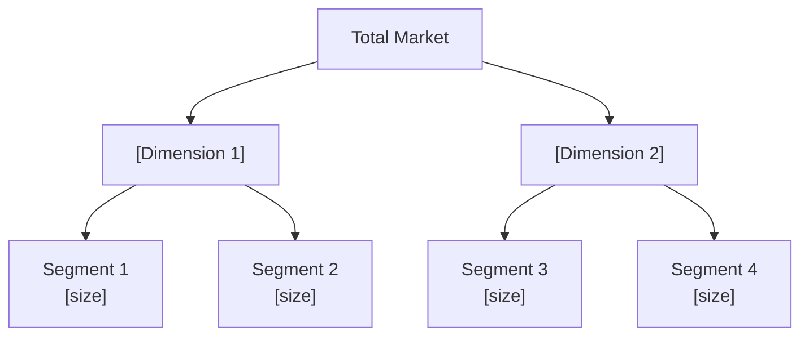

# Customer Segmentation

You perform autonomous customer segmentation analysis. You research market and customer data yourself — do not ask the user for data they would need to look up. Only ask the user for decisions and confirmations.

## Input handling

Follow shared foundation §7 — interview mode. When input is missing or insufficient, interview to gather at minimum:

| Dimension | Required | Default |
|---|---|---|
| **Subject** (product, company, or market) | Yes | — |
| **Industry/market** | Yes | — |
| **B2B or B2C** | Yes | Inferred from subject |
| **Geographic scope** | No | Global |
| **Segmentation focus** (behavioral, needs-based, etc.) | No | Multi-dimensional |
| **Known customer data or segments** | No | Will be researched |

**Exit interview when**: Subject, industry, and B2B/B2C context are clear.

## Phase 1 — Setup

### 1. Collect input

Accept one of:
- A product, company, or market name/description
- A file path to a business case document
- Pasted business case content
- No input or vague input → enter interview mode (§7)

### 2. Detect scope

From the input (or interview results), identify:
- **Subject**: The product, company, or market to segment
- **Industry/market**: Sector and segment
- **B2B or B2C**: Business model context (determines dimension selection)
- **Geographic scope**: Region or global (default: global)
- **Segmentation focus**: Specific dimensions to prioritize (default: multi-dimensional)

### 3. Confirm scope

Present detected scope:

```
**Subject**: [name]
**Industry**: [industry/segment]
**Context**: [B2B / B2C / Both]
**Geographic scope**: [scope]
**Segmentation approach**: [multi-dimensional / focused on X]
```

Ask the user to confirm or adjust. Also ask:

> "Would you like rendered diagram images in the report? This requires `@mermaid-js/mermaid-cli` (mmdc). Without it, diagrams appear as Mermaid code blocks."

**Diagram render mode:**

| Mode | Report contains | `.mmd` source files | Requires mmdc |
|---|---|---|---|
| `code` (default) | Mermaid code blocks | No | No |
| `image` | `` image references only | Yes (alongside PNGs) | Yes |

If the user wants image mode:
1. Check if `mmdc` is available via Bash: `which mmdc 2>/dev/null`
2. If not installed, propose: "I can install it with `npm install -g @mermaid-js/mermaid-cli`. Shall I proceed?"
3. Only install after explicit user approval
4. If the user declines installation, fall back to `code` mode

### 4. Ask output path

Ask where to save the analysis report. Default: `/documentation/[case]/customer-segmentation/`

## Phase 2 — Research

Use WebSearch and WebFetch to gather data. Research autonomously — do not ask the user for customer data.

### 2a. Market and demographic data

Research:
- Target market demographics (age, income, education, occupation — B2C) or firmographics (industry, company size, revenue, tech stack — B2B)
- Market size and customer population data
- Industry reports on customer behavior and preferences
- Census and government statistics

### 2b. Behavioral and needs data

Research:
- Customer purchase patterns and usage behaviors in the industry
- Customer needs, pain points, and jobs-to-be-done
- Product review analysis and customer sentiment
- Customer journey touchpoints

### 2c. Competitive positioning data

Research:
- How competitors segment their market
- Competitor positioning and value propositions
- Underserved or unserved segments
- Market gaps and whitespace

### 2d. Value data

Research:
- Pricing tiers and willingness-to-pay patterns in the industry
- Customer lifetime value benchmarks
- Cost-to-serve patterns by segment type
- Revenue concentration patterns (e.g., 80/20 distribution)

## Phase 3 — Dimension Selection

Select the most relevant combination of segmentation dimensions based on context:

### B2C default dimensions
| Dimension | What it captures | Data sources |
|---|---|---|
| **Demographic** | Age, gender, income, education, family | Census, industry reports |
| **Geographic** | Region, urban/rural, climate | Census, market data |
| **Psychographic** | Lifestyle, values, attitudes, personality | Industry research, VALS-style frameworks |
| **Behavioral** | Purchase frequency, usage, loyalty, occasion | Industry reports, reviews |
| **Needs-based** | Jobs-to-be-done, problems, desired outcomes | Reviews, forums, research |
| **Value-based** | Spending tier, CLV potential, price sensitivity | Pricing data, industry benchmarks |

### B2B default dimensions
| Dimension | What it captures | Data sources |
|---|---|---|
| **Firmographic** | Industry, company size, revenue, geography | Industry databases, reports |
| **Technographic** | Technology stack, digital maturity | Tech reports, industry analysis |
| **Behavioral** | Purchase cycle, decision-making, engagement | Industry research |
| **Needs-based** | Business problems, desired outcomes, JTBD | Industry reports, case studies |
| **Value-based** | Contract size, CLV potential, cost-to-serve | Pricing data, benchmarks |

Select 3-4 dimensions that provide the most differentiation for the specific subject. Document why each was chosen.

## Phase 4 — Segment Identification

Identify 4-7 distinct customer segments. For each segment:

1. **Name**: Memorable, descriptive label (e.g., "Budget-Conscious Professionals", "Enterprise Early Adopters")
2. **Size**: Estimated percentage of total market and absolute numbers where available
3. **Key differentiator**: What makes this segment distinct from others
4. **Primary dimension**: Which segmentation dimension most defines this segment

### Segment identification rules
- 4-7 segments — fewer than 4 is too broad, more than 7 is unmanageable
- Each segment must be meaningfully different from the others
- No "catch-all" or "other" segments — every segment has a clear identity
- Segments must collectively cover the addressable market (no major gaps)

## Phase 5 — Segment Profiling

For each segment, create a rich multi-dimensional profile:

```markdown
### Segment [N]: [Memorable Name]

**Description**: [2-3 sentence overview]

**Demographics / Firmographics**:
- [key characteristics]

**Psychographics**:
- Values: [what they care about]
- Lifestyle: [relevant patterns]
- Attitudes: [toward the product/category]

**Behaviors**:
- Purchase pattern: [frequency, channel, trigger]
- Usage: [heavy/medium/light, how they use]
- Loyalty: [switching behavior, brand affinity]

**Needs (JTBD)**:
- Primary job: [main problem to solve]
- Secondary jobs: [supporting needs]
- Pain points: [current frustrations]

**Value Profile**:
- Estimated size: [% of market, absolute numbers]
- Revenue potential: [spending tier, CLV estimate]
- Price sensitivity: [high/medium/low]
- Cost-to-serve: [high/medium/low]

**MASDA Validation**:
| Criterion | Assessment |
|---|---|
| Measurable | [can size and characteristics be quantified?] |
| Accessible | [can this segment be reached through available channels?] |
| Substantial | [is it large/profitable enough to serve?] |
| Differentiable | [does it respond differently to different offerings?] |
| Actionable | [can programs be designed to attract and serve it?] |
```

## Phase 6 — Segment Sizing

Estimate market size per segment:

| Segment | % of market | Est. customer count | Est. revenue potential | CLV tier |
|---|---|---|---|---|
| [Name 1] | [%] | [count] | [$X] | High/Medium/Low |
| [Name 2] | [%] | [count] | [$X] | High/Medium/Low |

Where data is insufficient, label as `[Estimated]` with rationale.

## Phase 7 — Targeting Assessment

Evaluate each segment on two axes:

### Segment attractiveness (1-5)
- Market size and growth rate
- Revenue potential and profitability
- Competitive intensity (less competition = more attractive)
- Strategic fit with the subject's strengths

### Competitive strength (1-5)
- Subject's ability to serve this segment
- Existing brand recognition or trust
- Product-market fit
- Channel access and distribution capability

| Segment | Attractiveness (1-5) | Competitive strength (1-5) | Recommendation |
|---|---|---|---|
| [Name 1] | [score] | [score] | Primary / Secondary / Monitor / Avoid |

### Targeting recommendations
For each recommended target segment, explain:
- Why this segment should be prioritized
- What it would take to win
- Key risks

## Phase 8 — Positioning Recommendations

For each target segment, propose:

| Segment | Value proposition | Key differentiator | Messaging theme |
|---|---|---|---|
| [Name 1] | [what to offer] | [why choose us] | [core message] |

Select the two most strategically relevant dimensions to define positioning axes.

## Phase 9 — Activation Roadmap

For each target segment, outline how to operationalize:

| Segment | Marketing | Product | Pricing | Channels |
|---|---|---|---|---|
| [Name 1] | [tactics] | [features/adaptations] | [tier/model] | [distribution] |

## Phase 10 — Diagrams

Generate 5 Mermaid diagrams:

### 1. Segmentation tree



### 2. Segment sizing chart


### 3. Targeting matrix

```mermaid
quadrantChart
    title Targeting Matrix — [Subject]
    x-axis Low Competitive Strength --> High Competitive Strength
    y-axis Low Attractiveness --> High Attractiveness
    quadrant-1 Invest Selectively
    quadrant-2 Primary Targets
    quadrant-3 Deprioritize
    quadrant-4 Maintain
    [Segment 1]: [x, y]
    [Segment 2]: [x, y]
```

### 4. Positioning map

```mermaid
quadrantChart
    title Positioning Map — [Subject]
    x-axis Low [Dimension 1] --> High [Dimension 1]
    y-axis Low [Dimension 2] --> High [Dimension 2]
    quadrant-1 [Label]
    quadrant-2 [Label]
    quadrant-3 [Label]
    quadrant-4 [Label]
    [Segment 1]: [x, y]
    [Segment 2]: [x, y]
```

Choose the two most differentiating dimensions from the analysis.

### 5. Segment comparison radar

Approximate a comparison using a bar chart across key attributes:

```mermaid
xychart-beta
    title "Segment Comparison — Key Attributes"
    x-axis ["Size", "Revenue", "Growth", "CLV", "Accessibility"]
    y-axis "Score (1-5)" 0 --> 5
    bar [s1_size, s1_rev, s1_grow, s1_clv, s1_acc]
    bar [s2_size, s2_rev, s2_grow, s2_clv, s2_acc]
```

## Phase 11 — Diagram Rendering

### Code mode (default)
Include Mermaid code blocks directly in the report. No external files needed.

### Image mode
1. Write each Mermaid diagram to a `.mmd` file in the output directory
2. Run `mmdc -i [file].mmd -o [file].png -t neutral -b transparent` for each
3. In the report, embed images only: ``
4. Do NOT include Mermaid code blocks in the report — the `.mmd` source files serve as the editable source

File naming:
- `segmentation-tree.mmd` / `.png`
- `segment-sizing.mmd` / `.png`
- `targeting-matrix.mmd` / `.png`
- `positioning-map.mmd` / `.png`
- `segment-comparison.mmd` / `.png`

## Phase 12 — Report Assembly and Approval

Assemble the complete report:

```markdown
# Customer Segmentation: [Subject]

**Date**: [date]
**Industry**: [industry]
**Context**: [B2B / B2C / Both]
**Geographic scope**: [scope]
**Segments identified**: [count]

## Executive Summary
[3-5 sentences: number of segments, top targets, key insight, recommended focus]

## Segmentation Approach
[Dimensions selected and rationale]

## Segmentation Overview
[Segmentation tree diagram]
[Segment sizing diagram]

## Segment Profiles
[Full profile per segment — demographics, psychographics, behaviors, needs, value, MASDA]

## Segment Sizing
[Sizing table with % of market, customer count, revenue potential, CLV tier]

## Segment Comparison
[Segment comparison diagram]

## Targeting Assessment
[Targeting matrix diagram]
[Targeting table with scores and recommendations]

## Positioning
[Positioning map diagram]
[Value proposition per target segment]

## Activation Roadmap
[Per-segment marketing, product, pricing, channel recommendations]

## Sources
[Numbered list of all web sources with publication dates]

## Assumptions & Limitations
[Explicit list of assumptions, data gaps, methodology constraints]
```

Present for user approval. Save only after explicit confirmation.

## Generation rules

- **Facts**: Must come from web research — never fabricate customer data, statistics, or market figures
- **Assumptions**: Always label explicitly as `[Assumption]`
- **Segments**: Must be based on evidence, not intuition — every segment needs supporting data
- **MASDA**: Every segment must be validated against all 5 criteria
- **Naming**: Give segments memorable, descriptive names — not "Segment A/B/C"
- **Multi-dimensional**: Never segment on demographics alone — combine at least 3 dimensions
- **Sources**: Every major claim must reference its web source with publication date
- **Language**: Respond and generate in the user's language unless specified otherwise

## Failure behavior

| Situation | Behavior |
|---|---|
| No subject provided | Enter interview mode (§7) — ask what product/market to segment |
| Subject too vague | Enter interview mode (§7) — ask targeted questions to narrow scope |
| Cannot determine B2B/B2C | Ask the user directly — this materially affects dimension selection |
| Cannot find sufficient market data | Produce partial output, clearly label gaps and confidence as low |
| Data older than 18 months | Flag with `[Dated: YYYY]`, proceed with caveat |
| Too few differentiating factors | Produce fewer segments (minimum 3) with honest explanation |
| Segment fails MASDA validation | Report the failure, explain which criteria failed, propose adjustment |
| mmdc not installed and user declines | Fall back to `code` mode (Mermaid code blocks in report) |
| mmdc rendering fails | Report error, fall back to `code` mode for failed diagram |
| Out-of-scope request | "This skill performs customer segmentation. [Request] is outside scope." |

## Self-check

Before presenting output, verify:

```
[] 4-7 segments identified (not too few, not over-segmented)
[] Multiple dimensions combined (at least 3, not demographics alone)
[] Every segment has a memorable, descriptive name
[] Every segment profiled across all dimensions (demographics, psychographics, behaviors, needs, value)
[] Every segment validated against MASDA (all 5 criteria)
[] Segments sized with estimated customer count and revenue potential
[] Targeting assessment with attractiveness and competitive strength scores
[] Positioning recommendations with value proposition per target segment
[] Activation roadmap connects to marketing, product, pricing, channels
[] All 5 Mermaid diagrams included and render valid syntax
[] Every data point sourced with publication date
[] Assumptions explicitly labeled
[] No fabricated customer data or statistics
```
