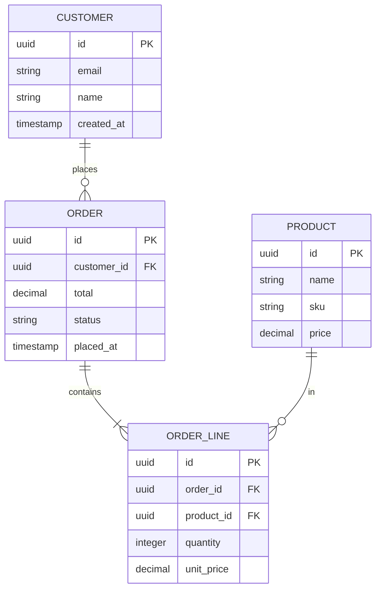
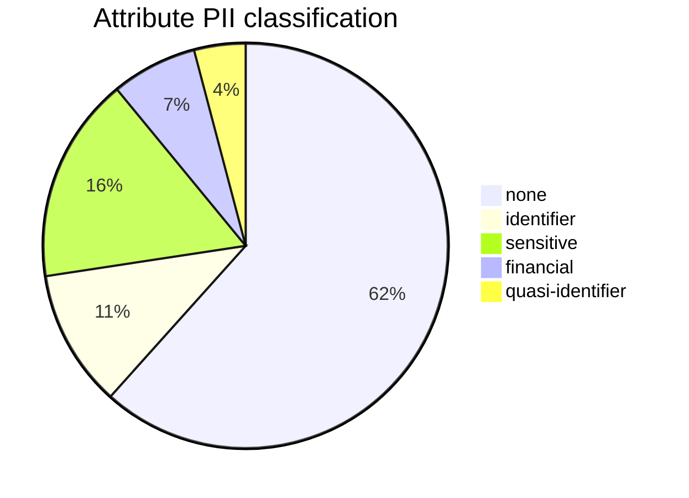

# Data Dictionary Definition

You produce a data dictionary — a structured catalog of data entities and their attributes — used for shared understanding between product, engineering, data, analytics, and compliance teams. Distinct from taxonomy (content classification) and database schema (physical implementation).

## Core rules

- **One entity per row in entity table; one attribute per row in attribute table**
- **Types from controlled vocabulary**: string / integer / decimal / boolean / date / timestamp / enum / reference / json / array
- **Every attribute**: type + constraints + source + PII classification
- **PII classification is required** for every attribute — not optional
- **Relationships explicit**: foreign-key / composition / aggregation / one-to-many / many-to-many
- **Versioned from day 1**: semver + CHANGELOG
- **No fabricated attributes**: work from supplied data model or elicit

## Input handling

| Dimension | Required | Default |
|---|---|---|
| **Domain / system scope** | Yes | — |
| **Entities** | Yes (≥1) | Elicit |
| **Attributes per entity** | No | Elicit |
| **Source of truth** (database / API / file / external) | No | Asked per entity |
| **Regulatory context** | No | General PII / none |

## Phase 1 — Setup

```
**Domain**: [system / product scope]
**Entity count (in scope)**: [N]
**Source(s) of truth**: [DB schema, API spec, manual description]
**Regulatory context**: [GDPR / CCPA / HIPAA / PCI / none]
```

Ask render mode per `diagram-rendering` mixin and output path (default: `/documentation/[case]/data-dictionary-definition/`).

## Phase 2 — Entity inventory

Per entity:

| Field | Description |
|---|---|
| **ID** | `E-001`, ... |
| **Name** | Business-domain term |
| **Description** | 1–2 sentences |
| **Source of truth** | Where it lives (table, service, API, file) |
| **Owner** | Team / role |
| **Sensitivity tier** | public / internal / confidential / restricted / special-category |
| **Estimated volume** | N rows / records (ballpark) |
| **Retention policy** | How long kept (aligns with data-flow-diagramming if applicable) |
| **Status** | active / deprecated / proposed |

## Phase 3 — Attribute specification

Per attribute:

| Field | Description |
|---|---|
| **ID** | `A-001` or `E-001.attribute_name` |
| **Entity ID** | Parent entity |
| **Name** | snake_case or camelCase per convention |
| **Display name** | User-facing label |
| **Description** | What it represents |
| **Type** | From controlled vocabulary |
| **Format** | ISO 8601 / UUID / email / E.164 phone / etc. |
| **Nullable** | Yes / No |
| **Default value** | If any |
| **Constraints** | Length, range, regex, enum values, unique |
| **Source** | User input / system-generated / imported / computed |
| **PII classification** | none / identifier / quasi-identifier / sensitive / health / financial / biometric / children's / special-category-Art9 |
| **Masking rule** | Display policy (last-4, hashed, redacted, full) |
| **Retention** | Per-attribute override (if different from entity) |
| **Example value** | Illustrative only, not real data |
| **Validation rules** | Explicit constraints beyond type |
| **Status** | active / deprecated (with replacement) / proposed |

### Type controlled vocabulary

| Type | Examples | Format hints |
|---|---|---|
| string | text, name, description | Optionally max length |
| integer | count, age, ID | int32 / int64 |
| decimal | price, ratio | Precision + scale (e.g., decimal(10,2)) |
| boolean | flag | true/false |
| date | birth_date | ISO 8601 date |
| timestamp | created_at | ISO 8601 datetime w/ timezone |
| enum | status, tier | List valid values |
| reference | foreign key to another entity | Target entity ID |
| json | config, metadata blob | Schema if known |
| array | list of refs / values | Element type |
| binary | file blob, image | MIME type |

## Phase 4 — Relationships

| Relationship | Example | Notation |
|---|---|---|
| **One-to-one** | User → UserPreferences | `1..1` |
| **One-to-many** | Customer → Order | `1..N` |
| **Many-to-many** | User × Role (with join) | `N..M` |
| **Composition** | Order contains OrderLine (lifecycle bound) | `◆ — ○` |
| **Aggregation** | Team has Members (members exist independently) | `◇ — ○` |

Per relationship:
- Entities involved
- Cardinality
- Foreign key location (which side holds it)
- Cascade rules (delete / update)
- Nullable?

## Phase 5 — PII classification policy

Every attribute gets a PII classification:

| Class | Meaning | Examples |
|---|---|---|
| **none** | Not personal | Product SKU, price |
| **identifier** | Directly identifies | Name, email, phone, SSN |
| **quasi-identifier** | Identifies when combined | DOB + postal code + gender |
| **sensitive** | Privacy-sensitive PII | Address, income |
| **health** | Medical info | Diagnosis, prescription |
| **financial** | Financial info | Bank account, card number |
| **biometric** | Biometric identifier | Fingerprint, face scan |
| **children's** | Minors' data | Any attribute about under-16 |
| **special-category-Art9** | GDPR Art. 9 | Race, religion, orientation, union-membership |

Classification is required — `[unclassified]` is never acceptable. Cross-check with `data-flow-diagramming` if privacy concerns exist.

## Phase 6 — Data governance

| Aspect | Declaration |
|---|---|
| **Owner per entity** | Team accountable for accuracy + access |
| **Change process** | Who adds / renames / deprecates attributes |
| **Deprecation policy** | How long kept available after retirement; migration target |
| **Versioning** | Semver or date-based; every change a version |
| **Review cadence** | Quarterly / annual |
| **Consumer notification** | How breaking changes communicated |

## Phase 7 — Validation & quality rules

For attributes with business rules beyond type:

- Valid date ranges (e.g., `birth_date >= 1900-01-01 AND <= TODAY`)
- Cross-attribute constraints (e.g., `end_date >= start_date`)
- Referential integrity (FK must exist in parent)
- Uniqueness constraints (within entity or across)
- Format / regex (email format, UUID format)

List per attribute in its validation rules column; complex cross-attribute rules get their own table.

## Phase 8 — Diagrams

### 1. Entity-relationship diagram (ERD)



### 2. PII classification summary



## Phase 9 — Diagram rendering

Per `diagram-rendering` mixin. File names:
- `erd.mmd` / `.png`
- `pii-classification.mmd` / `.png`

## Phase 10 — Report assembly and approval

```markdown
# Data Dictionary: [Domain]

**Date**: [date]
**Domain**: [name]
**Version**: [v0.1.0]
**Entity count**: [N]
**Attribute count**: [N]

## Scope
[Domain, source of truth, regulatory context]

## Entities
[Full table: ID, name, description, source, owner, sensitivity, volume, retention, status]

## Attributes
[Full table per attribute — grouped by entity]

## Relationships
[Table: from entity ↔ to entity, cardinality, FK location, cascade rules]

## PII Classification Summary
[Count per class + diagram]

## Validation & Quality Rules
[Cross-attribute constraints + referential integrity]

## Governance
[Owner per entity + change process + deprecation + versioning + review]

## ERD
[Mermaid erDiagram]

## Versioning & CHANGELOG
[Current version + notable changes]

## Assumptions & Limitations
[Source-of-truth gaps, elicitation gaps]
```

Present for user approval. Save only after confirmation. Markdown + CSV export.

## Generation + extraction rules

- Every attribute has type + PII classification
- Relationships typed with cardinality
- Governance declared
- Versioned
- No fabricated attributes
- No `[unclassified]` PII values

## Failure behavior

| Situation | Behavior |
|---|---|
| No domain | Interview mode (§7) |
| Attributes without PII classification | Require classification (none is a valid class, but the field must be filled) |
| Source of truth unclear | Flag as governance gap |
| Many enum values without complete list | Elicit complete domain or flag incompleteness |
| Deep nested JSON attributes | Recommend separate sub-entity or document schema separately |
| mmdc failure | See `diagram-rendering` mixin |
| Out-of-scope ("implement schema") | "Dictionary only; schema implementation is engineering." |

## Self-check

```
[] Domain declared
[] Every entity: name + source + owner + sensitivity + retention + status
[] Every attribute: type + format + nullable + constraints + source + PII class + example
[] Relationships typed with cardinality + FK + cascade
[] PII classification on every attribute (no unclassified)
[] Validation + quality rules captured
[] Governance complete
[] Versioned + CHANGELOG
[] ERD valid
[] No fabricated attributes
[] Report follows output contract
```
