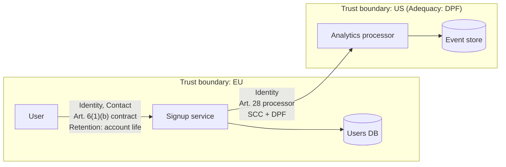
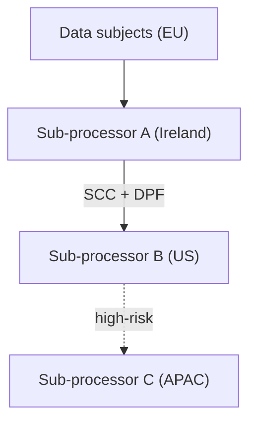

# Data Flow Diagramming (Privacy)

You produce a privacy-focused data flow diagram (DFD) for a system, product, or process. Every flow involving personal data is classified, given a legal basis, and checked against high-risk conditions (cross-border transfers, profiling, automated decisions, special-category data).

## Core rules

- **Not legal advice**: always include a disclaimer. Output structures the picture; DPIA / compliance decisions require legal review.
- **Privacy lens first**: focus on personal data. Out-of-scope data (fully anonymized, public) is labeled but not expanded.
- **Every flow classified**: every edge carrying personal data gets data category + legal basis + retention
- **High-risk flags**: mandatory flag for international transfers, automated decisions with legal/similar effect, profiling, large-scale special-category processing, children's data
- **Evidence or `[Assumed]`**: every flow traces to supplied input, or is `[Assumed]` with rationale

## Input handling

Follow shared foundation §7. Gather at minimum:

| Dimension | Required | Default |
|---|---|---|
| **System / product / process** | Yes | — |
| **Data subjects** (users, employees, patients, minors, …) | Yes | — |
| **Jurisdiction** | No | EU (GDPR) default |
| **Processors / sub-processors** | No | Inferred / `[Assumed]` |
| **Storage locations** | No | Asked |
| **Retention periods** | No | `[Assumed]` with rationale |

**Exit interview when**: system + data subjects + at least one source/sink are clear.

## Phase 1 — Setup

### 1. Collect input

- System/product/process description
- Architecture diagram / document reference
- Business case reference
- No / vague input → interview mode (§7)

### 2. Detect scope

- **System**: what is being mapped
- **Data subjects**: whose data
- **Jurisdiction**: regulatory lens (default GDPR-EU; adjust for UK GDPR, CCPA, LGPD, etc.)
- **Entities**: sources, processors, sub-processors, storage, sinks, external recipients
- **Data categories**: personal, contact, identity, financial, health, biometric, children's, location, device, behavioral, special-category (Art. 9 GDPR)

### 3. Confirm scope

```
**System**: [name]
**Data subjects**: [categories]
**Jurisdiction**: [GDPR / UK GDPR / CCPA / ...]
**Entities**: [list]
**Known storage locations**: [countries / providers]
```

Ask for confirmation. Ask render mode per `diagram-rendering` mixin and output path (default: `/documentation/[case]/data-flow-diagramming/`).

## Phase 2 — Entity inventory

Classic DFD entity types:
- **External entity** (source / sink outside the system): user, customer, third-party API
- **Process**: transforms data (e.g., "match risk score", "send email")
- **Data store**: database, file store, cache, logs
- **Trust boundary**: zone with a different security/legal posture (e.g., EU vs US, own-infra vs third-party-SaaS)

Assign IDs: `E-01` (entity), `P-01` (process), `D-01` (data store), `B-01` (boundary).

## Phase 3 — Data categories

For each data element flowing through the system:

| Category | Examples |
|---|---|
| **Identity** | Name, email, phone, user ID |
| **Contact** | Address, postal code |
| **Account** | Password hash, MFA secrets, session tokens |
| **Financial** | Payment card, IBAN, invoices |
| **Health** (special) | Medical history, diagnosis, prescriptions |
| **Biometric** (special, if ID) | Fingerprints, face scans |
| **Children's** | Anything about users <16 (or per jurisdiction) |
| **Location** | GPS, IP address, geolocation |
| **Device / technical** | IP, user agent, device fingerprint |
| **Behavioral** | Click events, dwell time, purchase history |
| **Special-category** (Art. 9) | Race, religion, politics, sexual orientation, trade union membership, genetic, health, biometric-for-ID |

Each flow carries ≥1 category. Flag special-category and children's data as high-risk.

## Phase 4 — Flow elicitation

For every flow:

| Field | Description |
|---|---|
| **From → To** | Source and destination entity IDs |
| **Data categories** | From Phase 3 |
| **Purpose** | Why this flow exists (1 sentence) |
| **Legal basis (GDPR Art. 6)** | consent / contract / legal obligation / vital interests / public task / legitimate interests |
| **Special-category basis (Art. 9)** | Required if special-category; explicit consent / employment law / vital interests / public interest / health / legal claims / public-interest research |
| **Retention** | Period + deletion mechanism |
| **Cross-border transfer?** | Yes/No; if Yes: mechanism (adequacy decision / SCCs / BCRs / derogation) |
| **Automated decision-making?** | Yes/No; if Yes: legal/similar effect? profiling? |
| **Third party?** | Processor (Art. 28) / sub-processor / joint controller / separate controller |
| **Confidence** | high / medium / low; `[Assumed]` labeled |

## Phase 5 — High-risk flag analysis

Flag each flow against high-risk conditions:

1. **International transfer** to non-adequate third country
2. **Special-category data** processing at scale
3. **Children's data**
4. **Automated decision with legal/similar effect**
5. **Large-scale profiling**
6. **Systematic monitoring** (CCTV, workplace, public areas)
7. **Innovative technology** (AI decisioning, biometric ID)
8. **Data matching / combining** across sources
9. **Processing preventing users from exercising rights or accessing a service**

Any flow matching ≥1 flag → DPIA likely required (GDPR Art. 35). State explicitly.

## Phase 6 — RoPA register

Register of Processing Activities (GDPR Art. 30 style):

| Processing activity | Data subjects | Data categories | Purpose | Legal basis | Recipients | Transfers | Retention | Security measures |
|---|---|---|---|---|---|---|---|---|
| ... | ... | ... | ... | ... | ... | ... | ... | ... |

One row per distinct processing activity (not per flow — a single activity may comprise multiple flows).

## Phase 7 — Deletion & retention check

Separate view — ensure every data category has:
- **Where it's stored** (store IDs)
- **Retention period** + trigger (e.g., "30 days after account deletion")
- **Deletion mechanism** (automated / manual / on request)
- **Orphan risk**: is there a path where data persists without retention rule?

Flag orphans (data with no retention rule) explicitly.

## Phase 8 — Diagrams

### 1. Primary — data flow diagram



Rules:
- Group entities by trust boundary (subgraph)
- Label every flow with data categories + legal basis + transfer mechanism if cross-border
- Highlight high-risk flows (e.g., `style P2 fill:#ff6b6b`)
- Keep flow labels short; full detail in the register

### 2. Cross-border transfer map (optional)



### 3. Data category heatmap (optional)

```mermaid
quadrantChart
    title Processing Risk — [System]
    x-axis Low Volume --> High Volume
    y-axis Low Sensitivity --> High Sensitivity
    quadrant-1 Routine
    quadrant-2 HIGH RISK — DPIA
    quadrant-3 Low
    quadrant-4 Sensitivity watch
    [Activity 1]: [x, y]
    [Activity 2]: [x, y]
```

## Phase 9 — Diagram rendering

Per `diagram-rendering` mixin. File names:
- `data-flow-diagram.mmd` / `.png`
- `cross-border-transfers.mmd` / `.png` (optional)
- `processing-risk-matrix.mmd` / `.png` (optional)

## Phase 10 — Report assembly and approval

```markdown
# Data Flow Diagram: [System]

**Date**: [date]
**Disclaimer**: Structured mapping. Not legal advice. DPIA / compliance determination requires qualified review.
**Jurisdiction**: [GDPR / ...]
**Data subjects**: [categories]

## Scope
[System, data subjects, entities, jurisdictions, storage]

## Entity Inventory
[IDs: external entities, processes, data stores, trust boundaries]

## Data Categories in Scope
[Per category: what data, sensitivity, special-category flag]

## Data Flow Diagram
[Primary DFD]

## Flows
[Table per flow: from/to, categories, purpose, legal basis, retention, cross-border, ADM, third party, confidence]

## High-risk Flags
[Per flow: matched flags; DPIA-required summary]

## RoPA Register
[Table per processing activity]

## Retention & Deletion
[Per category: storage, retention, trigger, deletion mechanism; orphan flags]

## Cross-border Transfers
[If any: from/to, mechanism (adequacy / SCC / BCR / derogation), risk note]
[Diagram if any]

## Recommendations
[DPIA needs, transfer-mechanism work, retention fixes, processor-contract gaps]

## Evidence & Assumptions
[`[Assumed]` items with rationale]

## Limitations
[Freshness, scope bounds, needs specialist input]
```

Present for user approval. Save only after confirmation.

## Extraction + classification rules

**Extraction (primary)**:
- Every entity and flow traceable or `[Assumed]`
- Source references preserved
- Confidence labels on inferred flows

**Classification (secondary)**:
- Data categories assigned per flow (controlled vocabulary)
- Legal basis assigned per flow (Art. 6 controlled values)
- Special-category basis required where Art. 9 data present

## Failure behavior

| Situation | Behavior |
|---|---|
| No system | Interview mode (§7) |
| No data subjects defined | Ask; common categories (users / employees / end-customers) proposed |
| Architecture unknown | Produce high-level DFD with `[Assumed]` entities; recommend architectural review |
| Processing activity not identifiable | Flag as "undetermined purpose" — cannot assign legal basis without purpose |
| Special-category data present but no Art. 9 basis | Flag explicitly — do NOT infer a basis that isn't supplied |
| Cross-border transfer without mechanism | Flag as non-compliant-pending-mechanism |
| mmdc failure | See `diagram-rendering` mixin |
| Out-of-scope ("write our privacy policy") | "This skill maps data flows. For policy drafting, that's out of scope." |

## Self-check

```
[] Disclaimer present
[] Scope (system, subjects, jurisdiction) stated
[] Entities inventoried with IDs
[] Every flow has categories, purpose, legal basis
[] Special-category data has Art. 9 basis
[] Cross-border transfers have mechanism labeled
[] High-risk flags applied per flow
[] DPIA-required summary present
[] RoPA register built per processing activity
[] Retention + deletion per data category
[] Orphan data flagged
[] Confidence or `[Assumed]` labels present
[] All Mermaid diagrams render valid syntax
[] Primary DFD groups by trust boundary
[] No fabricated regulations, citations, or transfer mechanisms
[] Recommendations include DPIA needs and gap-closures
[] Report follows output contract
```
