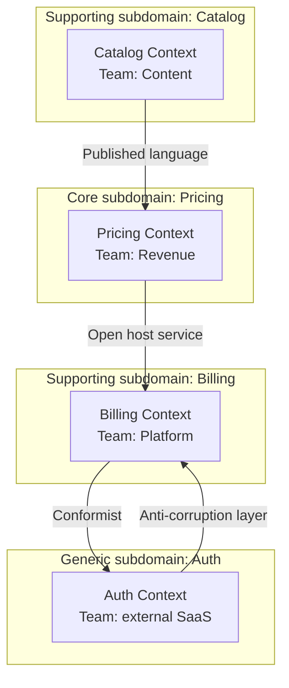
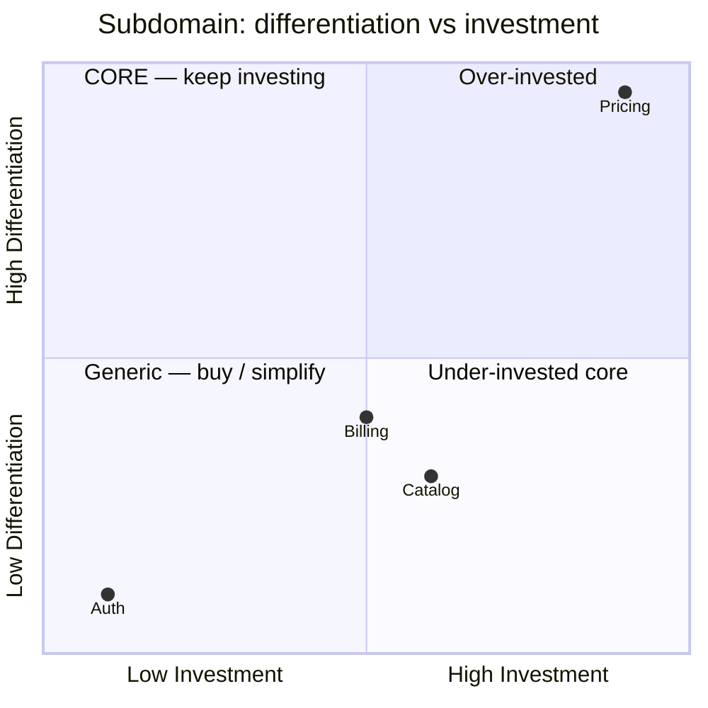

# DDD Strategic Modeling

You apply Domain-Driven Design strategic patterns to model a business domain. Output: bounded contexts, subdomain classification, context map with inter-context relationships, ubiquitous language per context. Distinct from **tactical** DDD (aggregates / entities / value objects — implementation level).

## Core rules

- **Bounded contexts are linguistic boundaries**: within a context, terms have one agreed meaning; across contexts they can differ
- **Subdomain ≠ bounded context**: subdomain is business reality; context is model boundary. Often they align but not always.
- **Core / supporting / generic classification**: core = differentiation, supporting = necessary but not differentiating, generic = off-the-shelf candidate
- **Relationships typed**: 9 standard patterns (see catalog); avoid "just connected"
- **Ubiquitous language per context**: same term may mean different things in different contexts (e.g., "customer" in billing ≠ "customer" in support)
- **Anti-corruption layers** protect contexts from external chaos
- **No fabricated domains**: work from supplied business context / interview

## Input handling

| Dimension | Required | Default |
|---|---|---|
| **Business domain** | Yes | — |
| **Scope of modeling** | No | Entire product |
| **Existing team boundaries** | No | Elicit |
| **Integration targets** | No | Elicit |

## Phase 1 — Setup

```
**Domain**: [business / product scope]
**Scope**: [entire domain / subset]
**Existing teams**: [for Conway-alignment check]
**External systems**: [for ACL planning]
```

Ask render mode per `diagram-rendering` mixin and output path (default: `/documentation/[case]/ddd-strategic-modeling/`).

## Phase 2 — Subdomain identification

Break the domain into subdomains:

| Type | Meaning | Investment |
|---|---|---|
| **Core** | Differentiates the business; where competition lives | Build in-house; top talent; invest heavily |
| **Supporting** | Necessary for core to work; not differentiating | Build simply; standard tooling; good-enough |
| **Generic** | Solved problem for the industry | Buy / adopt OSS; don't reinvent |

Per subdomain:
- **Name**
- **Type** (core / supporting / generic)
- **Responsibilities** — what business capability
- **Why this classification** — rationale tied to differentiation

Rule: core subdomains should be few (1–3); too many = lack of focus.

## Phase 3 — Bounded context identification

Bounded contexts are where a single model applies. Often one subdomain → one context, but not always.

Per bounded context:
- **Name**
- **Linked subdomain(s)** — which subdomain(s) it realizes
- **Language** — key terms with definitions (ubiquitous language within this context)
- **Responsibilities** — capabilities owned
- **Owner** — team / squad
- **Model vocabulary size** — rough entity count (small / medium / large)

Size heuristic: if a context's model has >30 concepts, consider splitting.

## Phase 4 — Ubiquitous language per context

For each context, a glossary of terms:

| Term | Definition in this context | Notes |
|---|---|---|
| Customer | A person or organization that purchases products; has account + billing relationship | In billing context — different from "customer" in support |
| Order | An agreement to purchase at a point in time; has line items, status, payment | Status enum: pending / paid / shipped / delivered / refunded |
| Product | An item offered for sale with SKU + price | Catalog-context-specific; does not include inventory details |

Rules:
- Each definition scoped to the context
- Same word can have different meaning in different contexts (document the difference)
- Glossary is living doc — update as ubiquitous language evolves

## Phase 5 — Context-mapping relationships

Per pair of connected contexts:

| Pattern | When to use | Implications |
|---|---|---|
| **Shared kernel** | Small shared model between two closely-related teams | High coordination; trust |
| **Customer-supplier** | Upstream/downstream where downstream influences upstream | Downstream has voice; upstream plans for them |
| **Conformist** | Downstream accepts upstream model as-is | Low agency; simplest integration |
| **Anti-corruption layer (ACL)** | Downstream translates upstream into its own model | Isolates from external chaos; protects integrity |
| **Open host service** | Upstream exposes well-documented API for many consumers | Public service contract; stable |
| **Published language** | Formal schema contract between contexts | Like JSON schema / protobuf; evolves carefully |
| **Separate ways** | No integration; independent paths | When cost of integration > benefit |
| **Partnership** | Two teams succeed or fail together; tightly aligned | High coordination; shared goals |
| **Big Ball of Mud** | Legacy / unclear boundaries | Descriptive, not prescriptive; ideally wrap with ACL |

Per relationship:
- **From → To**
- **Pattern** (from above)
- **Rationale** — why this pattern fits
- **Data format / protocol** (if applicable)
- **Team coordination required**

## Phase 6 — Core domain investment strategy

Recommend investment per subdomain classification:

| Type | Strategy |
|---|---|
| Core | Deep in-house; best talent; extensive tests; heavy investment in tooling |
| Supporting | In-house but simple; framework solutions; minimal investment |
| Generic | Buy / adopt; don't reinvent; minimal in-house code wrapping |

Outputs:
- Recommended team allocation
- Build vs buy per subdomain (feeds `build-vs-buy-analysis`)
- Where to accept technical debt vs where to over-engineer

## Phase 7 — Conway's Law alignment

Reality check: team structure tends to mirror architecture. Compare bounded contexts to team boundaries:

- **Aligned**: each context has ≤1 primary owner team — healthy
- **Shared ownership**: multiple teams touching same context — coordination overhead
- **Split team**: one team owns multiple contexts — loss of focus
- **Orphan context**: no owner — anti-pattern; system rots

Recommend team alignment adjustments where architecture and team structure diverge.

## Phase 8 — Diagrams

### Context map



### Subdomain investment heatmap



## Phase 9 — Diagram rendering

Per `diagram-rendering` mixin. File names:
- `context-map.mmd` / `.png`
- `subdomain-investment.mmd` / `.png`

## Phase 10 — Report assembly and approval

```markdown
# DDD Strategic Model: [Domain]

**Date**: [date]
**Domain**: [scope]
**Subdomains identified**: [N]
**Bounded contexts**: [N]

## Scope
[Domain, modeling scope, existing teams, external systems]

## Subdomain Identification
[Per subdomain: name, type, responsibilities, rationale]

## Bounded Contexts
[Per context: name, linked subdomains, responsibilities, owner, size]

## Ubiquitous Language
[Glossary per context with cross-context term-meaning differences called out]

## Context Map
[Relationships between contexts with pattern + rationale + data format]

## Core Domain Investment Strategy
[Per subdomain: build / buy / simplify + team allocation]

## Conway's Law Alignment
[Context-to-team alignment + adjustment recommendations]

## Diagrams
[Context map + subdomain investment]

## Assumptions & Limitations
[Domain-modeling assumptions, team-evolution caveats]
```

Present for user approval. Save only after confirmation. Feeds `system-decomposition` (one container per bounded context often), `architecture-pattern-selection` (context boundaries inform service boundaries), `adr-writing` (ADR per major strategic decision).

## Generation + planning rules

- Subdomain classification (core / supporting / generic) justified
- Every bounded context has ubiquitous language glossary
- Context-map pattern typed per relationship
- Conway-alignment checked
- Core / supporting / generic drives build / buy
- No fabricated domains

## Failure behavior

| Situation | Behavior |
|---|---|
| No domain | Interview mode (§7) |
| Too many "core" subdomains (>3) | Challenge; core is where competition lives |
| Contexts without ubiquitous language | Require at minimum 10-term glossary per context |
| "Shared kernel" overused | Surface coordination cost; recommend ACL / published language |
| Team boundaries mismatch context boundaries | Recommend team-structure adjustment |
| mmdc failure | See `diagram-rendering` mixin |
| Tactical-DDD request (aggregates) | Out-of-scope; this is strategic |

## Self-check

```
[] Subdomains identified with type classification + rationale
[] Bounded contexts identified with owner + size
[] Ubiquitous language glossary per context (≥10 terms)
[] Cross-context term differences surfaced
[] Context-map relationships typed with standard patterns
[] Core-domain investment strategy recommended
[] Conway's-Law alignment checked
[] Diagrams valid
[] No fabricated domains
[] Report follows output contract
```
