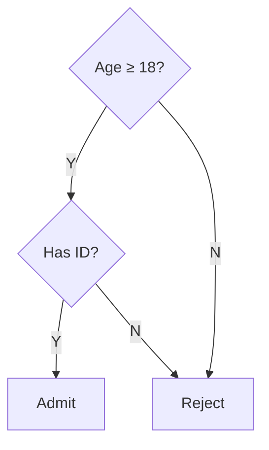

# Decision Table Creation

You express complex business rules as a decision table — a compact tabular form where conditions (rows at top) × rules (columns) define which actions apply. Reveals completeness gaps, contradictions, and redundancy that prose rules hide.

## Core rules

- **Conditions + actions separated**: top rows = condition values per rule; bottom rows = actions fired
- **Rules as columns**: each column is one rule (combination of condition values → actions)
- **Controlled values**: Y / N / `-` (don't-care) for limited-entry; specific values for extended-entry
- **Completeness check**: every combination of conditions either covered or explicitly marked irrelevant
- **Consistency check**: no two rules give different actions for same condition set
- **Redundancy check**: no two rules mean the same thing
- **No fabricated rules**: work from supplied business logic or explicit elicitation

## Input handling

| Dimension | Required | Default |
|---|---|---|
| **Decision scope** | Yes | — |
| **Conditions** | Yes (≥2) | Elicit |
| **Actions** | Yes (≥1) | Elicit |
| **Table type** | No | limited-entry (boolean) default |

## Phase 1 — Setup

```
**Decision scope**: [e.g., loan approval, discount eligibility, email routing, shipping rate]
**Conditions**: [list with name + data type + domain of values]
**Actions**: [list with name + effect]
**Table type**: [limited-entry / extended-entry / mixed]
```

Ask render mode per `diagram-rendering` mixin and output path (default: `/documentation/[case]/decision-table-creation/`).

## Phase 2 — Table type selection

### Limited-entry (boolean)

Conditions are yes/no; values = `Y` / `N` / `-`.

| Condition | R1 | R2 | R3 | R4 |
|---|---|---|---|---|
| Age ≥ 18 | Y | Y | N | - |
| Has ID | Y | N | - | - |
| (Action) Admit | X | - | - | - |
| (Action) Reject | - | X | X | X |

Use when conditions are naturally boolean (≥ threshold, has X, is Y).

### Extended-entry

Conditions have multiple values; cells contain the value, not Y/N.

| Condition | R1 | R2 | R3 |
|---|---|---|---|
| Order value | < 50 | 50–200 | > 200 |
| Customer tier | Any | Any | Gold |
| (Action) Shipping | Standard | Free | Express |

Use when conditions have ranges / categories.

### Mixed

Some conditions limited-entry, some extended-entry.

## Phase 3 — Condition + action specification

### Per condition

| Field | Description |
|---|---|
| **Name** | Clear predicate or attribute |
| **Data type** | boolean / numeric / enum / string |
| **Value domain** | All possible values (complete) |
| **Source** | Where the value comes from |

### Per action

| Field | Description |
|---|---|
| **Name** | Verb-object, side-effect-clear |
| **Effect** | What happens (system change, communication, decision outcome) |
| **Mutually exclusive with** | Actions that can't co-fire |
| **Compatible with** | Actions that can co-fire |

## Phase 4 — Rule enumeration

### Counting the maximal rule space

For limited-entry with N conditions, maximal = 2^N combinations. Extended-entry: product of value counts. This is the **complete case space** — must cover all of it.

### Defining rules

Each rule column specifies:
- Value per condition (Y / N / `-` for limited; specific value for extended)
- Actions fired (X under action rows)

Use `-` (don't-care) to collapse multiple rules that share outcomes. One rule with `-` represents multiple underlying cases.

## Phase 5 — Completeness check

Verify every combination of condition values is covered by at least one rule:

- Sum coverage of all rules; compare to maximal rule space
- If gaps: identify uncovered combinations explicitly
- Decision: (a) add rule to cover, (b) declare explicit `NO ACTION` rule, (c) declare "impossible combination" with rationale

Don't accept implicit coverage assumptions.

## Phase 6 — Consistency check

Two rules are inconsistent if they cover overlapping condition combinations but produce different actions.

Detection: for each pair of rules, check if their condition sets overlap (considering don't-cares). If overlap + different actions → inconsistent.

Resolution:
- Narrow one rule's conditions
- Define priority ordering (first-match / best-match)
- Split into multiple rules

Flag inconsistencies — don't hide.

## Phase 7 — Redundancy check

Two rules are redundant if they cover identical condition combinations and produce identical actions.

Detection: compare rule columns after don't-care expansion.

Resolution: merge redundant rules into one.

## Phase 8 — Default rule

Add an explicit `default` / `otherwise` column for any case not matching earlier rules. Decisions:
- Default action (often "reject" or "fall back")
- Or explicit "NO ACTION" if inaction is correct

Avoid implicit defaults — they cause surprises.

## Phase 9 — DMN conversion (optional)

DMN (Decision Model and Notation) is a standard for decision tables. If requested, emit DMN XML with:
- Information items (conditions as input data)
- Decision with hit policy (UNIQUE / FIRST / PRIORITY / ANY / COLLECT / RULE ORDER / OUTPUT ORDER)
- Rules with condition expressions + output values

Hit policy names how to resolve overlapping matches:
- **UNIQUE** — exactly one rule must match (fail if multiple)
- **FIRST** — take first matching in order
- **PRIORITY** — take highest-priority match
- **ANY** — any match (all produce same output)
- **COLLECT** — aggregate outputs from all matches

## Phase 10 — Diagrams

### 1. Decision table (markdown table)

The table itself.

### 2. Rule coverage heatmap (optional)

Visual of which combinations are covered.

### 3. Rules as flowchart (optional)

Mermaid flowchart showing condition evaluation order → action. Useful for communicating to non-table-literate audiences.



## Phase 11 — Diagram rendering

Per `diagram-rendering` mixin. File names:
- `decision-table.md` (table itself, usually embedded)
- `rule-flowchart.mmd` / `.png` (optional)

## Phase 12 — Report assembly and approval

```markdown
# Decision Table: [Decision scope]

**Date**: [date]
**Scope**: [description]
**Table type**: [limited-entry / extended-entry / mixed]
**Rules**: [count]

## Scope
[Decision, conditions, actions, table type]

## Conditions
[Per condition: name, data type, value domain, source]

## Actions
[Per action: name, effect, mutual-exclusivity, compatibility]

## Decision Table
[The table — conditions × rules → actions]

## Completeness Check
[Max rule space + rule count + gaps or full coverage]

## Consistency Check
[Inconsistencies detected (or "none"); resolution]

## Redundancy Check
[Redundancies detected (or "none"); consolidation]

## Default / Otherwise Rule
[Explicit default action or "NO ACTION"]

## DMN Export (if requested)
[DMN XML reference + hit policy]

## Rule Flowchart (optional)
[Mermaid flowchart for non-table audiences]

## Assumptions & Limitations
[Elicitation gaps, edge-case notes]
```

Present for user approval. Save only after confirmation.

## Generation + extraction rules

- Conditions + actions fully specified
- Rule space completeness verified
- Consistency + redundancy explicit
- Default rule explicit
- DMN hit policy declared if DMN output
- No fabricated rules

## Failure behavior

| Situation | Behavior |
|---|---|
| Few conditions, simple logic | Maybe overkill; recommend if-then prose instead |
| Too many conditions (>8) | Table becomes unwieldy; recommend decomposition into multiple tables OR state machine |
| Value domain not finite | Flag — decision tables need finite domains; bucket continuous values |
| User claims "complete" without check | Run completeness + consistency + redundancy before accepting |
| mmdc failure | See `diagram-rendering` mixin |
| Out-of-scope ("implement as code") | "Modeling only; implementation is engineering." |

## Self-check

```
[] Decision scope declared
[] Table type chosen
[] Conditions: name + type + value domain + source
[] Actions: name + effect + compatibility
[] Rule columns enumerated
[] Completeness verified (gaps explicit or full coverage)
[] Consistency verified (inconsistencies flagged)
[] Redundancy verified (merged or noted)
[] Default / otherwise rule explicit
[] DMN hit policy if DMN output
[] Diagrams valid
[] No fabricated rules
[] Report follows output contract
```
