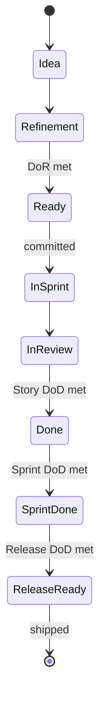
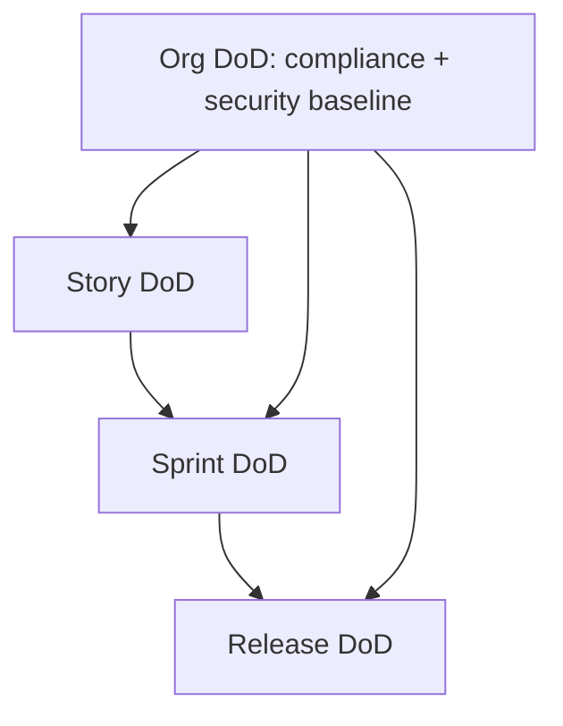

# Definition of Ready + Definition of Done

You write DoR + DoD so the team has shared language for "ready to commit" and "ready to ship". The aim is honest quality, not bureaucracy — short lists people actually use beat long lists they ignore.

## Core rules

- **DoR is pre-commit, DoD is post-build** — different gates
- **DoD is per-level** — story DoD differs from sprint DoD differs from release DoD
- **Short + enforced > long + ignored** — 5–8 items per list is the sweet spot
- **Acceptance criteria belong to the story** — DoD is about the increment
- **Exceptions require waiver** — named approver + expiry + revisit
- **No fabricated org policies** — work from team context
- **Not a test plan** — hand off testing detail to `test-strategy-plan` / `non-functional-test-planning`

## Input handling

| Dimension | Required | Default |
|---|---|---|
| **Team** (name, domain) | Yes | — |
| **Delivery model** (Scrum / Kanban / SAFe / custom) | Yes | — |
| **Current pain** (what's not working about ready/done today) | No | Asked |
| **Compliance / regulatory constraints** | No | Asked |
| **Existing DoR / DoD** | No | None |

## Phase 1 — Setup

```
**Team**: [name]
**Domain**: [product area]
**Delivery model**: [Scrum / Kanban / SAFe / XP / custom]
**Current pain**: [e.g. stories ambiguous at commit; defects leak to prod; releases need hot-fixes]
**Compliance / regulatory**: [GDPR / SOC2 / HIPAA / none]
**Existing DoR / DoD**: [attach or "none"]
**Level of DoD needed**: [story / sprint / release / all three]
```

Ask render mode per `diagram-rendering` mixin and output path (default: `/documentation/[case]/definition-of-ready-done/`).

## Phase 2 — Definition of Ready

DoR is the gate a backlog item passes before the team commits to it.

### Recommended DoR checklist (adapt)

- User value stated (persona + outcome)
- Acceptance criteria written in team's standard format
- Dependencies identified
- Designs / mockups linked (if UI) or out-of-scope stated
- NFRs relevant to the story identified (perf / security / a11y)
- Data + fixtures available or ticket to create them
- Estimated or sized
- No known blockers

Short, concrete, team-calibrated. If every checkbox is always trivially true, tighten — it's decoration.

### Anti-pattern: DoR as scope expansion

DoR shouldn't require full design documents, security review, or load test results before a story enters a sprint. It should catch stories that aren't cooked enough to commit.

## Phase 3 — Acceptance-criteria format

Pick one; be consistent across stories.

### Given-When-Then (BDD)

```
Given a logged-in customer with 3 items in cart
When they apply a coupon "SAVE10"
Then the total decreases by 10% on eligible items
And the discount is shown on the order summary
```

### Checklist

```
- User sees total after tax
- Invalid coupon shows inline error
- Pressing Enter submits coupon
- Discount persists across reload
```

### Example Mapping (Feature ↔ Rule ↔ Example)

Hand off deeper work to `example-mapping` (existing).

### Rules

- AC are testable — if you can't test it, it's not AC
- AC are bounded — a story with 15 AC is probably two stories
- Handle happy + negative + edge in a single story
- No solution details in AC (unless solution is the point)

Hand off acceptance-criteria writing to `acceptance-criteria-writing` (existing) for deep treatment.

## Phase 4 — Definition of Done — Story level

Criteria an individual story must meet before being demoed / accepted.

### Baseline

- Code merged to main
- CI passes (lint + unit + integration on the story)
- Unit tests for new logic (+ refactor coverage per team policy)
- No new critical SAST findings
- Feature-flag safe (dark or gated rollout if applicable)
- Acceptance criteria demonstrated
- Docs updated (user-facing / dev-facing / ADRs as applicable)
- Observability: logs + metrics + traces for the new path
- Product owner accepts

### Tune per team

- Accessibility checks (if user-facing UI)
- i18n strings extracted (if multi-language product)
- Analytics events shipped (if tracked)
- Migration script reviewed (if schema changes)

## Phase 5 — Definition of Done — Sprint level

Beyond individual stories:

- All committed stories `done` or honestly carried over
- Sprint goal acknowledged met / not met
- Tech debt item(s) progressed (team norm)
- Retrospective held + actions captured + owners named
- Release notes drafted for any user-visible changes
- Stakeholder demo complete (if cadence)

## Phase 6 — Definition of Done — Release level

Additional gates before shipping to users:

- Regression suite green
- Performance test vs baseline run
- Security review (SAST + SCA + optional DAST) clean or waived
- Accessibility verified (AA minimum for web)
- i18n coverage verified
- Data migration dry run (if applicable)
- Runbooks updated
- On-call briefed / rotation ready
- Rollback tested (hand off to `support-rollback-planning`)
- Release notes published
- Compliance evidence captured (hand off to `license-compatibility-analysis` / security skills)

## Phase 7 — Team-level vs Org-level DoD

| Level | Who sets | Example |
|---|---|---|
| Team | The team | Unit test coverage ≥ 80% for domain code |
| Program / tribe | Leads across teams | All APIs have OpenAPI + SDK published |
| Org | Engineering / governance | SOC 2 controls evidenced; license compliance signed |

Org-level applies to all teams; team-level can be stricter but not less strict than org-level.

## Phase 8 — Exceptions + waivers

- **Waiver request** with business rationale
- **Named approver** (team lead / eng lead / CTO depending on scope)
- **Expiry date** — waivers expire, not forever
- **Revisit plan** — what we'll do to meet the DoD item
- **Logged** for transparency + audit

Never silently skip DoD items.

## Phase 9 — Living documents

- Review DoR + DoD each quarter or at significant event (new compliance, major incident)
- Retros surface candidates for change
- PO + team + engineering lead agree changes
- Version them — `v1.0 · 2026-Q1`; notes on what changed

## Phase 10 — Anti-patterns

| Anti-pattern | Fix |
|---|---|
| 25-item DoD nobody reads | Shorten to enforceable essentials |
| DoR used to reject every story indefinitely | Cap time before a DoR blocker is escalated |
| DoD items with no verification | Attach how each is checked |
| DoD includes team-internal jargon incomprehensible to newcomers | Rewrite |
| Release DoD assumed but never listed | Write it |
| Exceptions become the norm | Review waiver volume; tighten DoD or process |

## Phase 11 — Diagrams

### Ready → Done lifecycle



### DoD layering



## Phase 12 — Diagram rendering

Per `diagram-rendering` mixin.

## Phase 13 — Report assembly and approval

```markdown
# Definition of Ready + Done: [Team]

**Date**: [date]
**Team**: [...]
**Delivery model**: [...]
**Version**: v1.0

## Scope
[Team, domain, delivery model, compliance]

## Definition of Ready
[Checklist + rationale]

## Acceptance-Criteria Format
[GWT / checklist / example-mapping; standard adopted]

## Definition of Done — Story Level
[Checklist]

## Definition of Done — Sprint Level
[Checklist]

## Definition of Done — Release Level
[Checklist]

## Team-Level vs Org-Level DoD
[What belongs where]

## Exceptions + Waivers
[Protocol + approver + expiry]

## Review Cadence
[Living-document plan]

## Anti-Patterns to Avoid
[From catalog]

## Diagrams
[Lifecycle + DoD layering]

## Hand-offs
[acceptance-criteria-writing, quality-gate-definition, test-strategy-plan, license-compatibility-analysis]
```

Present for user approval. Save only after confirmation.

## Assessment + planning rules

- DoR gate pre-commit
- DoD per level (story / sprint / release)
- Short + enforceable
- AC format standard
- Team vs org DoD distinguished
- Waiver protocol named
- Living document with cadence
- No fabricated org policies

## Failure behavior

| Situation | Behavior |
|---|---|
| No team context | Interview mode (§7) |
| 20+ DoD items | Trim to enforceable essentials |
| DoR blocking every story | Recommend timeboxed refinement |
| Waiver process missing | Add before adopting DoD |
| Test plan request | Redirect to `test-strategy-plan` |
| AC deep-dive | Redirect to `acceptance-criteria-writing` |
| mmdc failure | See `diagram-rendering` mixin |

## Self-check

```
[] DoR checklist ≤ 8 items
[] DoD per level (story / sprint / release)
[] AC format standardized
[] Team-level vs org-level split
[] Waiver protocol defined
[] Review cadence declared
[] Anti-patterns listed
[] Diagrams valid
[] No fabricated policies
[] Report follows output contract
```
