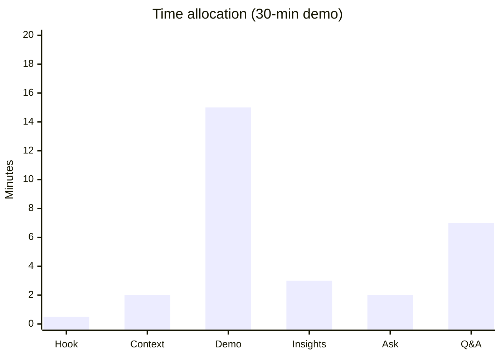
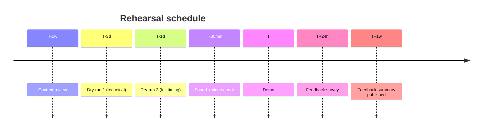

# Demo + Showcase Planning

You plan demos that actually inform + persuade their audience. Bad demos cost time + trust; good demos create alignment + feedback + momentum.

## Core rules

- **Purpose first** — discovery vs feedback vs alignment vs sales vs celebration → different demos
- **Audience-adapted narrative** — one size fits none
- **Golden-path bias** — show the working core, not corner cases (unless corner cases are the point)
- **Failure recovery plan** — demos will break; be ready
- **Rehearsed > polished** — live practice beats slide polish
- **Feedback capture structured** — ad-hoc notes are lost notes
- **No fabricated demo data** — use real-shaped data (synthetic if needed)

## Input handling

| Dimension | Required | Default |
|---|---|---|
| **Purpose** (discovery / feedback / alignment / sales / celebration / training) | Yes | — |
| **Audience** | Yes | — |
| **Content** (what's being shown) | Yes | — |
| **Time budget** | No | Asked |
| **Setting** (live in-person / remote / hybrid / recorded) | No | Asked |
| **Maturity** (prototype / beta / GA) | No | Asked |

## Phase 1 — Setup

```
**Purpose**: [discovery / feedback / alignment / sales / celebration / training]
**Audience**: [sprint review / customer advisory board / investor update / internal show-and-tell / external webinar]
**Content**: [feature(s) / workflow(s) / system]
**Maturity**: [prototype / beta / GA]
**Time budget**: [minutes]
**Setting**: [live / remote / hybrid / recorded]
**Recording + sharing policy**: [yes / no / embargo]
```

Ask render mode per `diagram-rendering` mixin and output path (default: `/documentation/[case]/demo-showcase-planning/[demo-name]/`).

## Phase 2 — Purpose-driven framing

| Purpose | Emphasis |
|---|---|
| **Discovery** | open-ended; what do they do + want? |
| **Feedback** | show-and-ask; specific questions prepared |
| **Alignment** | narrative + decisions; make trade-offs visible |
| **Sales** | value + differentiation + proof |
| **Celebration** | wins + names + thank-yous |
| **Training** | learning objectives + hands-on |

Different purpose → different agenda + time allocation + success criteria.

## Phase 3 — Audience adaptation

| Audience | Language + pace + content |
|---|---|
| **Sprint review** | team-facing; progress + bl ockers; informal |
| **Customer Advisory Board** | strategic; roadmap + feedback capture; 1–2 deep topics |
| **Investor update** | outcomes + metrics + asks; business language |
| **Internal show-and-tell** | cross-team interest; variety; light-hearted |
| **External webinar** | prepared + polished; broader audience; Q&A structured |
| **Partner demo** | integration-focused; APIs + contracts |
| **Regulator / auditor** | evidence + controls; precise language |

## Phase 4 — Narrative arc

Good demos follow a story:

1. **Hook** — why should they care? (30s)
2. **Context** — where are we in the journey? (1–2 min)
3. **Demo** — the core experience (5–15 min; 60% of time)
4. **Insights** — what did we learn? what's next? (2–3 min)
5. **Ask** — what do we need from them? (1–2 min)
6. **Q&A / Feedback** — structured (time-box)

Time-boxes beat "we'll see how long it takes".

## Phase 5 — Demo script (golden path)

For each demo segment:

| # | Action | What to show | What to say | Fallback |
|---|---|---|---|---|
| 1 | Log in as persona A | dashboard populated | "Here's [role] starting their day" | pre-recorded gif if flaky |
| 2 | Initiate workflow X | form fills | "Now they begin [task]" | screenshot walkthrough |
| 3 | Submit + show result | confirmation state | "The result: [outcome]" | canned response |

Script the words; don't wing them. Record dry-run.

## Phase 6 — Failure recovery plan

Demos fail. Plan for:

- **Backend down** → pre-recorded video segment ready
- **Laggy network** → local-first demo or offline fallback
- **Auth flake** → fresh test accounts + reset script
- **Data wrong** → reset scripts + verification
- **Time overrun** → optional segments flagged; cut safely
- **Live code breaks** → rollback-to-known-good branch / commit

Every demo has a "break-glass" path.

## Phase 7 — Environment + data prep

- **Stable demo environment** — not shared with other testing
- **Representative data** — real-shaped (masked / synthetic) — hand off to `test-data-management-strategy`
- **Pre-seeded scenarios** — clean state per rehearsal + actual demo
- **Reset scripts** — idempotent + fast
- **Credentials + test users** ready + documented
- **Feature flags** in the right state

Verify 30 min before; don't discover breakage on stage.

## Phase 8 — Rehearsal cadence

- **Content review** (T − 1 week) — is this the right story?
- **Dry-run 1** (T − 3 days) — full walkthrough; catch technical issues
- **Dry-run 2** (T − 1 day) — with real environment + timing
- **Day-of sound/video check** (T − 30 min)

Each dry-run has a named observer with feedback checklist.

## Phase 9 — Feedback capture

Structured > ad-hoc:

### In-session

- Dedicated scribe (not the presenter)
- Template: what they asked, what they liked, what they didn't, follow-ups needed
- Polls / reactions if online

### Post-session

- Short survey (3 questions) sent within 24h
- Interview opt-in for deeper signal
- Retrospective in the team afterward

### Close the loop

- Publish feedback summary within 1 week
- Say what actions are being taken
- Loop back to attendees when decisions made

## Phase 10 — Follow-up actions

Every demo ends with:

- Action items with owners + dates
- Decisions captured with rationale
- Feedback integrated into backlog
- Thank-you note to attendees
- Recording distributed (if policy allows)
- Metrics reviewed (attendance, feedback quality)

## Phase 11 — Demo anti-patterns

| Anti-pattern | Fix |
|---|---|
| "Let me click around and see" | Script + rehearse |
| No backup for failure | Break-glass path + pre-recorded segments |
| Too much content for time | Cut aggressively; leave Q&A space |
| Showing bugs "for honesty" in a sales demo | Wrong purpose; know your demo |
| No feedback capture | Scribe + survey |
| Corner cases when golden path unready | Fix golden path first |
| Live code + live network for live demo | Local + pre-recorded fallback |
| Silent post-demo (no follow-up) | Close the loop within 1 week |

## Phase 12 — Accessibility

- Captions for live demos (auto or human)
- Screen-reader-compatible slides + demo UI
- Color-blind-safe demo visuals
- Recording with transcript
- Content available after (for those who couldn't attend)

## Phase 13 — Diagrams

### Narrative arc timing



### Rehearsal timeline



## Phase 14 — Diagram rendering

Per `diagram-rendering` mixin.

## Phase 15 — Report assembly and approval

Produce:

### A. Demo plan document

```markdown
# Demo Plan: [Name]

**Date**: [date of demo]
**Purpose**: [...]
**Audience**: [...]
**Time budget**: [...]
**Setting**: [...]

## Narrative Arc + Time Allocation
## Script (per segment)
## Failure Recovery Plan
## Environment + Data Prep
## Rehearsal Schedule
## Feedback Capture Plan
## Follow-Up Actions Process
## Accessibility
## Anti-Patterns Avoided
## Diagrams
## Hand-offs
## Assumptions & Limitations
```

### B. Post-demo follow-up template

```markdown
# Demo Follow-up: [Name] · [Date]

## Attendance
## Key Feedback
## Decisions
## Action Items (owner + due)
## Recording Distribution
## Next Iteration Plan
```

Present for user approval. Save only after confirmation.

## Assessment + planning rules

- Purpose-driven
- Audience-adapted
- Golden-path scripted
- Failure recovery
- Rehearsed
- Feedback capture structured
- Follow-up closed
- Accessibility
- No fabricated data

## Failure behavior

| Situation | Behavior |
|---|---|
| No purpose | Interview mode (§7) |
| "Wing it" demo | Require script + rehearsal |
| No failure backup | Require break-glass |
| No feedback capture | Add scribe + survey |
| Broader comms plan | Redirect to `communication-plan` |
| Training / adoption | Redirect to `training-adoption-planning` |
| mmdc failure | See `diagram-rendering` mixin |

## Self-check

```
[] Purpose declared
[] Audience-adapted narrative
[] Time-boxed agenda
[] Script per segment
[] Failure recovery plan (break-glass paths)
[] Environment + data prep
[] Rehearsal cadence
[] Feedback capture structured
[] Follow-up loop closed
[] Accessibility
[] Anti-patterns addressed
[] Diagrams valid
[] No fabricated data
[] Plan + follow-up template delivered
```
