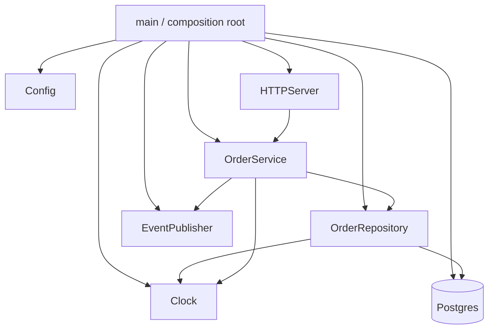

# Dependency Injection Planning

You plan how a service wires its dependencies — so code is testable, lifetimes are clear, and the composition root is unambiguous.

## Core rules

- **Constructor injection is the default** — explicit dependencies, easy tests
- **One composition root per process** — top of `main` / entrypoint; nowhere else
- **Domain code is framework-free** — no `@Inject` in pure domain; adapters only
- **Lifetimes are deliberate** — document scopes for every dep
- **Avoid service locator** — hidden deps; hard tests
- **Ports + adapters enable substitution** — test doubles replace adapters at the root
- **Deterministic ports for side-effects** — Clock, RNG, IdGen injected as ports
- **No fabricated dependencies** — work from supplied structure

## Input handling

| Dimension | Required | Default |
|---|---|---|
| **Service / module** | Yes | — |
| **Language + framework** | Yes | — |
| **Existing DI approach** (if any) | No | Asked |
| **Layered vs ports-adapters** | No | Asked |
| **Multi-tenant / per-request scoping** | No | Asked |

## Phase 1 — Setup

```
**Service**: [name]
**Language**: [Go / Kotlin / Java / Python / TypeScript / C# / Rust]
**Framework**: [Spring / NestJS / FastAPI / .NET / Dagger / none]
**Existing approach**: [constructor-pure / container-based / service-locator / mixed]
**Architecture**: [ports-adapters / layered / modular monolith / ...]
**Scoping needs**: [per-request / per-tenant / singleton-only]
```

Ask render mode per `diagram-rendering` mixin and output path (default: `/documentation/[case]/dependency-injection-planning/[service]/`).

## Phase 2 — Injection styles

| Style | When |
|---|---|
| **Constructor** | Default; dependencies required for the object to function |
| **Setter / property** | Optional deps, or when framework demands (e.g., property injection in .NET MVC controllers) |
| **Method parameter** | Per-call context (e.g., user / tenant) — avoid passing through graph |
| **Ambient / context** | For cross-cutting concerns (logger, tracer) with care; prefer explicit |

Avoid:
- Hidden service locators (`ServiceLocator.get<Foo>()` from anywhere)
- Global singletons accessed statically
- Property injection on required deps (hides what's needed)

## Phase 3 — Composition root

- **Single location** where the object graph is built
- Typical: `main()` / `Program.cs` / `app.module.ts` / `bootstrap()`
- Reads config, creates adapters, wires services, starts lifecycle
- Nothing below the root imports the DI container

Example (pure Go):

```go
func main() {
    cfg := config.MustLoad()
    clock := clock.System{}
    db := postgres.MustConnect(cfg.DatabaseURL)
    orderRepo := postgres.NewOrderRepository(db, clock)
    publisher := kafka.NewPublisher(cfg.KafkaBrokers)
    orderSvc := orders.NewService(orderRepo, publisher, clock)
    http := api.NewServer(orderSvc)
    lifecycle.Run(http)
}
```

Example (NestJS):

```typescript
@Module({
  imports: [ConfigModule, PersistenceModule, MessagingModule],
  providers: [OrderService],
  controllers: [OrderController],
})
export class OrderModule {}
```

## Phase 4 — Lifetimes + scopes

| Lifetime | Meaning |
|---|---|
| **Singleton** | One instance per process; state shared |
| **Scoped / per-request** | One per HTTP request / unit of work |
| **Transient** | New instance per resolution |
| **Per-tenant** | One per tenant (usually via factory + cache keyed on tenant) |
| **Per-conversation** | Agentic / long-running session |

Rules:
- Dependencies of a singleton must themselves be safe as singletons (thread-safe)
- A singleton holding a scoped dependency is a leak — use factory / provider
- DBs: connection pool is singleton; transaction is scoped
- HTTP clients: usually singleton with keepalive; tune per runtime

## Phase 5 — Framework vs pure DI

| Approach | Pros | Cons |
|---|---|---|
| **Pure / manual** (Go, Rust typical) | explicit, no magic, compile-time checks | more code at composition root |
| **Compile-time container** (Dagger, Wire) | static graph, no runtime reflection | extra build step |
| **Runtime container** (Spring, NestJS, .NET DI, FastAPI Depends) | ergonomic, scopes built-in | reflection, magic, harder mental model |

Recommend:
- Small services / Go / Rust: manual
- Java / Kotlin / Spring shop: Spring
- TypeScript backend: NestJS or manual + class-validator
- Python: FastAPI Depends or manual (avoid heavy containers)
- .NET: built-in `IServiceCollection`

## Phase 6 — Ports, adapters, test doubles

- **Port** = interface owned by the domain
- **Adapter** = infra implementation living at the edge
- Test doubles swap adapters at the composition root

Deterministic ports:
- `Clock` (not `time.Now()` directly)
- `RandomSource` (not `rand.Read`)
- `IdGenerator` (not `uuid.New()` directly)
- `HttpClient` port with canned-response adapter for tests

Keeps tests reproducible + fast.

## Phase 7 — Lifecycle

- **Start**: open connections, warm caches, listen
- **Ready check**: report ready after deps healthy
- **Shutdown**: drain in-flight, close connections, flush, exit
- Frameworks with lifecycle hooks: Spring `@PostConstruct`/`@PreDestroy`, NestJS `OnModuleInit`/`OnModuleDestroy`, FastAPI `startup`/`shutdown`
- Manual: register close handlers in reverse of construction

## Phase 8 — Circular dependencies

- **Prevent at root** — circular between services usually means a seam is wrong
- **Detection**: compile-time in Dagger/Wire; runtime in Spring
- **Fix strategies**:
  - extract shared interface / domain event
  - invert dependency (Y depends on X's abstraction, X provides impl)
  - merge if truly one concept
- **Never** fix with setter injection + `null` dance

## Phase 9 — Testing strategy

- Unit tests: build object graphs manually or via small helpers; no framework container
- Integration tests: real adapters + real DB/broker in docker-compose or testcontainers
- Composition-root tests: happy-path start-up; validates wiring

## Phase 10 — Anti-patterns to avoid

| Anti-pattern | Why bad |
|---|---|
| Service locator | hidden deps; tests fragile |
| New-ing deps inside constructors | can't substitute in tests |
| Static factories for deps | hidden state |
| Global mutable singletons | thread/concurrency bugs |
| Domain code with `@Inject` | bound to container; not reusable |
| Constructor with 10+ deps | cohesion problem; split service |

## Phase 11 — Diagrams

### Dependency graph



### Lifetime layering


## Phase 12 — Diagram rendering

Per `diagram-rendering` mixin.

## Phase 13 — Report assembly and approval

```markdown
# Dependency Injection Plan: [Service]

**Date**: [date]
**Service**: [...]
**Language / framework**: [...]

## Scope
[Architecture, scoping needs, existing approach]

## Injection Styles
[Constructor default; when setter / param; what to avoid]

## Composition Root
[Location + content + rules for callers]

## Lifetimes + Scopes
[Table per dependency]

## Framework vs Pure
[Choice + rationale]

## Ports + Adapters + Test Doubles
[Deterministic ports: Clock / RNG / IdGen]

## Lifecycle
[Start / ready / shutdown + hooks]

## Circular Dependencies
[Prevention + detection + fix strategies]

## Testing Strategy
[Unit / integration / composition-root]

## Anti-Patterns Avoided
[Service locator etc.]

## Diagrams
[Graph + lifetime layering]

## Hand-offs
[component-design-documentation, configuration-management-design, system-error-handling-strategy]

## Assumptions & Limitations
```

Present for user approval. Save only after confirmation.

## Assessment + planning rules

- Constructor injection default
- One composition root
- Lifetimes documented
- Ports + adapters for substitution
- Deterministic ports for Clock/RNG/IdGen
- No service locator
- Framework-free domain
- No fabricated deps

## Failure behavior

| Situation | Behavior |
|---|---|
| No language / architecture | Interview mode (§7) |
| Service locator present | Flag + migration plan |
| Too many constructor deps | Split service |
| Domain uses framework annotations | Recommend port + adapter separation |
| Circular deps | Propose seam fix; never setter dance |
| mmdc failure | See `diagram-rendering` mixin |
| Implementation request | "Design only; impl is engineering." |

## Self-check

```
[] Injection style per category
[] Composition root located + rules
[] Lifetimes per dependency
[] Framework vs pure decision justified
[] Deterministic ports (Clock/RNG/IdGen)
[] Lifecycle hooks wired
[] Circular-dep prevention
[] Testing approach
[] Anti-patterns avoided
[] Diagrams valid
[] No fabricated deps
[] Report follows output contract
```
