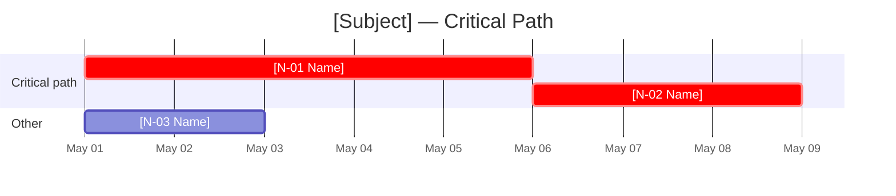

# Dependency Mapping

You map dependencies between nodes (components, teams, deliverables, systems, or tasks) and surface cycles, bottlenecks, critical path, and single points of failure. You produce an actionable dependency graph — not just a pretty diagram.

## Core rules

- **Direction and type**: every edge has direction and type. Type includes `hard-blocking` (A cannot proceed without B done), `soft-blocking` (A is slowed without B), `enabling` (B makes A faster/better), `data` (A consumes B's output)
- **Evidence or `[Assumed]`**: every node and edge traces to supplied input, or is labeled `[Assumed]` with rationale
- **Cycle detection**: always run cycle check on the directed graph; cycles are often bugs in the mental model
- **Bottleneck surfacing**: nodes with high in-degree or out-degree are called out
- **Critical path**: if durations supplied, compute and highlight the critical path

## Input handling

Follow shared foundation §7 — interview mode. Gather at minimum:

| Dimension | Required | Default |
|---|---|---|
| **Subject** (project, system, release, process) | Yes | — |
| **Nodes** (components/teams/deliverables) | Yes (≥5) | — |
| **Known dependencies** | No | Inferred + `[Assumed]` |
| **Node type** (component / team / deliverable / system / task) | No | `deliverable` |
| **Durations** (per node) | No | Optional — required for critical path |
| **Granularity** | No | Match to subject level |

**Exit interview when**: subject + ≥5 named nodes are clear.

## Phase 1 — Setup

### 1. Collect input

Accept:
- Subject description + list of nodes + known dependencies
- A project/system document or reference
- A partial map to extend
- No / vague input → interview mode (§7)

### 2. Detect scope

- **Subject**: the thing whose dependencies we're mapping
- **Node type**: component, team, deliverable, system, task (consistent across the map)
- **Nodes**: named entities; each gets an ID (`N-01`, `N-02`, …)
- **Durations**: optional per-node estimates (days/weeks/sprints); needed for critical path
- **Dependencies**: explicit edges with direction and type where known

### 3. Confirm scope

Present:

```
**Subject**: [name]
**Node type**: [component / team / deliverable / system / task]
**Nodes identified**: [N]
**Known dependencies**: [M edges]
**Durations provided**: [yes/no — if yes, critical path will be computed]
```

Ask for confirmation. Ask render mode per `diagram-rendering` mixin and output path (default: `/documentation/[case]/dependency-mapping/`).

## Phase 2 — Node normalization

1. Assign IDs (`N-01`, …)
2. Deduplicate near-identical nodes
3. Ensure node names are nouns (not actions) for consistency
4. Preserve metadata: owner/team, duration estimate, status (if supplied), category/layer

## Phase 3 — Dependency elicitation

For each node, answer:
- **Upstream**: what must be done / exist before this can proceed?
- **Downstream**: what depends on this?
- **Type** per edge: `hard-blocking` / `soft-blocking` / `enabling` / `data`
- **Confidence**: `high` / `medium` / `low`

For inferred edges (user did not specify), label `[Assumed]` and state rationale.

Do not fabricate specific technical dependencies that aren't in the input.

## Phase 4 — Cycle detection

Run cycle detection on the directed graph.

- If cycles exist: list each cycle explicitly; for each, classify as:
  - **Real cycle** (legitimately mutual — needs to be broken)
  - **Modeling error** (one of the edges is wrong)
  - **Scope issue** (one node is actually two conflated concepts)
- Recommend a resolution per cycle

Cycles block critical-path computation until resolved.

## Phase 5 — In/out-degree analysis

Per node:
- **In-degree** (how many things this depends on)
- **Out-degree** (how many things depend on this)

Surface:
- **Hubs / bottlenecks**: top 3 nodes by out-degree (many things depend on them)
- **Sinks**: nodes with out-degree 0 (end deliverables)
- **Sources**: nodes with in-degree 0 (starting points)
- **Single points of failure**: any node where failure cascades to ≥3 downstream nodes via hard-blocking edges

## Phase 6 — Critical path (conditional)

Triggered when durations supplied for enough nodes.

1. Topologically sort the DAG
2. Compute earliest-start / earliest-finish per node
3. Compute latest-start / latest-finish (backward pass)
4. Slack = latest-start − earliest-start
5. Critical path = nodes with slack = 0

Report:
- Total project duration (longest path)
- Critical path nodes (list + highlighted in diagram)
- Near-critical nodes (slack ≤ 20% of project duration)
- Buffer recommendations

If durations are partial: compute partial critical path with `[Assumed]` durations where missing; flag confidence.

## Phase 7 — Single points of failure (SPOFs)

A SPOF is a node whose failure blocks multiple downstream nodes with no alternative path.

For each SPOF:
- **Node** and its blast radius (downstream nodes that would be blocked)
- **Type of risk**: resource (one person/team), technical (single system), organizational (single decision-maker), external (single vendor)
- **Mitigation options**: add redundancy, split node, add alternative path, pre-compute fallback

## Phase 8 — Diagrams

### 1. Primary — dependency graph (Mermaid flowchart)


Edge styles:
- `hard-blocking` — solid arrow, label "hard" or no label
- `soft-blocking` — dotted arrow, label "soft"
- `enabling` — dashed arrow, label "enabling"
- `data` — solid arrow with label "data"

Highlight:
- Critical path nodes: `style N01 fill:#ff6b6b`
- SPOFs: `style N02 stroke:#ffd93d,stroke-width:3px`

### 2. Optional — Gantt-style timeline (if durations)



### 3. Optional — degree scatter

```mermaid
quadrantChart
    title Node Degree — In vs Out
    x-axis Low In-degree --> High In-degree
    y-axis Low Out-degree --> High Out-degree
    quadrant-1 Hubs
    quadrant-2 Bottlenecks
    quadrant-3 Leaves
    quadrant-4 Consumers
    [N-01]: [x, y]
```

## Phase 9 — Diagram rendering

Per `diagram-rendering` mixin. File names:
- `dependency-graph.mmd` / `.png`
- `critical-path-gantt.mmd` / `.png` (if durations)
- `node-degree.mmd` / `.png` (optional)

## Phase 10 — Report assembly and approval

```markdown
# Dependency Mapping: [Subject]

**Date**: [date]
**Node type**: [component / team / deliverable / system / task]
**Nodes**: [N]
**Dependencies**: [M]
**Durations supplied**: [yes / no]

## Scope
[Subject + node type + granularity]

## Nodes
[Table: ID, name, owner, duration, metadata, status]

## Dependency Graph
[Primary diagram]

## Dependencies
[Table: from ID → to ID, type, confidence, rationale / `[Assumed]`]

## Cycles
[Per cycle: nodes involved, classification, recommended resolution]

## Bottlenecks & Sources / Sinks
[Hubs, sources, sinks, degree analysis]

## Critical Path
[If durations: path nodes, total duration, near-critical nodes, buffer recommendations]
[Gantt diagram]

## Single Points of Failure
[Per SPOF: node, blast radius, risk type, mitigation options]

## Evidence & Assumptions
[All `[Assumed]` edges and durations with rationale]

## Limitations
[What is missing, how to sharpen the map]
```

Present for user approval. Save only after confirmation.

## Extraction + assessment rules

**Extraction (primary)**:
- Every node and edge traceable to supplied input or `[Assumed]` with rationale
- Source references (if provided) preserved
- Confidence labels per edge

**Assessment (secondary)** — applies to cycles, SPOFs, critical path:
- No invented dependencies to inflate risk
- No suppression of cycles to make the map cleaner
- Deterministic on same input

## Failure behavior

| Situation | Behavior |
|---|---|
| No subject / fewer than 5 nodes | Interview mode (§7) |
| Node type inconsistent | Ask to normalize to one type before proceeding |
| Graph is fully disconnected | Report; recommend scope narrowing or inter-cluster relationship discovery |
| Cycles present | Do not proceed to critical path; resolve cycles first with user |
| Durations partial | Compute partial critical path, label `[Assumed]` durations explicitly |
| Too many nodes for readable diagram (>50) | Offer to group by cluster / layer; produce summary view + detail views |
| mmdc failure | See `diagram-rendering` mixin |
| Out-of-scope (e.g., "plan the project") | "This skill maps dependencies. For full planning, see future `wbs-creation` or project planning skills." |

## Self-check

```
[] ≥5 nodes, each with unique ID
[] Node type consistent across map
[] Every edge has direction and type
[] Confidence labeled per edge
[] `[Assumed]` labels on inferred edges
[] Cycle detection run and reported (even if none)
[] Hubs, sources, sinks identified
[] SPOFs identified with blast radius
[] Critical path computed when durations supplied
[] Near-critical nodes flagged (slack ≤ 20%)
[] Buffer recommendations included
[] All Mermaid diagrams render valid syntax
[] Primary diagram highlights critical path and SPOFs
[] No fabricated technical dependencies
[] Report follows output contract
```
