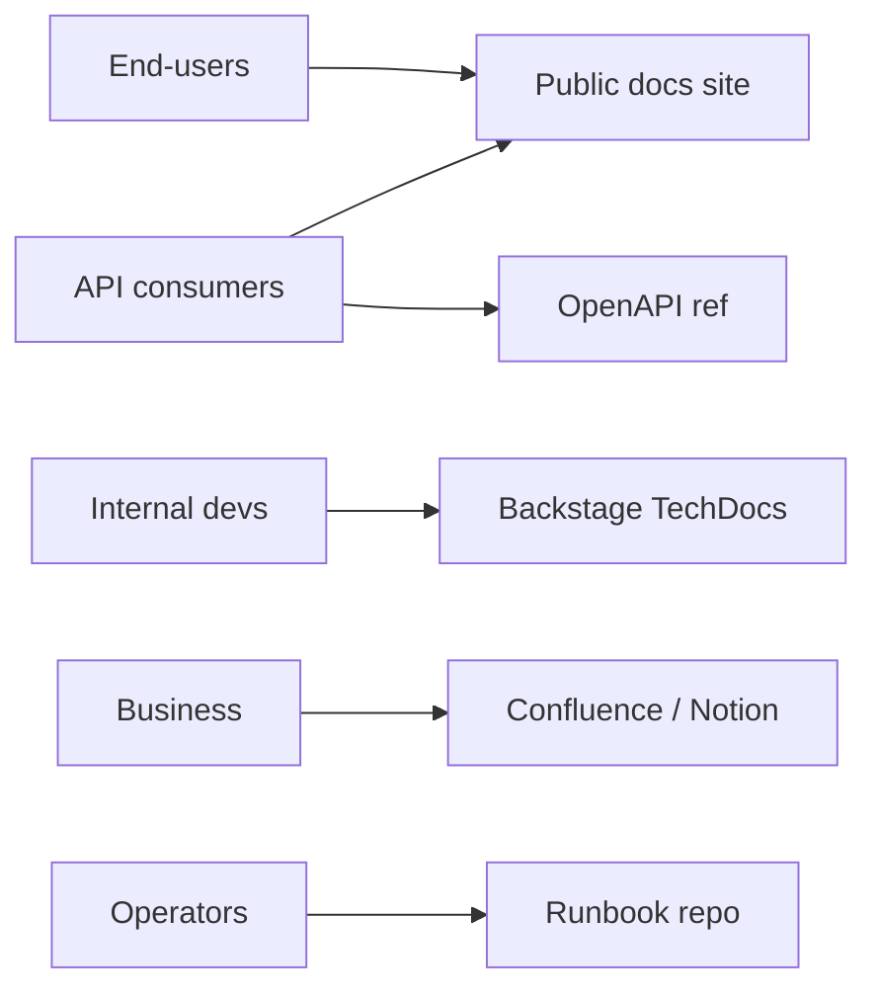

# Documentation Tooling Selection

You pick the tooling that realizes the documentation strategy. Tooling serves the strategy, not the other way around — so start from audience + content needs.

## Core rules

- **Strategy first** — tooling decision after audience + IA + content types known
- **Docs-as-code bias** — unless the audience doesn't fit
- **One primary tool per audience** — don't spread content across many
- **Lock-in visible** — openness of formats + export + migration cost
- **Total cost beyond license** — operation + hosting + authoring UX
- **Future-proof** — can we change tool in 3 years?
- **No fabricated features** — mark `[unverified]` where vendor-claim uncited

## Input handling

| Dimension | Required | Default |
|---|---|---|
| **Strategy reference** (audiences, Diátaxis adoption, living-docs stance) | Yes | — |
| **Content types** (product docs / API ref / developer portal / wiki / learning) | Yes | — |
| **Existing stack** | No | Asked |
| **Compliance + hosting** (region, on-prem) | No | Asked |
| **Budget** | No | Asked |

## Phase 1 — Setup

```
**Strategy**: [reference to `documentation-strategy` output]
**Audiences served**: [end-users / API consumers / operators / internal devs / external partners]
**Content types**: [docs site / API reference / wiki / dev portal / LMS / release notes / blog]
**Existing stack**: [Confluence / Notion / Docusaurus / ...]
**Hosting**: [SaaS / on-prem / cloud self-host]
**Compliance**: [data residency / auth / audit]
**Budget**: [license + ops]
**Scale**: [# of docs / # of authors / traffic]
```

Ask render mode per `diagram-rendering` mixin and output path (default: `/documentation/[case]/documentation-tooling-selection/`).

## Phase 2 — Tool categories

### A. Static site generators (docs-as-code)

| Tool | Strengths | Weaknesses |
|---|---|---|
| **Docusaurus** | React-based + versioning + i18n built-in + plugins + MDX | heavier; rebuilds on big sites |
| **MkDocs + Material** | Python + simple + fast + rich theme | less-flexible UI beyond Material |
| **Astro (Starlight)** | flexible + fast + full HTML control | newer ecosystem |
| **Nextra** | Next.js + MDX + close to Vercel | locks to Next.js |
| **VitePress** | Vue + fast + simple | less extensibility than Docusaurus |
| **Hugo** | Go + very fast + mature themes | less JS component interactivity |
| **Jekyll** | GitHub Pages native | aging; Ruby |
| **Sphinx** | Python ecosystem default, reStructuredText + MyST | authoring UX rougher |

### B. Developer portals

| Tool | Strengths | Weaknesses |
|---|---|---|
| **Backstage (Spotify) TechDocs** | Markdown-in-repo + catalog + plugins | self-host ops |
| **Port** | managed portal | commercial |
| **Cortex** | engineering intelligence + docs | commercial |
| **OpsLevel** | catalog + docs | commercial |

### C. Wikis / knowledge bases

| Tool | Strengths | Weaknesses |
|---|---|---|
| **Confluence** | collaboration + macros + Jira integration | not docs-as-code by default; editor quirks |
| **Notion** | collaboration + DB-like | search limits at scale; API maturity |
| **Outline** | open-source wiki | smaller ecosystem |
| **GitBook** | good authoring UX + hosting | lock-in + cost |

### D. API reference tools

| Tool | Strengths | Weaknesses |
|---|---|---|
| **Redoc / Redocly** | OpenAPI rendering, great UX | limited for tutorials |
| **Scalar** | modern OpenAPI UI + open-source | newer |
| **Stoplight** | API design + docs + governance | commercial; opinionated |
| **Swagger UI** | ubiquitous OpenAPI reference | dated UX |
| **Postman Docs** | tied to collections | lock-in to Postman |
| **Mintlify / ReadMe** | managed hosted | commercial; lock-in |

### E. Learning management

| Tool | When |
|---|---|
| **Docebo / TalentLMS / LearnDash / Moodle** | structured courses + progress + certs |
| **Notion / Docusaurus tutorial section** | lightweight learning alongside docs |

## Phase 3 — Evaluation criteria

Adapt weights per strategy. Sum to 100.

| Criterion | Weight | Captures |
|---|---|---|
| Docs-as-code fit | 15 | Markdown / MDX + Git-PR workflow |
| Versioning | 10 | Version-aware content + URL |
| Search | 10 | On-site search quality + search API |
| Localization | 5 | i18n + translation workflow |
| Authoring UX | 10 | WYSIWYG for non-devs or Markdown for devs |
| Publishing pipeline | 10 | CI-compatible build + preview + deploy |
| Theming + extensibility | 10 | Custom components + branding |
| Plugin ecosystem | 5 | For future-proofing |
| Performance / scale | 5 | Build time + page speed |
| Cost (license + ops) | 10 | TCO |
| Lock-in + exit | 10 | Open formats + export |

Score candidates 1–5 per criterion.

## Phase 4 — Per-audience recommendation

Match tools to audiences:

| Audience | Default fit |
|---|---|
| External end-users | Docusaurus / Astro Starlight + Redoc for API |
| API consumers | Docusaurus + Redoc / Scalar |
| Internal devs (platform) | Backstage TechDocs (Markdown in repos, aggregated) |
| Operators | docs-as-code + runbook repo |
| Non-technical business audiences | Notion / Confluence |
| Mixed internal | Confluence for collab + Backstage for engineering docs |

Hybrid stacks are common + acceptable — but keep the authority per content type clear.

## Phase 5 — Publishing pipeline

- Source in Git (docs-as-code) or DB (wiki-style)
- CI build on PR with preview URL
- Link + code-sample CI checks
- Auto-deploy on main merge
- Versioned releases if product-aligned
- CDN for performance + global reach

For wiki-style: access controls, export cadence, audit log.

## Phase 6 — Integrations needed

- SSO / IdP
- Search (e.g., Algolia DocSearch / Typesense / Meilisearch)
- Analytics (Plausible / GA / Fathom + respecting GDPR)
- Feedback widget (helpful? yes/no)
- Translation pipeline (Crowdin / Lokalise)
- Issue tracker links (Jira / Linear / GitHub)
- API ref autogeneration from OpenAPI / proto
- Diagram rendering (Mermaid / PlantUML)

## Phase 7 — Lock-in + exit

- **Content formats**: Markdown / MDX portable; proprietary formats risky
- **Export**: verify tool supports full export
- **Migration cost**: estimate in weeks for N docs
- **Abstraction**: content in Git = easy tool swap

Rank candidates on exit cost.

## Phase 8 — Recommendation

One paragraph:
- **Primary tool** per audience
- **Hybrid if needed**
- **Why**: top 2–3 criteria
- **Trade-offs accepted**
- **Lock-in + exit plan**
- **Integrations baseline**

## Phase 9 — Diagrams

### Tool fit heatmap

```mermaid
xychart-beta
    title "Candidates across criteria (1-5)"
    x-axis ["DaC", "Ver", "Srch", "L10n", "UX", "Pub", "Theme", "Plug", "Perf", "Cost", "Exit"]
    y-axis "Score" 0 --> 5
    bar [5, 5, 4, 5, 3, 5, 5, 5, 4, 4, 4]
    bar [5, 4, 4, 3, 4, 5, 4, 4, 5, 5, 4]
    bar [2, 3, 4, 4, 5, 3, 4, 3, 3, 3, 2]
```



Bars = Docusaurus / MkDocs Material / Confluence.

### Content authority per audience



## Phase 10 — Diagram rendering

Per `diagram-rendering` mixin.

## Phase 11 — Report assembly and approval

```markdown
# Documentation Tooling Selection: [Product]

**Date**: [date]
**Strategy reference**: [link]
**Recommended primary**: [...]

## Scope
## Tool Categories Considered
## Evaluation Criteria + Weights
## Scoring Matrix
## Per-Audience Recommendation
## Publishing Pipeline
## Integrations
## Lock-in + Exit
## Recommendation
## Diagrams
## Hand-offs
## Assumptions & Limitations
```

Present for user approval. Save only after confirmation.

## Assessment + planning rules

- Strategy-driven selection
- Weights agreed
- Evidence per score
- Lock-in + exit analyzed
- Hybrid clear authorities
- No fabricated features

## Failure behavior

| Situation | Behavior |
|---|---|
| No strategy | Hand off to `documentation-strategy` first |
| Single-tool demand without fit analysis | Challenge |
| Vendor marketing as fact | Mark `[unverified]` |
| Migration request | Hand off to general migration planning |
| mmdc failure | See `diagram-rendering` mixin |
| Implementation (authoring) | Out of scope |

## Self-check

```
[] Strategy cited
[] Tool categories mapped to audiences
[] Weights sum 100
[] Evidence per score
[] Publishing pipeline
[] Integrations listed
[] Lock-in + exit analyzed
[] Hybrid authorities clear
[] Recommendation with trade-offs
[] Diagrams valid
[] No fabricated features
[] Report follows output contract
```
