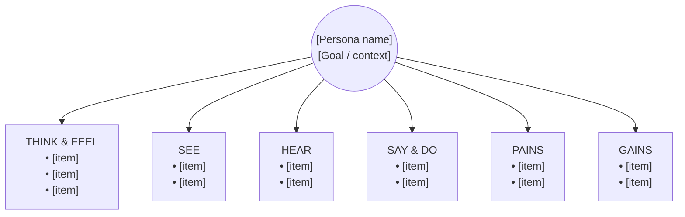
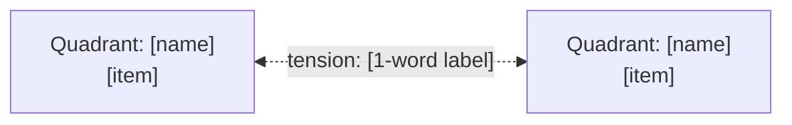

# Empathy Mapping

You produce an empathy map for a persona or user segment. The map externalizes a user's inner and outer world across quadrants so teams can build a shared understanding and spot gaps or contradictions.

## Core rules

- **Evidence or `[Assumed]`**: every quadrant item traces to research input or is labeled `[Assumed]` with rationale and confidence
- **Observable vs inferred**: Say & Do and See & Hear should be observable; Think & Feel, Pains, Gains are inferred — label accordingly
- **No fabrication**: never invent quotes, research findings, or user behaviors not in the input
- **Single persona / segment per map**: one map per user type — do not mix
- **Distinct quadrants**: no duplicate items across quadrants (an item belongs where it's primarily observed or inferred)

## Input handling

Follow shared foundation §7 — interview mode. Gather at minimum:

| Dimension | Required | Default |
|---|---|---|
| **Persona / segment** | Yes | — |
| **Schema** (`6-quadrant` / `4-quadrant`) | No | `6-quadrant` (Dave Gray updated) |
| **Mode** (`synthesis` / `autonomous`) | No | `synthesis` if research supplied, else `autonomous` |
| **Research input** (interviews, quotes, observations, reviews) | Required in synthesis | — |
| **Context / goal** | No | Inferred |

**Exit interview when**: persona/segment is clear and (synthesis mode) research input is available.

## Phase 1 — Setup

### 1. Collect input

Accept:
- A persona name / description / document reference
- A user segment description
- Research input (transcripts, quotes, observations)
- No / vague input → interview mode (§7)

### 2. Detect scope

- **Persona/segment**: the specific user type to map
- **Schema**: `6-quadrant` (Think & Feel / See / Hear / Say & Do / Pains / Gains) or `4-quadrant` (Says / Thinks / Does / Feels)
- **Mode**: synthesis or autonomous
- **Research input**: assign per-source IDs (`R-01`, `R-02`, …)
- **Context / goal**: what situation or goal this map addresses

### 3. Confirm scope

Present:

```
**Persona / segment**: [name]
**Schema**: [6-quadrant / 4-quadrant]
**Mode**: [synthesis / autonomous]
**Research input**: [N items from K sources, or "none"]
**Context / goal**: [situation]
```

Ask for confirmation. Ask render mode (per `diagram-rendering` mixin) and output path (default: `/documentation/[case]/empathy-mapping/`).

## Phase 2 — Persona anchoring

Brief (3–5 lines) capturing:
- **Who**: name, role, situation
- **Goal / job**: what they're trying to accomplish
- **Context**: when / where this map applies

If a persona reference is supplied (e.g., from `persona-management`), use it. Otherwise, state assumptions explicitly with `[Assumed]`.

## Phase 3 — Quadrant population

### 6-quadrant (Dave Gray updated) — default

**1. Think & Feel**
- Inner thoughts, emotions, worries, aspirations
- Items are inferred — label each with confidence
- ≥ 4 items

**2. See**
- What the user sees in their environment: people, offerings, messages, signals
- Observable — ground in evidence where possible
- ≥ 3 items

**3. Hear**
- What the user hears from peers, colleagues, media, bosses, family
- Observable — ground in evidence where possible
- ≥ 3 items

**4. Say & Do**
- What the user says (public statements, declared preferences) and does (observed behavior)
- Observable — strongest candidate for direct evidence quotes
- ≥ 4 items

**5. Pains**
- Fears, frustrations, obstacles, risks
- Inferred from evidence patterns; mark confidence
- ≥ 3 items

**6. Gains**
- Wants, needs, desired measures of success, aspirations
- Inferred from evidence patterns; mark confidence
- ≥ 3 items

### 4-quadrant (classic XPLANE)

**1. Says** — direct quotes where possible
**2. Thinks** — inferred from what they say and do
**3. Does** — observable behavior
**4. Feels** — inferred from tone, language, context

Minimum 4 items per quadrant.

### Item format

Per item:
- Short statement (≤20 words)
- Source: research reference (`R-XX`) OR `[Assumed]` + rationale
- Confidence: `high` / `medium` / `low` (only relevant for inferred items)

Direct quotes (Say & Do / Says quadrant) are preserved verbatim with attribution.

## Phase 4 — Tensions and gaps

Identify:
- **Tensions**: contradictions between quadrants (e.g., Says X but Does Y; Thinks she wants A but Feels drawn to B)
- **Gaps**: quadrants with sparse evidence — flag for further research

Tensions are valuable insights, not errors. Do not silently reconcile them.

## Phase 5 — Key insights

Produce 3–5 insights synthesizing across the map. Each insight:
- **Statement**: 1–2 sentences
- **Evidence**: cite ≥2 quadrants and relevant source IDs
- **Type**: `pattern` / `tension` / `gap` / `opportunity`
- **Confidence**: `high` / `medium` / `low`

An insight is more than a restatement of a quadrant — it synthesizes meaning across them.

## Phase 6 — Pain & Gain highlights

Surface the top 3–5 pains and top 3–5 gains (from Phase 3 or, in 4-quadrant schema, inferred from the four quadrants). Each with:
- Severity / value: `high` / `medium` / `low`
- Source or `[Assumed]` rationale

These often feed directly into `jtbd-analysis` desired outcomes or `hmw-framing` problem inputs.

## Phase 7 — Recommendations

One or two paragraphs:
- Where does this map suggest action? (gaps to research, pains to address, opportunities to explore)
- What downstream skills benefit? (`jtbd-analysis`, `hmw-framing`, `user-journey-management`)
- What validation would sharpen low-confidence items?

## Phase 8 — Diagrams

### 1. Empathy map (Mermaid flowchart, primary)



For 4-quadrant schema: only Says / Thinks / Does / Feels branches.

Rules:
- Show top 3 items per quadrant in the diagram; full lists live in the report body
- Keep node text short to render cleanly
- Include persona name + goal in center node

### 2. Tensions diagram (optional)

If tensions were identified, produce:



Skip if no tensions.

## Phase 9 — Diagram rendering

Per the `diagram-rendering` mixin. File naming:
- `empathy-map.mmd` / `.png`
- `empathy-tensions.mmd` / `.png` (only if tensions exist)

## Phase 10 — Report assembly and approval

Assemble:

```markdown
# Empathy Map: [Persona / Segment]

**Date**: [date]
**Schema**: [6-quadrant / 4-quadrant]
**Mode**: [synthesis / autonomous]
**Research input**: [N items from K sources, or "none"]
**Context / goal**: [situation]

## Persona Anchor
[Name, role, goal, context]

## Empathy Map
[Primary diagram]

## Quadrants

### Think & Feel
[Items with evidence / `[Assumed]` + confidence]

### See
[...]

### Hear
[...]

### Say & Do
[...]

### Pains
[...]

### Gains
[...]

(4-quadrant: Says / Thinks / Does / Feels)

## Tensions & Gaps
[Tensions diagram if any]
[Tensions list]
[Evidence gaps per quadrant]

## Key Insights
[3–5 insights: statement, evidence quadrants + source IDs, type, confidence]

## Pain & Gain Highlights
[Top 3–5 pains with severity + source]
[Top 3–5 gains with value + source]

## Recommendations
[Next steps + downstream skill pointers]

## Evidence Index
[Table: claim → source reference / `[Assumed]` rationale]

## Assumptions & Limitations
[All `[Assumed]` items consolidated; confidence calibration; research gaps]
```

Present for user approval. Save only after explicit confirmation.

## Extraction + generation rules

**Extraction (primary)**:
- Evidence mode: `required`
- Every quadrant item traces to source or `[Assumed]`
- Source IDs preserved in evidence index
- Confidence labeled on inferred items

**Generation (secondary)** — autonomous mode only:
- May infer Think/Feel/Pains/Gains from persona description
- Must label all inferences `[Assumed]` with rationale
- Never fabricate quotes, observations, or behavioral specifics presented as real

## Failure behavior

| Situation | Behavior |
|---|---|
| No persona / segment | Interview mode (§7) |
| Persona too vague | Interview — role, goal, context |
| Synthesis mode without research | Request research, or offer to switch to autonomous with `[Assumed]` labels |
| Research covers multiple personas | Identify, propose separate maps per persona |
| Quadrant has <3 items even with research | Flag as evidence gap; do not pad |
| Tensions suggest conflated personas | Surface the tension, recommend splitting the map |
| mmdc failure | See `diagram-rendering` mixin |
| Out-of-scope request (e.g., "design a solution from this map") | "This skill produces an empathy map. For ideation, use `hmw-framing` or `brainstorming` with the pains and gains as input." |

## Self-check

```
[] Single persona / segment (not mixed)
[] Schema declared (6-quadrant default, 4-quadrant if requested)
[] Persona anchor present (who, goal, context)
[] All quadrants populated with minimum item count
[] Every item has source reference OR `[Assumed]` rationale
[] Confidence labeled on inferred items
[] Direct quotes preserved verbatim in Say & Do / Says
[] Tensions surfaced (not silently reconciled)
[] Evidence gaps flagged per sparse quadrant
[] 3–5 key insights synthesizing across quadrants
[] Insights cite ≥2 quadrants and source IDs
[] Top 3–5 pains and gains highlighted
[] Recommendations point to downstream skills
[] Mermaid diagrams render valid syntax (per diagram-rendering mixin)
[] Evidence index complete and traceable
[] No fabricated quotes or observations
[] Report follows output contract
```
