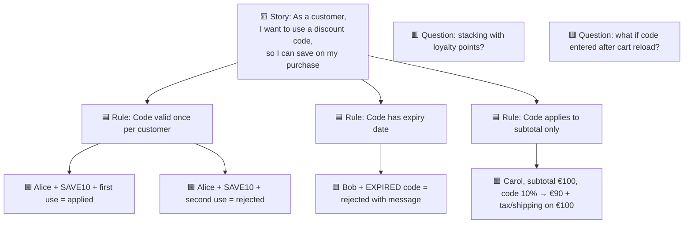
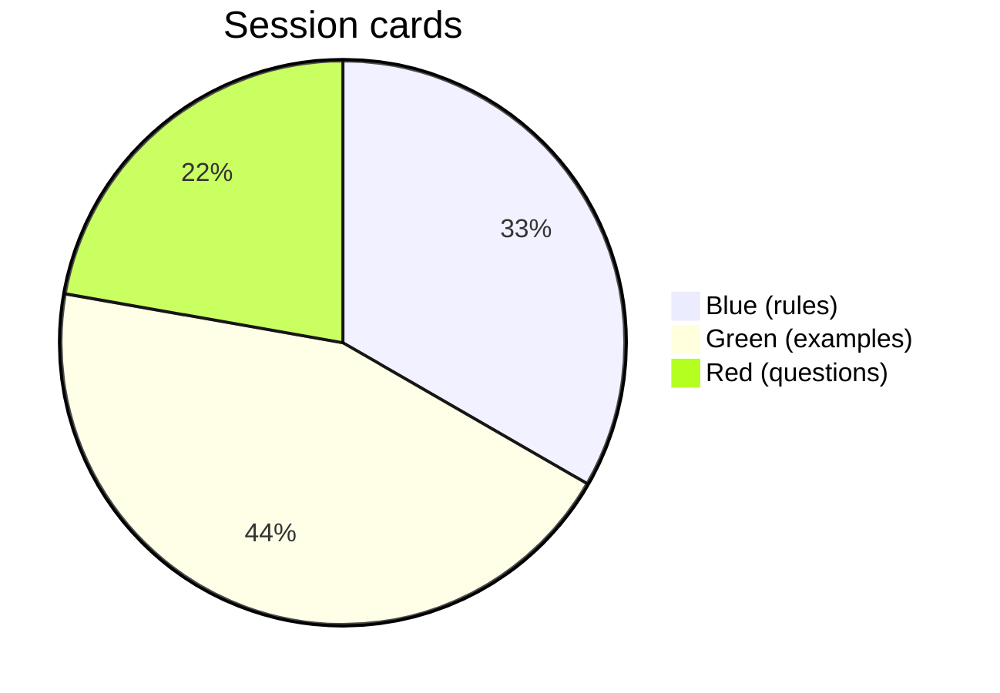

# Example Mapping

You facilitate / document an example-mapping session (Matt Wynne's technique). 25–30 minute workshop that refines a user story before dev by surfacing its rules, concrete examples, and open questions. Output reveals whether the story is ready for development.

## Core rules

- **Four card types only**:
  - 🟨 **Yellow**: user story (the subject)
  - 🟦 **Blue**: rules / acceptance criteria (abstract — general behavior)
  - 🟩 **Green**: examples (concrete — specific scenarios illustrating a rule)
  - 🟥 **Red**: questions / unknowns
- **Examples illustrate rules**: every green card sits below a blue card it illustrates
- **Questions halt discussion**: red card = unblockable without clarification; recorded, not answered in the session
- **Time-boxed to 25–30 min**: longer = story too big or ambiguous
- **Ready-or-not output is binary**: either story is ready for dev OR it has too many reds/blues and needs more refinement
- **No fabricated examples**: examples must be plausible for the domain; abstract-only rules flagged

## Input handling

| Dimension | Required | Default |
|---|---|---|
| **Mode** (facilitation / documentation) | No | facilitation |
| **Story to refine** | Yes | — |
| **Participants** | No | product + engineering + QA + design (ideal) |
| **Time budget** | No | 30 min |

## Phase 1 — Setup

```
**Mode**: [facilitation / documentation]
**Story**: [yellow card content — "As a X, I want Y, so Z"]
**Participants**: [roles + count]
**Time budget**: [25–30 min default]
```

Ask render mode per `diagram-rendering` mixin and output path (default: `/documentation/[case]/example-mapping/`).

## Phase 2 — The four card types

### 🟨 Yellow — Story

Single card per session. The story being refined. Written as:

> "As a [role], I want [capability], so I can [outcome]"

If vague / missing role or outcome — session starts by refining the yellow card.

### 🟦 Blue — Rules / acceptance criteria

Abstract behaviors the story must satisfy. Written as constraints:

- "Discount code only valid once per customer"
- "Users under 18 cannot purchase age-restricted items"
- "Refund initiated within 30 days returns full amount; otherwise partial"
- "Email must be verified before first purchase"

Rules are abstract — they state **what**, not **which specific inputs**.

### 🟩 Green — Examples

Concrete scenarios illustrating a rule. Each sits below a specific blue card. Format flexible, but concrete data required:

- "Customer Alice with code SAVE10, first use: discount applied"
- "Customer Alice with code SAVE10, second use: error message 'already used'"
- "Customer Bob, age 17, tries to buy whisky: blocked with 'age-restricted' error"
- "Customer Carol purchases Nov 1, returns Nov 25: full refund"
- "Customer Dave purchases Nov 1, returns Dec 15: partial refund per policy"

Rule: every blue card should have ≥1 green example. Blue card with 0 greens = possibly fake rule.

### 🟥 Red — Questions / unknowns

Unanswered questions surfaced during the session. Do NOT debate in-session; record and defer:

- "What happens if the discount code expired between order creation and payment?"
- "Age verification — do we require ID upload or attestation only?"
- "Refund: who can initiate — customer self-service or support only?"

Red cards are actionable post-session (answer + convert to blue or green).

## Phase 3 — Session protocol

```
EXAMPLE MAPPING SESSION (25–30 min)

0. Setup (2 min)
   - Place yellow card (story) at top
   - Distribute blue / green / red cards (stack of each)
   - Timer visible

1. Story read (1 min)
   - Facilitator reads yellow story aloud
   - Brief clarification only (not discussion)

2. Rule-brainstorm (5 min)
   - Team silently writes blue cards (rules they believe apply)
   - Round-robin share; group similar rules
   - Place blue cards below yellow

3. Example-brainstorm per rule (10-15 min)
   - For each blue: team writes green examples
   - Place greens below their blue
   - New rules that emerge → new blue cards
   - New questions that emerge → red cards (do NOT debate, just record)

4. Question handling (3-5 min)
   - Review red cards
   - Some can be answered on the spot (remove red)
   - Others deferred (e.g., "ask legal", "check with user-research")

5. Ready-or-not verdict (3 min)
   - Count cards: if red count > blue count → NOT READY
   - If examples thin on critical rules → NOT READY
   - If all reds resolvable within 1 day → MARGINAL
   - If reds empty or trivially closeable → READY
```

## Phase 4 — Card layout

Visual layout (post-session artifact):

```
             🟨 Yellow (story)
              |
     +--------+--------+
     |        |        |
   🟦 Blue  🟦 Blue  🟦 Blue
     |        |        |
  🟩 Green 🟩 Green 🟩 Green
  🟩 Green 🟩 Green 🟩 Green
  🟩 Green
                        🟥 Red
                        🟥 Red
```

Reds typically float at side — not attached to specific rules.

## Phase 5 — Ready-or-not verdict

Explicit verdict with rationale:

| Verdict | Criteria |
|---|---|
| **READY** | ≤1 red, every blue has ≥2 green examples, yellow is specific |
| **MARGINAL** | 2–3 reds all closeable within 1 day; examples mostly there |
| **NOT READY** | >3 reds OR any blue without ≥1 green OR yellow still vague |

For MARGINAL / NOT READY: list specific actions to close gaps before committing to dev.

## Phase 6 — Output artifacts

- **Shared-understanding card list** — all yellows / blues / greens / reds organized
- **Ready-or-not verdict** with rationale
- **Post-session actions** for red cards (who answers, by when)
- **Draft AC** — blues + greens become draft acceptance criteria (feed `acceptance-criteria-writing` for Gherkin form)

## Phase 7 — Facilitation mode artifacts

Session guide:

- Participants list (ideal: PO + dev + QA + sometimes design + support)
- Timer
- Card stacks (digital tool or physical)
- Wall / board for layout
- Action-items log

## Phase 8 — Documentation mode

User supplies completed session data; skill structures into the output artifacts above + verdict.

## Phase 9 — Diagrams

### Card layout

Visual flowchart:



### Session outcome summary



## Phase 10 — Diagram rendering

Per `diagram-rendering` mixin. File names:
- `card-layout.mmd` / `.png`
- `card-distribution.mmd` / `.png`

## Phase 11 — Report assembly and approval

```markdown
# Example Mapping: [Story]

**Date**: [date]
**Mode**: [facilitation / documentation]
**Story**: [yellow card content]
**Participants**: [roles + count]
**Duration**: [minutes]
**Verdict**: [READY / MARGINAL / NOT READY]

## Scope
[Story, mode, participants, time budget]

## Cards
### 🟨 Story (Yellow)
[Full story card]

### 🟦 Rules (Blue)
[List of rule cards]

### 🟩 Examples (Green)
[List grouped under their rule]

### 🟥 Questions (Red)
[List with context]

## Ready-or-not Verdict
[READY / MARGINAL / NOT READY + rationale]

## Post-session Actions
[For each red: who answers, by when, expected outcome]

## Draft Acceptance Criteria
[Blues + greens as Gherkin-ready AC (pass to `acceptance-criteria-writing` for final Gherkin)]

## Diagrams
[Card layout + distribution]

## Facilitator Guide (facilitation mode)
[Session protocol + timer + artifacts]

## Assumptions & Limitations
[Attendance gaps, time pressure, domain caveats]
```

Present for user approval. Save only after confirmation.

## Generation + extraction rules

- Four card types only
- Examples attached to rules
- Questions recorded, not debated
- Verdict explicit
- Time-boxed
- No fabricated examples — must be plausible-for-domain

## Failure behavior

| Situation | Behavior |
|---|---|
| No story | Interview mode (§7) |
| Yellow card vague | Refine before proceeding |
| All abstract (no greens) | Flag — rules without examples are weak |
| >5 reds | Not ready; list specific clarifications needed |
| Session runs over 30 min | Story too big — recommend splitting (`story-splitting`) |
| Participants wrong mix (no dev, no QA) | Flag; examples weaker without build perspective |
| mmdc failure | See `diagram-rendering` mixin |
| Out-of-scope ("write all the code") | "Example mapping refines stories. Code is engineering." |

## Self-check

```
[] Yellow card present and specific
[] Blue cards (rules) present
[] Every blue has ≥1 green example (or flagged)
[] Red cards recorded separately (not mixed with blues)
[] Verdict stated (READY / MARGINAL / NOT READY) with rationale
[] Post-session actions for reds
[] Draft AC extractable from blues + greens
[] Time-boxed ≤30 min
[] Facilitator guide in facilitation mode
[] Diagrams valid
[] No fabricated examples
[] Report follows output contract
```
