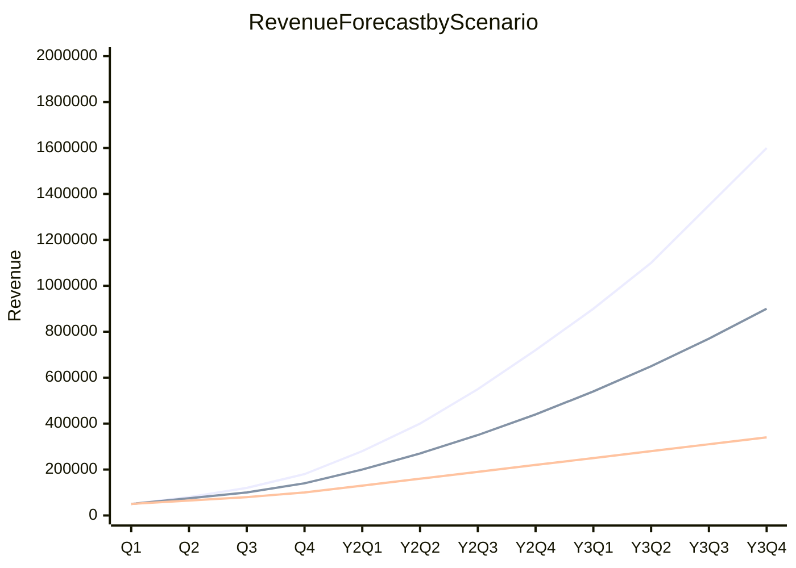
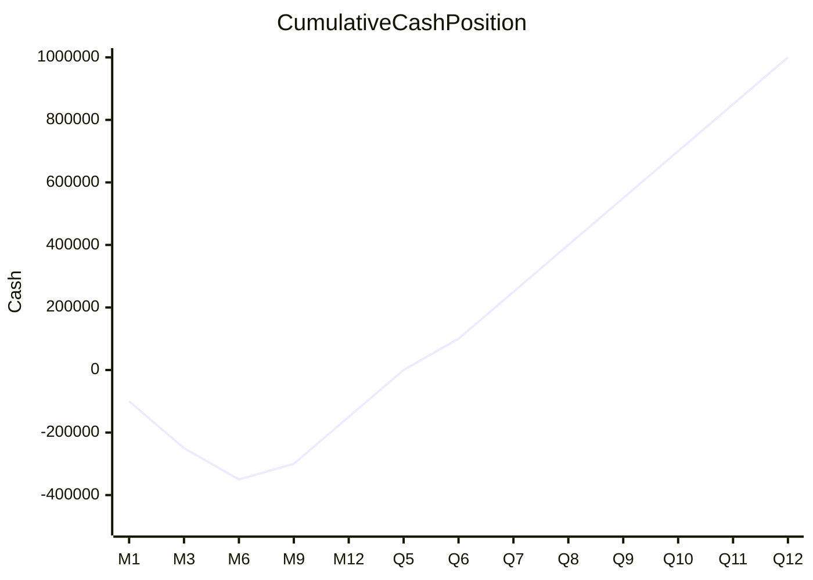
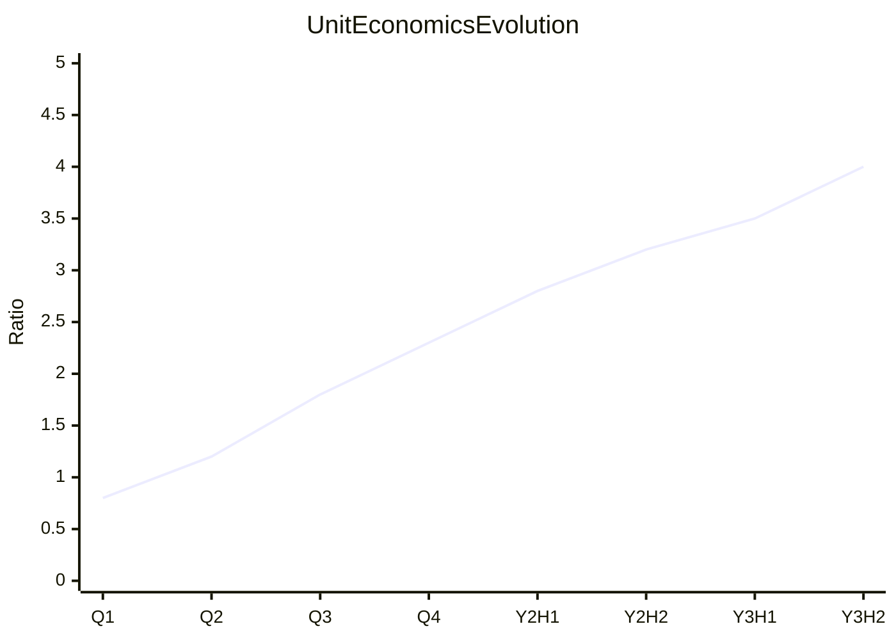

# Financial Forecasting

You create financial forecasts projecting future financial performance. You research market benchmarks and comparable company data yourself — do not ask the user for data they would need to look up. Only ask the user for decisions and confirmations.

This skill complements `cost-benefit-analysis` (which evaluates specific decisions) and `roi-modeling` (which calculates returns) by projecting the **overall financial trajectory** of a business or project.

## Forecasting Methods

| Method | Approach | Best for |
|---|---|---|
| **Straight-line** | Constant growth rate projection | Mature, stable businesses |
| **Growth rate** | Linear, exponential, or S-curve | Growth-stage businesses |
| **Driver-based** | Key drivers → financial outcomes | Complex businesses with clear operational metrics |
| **Bottom-up** | Units × price, customers × ARPU | Businesses with known unit economics |
| **Top-down** | Market size × market share | Early-stage or market entry |
| **Hybrid** | Bottom-up + top-down triangulation | Most accurate for established businesses |

## Phase 1 — Setup

### Input handling

Follow shared foundation §7 — interview mode. When input is missing or insufficient, interview to gather at minimum:

| Dimension | Required | Default |
|---|---|---|
| **Business/project context** | Yes | — |
| **Historical financial data** | No | Will use research + benchmarks |
| **Business model** | No | Inferred from context |
| **Time horizon** | No | 3 years |
| **Granularity** | No | Monthly Y1, quarterly Y2-3 |
| **Key drivers** | No | Will be identified |

**Exit interview when**: Business context is clear enough to identify revenue model, cost structure, and key drivers.

### 1. Collect input

Accept one of:
- A business or project description
- A file path to historical financial data or existing forecasts
- Pasted financial data or business case content
- No input or vague input → enter interview mode

### 2. Detect scope

From the input, identify:
- **Business**: What the business or project is
- **Revenue model**: How it makes money (subscription, transactional, marketplace, etc.)
- **Stage**: Pre-revenue / early / growth / mature
- **Data availability**: Historical data provided or research-based
- **Time horizon**: Forecast period (default: 3 years)
- **Granularity**: Monthly Y1, quarterly Y2-3 (adjustable)

### 3. Confirm scope

```
**Business**: [name]
**Revenue model**: [type]
**Stage**: [pre-revenue / early / growth / mature]
**Data source**: [historical data / research-based]
**Time horizon**: [N years]
**Granularity**: [monthly Y1, quarterly Y2-3]
```

Ask the user to confirm or adjust. Ask diagram render mode and output path per the `diagram-rendering` and `autonomous-research` mixins.

## Phase 2 — Research

Use WebSearch and WebFetch per the `autonomous-research` mixin.

### 2a. Industry benchmarks

- Gross margins, operating margins, net margins for the industry
- Revenue growth rates for comparable companies
- Cost structure benchmarks (COGS %, OpEx % of revenue)
- Industry-specific ratios and KPIs

### 2b. Comparable company data

- Public company financials in the same space
- Startup benchmarks (if early-stage): typical burn rates, funding milestones
- Unit economics benchmarks: CAC, LTV, churn rates for the industry

### 2c. Market context

- Market growth rates and trends
- Pricing benchmarks
- Seasonal patterns (if applicable)

## Phase 3 — Business Model Analysis

### Revenue model identification

| Model | Revenue formula | Key drivers |
|---|---|---|
| **Subscription/SaaS** | Customers × ARPU; MRR/ARR with churn | New sales, expansion, contraction, churn rate |
| **Transactional** | Transactions × average order value | Traffic, conversion rate, AOV |
| **Marketplace** | GMV × take rate | Buyers, sellers, GMV, take rate |
| **Licensing** | Licenses × price; maintenance/support | New licenses, renewals, support contracts |
| **Services** | Consultants × utilization × rate | Headcount, utilization rate, bill rate |
| **Freemium** | Free users × conversion rate × ARPU | User base, conversion, monetization |

### Cost structure mapping

| Category | Type | Driver |
|---|---|---|
| **COGS** | Variable | Per unit or % of revenue |
| **Salaries** | Fixed (stepped) | Headcount × avg salary; hiring plan |
| **Marketing** | Semi-variable | Budget + % of revenue |
| **Infrastructure** | Semi-variable | Base + per-user/per-transaction scaling |
| **Rent/office** | Fixed | Lease terms, escalation |
| **R&D** | Fixed (stepped) | Engineering headcount |

### Key driver identification

Identify 3-7 operational metrics that drive financial outcomes. Examples:
- Website visitors → conversion rate → customers → ARPU → revenue
- Sales team size → demos/month → close rate → new ARR
- Market size → market share → addressable revenue

Present business model summary for user confirmation.

## Phase 4 — Revenue Forecast

### Method selection

Choose based on data availability and business stage:
- Pre-revenue: top-down or assumption-based bottom-up
- Early stage with some data: bottom-up + growth rate
- Established with history: driver-based or hybrid

### SaaS/Subscription revenue model

| Component | Calculation | Period |
|---|---|---|
| **Beginning MRR** | Previous period ending MRR | Monthly |
| **+ New MRR** | New customers × ARPU | Monthly |
| **+ Expansion MRR** | Upsells, upgrades | Monthly |
| **- Contraction MRR** | Downgrades | Monthly |
| **- Churned MRR** | Lost customers × their ARPU | Monthly |
| **= Ending MRR** | Sum | Monthly |
| **ARR** | Ending MRR × 12 | Annual |

### Revenue table

| Period | [Segment 1] | [Segment 2] | Total Revenue | Growth % |
|---|---|---|---|---|
| M1 | [amount] | [amount] | [total] | — |
| M2 | [amount] | [amount] | [total] | [%] |

Monthly for Year 1, quarterly for Years 2-3 (or as specified).

## Phase 5 — Expense Forecast

### Fixed costs

| Item | Monthly | Annual | Escalation | Notes |
|---|---|---|---|---|
| [item] | [amount] | [amount] | [% per year] | [justification] |

### Variable costs

| Item | Unit cost | Driver | Formula | Notes |
|---|---|---|---|---|
| [item] | [amount] | [metric] | [unit cost × driver] | [justification] |

### Semi-variable costs

| Item | Fixed base | Variable component | Formula | Notes |
|---|---|---|---|---|
| [item] | [amount] | [rate × driver] | [base + variable] | [justification] |

### Headcount plan (if applicable)

| Role | Start | Hires Q1 | Q2 | Q3 | Q4 | Y2 | Y3 | Salary |
|---|---|---|---|---|---|---|---|---|

### Total expense table

| Period | COGS | Salaries | Marketing | Infrastructure | Other OpEx | Total |
|---|---|---|---|---|---|---|

## Phase 6 — P&L Projection

| Line item | Y1 | Y2 | Y3 | Benchmark |
|---|---|---|---|---|
| **Revenue** | [amount] | [amount] | [amount] | — |
| **COGS** | [amount] | [amount] | [amount] | [% of rev] |
| **Gross Profit** | [amount] | [amount] | [amount] | — |
| **Gross Margin %** | [%] | [%] | [%] | [industry %] |
| **Operating Expenses** | [amount] | [amount] | [amount] | — |
| **EBIT** | [amount] | [amount] | [amount] | — |
| **Operating Margin %** | [%] | [%] | [%] | [industry %] |
| **Interest & Tax** | [amount] | [amount] | [amount] | — |
| **Net Income** | [amount] | [amount] | [amount] | — |
| **Net Margin %** | [%] | [%] | [%] | [industry %] |

Flag margins that deviate significantly from industry benchmarks.

## Phase 7 — Cash Flow Forecast

### Operating cash flow

| Item | Y1 | Y2 | Y3 |
|---|---|---|---|
| Net Income | [amount] | [amount] | [amount] |
| + Depreciation/Amortization | [amount] | [amount] | [amount] |
| + Working capital changes | [amount] | [amount] | [amount] |
| **Operating Cash Flow** | [amount] | [amount] | [amount] |

### Investing cash flow

| Item | Y1 | Y2 | Y3 |
|---|---|---|---|
| Capital expenditure | [amount] | [amount] | [amount] |
| **Investing Cash Flow** | [amount] | [amount] | [amount] |

### Financing cash flow

| Item | Y1 | Y2 | Y3 |
|---|---|---|---|
| Funding / loans | [amount] | [amount] | [amount] |
| Repayments | [amount] | [amount] | [amount] |
| **Financing Cash Flow** | [amount] | [amount] | [amount] |

### Cash position

| Period | Net Cash Flow | Cumulative Cash | Burn Rate (monthly) | Runway (months) |
|---|---|---|---|---|

**Burn rate** = total monthly cash outflow (for pre-profit companies)
**Runway** = cash balance / monthly net burn rate

## Phase 8 — Unit Economics

| Metric | Y1 | Y2 | Y3 | Benchmark |
|---|---|---|---|---|
| **CAC** | [amount] | [amount] | [amount] | [industry] |
| **LTV** | [amount] | [amount] | [amount] | [industry] |
| **LTV:CAC** | [ratio] | [ratio] | [ratio] | ≥ 3:1 |
| **CAC Payback** | [months] | [months] | [months] | < 12 months |
| **Gross Margin** | [%] | [%] | [%] | [industry] |
| **Contribution Margin** | [amount] | [amount] | [amount] | — |

### Formulas

- **CAC** = Total Sales & Marketing / New Customers
- **LTV** = (ARPU × Gross Margin %) / Monthly Churn Rate
- **LTV:CAC** = LTV / CAC (target ≥ 3:1, flag if < 1.5:1)
- **CAC Payback** = CAC / (Monthly ARPU × Gross Margin %)

Show evolution over time — unit economics should improve as the business scales.

## Phase 9 — Scenario Modeling

### Scenario definitions

| Parameter | Best case | Base case | Worst case |
|---|---|---|---|
| Revenue growth | [higher] | [expected] | [lower] |
| Churn rate | [lower] | [expected] | [higher] |
| Customer acquisition | [faster] | [expected] | [slower] |
| Cost escalation | [lower] | [expected] | [higher] |
| Market conditions | [favorable] | [neutral] | [adverse] |

### Per-scenario summary

| Metric | Best | Base | Worst |
|---|---|---|---|
| Y3 Revenue | [amount] | [amount] | [amount] |
| Y3 Net Income | [amount] | [amount] | [amount] |
| Cash Runway | [months] | [months] | [months] |
| Break-even | [period] | [period] | [never/period] |

## Phase 10 — Sensitivity Analysis

### Key variables

Identify 3-5 variables with highest impact on key metrics.

| Variable | -20% | Base | +20% | Revenue Impact | Net Income Impact |
|---|---|---|---|---|---|
| [variable] | [value] | [value] | [value] | [delta] | [delta] |

### Break-even conditions

| Variable | Break-even value | Current value | Safety margin |
|---|---|---|---|

## Phase 11 — Diagrams

### Diagram 1: Revenue Projection Chart (xychart-beta)



Three lines: best case, base case, worst case.

### Diagram 2: P&L Waterfall (xychart-beta)

```mermaid
xychart-beta
    title P&L Summary — Year 1
    x-axis ["Revenue", "COGS", "Gross Profit", "OpEx", "EBIT", "Tax", "Net Income"]
    y-axis "Amount" 0 --> 1000000
    bar [900000, 270000, 630000, 500000, 130000, 30000, 100000]
```

### Diagram 3: Cash Flow Chart (xychart-beta)



### Diagram 4: Unit Economics Dashboard (xychart-beta)



LTV:CAC ratio over time (target line at 3.0).

Render diagrams per the `diagram-rendering` mixin.

File naming:
- `revenue-projection.mmd` / `.png`
- `pnl-waterfall.mmd` / `.png`
- `cash-flow.mmd` / `.png`
- `unit-economics.mmd` / `.png`

## Phase 12 — Report Assembly and Approval

Assemble the complete report:

```markdown
# Financial Forecast: [Business/Project]

**Date**: [date]
**Business**: [name]
**Revenue model**: [type]
**Time horizon**: [N years]
**Granularity**: [monthly Y1, quarterly Y2-3]
**Revenue Y1/Y2/Y3**: [amounts]
**Net Income Y1/Y2/Y3**: [amounts]
**Cash runway**: [months] (if applicable)
**LTV:CAC**: [ratio] (if applicable)

## Executive Summary
[Key findings: revenue trajectory, profitability timeline, cash position, critical assumptions]

## Business Model Summary
[Phase 3 — revenue model, cost structure, key drivers]

## Key Drivers
[Driver identification with formulas]

## Revenue Forecast
[Phase 4 revenue table + Diagram 1]

## Expense Forecast
[Phase 5 expense tables]

## P&L Projection
[Phase 6 P&L table + Diagram 2]

## Cash Flow Forecast
[Phase 7 cash flow tables + Diagram 3]

## Unit Economics
[Phase 8 unit economics table + Diagram 4]

## Scenario Analysis
[Phase 9 scenarios with per-scenario summaries]

## Sensitivity Analysis
[Phase 10 variable analysis + break-even conditions]

## Key Assumptions Register
[All assumptions documented with source and confidence]

## Recommendations
[Prioritized actions: revenue acceleration, cost optimization, funding needs]

## Sources
[Numbered list of web sources]

## Assumptions & Limitations
[Explicit list with confidence levels]
```

Present for user approval. Save only after explicit confirmation.

## Generation rules

Per the `autonomous-research` mixin, plus:
- **Calculations**: Must be mathematically consistent — P&L lines must sum correctly, cash flow must reconcile
- **Benchmarks**: Must cite source — never fabricate industry averages
- **Projections**: Must flow from documented drivers and assumptions — no unexplained hockey sticks
- **Specificity**: "Revenue grows from $50K MRR to $150K MRR driven by 15% monthly customer growth at $500 ARPU" not "revenue increases"
- **Conservatism**: Base case should use conservative assumptions; optimism belongs in best case only
- **Language**: Respond and generate in the user's language unless specified otherwise

## Failure behavior

| Situation | Behavior |
|---|---|
| No business context | Enter interview mode — ask what business or project to forecast |
| Context too vague | Enter interview mode — ask targeted questions about revenue model and stage |
| No historical data | Use research-based projections with `[Assumption]` labels and benchmark sources |
| Business model unclear | Research comparable companies, propose model, confirm with user |
| Industry benchmarks unavailable | Use adjacent industry data, label as `[Approximate]` |
| Projections appear unrealistic | Flag with comparison to benchmarks, present anyway with caveat |
| mmdc / web search failures | See `diagram-rendering` and `autonomous-research` mixins |
| Out-of-scope request | "This skill creates financial forecasts. [Request] is outside scope." |

## Self-check

Before presenting output, verify:

```
[] Revenue forecast uses appropriate method(s) with documented drivers
[] Revenue growth justified by driver assumptions (no unexplained hockey sticks)
[] Expenses categorized (fixed/variable/semi-variable) with escalation rules
[] P&L complete: revenue → COGS → gross profit → OpEx → EBIT → net income
[] All P&L lines sum correctly (mathematical consistency)
[] Margins tracked and compared to industry benchmarks
[] Cash flow includes operating, investing, financing components
[] Burn rate and runway calculated (if pre-profit)
[] Unit economics calculated: CAC, LTV, LTV:CAC, payback period
[] Unit economics show evolution over time
[] 3 scenarios with distinct, documented assumptions
[] Sensitivity analysis on 3-5 key variables
[] Break-even conditions identified
[] All assumptions documented in register with source and confidence
[] Monthly granularity for Year 1 (or as specified)
[] All 4 Mermaid diagrams render valid syntax (per diagram-rendering mixin)
[] Sources listed for benchmarks and claims (per autonomous-research mixin)
[] Assumptions labeled with confidence (per autonomous-research mixin)
```
