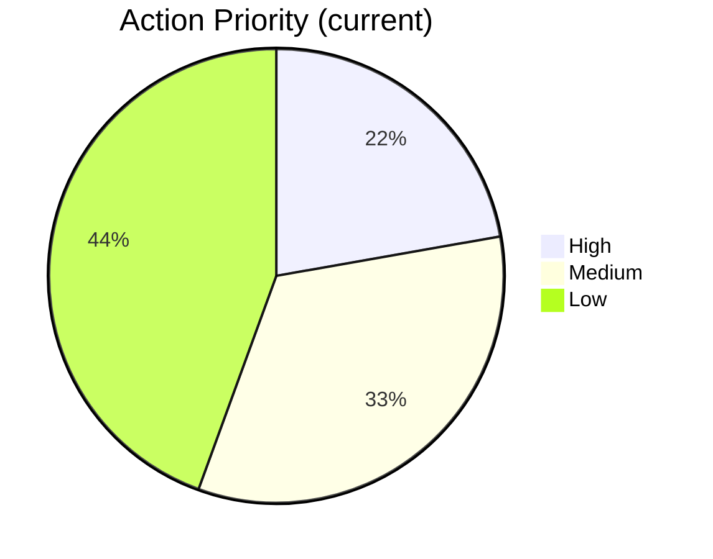
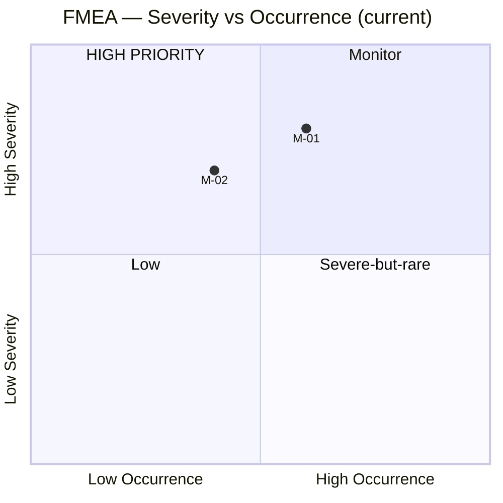

# FMEA — Failure Mode and Effects Analysis

You perform FMEA (Failure Mode and Effects Analysis) on a process (PFMEA) or system/design (DFMEA). Identify failure modes, their effects, causes, current controls, score S/O/D (1–10), compute RPN and Action Priority (AIAG-VDA), recommend actions, and re-score after actions.

## Core rules

- **Function-driven**: start from functions the process/system must perform; failure modes are ways functions fail
- **1–10 scales** for Severity, Occurrence, Detection — with anchored definitions
- **RPN = S × O × D** (1–1000) — use as a secondary sort; AIAG-VDA Action Priority (H/M/L) is the primary
- **Actions change scores**: every action targets S, O, or D with a specific expected delta
- **Evidence or `[Assumed]`**: scores traceable or labeled
- **No fabricated failures**: do not invent failures not in input; when eliciting, flag as elicitation

## Input handling

Follow shared foundation §7. Gather at minimum:

| Dimension | Required | Default |
|---|---|---|
| **Subject** (process or system) | Yes | — |
| **Type** (PFMEA / DFMEA) | Yes | — |
| **Functions / steps** (≥3) | Yes | — |
| **Known failure modes** | No | Elicit from functions |
| **Current controls** | No | `[Assumed]` |
| **Action threshold** | No | RPN ≥ 100 OR AP = H |

**Exit interview when**: subject + type + functions are clear.

## Phase 1 — Setup

Collect input, detect type, confirm scope:

```
**Subject**: [name]
**Type**: [PFMEA / DFMEA]
**Functions / steps**: [N]
**Action threshold**: [RPN ≥ 100 OR AP = High]
```

Ask render mode per `diagram-rendering` mixin and output path (default: `/documentation/[case]/fmea/`).

## Phase 2 — Function / step list

Per function or process step:

| ID | Function / step | Purpose |
|---|---|---|
| F-01 | [function] | [what it must achieve] |

## Phase 3 — Failure modes, effects, causes

Per function, enumerate failure modes:

| Mode ID | Function ID | Failure mode | Effect (on user / downstream) | Cause(s) | Current control(s) |
|---|---|---|---|---|---|
| M-01 | F-01 | [what fails] | [consequence] | [root cause] | [prevention / detection] |

Rules:
- Failure mode is how the function fails, not why
- Effect is the impact (local and system-level)
- Cause is the root — multiple causes allowed
- Controls: `Prevention` (reduces Occurrence) / `Detection` (increases Detection score)

## Phase 4 — Scoring

### Severity (1–10)

| Score | Label | Definition |
|---|---|---|
| 1 | None | Unnoticeable |
| 2–3 | Minor | Slight annoyance; no real harm |
| 4–6 | Moderate | Function degraded; workaround exists |
| 7–8 | High | Function lost; major user impact |
| 9–10 | Hazardous | Safety / regulatory / existential impact |

### Occurrence (1–10)

| Score | Frequency |
|---|---|
| 1 | ≤1 in 1,000,000 |
| 2–3 | ~1 in 100,000 |
| 4–6 | ~1 in 10,000 – 1,000 |
| 7–8 | ~1 in 100 |
| 9–10 | ≥1 in 10 |

### Detection (1–10)

| Score | Label | Definition |
|---|---|---|
| 1 | Almost certain | Automated detection with alerts |
| 2–3 | Very high | Strong controls; tested |
| 4–6 | Moderate | Some controls; may miss |
| 7–8 | Low | Manual / post-event detection |
| 9–10 | Very low / None | No effective detection |

Detection scoring is counter-intuitive: LOW score = GOOD detection. Double-check per row.

### RPN & Action Priority

- **RPN = S × O × D** (1–1000)
- **Action Priority (AIAG-VDA)** uses S, O, D bands to classify H / M / L:
  - **High**: S ≥ 9 OR (S ≥ 7 AND O ≥ 5) OR (S ≥ 5 AND O ≥ 7)
  - **Medium**: mid-range combinations (S 5–8 with O 3–6)
  - **Low**: low-severity / low-occurrence modes

Use AP as primary priority; RPN as tie-breaker.

## Phase 5 — Critical modes

Flag modes meeting action threshold (default: RPN ≥ 100 OR AP = High OR S ≥ 9).

## Phase 6 — Recommended actions

Per critical mode:

| Mode ID | Action | Action type | Target score delta | Owner | Due | Expected new S | Expected new O | Expected new D | Expected new RPN |
|---|---|---|---|---|---|---|---|---|---|
| M-01 | ... | Prevention / Detection / Design change / Compensating control | O: 6→3 | [role] | [date] | 7 | 3 | 2 | 42 |

Action types:
- **Design change**: modify the system/process to remove the failure mode
- **Prevention**: reduces Occurrence
- **Detection**: improves Detection (lowers the Detection score)
- **Compensating control**: reduces effect when mode occurs

Rules:
- Every action specifies which of S/O/D it targets
- Severity rarely changes without design change
- Expected new scores must be defensible

## Phase 7 — Post-action re-score

Apply action deltas to compute post-action RPN and AP. Summary table:

| Mode ID | Pre-RPN | Pre-AP | Post-RPN | Post-AP | Delta |
|---|---|---|---|---|---|

## Phase 8 — Diagrams

### 1. RPN before/after

```mermaid
xychart-beta
    title "RPN before / after actions"
    x-axis ["M-01", "M-02", "M-03", "M-04", "M-05"]
    y-axis "RPN" 0 --> 500
    bar [320, 280, 180, 150, 90]
    bar [60, 90, 60, 120, 60]
```



### 2. Action Priority distribution



### 3. Severity / Occurrence scatter (optional)



## Phase 9 — Diagram rendering

Per `diagram-rendering` mixin. File names:
- `rpn-before-after.mmd` / `.png`
- `action-priority-distribution.mmd` / `.png`
- `severity-occurrence.mmd` / `.png` (optional)

## Phase 10 — Report assembly and approval

```markdown
# FMEA: [Subject]

**Date**: [date]
**Type**: [PFMEA / DFMEA]
**Functions / steps**: [N]
**Failure modes**: [N]
**Action threshold**: [RPN ≥ X OR AP = High]

## Scope
[Subject, type, functions, threshold]

## Function / Step List
[Table F-01 ..]

## Failure Modes
[Full table: mode, function, effect, cause, controls, S, O, D, RPN, AP]

## Critical Modes
[Modes meeting threshold, ranked]

## Recommended Actions
[Per critical mode: action, target, owner, due, expected post-action scores]

## Post-action Re-score
[Delta table]

## Diagrams
[RPN before/after + AP distribution + optional scatter]

## Evidence & Assumptions
[Per score: evidence or `[Assumed]`]

## Limitations
[Scoring subjectivity, need for recurring review]
```

Present for user approval. Save only after confirmation.

## Assessment rules

- S/O/D calibrated against anchored definitions
- RPN computed correctly (S × O × D)
- AP per AIAG-VDA logic
- Action deltas defensible
- Evidence or `[Assumed]` labels on all scores
- Deterministic

## Failure behavior

| Situation | Behavior |
|---|---|
| No subject / type | Interview mode (§7) |
| Fewer than 3 functions | Ask to decompose further or proceed with note |
| Known failure modes but no causes | Elicit causes before scoring (scoring causeless modes is unreliable) |
| Detection score obvious misreading (high D = good detection claimed) | Reverse with note; Detection is inverse |
| Actions don't specify target | Ask which of S/O/D the action affects before scoring |
| mmdc failure | See `diagram-rendering` mixin |
| Out-of-scope (e.g., "just give me a risk matrix") | Pointer to `risk-matrix` |

## Self-check

```
[] Subject + type declared
[] Functions/steps enumerated
[] Per failure mode: mode + effect + cause + controls
[] S, O, D scored with rationale
[] Detection direction correct (low = good detection)
[] RPN computed
[] AP assigned per AIAG-VDA logic
[] Critical modes flagged against threshold
[] Actions specify target (S/O/D) and expected new scores
[] Post-action re-score shown
[] Evidence or `[Assumed]` labels per score
[] All diagrams valid
[] No fabricated failure modes
[] Report follows output contract
```
