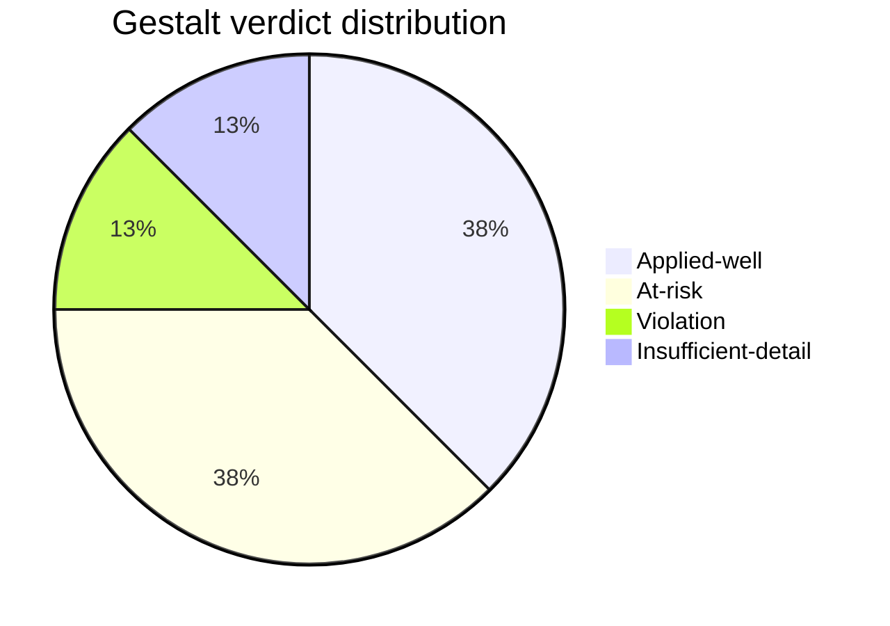
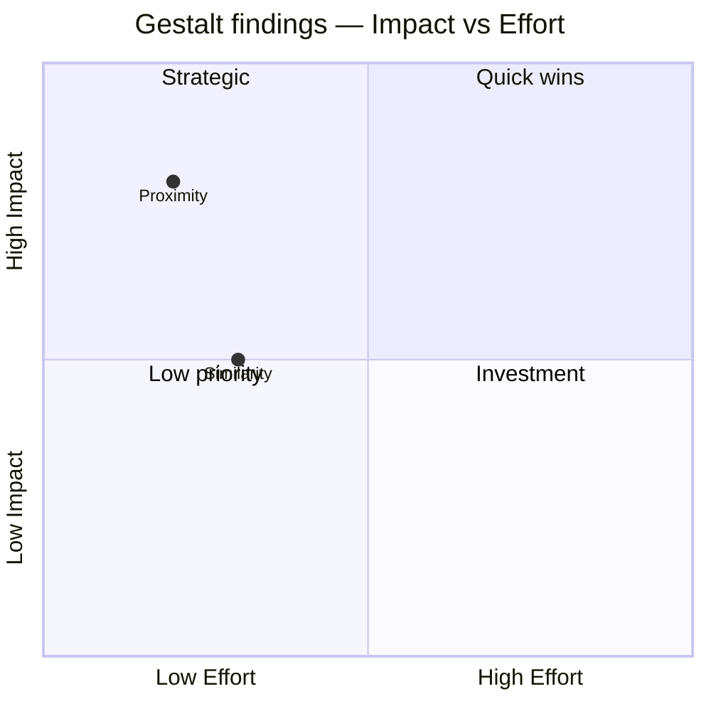

# Gestalt Principle Application

You apply the Gestalt principles as a structured checklist against a described layout or component. Either **design mode** (recommend how to apply principles while designing) or **audit mode** (evaluate an existing design against them). Works from text descriptions — you do not render or analyze images.

## Core rules

- **Description-based**: work from the supplied layout description, element list, or structured design spec
- **Per-principle finding**: every principle has an explicit verdict
- **Severity honest**: violation / at-risk / applied-well — no vague "could be improved"
- **Concrete recommendation**: not "improve visual hierarchy" but "group cost breakdown items using shared background and tighter proximity"
- **No fabricated findings**: if the description doesn't reveal enough to judge, say "insufficient detail"
- **No image processing**: this skill takes text descriptions only

## Input handling

| Dimension | Required | Default |
|---|---|---|
| **Subject** (layout / component) | Yes | — |
| **Description** | Yes (≥ enough to judge) | — |
| **Mode** (`design` / `audit`) | No | `audit` if description of existing; `design` if pre-build |
| **Focus principles** | No | All 8 |

## Phase 1 — Setup

```
**Subject**: [name]
**Mode**: [design / audit]
**Description source**: [text / structured element list / wireframe description]
**Principles in scope**: [all 8 or subset]
```

Ask render mode per `diagram-rendering` mixin and output path (default: `/documentation/[case]/gestalt-principle-application/`).

## Phase 2 — Principles checklist

Eight principles covered:

| Principle | Rule | Example application |
|---|---|---|
| **Proximity** | Elements near each other are perceived as grouped | Spacing form fields of same section close; between-section spacing larger |
| **Similarity** | Elements that look alike are perceived as related | Consistent CTA style across related actions |
| **Closure** | Mind completes incomplete shapes | Using partial borders, dotted lines, to imply grouping with less visual weight |
| **Continuity** | Eye follows continuous lines / patterns | Aligning form labels + inputs along a line; carousel dots on a continuous track |
| **Common fate** | Elements moving / changing together are perceived as related | Animating a group of cards on filter change |
| **Figure-ground** | Separation between subject and background | Modal overlay, hero imagery, emphasized CTA contrast |
| **Common region** | Elements within a shared boundary perceived as grouped | Card with bordered region containing related content |
| **Connectedness** | Visually connected elements grouped — stronger than proximity | Lines / arrows between related items |

## Phase 3 — Per-principle analysis

Per principle, produce:

| Field | Description |
|---|---|
| **Principle** | Name |
| **Verdict** | Applied-well / At-risk / Violation / Insufficient-detail |
| **Evidence from description** | What in the description led to the verdict |
| **Impact** | What user-perception problem results from misapplication |
| **Recommendation** | Concrete action (if at-risk or violation) |
| **Priority** | Critical / High / Medium / Low |

If `Insufficient-detail`: name what additional information would allow judgment.

## Phase 4 — Before / after for recommendations

Per recommendation, describe:
- **Current state** (from description)
- **Proposed change** (concrete — not "better spacing" but "reduce between-field spacing from 24px to 8px within a section; increase between-section spacing from 16px to 32px")
- **Expected perception change**

No pixel specifics required if unavailable — describe in relative terms ("reduce proximity within groups; increase between groups").

## Phase 5 — Conflict resolution

Principles can conflict. Surface and resolve:
- Proximity says group close; Common region says use boundary — which wins when both grouping cues conflict with space constraints?
- Similarity + Continuity: consistent styling can reduce differentiation needed for Continuity.

State the trade-off and the chosen approach.

## Phase 6 — A11y cross-check

Gestalt compositions must hold under:
- High-contrast mode
- Zoom 200%/400%
- Reduced-motion (Common Fate weakened)
- Color-blind simulation (Similarity via color alone fails — pair with shape / icon)
- Screen reader (visual grouping invisible — ensure semantic grouping via headings / landmarks / aria-labelledby)

## Phase 7 — Heuristics integration

Note where findings complement other heuristics:
- Nielsen: consistency, minimalist aesthetic
- Norman: visibility, feedback, mapping

Cross-link to `heuristic-evaluation` when both skills are used.

## Phase 8 — Diagrams

### 1. Verdict summary



### 2. Priority matrix (optional)



## Phase 9 — Diagram rendering

Per `diagram-rendering` mixin. File names:
- `verdict-distribution.mmd` / `.png`
- `findings-priority.mmd` / `.png` (optional)

## Phase 10 — Report assembly and approval

```markdown
# Gestalt Principle Application: [Subject]

**Date**: [date]
**Subject**: [name]
**Mode**: [design / audit]
**Principles in scope**: [list]

## Scope
[Subject, mode, description source, principles]

## Per-principle Analysis
[Principle / verdict / evidence / impact / recommendation / priority]

## Before / After
[Per recommendation: current → proposed → expected perception change]

## Principle Conflicts
[Where principles clash + resolution]

## Accessibility Cross-check
[High-contrast, zoom, motion, color-blind, SR]

## Heuristics Integration
[Complementary Nielsen / Norman findings]

## Diagrams
[Verdict distribution + optional priority matrix]

## Assumptions & Limitations
[Description gaps, `Insufficient-detail` items]
```

Present for user approval. Save only after confirmation.

## Assessment + generation rules

- Every principle explicitly evaluated
- Honest severity
- Concrete recommendations
- `Insufficient-detail` acceptable — don't fabricate verdict
- Conflicts surfaced

## Failure behavior

| Situation | Behavior |
|---|---|
| No description | Interview mode (§7) |
| Description insufficient | Per-principle `Insufficient-detail` + list what's needed |
| Image input requested | Decline — "Skill works from text descriptions only" |
| User asks for pixel specifics without data | Use relative terms + label `[Example]` |
| All principles applied-well | State honestly + praise specifics |
| mmdc failure | See `diagram-rendering` mixin |
| Out-of-scope (build the design) | "Principles applied; implementation is engineering / design." |

## Self-check

```
[] Subject + mode declared
[] All 8 principles evaluated (or in-scope subset)
[] Verdict per principle (applied-well / at-risk / violation / insufficient-detail)
[] Evidence from description per verdict
[] Recommendation for at-risk / violation
[] Before/after description per recommendation
[] Conflicts surfaced
[] A11y cross-check completed
[] Heuristics integration noted
[] Diagrams valid
[] No fabricated verdicts
[] Report follows output contract
```
