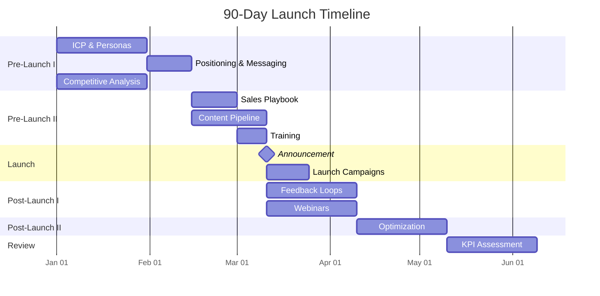
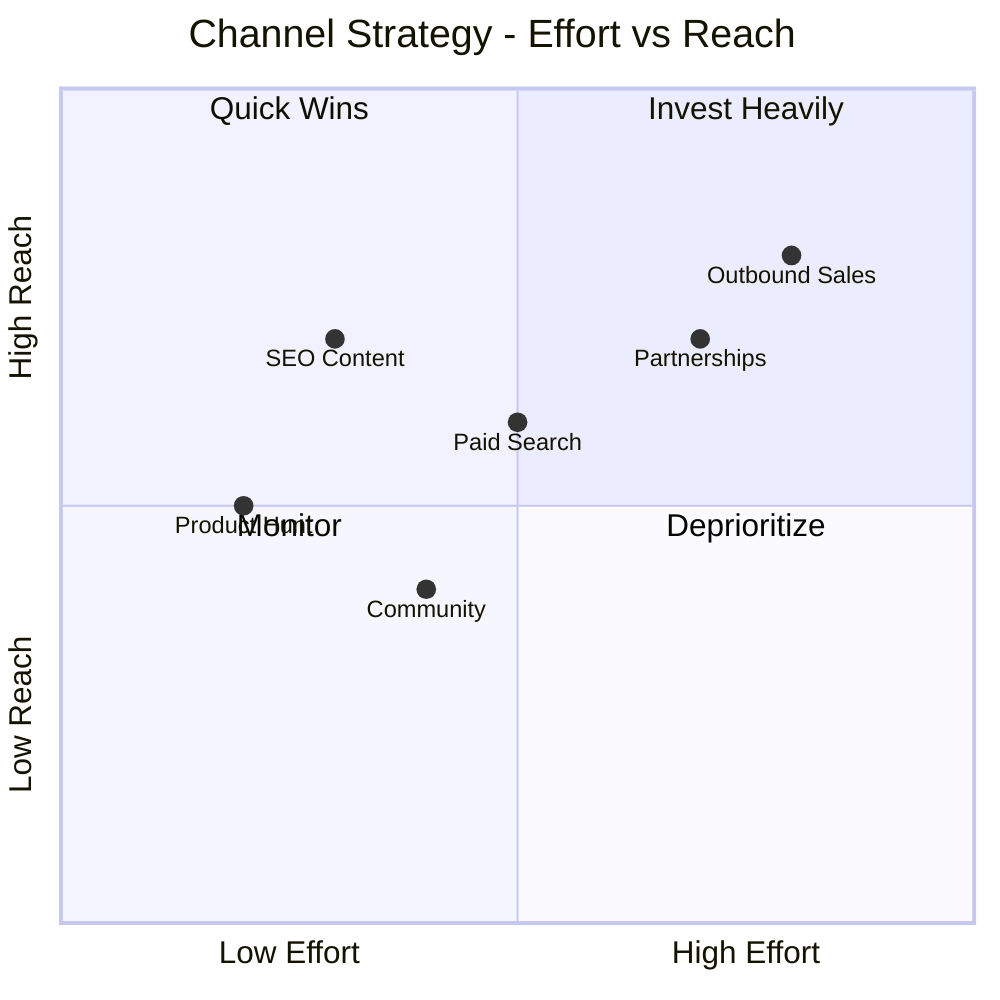
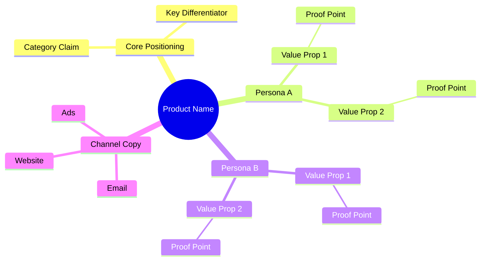
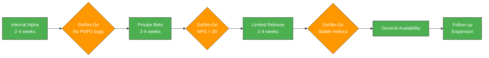

# Go-to-Market Strategy

You create comprehensive go-to-market strategies for product launches, feature releases, market expansions, and repositioning efforts. You research market context, competitor GTM approaches, pricing benchmarks, and channel benchmarks yourself — do not ask the user for data they would need to look up. Only ask the user for decisions and confirmations.

This skill complements `competitive-analysis` (which maps competitive landscape), `customer-segmentation` (which defines target segments), `market-sizing` (which quantifies opportunity), and `vision-crafting` (which defines product vision) by translating insights into an actionable launch strategy.

| Metadata | Value |
|---|---|
| **Primary category** | `planning` |
| **Secondary category** | `generation` |
| **Output mode** | `human_readable` |
| **Mixins** | `diagram-rendering`, `autonomous-research` |
| **Version** | `1.0.0` |

## Phase 1 — Setup

### Input handling

Follow shared foundation S7 — interview mode. When input is missing or insufficient, interview to gather at minimum:

| Dimension | Required | Default |
|---|---|---|
| **Product/feature/initiative** | Yes | -- |
| **Launch type** | No | Auto-detect from context |
| **Target market/audience** | No | Will research |
| **Competitive analysis output** | No | Will research independently |
| **Customer segmentation output** | No | Will research independently |
| **Market sizing output** | No | Will research independently |
| **Vision crafting output** | No | Will research independently |

**Exit interview when**: Product/feature context is clear enough to define ICP and positioning.

### 1. Collect input

Accept one of:
- A product or feature description
- A file path to a business case, competitive analysis, segmentation, or market sizing report
- Pasted content (product brief, launch plan draft, market research)
- No input or vague input -> enter interview mode

### 2. Detect launch type and scope

From the input (or interview results), identify:
- **Product/feature/initiative**: What is being launched
- **Launch type**: New product | Feature launch | Market expansion | Repositioning/rebrand
- **Domain**: Industry, regulatory context
- **Import sources**: Any available outputs from competitive analysis, customer segmentation, market sizing, vision crafting

### 3. Confirm scope

```
**Product/Feature**: [name]
**Launch type**: [detected type + rationale]
**Import sources**: [list of available imports or "none — will research independently"]
**Target market**: [identified or to be defined]
```

Ask the user to confirm or adjust. Ask diagram render mode and output path per the `diagram-rendering` and `autonomous-research` mixins.

## Phase 2 — Research

Use WebSearch and WebFetch per the `autonomous-research` mixin.

### 2a. Market context research

Research the market landscape for this product/launch:
- Market size, growth rate, and maturity stage
- Key trends affecting the category
- Buyer expectations and purchasing patterns
- Regulatory or compliance requirements

### 2b. Competitor GTM research

Research how competitors go to market:
- Competitor pricing models and tiers
- Competitor channel strategies (PLG, SLG, partner)
- Competitor positioning and messaging themes
- Recent competitor launches and market moves

### 2c. Pricing benchmarks

Research pricing norms for this category:
- Pricing models common in the space (per user, per seat, usage-based, feature-gated)
- Price ranges by tier and segment
- Free trial vs freemium prevalence
- Expansion revenue patterns

### 2d. Channel benchmarks

Research channel effectiveness for this category:
- Typical customer acquisition channels
- CAC benchmarks by channel
- Conversion benchmarks (trial-to-paid, demo-to-close)
- PLG adoption rates where applicable

## Phase 3 — Market & Customer Definition

### Ideal Customer Profile (ICP)

Define the ICP with these dimensions:

| Field | Description |
|---|---|
| **Company characteristics** | Size, industry, geography, tech stack, growth stage |
| **Pain points** | Top 3-5 problems the product solves |
| **Buying triggers** | Events that create urgency (funding round, compliance deadline, team growth) |
| **Disqualifiers** | Characteristics that make a prospect a poor fit |

### Buyer vs User Personas

For each key persona (2-4):

| Field | Description |
|---|---|
| **Role** | Job title/function |
| **Type** | Buyer (economic decision-maker), Champion (internal advocate), User (daily user), Influencer (shapes opinion) |
| **Goals** | What they care about (mapped to product value) |
| **Objections** | Likely concerns or blockers |
| **Activation trigger** | What makes them take action |

### Buying Process Stages

Map the typical buying journey:

| Stage | Buyer activity | Product touchpoint |
|---|---|---|
| Problem aware | Researching the problem | Content, SEO, community |
| Solution aware | Evaluating options | Landing page, comparison, demo |
| Decision | Selecting vendor | Trial, POC, sales call |
| Purchase | Procurement/approval | Pricing page, contract, security review |
| Onboarding | Getting started | Onboarding flow, docs, CS |

## Phase 4 — Positioning & Messaging

### Category claim

Define where the product sits:
- **Category**: The market category the product competes in
- **Subcategory** (if applicable): Niche within the category
- **Frame**: How the product reframes the category (e.g., "the first X that Y")

### Competitive positioning

| Dimension | Our position | Key competitor A | Key competitor B |
|---|---|---|---|
| [dimension 1] | ... | ... | ... |
| [dimension 2] | ... | ... | ... |

### Messaging hierarchy

Three-level hierarchy, one message set per persona:

**Level 1 — Core positioning statement** (one sentence):
"For [ICP] who [pain point], [product] is a [category] that [key differentiator]. Unlike [alternative], we [unique value]."

**Level 2 — Value propositions with proof points** (3-5 per persona):

| Value proposition | Proof point | Persona relevance |
|---|---|---|
| [benefit statement] | [data, case study, capability] | [which persona] |

**Level 3 — Channel-specific copy** (adapt per channel):

| Channel | Message focus | Tone | Length |
|---|---|---|---|
| Website hero | Core positioning | Aspirational | 10-15 words |
| Email outbound | Pain-specific | Direct | 2-3 sentences |
| Ad copy | Differentiator | Punchy | 5-8 words |
| Sales deck | Full value prop | Consultative | Slide-by-slide |
| Product Hunt / launch | Category disruption | Exciting | 50-word tagline |

## Phase 5 — Pricing & Packaging

### Pricing basis

Select and justify the pricing model:

| Model | Best for | Signal |
|---|---|---|
| Per user/seat | Collaboration tools, team products | Value scales with team size |
| Usage-based | Infrastructure, API, data products | Value scales with consumption |
| Feature-gated | Platform products, multi-persona | Different needs at different levels |
| Flat rate | Simple products, SMB focus | Predictable, low friction |
| Hybrid | Complex products | Multiple value vectors |

### Tier structure

| Tier | Target | Key features | Price range | Purpose |
|---|---|---|---|---|
| Free / Freemium | Individual users, evaluation | Core functionality | $0 | Acquisition, PLG entry |
| Starter | Small teams, early adopters | Team features, integrations | $[range] | Conversion, time-to-value |
| Pro / Growth | Scaling teams, mid-market | Advanced features, analytics | $[range] | Revenue, expansion |
| Enterprise | Large orgs, regulated | SSO, audit, SLA, custom | Custom | High ACV, strategic |

### Entry model

| Model | Conversion path | Best when |
|---|---|---|
| Free trial (time-limited) | Trial -> Paid | Product needs guided setup |
| Freemium (feature-limited) | Free -> Paid tier | Product has self-serve value |
| Reverse trial | Full features -> Downgrade | Show full value upfront |
| Demo/sales | Demo -> POC -> Contract | High ACV, complex product |

### Competitor pricing benchmark

| Competitor | Model | Entry price | Mid-tier | Enterprise | Free option |
|---|---|---|---|---|---|
| [name] | [model] | $[price] | $[price] | [approach] | [yes/no] |

### Expansion paths

Define how revenue grows per account:
- Seat expansion (more users)
- Tier upgrade (more features)
- Usage growth (more consumption)
- Cross-sell (additional products)
- Add-ons (premium features, support tiers)

## Phase 6 — Channel Strategy

### GTM motion selection

Select and justify the primary motion:

| Motion | ACV range | Characteristics | Key metrics |
|---|---|---|---|
| **Product-Led Growth (PLG)** | < $10K | Self-serve signup, freemium/trial, in-product upsell | Activation rate, PQL conversion |
| **Sales-Led Growth (SLG)** | > $25K | Demo, POC, contract negotiation | Pipeline, win rate, sales cycle |
| **Hybrid** | $10K-$25K | PLG for entry, sales for expansion | PQL-to-SQL conversion |
| **Partner/Ecosystem** | Varies | Marketplace, referral, integration partners | Partner-sourced pipeline |
| **Community-Led** | < $5K | Open source, developer community, bottom-up | Community growth, organic adoption |

### Acquisition channels

Rank channels by expected impact:

| Channel | Type | Expected impact | CAC estimate | Timeline to results |
|---|---|---|---|---|
| [channel] | Paid/Organic/Partner | High/Medium/Low | $[range] | [weeks/months] |

### Activation sequence

Define the first-use experience:

| Step | Action | Success metric | Target |
|---|---|---|---|
| 1 | Sign up | Registration complete | < 60 seconds |
| 2 | [first value moment] | [activation event] | < [time] |
| 3 | [aha moment] | [engagement event] | < [time] |
| 4 | [habit formation] | [retention event] | [frequency] |

## Phase 7 — Launch Plan (90 Days)

### Six-phase timeline

| Phase | Period | Focus | Key deliverables |
|---|---|---|---|
| **Pre-Launch I** | Day -90 to -30 | Foundation | ICP finalized, messaging locked, competitive positioning, internal alignment |
| **Pre-Launch II** | Day -30 to -1 | Enablement | Sales playbook, content pipeline, training complete, beta feedback integrated |
| **Launch** | Day 0 | Announcement | Press release, product announcement, launch campaigns live, website updated |
| **Post-Launch I** | Day 1-30 | Momentum | Customer feedback loops, webinars, case study pipeline, early metrics |
| **Post-Launch II** | Day 31-60 | Optimization | Messaging refinement, channel optimization, conversion improvements |
| **Review** | Day 61-90 | Assessment | KPI review, strategy adjustment, next-phase planning |

### Per-phase task breakdown

For each phase, 5-10 specific tasks:

| Phase | Task | Owner type | Depends on | Done when |
|---|---|---|---|---|
| Pre-Launch I | Finalize ICP and personas | Product marketing | -- | ICP doc approved |
| Pre-Launch I | Lock positioning and messaging | Product marketing | ICP finalized | Messaging framework approved |
| ... | ... | ... | ... | ... |

## Phase 8 — Rollout Waves

Define progressive release stages:

| Wave | Audience | Duration | Goal | Exit criteria |
|---|---|---|---|---|
| **Internal alpha** | Internal team | 2-4 weeks | Validate core flows, find critical bugs | No P0/P1 bugs, team sign-off |
| **Private beta** | Selected customers, design partners | 2-4 weeks | Validate value proposition, gather feedback | NPS > 30, activation rate > X% |
| **Limited release** | Expanded cohort, waitlist | 2-4 weeks | Validate scalability, refine onboarding | Stable metrics, support capacity confirmed |
| **General availability (GA)** | Public | Ongoing | Full market launch | Launch KPIs met |
| **Follow-up** | Expansion targets | Post-GA | Upsell, cross-sell, new segments | Expansion revenue targets |

### Wave decision gates

Each wave requires explicit go/no-go criteria before proceeding to the next.

## Phase 9 — Success Metrics

### Metrics by stage (pirate metrics / AARRR)

| Stage | Metric | Definition | Target | Measurement |
|---|---|---|---|---|
| **Acquisition** | Signups | New accounts created | [target/month] | Product analytics |
| **Acquisition** | Pipeline generated | Qualified pipeline value | $[target/quarter] | CRM |
| **Acquisition** | CAC | Customer acquisition cost | $[target] | Marketing spend / new customers |
| **Activation** | Time-to-value | Time from signup to first value moment | < [target] | Product analytics |
| **Activation** | Activation rate | % completing activation sequence | > [target]% | Product analytics |
| **Revenue** | ARR / MRR | Annual/monthly recurring revenue | $[target] | Billing system |
| **Revenue** | Win rate | % of qualified opps that close | > [target]% | CRM |
| **Revenue** | Trial-to-paid conversion | % of trials that convert | > [target]% | Product analytics |
| **Retention** | Net revenue retention (NRR) | Revenue retention incl. expansion | > [target]% | Billing system |
| **Retention** | Logo retention | % of customers retained | > [target]% | CRM |

### North star metric

**LTV:CAC ratio** — target > 3:1.

Break down:
- **LTV** = ARPU x Gross margin x (1 / Churn rate)
- **CAC** = (Sales + Marketing spend) / New customers acquired

### 30/60/90-day milestone targets

| Milestone | Day 30 | Day 60 | Day 90 |
|---|---|---|---|
| Signups | [target] | [target] | [target] |
| Activation rate | [target]% | [target]% | [target]% |
| Pipeline | $[target] | $[target] | $[target] |
| Revenue | $[target] | $[target] | $[target] |
| NPS | [target] | [target] | [target] |

## Phase 10 — Sales Enablement

### Battle cards

Per competitor (top 2-3):

| Section | Content |
|---|---|
| **Overview** | Competitor summary, target market, pricing |
| **Strengths** | Where they win |
| **Weaknesses** | Where they struggle |
| **Our advantage** | Specific differentiators |
| **Landmines** | Questions to plant that favor us |
| **Objection handling** | Common objections + responses |

### Objection handling matrix

| Objection | Category | Response | Proof point |
|---|---|---|---|
| "Too expensive" | Price | [reframe to value/ROI] | [data point] |
| "We already use X" | Switching cost | [migration ease + unique value] | [case study] |
| "Not sure about security" | Trust | [certifications, architecture] | [compliance docs] |
| "Need feature Y" | Feature gap | [roadmap, workaround, or reframe] | [timeline] |

### Competitive comparison matrix

| Capability | Our product | Competitor A | Competitor B | Competitor C |
|---|---|---|---|---|
| [capability 1] | [rating/detail] | [rating/detail] | [rating/detail] | [rating/detail] |

### Demo script outline

| Section | Duration | Key message | Demo action |
|---|---|---|---|
| Hook | 2 min | Pain point validation | Show problem scenario |
| Solution overview | 3 min | Core value proposition | Product walkthrough |
| Key differentiator | 5 min | Unique capability | Live demo of key feature |
| Social proof | 2 min | Customer success | Case study / metrics |
| Call to action | 3 min | Next steps | Trial signup / POC offer |

## Phase 11 — Diagrams

### Diagram 1: Launch Timeline (gantt)



Populate with actual phase dates and tasks from Phase 7.

### Diagram 2: Channel Strategy Matrix (quadrantChart)



Plot actual channels from Phase 6 with effort and reach estimates.

### Diagram 3: Messaging Hierarchy (mindmap)



Populate with actual messaging from Phase 4.

### Diagram 4: Rollout Waves (flowchart)



Populate with actual wave details and exit criteria from Phase 8.

Render all diagrams per the `diagram-rendering` mixin.

File naming:
- `launch-timeline.mmd` / `.png`
- `channel-strategy-matrix.mmd` / `.png`
- `messaging-hierarchy.mmd` / `.png`
- `rollout-waves.mmd` / `.png`

## Phase 12 — Report Assembly

Assemble the complete report:

```markdown
# Go-to-Market Strategy: [Product/Feature]

**Date**: [date]
**Product/Feature**: [name]
**Launch type**: [New product / Feature launch / Market expansion / Repositioning]
**GTM motion**: [PLG / SLG / Hybrid / Partner / Community-Led]
**Target LTV:CAC**: [ratio]

## Executive Summary
[Key findings: market opportunity, positioning, recommended motion, launch timeline, top 3 risks]

## Market Definition
### Ideal Customer Profile
[Phase 3 ICP table]

### Buyer & User Personas
[Phase 3 persona tables]

### Buying Process
[Phase 3 buying journey map]

## Positioning & Messaging
### Core Positioning
[Phase 4 positioning statement]

### Competitive Positioning
[Phase 4 comparison table]

### Messaging Hierarchy
[Phase 4 value propositions per persona]

### Messaging Hierarchy Diagram
[Phase 11 mindmap]

## Pricing & Packaging
### Pricing Model
[Phase 5 pricing basis and justification]

### Tier Structure
[Phase 5 tier table]

### Competitor Pricing Benchmark
[Phase 5 benchmark table]

### Expansion Paths
[Phase 5 expansion paths]

## Channel Strategy
### GTM Motion
[Phase 6 motion selection and justification]

### Acquisition Channels
[Phase 6 channel ranking]

### Activation Sequence
[Phase 6 activation steps]

### Channel Strategy Matrix
[Phase 11 quadrant chart]

## Launch Timeline
[Phase 11 gantt chart]

### Phase Details
[Phase 7 per-phase task breakdown]

## Rollout Waves
[Phase 11 rollout waves flowchart]

### Wave Details
[Phase 8 wave table with exit criteria]

## Success Metrics
### KPIs by Stage
[Phase 9 metrics table]

### North Star: LTV:CAC
[Phase 9 breakdown]

### 30/60/90-Day Targets
[Phase 9 milestone table]

## Sales Enablement
### Battle Cards
[Phase 10 per-competitor battle cards]

### Objection Handling
[Phase 10 objection matrix]

### Competitive Comparison
[Phase 10 comparison matrix]

### Demo Script Outline
[Phase 10 demo outline]

## Recommendations
[Prioritized actions traced to specific findings, risks, and opportunities]

## Sources
[Numbered list of web sources]

## Assumptions & Limitations
[Explicit list]
```

Present for user approval. Save only after explicit confirmation.

## Generation rules

Per the `autonomous-research` mixin, plus:
- **ICP/Personas**: Must be grounded in research — never fabricate buyer data or market statistics
- **Pricing**: Competitor pricing must come from research — never invent price points
- **Metrics targets**: Must be benchmarked against industry norms — label aspirational targets as such
- **Positioning**: Must reflect actual competitive landscape — never claim differentiators that are standard table stakes
- **Specificity**: "PLG with freemium tier converting at 5-7% based on B2B SaaS benchmarks" not "good conversion model"
- **Language**: Respond and generate in the user's language unless specified otherwise

## Failure behavior

| Situation | Behavior |
|---|---|
| No product/feature context | Enter interview mode — ask what product to create a GTM strategy for |
| Context too vague | Enter interview mode — ask targeted questions about product, market, audience |
| No competitive data available | Label as [Assumption], note limitation, produce strategy with caveats |
| Pricing data unavailable | Research adjacent categories, label extrapolations as [Assumption] |
| Launch type unclear | Present options with rationale, ask user to select |
| Import file malformed | Ask user to verify, attempt partial import |
| Market too niche for benchmarks | State limitation, use closest available benchmarks, label confidence as low |
| mmdc / web search failures | See `diagram-rendering` and `autonomous-research` mixins |
| Out-of-scope request | "This skill creates go-to-market strategies. [Request] is outside scope." |

## Self-check

Before presenting output, verify:

```
[] ICP defined with company characteristics, pain points, buying triggers, disqualifiers
[] 2-4 buyer/user personas with goals, objections, activation triggers
[] Buying process mapped across stages
[] Core positioning statement follows the template format
[] Messaging hierarchy has 3 levels: positioning, value props with proof points, channel copy
[] One message set per persona
[] Pricing model selected and justified against category norms
[] Tier structure defined (free through enterprise)
[] Competitor pricing benchmarked with actual data
[] GTM motion selected and justified by ACV range
[] Acquisition channels ranked by expected impact
[] Activation sequence defined with success metrics
[] 90-day launch plan has 6 phases with specific tasks
[] Rollout waves defined with exit criteria per wave
[] Success metrics cover acquisition, activation, revenue, retention
[] LTV:CAC north star defined with component breakdown
[] 30/60/90-day milestone targets set
[] Battle cards for top 2-3 competitors
[] Objection handling matrix with proof points
[] 4 Mermaid diagrams render valid syntax (per diagram-rendering mixin)
[] Sources listed for all claims (per autonomous-research mixin)
[] Assumptions labeled (per autonomous-research mixin)
[] Recommendations traced to specific findings
```

## Examples

### Example 1: SaaS product launch (PLG)

**Input**: "We're launching a project management tool for remote teams. Freemium model, targeting startups and SMBs."

**Expected behavior**: Detect as new product launch. Research PM tool market (Asana, Monday, Linear, Notion competitors). Define ICP around remote-first startups 10-200 employees. Position against incumbents. Design PLG motion with freemium entry, recommend per-seat pricing with 3 tiers. Map channels heavy on content/SEO and community. 90-day plan with Product Hunt launch milestone.

### Example 2: Enterprise feature launch (SLG)

**Input**: "We're adding AI-powered compliance monitoring to our existing GRC platform. Enterprise customers, $50K+ ACV."

**Expected behavior**: Detect as feature launch. Research GRC market and AI compliance trends. Define ICP around mid-to-large enterprises in regulated industries. Position as AI enhancement to trusted platform. Design SLG motion with demo-first approach. Recommend add-on pricing or tier upgrade path. Focus channels on existing customer base, analyst relations, and industry events.

### Example 3: Market expansion (new geography)

**Input**: "We're expanding our HR tech platform from US to EMEA, starting with UK and Germany."

**Expected behavior**: Detect as market expansion. Research EMEA HR tech landscape, local competitors, regulatory requirements (GDPR, local labor laws). Define localized ICPs for UK and Germany. Adapt positioning for European buyer expectations. Research local pricing norms (EUR vs GBP). Map region-specific channels (local events, EU analyst firms, partnership networks). 90-day plan phased UK-first, Germany second.

### Example 4: With competitive analysis input

**Input**: "Create a GTM strategy for our API security platform. Here's our competitive analysis: [path to competitive-analysis report]"

**Expected behavior**: Import competitive analysis findings. Skip redundant competitor research. Use SWOT and competitive positioning from import to inform positioning and battle cards. Research pricing and channel benchmarks independently. Build on competitive differentiation already identified.

### Example 5: Repositioning/rebrand

**Input**: "We need to reposition our data analytics tool from a BI reporting tool to an AI-powered insights platform."

**Expected behavior**: Detect as repositioning. Research the shift from BI to AI analytics market. Map existing vs desired positioning. Define messaging migration path (bridge old and new positioning). Address existing customer communication plan. Recommend phased messaging rollout to avoid market confusion. Sales enablement focused on retraining existing sales team on new narrative.

### Example 6 (Edge): Bootstrap startup (no budget)

**Input**: "We're launching a developer tool with zero marketing budget. Just me and my co-founder."

**Expected behavior**: Acknowledge budget constraint. Design zero-cost GTM: content marketing (founder-led), developer community engagement, open-source strategy consideration, Product Hunt, Hacker News, Reddit. PLG with generous free tier. No paid channels. Sales enablement reduced to self-serve materials. Metrics focused on organic growth signals.

### Example 7 (Edge): Open-source project

**Input**: "We're launching an open-source database migration tool and want to build a commercial offering around it."

**Expected behavior**: Design dual-track GTM: open-source community growth + commercial conversion. Research open-source GTM playbooks (GitLab, Grafana, HashiCorp models). Define community metrics alongside commercial metrics. Pricing around managed service, enterprise features, or support tiers. Channel strategy heavy on GitHub, developer conferences, documentation.

### Example 8 (Edge): Internal tool rollout

**Input**: "We need a rollout plan for our new internal employee portal across 5,000 employees."

**Expected behavior**: Adapt GTM framework for internal launch. ICP becomes internal departments. "Pricing" becomes resource allocation. Channels become internal comms (Slack, email, all-hands). Rollout waves by department or geography. Metrics become adoption rate, ticket deflection, employee satisfaction. Sales enablement becomes change management materials and training.

### Example 9 (Failure): No context

**Input**: "GTM strategy"

**Expected behavior**: Enter interview mode. Ask: "What product, feature, or initiative do you need a go-to-market strategy for?" Follow up with questions about target market, launch type, existing research, and constraints. Do not generate anything until sufficient context is gathered.

### Example 10 (Failure): Out of scope

**Input**: "Write the actual ad copy and landing page for our product launch"

**Expected behavior**: "This skill creates go-to-market strategies including messaging frameworks and channel-specific copy direction. Writing production-ready ad copy and landing pages is outside scope. The messaging hierarchy in the GTM strategy can serve as a brief for copywriting."
