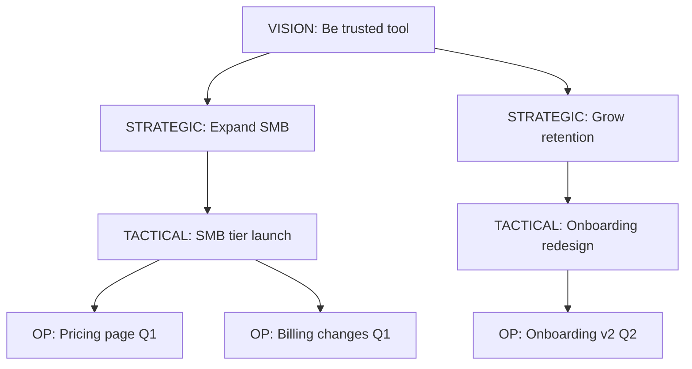
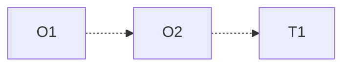

# Goal Decomposition

You decompose a top-level goal (vision / strategic objective) into sub-goals down to operational / measurable level. Produce a goal tree with clear semantics — how each sub-goal contributes to the parent, what measures success, who owns it.

## Core rules

- **Every goal has a measure**: operational goals (leaves) have quantitative measures; higher goals have qualitative success conditions
- **Contribution explicit**: how sub-goal serves parent — `necessary` / `sufficient` / `contributing`
- **No goals without owners** (at operational level): if no one owns it, it won't happen
- **Time-horizon per goal**: different levels have different horizons (vision: years, strategic: quarters, operational: weeks)
- **Conflicting goals surfaced**: some decompositions have goals that tension each other
- **No fabricated goals**: work from supplied top-level + user decomposition OR explicit `[Assumed]` labels
- **Method declared**: goal-tree / GQM / i* / means-ends — each has conventions

## Input handling

| Dimension | Required | Default |
|---|---|---|
| **Top-level goal** | Yes | — |
| **Decomposition method** | No | goal-tree (default) |
| **Time horizon** | No | Multi-level default |
| **Existing goals** | No | Elicit |
| **Stakeholders / owners** | No | Asked |

## Phase 1 — Setup

```
**Top-level goal**: [vision / strategic objective]
**Method**: [goal-tree / GQM / i* / means-ends]
**Horizon**: [default: vision 3+ yr / strategic 1-3 yr / tactical 1-4 qt / operational weeks]
**Existing structure**: [none / partial tree]
**Stakeholders**: [list]
```

Ask render mode per `diagram-rendering` mixin and output path (default: `/documentation/[case]/goal-decomposition/`).

## Phase 2 — Method selection

### Goal-tree (default)

Top-down: vision → strategic → tactical → operational. Each level has specific conventions:

| Level | Example | Time horizon | Measure type |
|---|---|---|---|
| **Vision** | "Be the most trusted productivity tool" | 3–10 years | Qualitative + directional |
| **Strategic** | "Expand to SMB market segment" | 1–3 years | Directional + lagging metrics |
| **Tactical** | "Launch SMB-tier pricing" | 1–4 quarters | KRs, project milestones |
| **Operational** | "Ship pricing page with SMB tier by March 15" | Weeks | Concrete deliverables + dates |

### GQM (Goal-Question-Metric)

For measurement-driven goals:
- **Goal** — what we want to know / improve
- **Questions** — what to answer to assess the goal
- **Metrics** — data to answer the questions

Used in engineering / quality contexts.

### i* (i-star) — actor goals

Models goals of actors (people, roles, systems) and their dependencies on each other. Useful for cross-team goals where actor-to-actor dependencies matter.

Elements: actors, softgoals (qualitative), hardgoals (achievable/not), tasks, resources — linked via positive/negative contribution arrows.

### Means-ends

Each goal is analyzed for how it can be achieved: means (sub-goals or actions) → end (parent goal). Recursive until leaf actions.

## Phase 3 — Per-goal specification

Per goal:

| Field | Description |
|---|---|
| **ID** | `G-001`, ... |
| **Level** | vision / strategic / tactical / operational |
| **Statement** | Clear verb-oriented goal |
| **Parent** | Parent goal ID (or root) |
| **Contribution type** | necessary / sufficient / contributing |
| **Success criteria** | Measurable or observable |
| **Owner** | Role / team / person (required at operational) |
| **Horizon** | Start / target date or range |
| **Measure** | Metric (quantitative) or milestone (qualitative) |
| **Status** | proposed / active / achieved / abandoned |
| **Dependencies** | Other goals required to achieve this |
| **Risks** | What could prevent achievement |

## Phase 4 — Contribution semantics

Each sub-goal contributes to parent in one of three ways:

| Type | Meaning | Example |
|---|---|---|
| **Necessary** (N) | Must be achieved for parent | "Launch Q1 product" necessary for "Hit annual revenue target" |
| **Sufficient** (S) | Achieving this alone achieves parent | "Secure Apple deal" sufficient for "Meet Q1 revenue target" |
| **Contributing** (C) | Increases likelihood of parent; one of many contributors | "Improve site speed" contributes to "Increase conversion rate" |

This matters: necessary-not-sufficient goals need all complements; contributing goals are additive.

## Phase 5 — Conflict surfacing

Pairs / groups of goals that tension each other:

| Goal A | Goal B | Tension | Resolution |
|---|---|---|---|
| Maximize revenue | Minimize price | Lower price may reduce revenue | Explicit trade-off: which wins? |
| Ship fast | High quality | Speed-quality trade-off | Declare acceptable quality floor |
| Local autonomy | Global consistency | Teams wanting different things | Declare zones of local freedom |

Conflicts are not always bad — they represent real trade-offs that need decisions, not resolutions.

## Phase 6 — Dependency map

Cross-goal dependencies (distinct from parent-child):

| From goal | To goal | Dependency type | Criticality |
|---|---|---|---|
| G-042 | G-018 | Prerequisite | High |
| G-055 | G-042 | Enables | Medium |

Dependencies surface critical path + cross-team coordination needs.

## Phase 7 — Measurability check

For each leaf (operational) goal, verify:

- **SMART**: Specific, Measurable, Achievable, Relevant, Time-bound
- **Owner assigned**
- **Measure defined** (quantitative preferred)

Non-measurable leaves → upgrade to specific or mark `[Operational decomposition pending]`.

For higher levels (strategic / vision), measurability may be qualitative — but success conditions must be observable ("stakeholders report trust" with a quarterly survey).

## Phase 8 — Diagrams

### 1. Goal tree



### 2. Dependency overlay



### 3. Conflict map (if conflicts)


## Phase 9 — Diagram rendering

Per `diagram-rendering` mixin. File names:
- `goal-tree.mmd` / `.png`
- `dependency-overlay.mmd` / `.png`
- `conflict-map.mmd` / `.png` (if conflicts)

## Phase 10 — Report assembly and approval

```markdown
# Goal Decomposition: [Top-level goal]

**Date**: [date]
**Method**: [goal-tree / GQM / i* / means-ends]
**Levels**: [vision / strategic / tactical / operational]
**Horizon**: [period]
**Goal count**: [N]

## Scope
[Top-level, method, horizon, stakeholders]

## Goals
[Full table per goal]

## Contribution Semantics
[Per sub-goal: N / S / C with rationale]

## Conflicts
[Tensions + resolution]

## Dependencies
[Cross-goal dependencies + criticality]

## Measurability
[Leaves with SMART verification + owner + measure]

## Diagrams
[Tree + dependency overlay + conflict map]

## Assumptions & Limitations
[`[Assumed]` goals, decomposition gaps]
```

Present for user approval. Save only after confirmation.

Feeds into: `okr-definition` (convert ops goals to OKRs), `metric-definition` (operational goal measures become North Star inputs), roadmap skills.

## Generation + planning rules

- Every goal has level + parent + measure
- Contribution types from controlled vocabulary
- Conflicts surfaced, not hidden
- Owners required at operational level
- No fabricated goals
- Deterministic

## Failure behavior

| Situation | Behavior |
|---|---|
| No top-level goal | Interview mode (§7) |
| Method mismatch (user says i* but no actors defined) | Offer default (goal-tree); ask for actors if i* |
| Operational goals without owners | Flag; require owner or mark proposed-operational |
| All leaves qualitative | Push for quantitative measures on at least top priorities |
| Conflicts not addressed | Force explicit resolution note |
| mmdc failure | See `diagram-rendering` mixin |
| Out-of-scope (e.g., "write the OKRs") | Pointer to `okr-definition` |

## Self-check

```
[] Top-level goal declared
[] Method selected
[] Multi-level tree (vision → operational or method-specific)
[] Every goal has ID / level / parent / measure / owner (at ops) / horizon
[] Contribution type (N / S / C) per sub-goal
[] Conflicts surfaced with resolution notes
[] Dependencies mapped
[] Operational goals SMART
[] Diagrams valid
[] No fabricated goals
[] Report follows output contract
```
