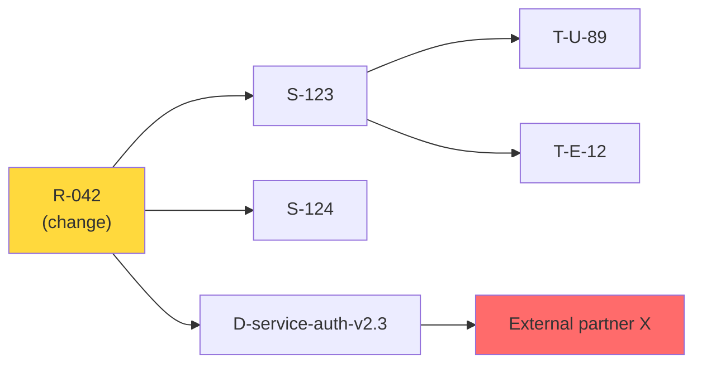
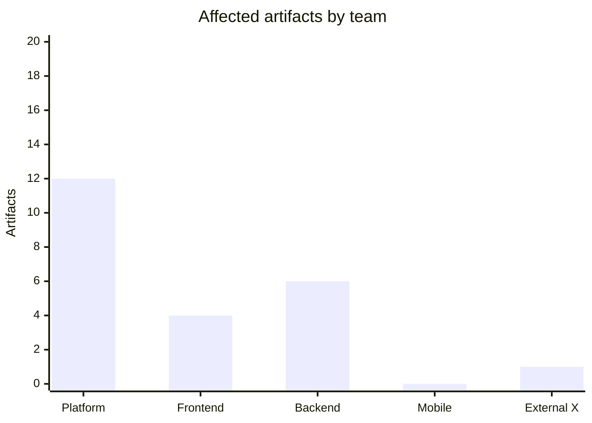

# Impact Analysis

You analyze the impact of a proposed change across a traceability graph. Input: a change with the source artifact(s). Output: affected artifacts, blast radius, effort, risk, phasing recommendation, and communication plan.

## Core rules

- **Change stated explicitly**: type (remove / modify / split / merge / deprecate), scope, rationale
- **Traceability-based**: follow links from `traceability-matrix` (or elicit graph if absent)
- **Both directions**: upstream (what invalidates the change) + downstream (what the change breaks)
- **Named effects, not "many"**: specific artifact IDs, not hand-waving
- **Risk grounded**: per affected artifact, score risk with rationale
- **No fabricated dependencies**: don't invent links not in the supplied graph

## Input handling

| Dimension | Required | Default |
|---|---|---|
| **Proposed change** | Yes (description + type) | — |
| **Source artifact(s)** | Yes (IDs) | — |
| **Traceability graph** | Yes | From `traceability-matrix` or supplied |
| **Change deadline** | No | None |
| **Stakeholders / teams** | No | Inferred |

## Phase 1 — Setup

```
**Change**: [description]
**Change type**: [remove / modify / split / merge / deprecate / rename / reinterpret]
**Source artifacts**: [IDs]
**Graph source**: [`traceability-matrix` output or supplied links]
**Deadline**: [date or "none"]
```

Ask render mode per `diagram-rendering` mixin and output path (default: `/documentation/[case]/impact-analysis/`).

## Phase 2 — Graph walk

Starting from source artifact(s), walk the graph in both directions:

### Downstream walk (what does this change break?)

Follow child links:
- Requirement → Stories implementing it → Tests verifying them → Deployed services → External consumers
- ADR → Requirements / services decided by it
- Goal → Requirements deriving from it

Depth: follow until natural leaves (tests, deployed artifacts, external APIs).

### Upstream walk (what invalidates this change?)

Follow parent links:
- Requirement → Goal it derives from → Business case
- Story → Requirement → ADR
- Test → Story → Requirement (what does this test exist to verify?)

Depth: until root (goals / strategic drivers).

## Phase 3 — Affected artifact list

Per affected artifact:

| Field | Description |
|---|---|
| **ID** | From graph |
| **Direction** | Upstream / Downstream |
| **Distance** | Hops from source |
| **Link type** | `derives-from` / `implements` / `verifies` / ... |
| **Effect** | What specifically changes (content / existence / behavior / contract) |
| **Effort** | S / M / L / XL |
| **Risk** | Low / Medium / High / Critical |
| **Owner** | Role / team |

Rule: "many affected" is not an answer; name them.

## Phase 4 — Blast radius

Summarize:

- **Total affected artifacts** by type
- **Cross-team impact** (teams other than the change owner)
- **External consumers** (partners, customers, public APIs)
- **Compliance scope** (regulated artifacts touched)

Classify overall blast radius:
- **Local** — single team, no external impact
- **Cross-team** — multiple internal teams
- **External** — customers / partners / public API
- **Enterprise** — org-wide standards or multiple departments

## Phase 5 — Risk assessment

Per affected artifact, risk factors:
- **Reversibility**: can we roll back?
- **Detection**: will we see breakage?
- **Blast**: downstream of this artifact
- **Schedule**: does the deadline force rushed integration?
- **Compliance**: regulatory implications

Aggregate into change-level risk (Low / Medium / High / Critical) with per-factor rationale.

## Phase 6 — Effort estimate

Per team + per artifact type:

| Team | Artifact type | Count | Estimated effort |
|---|---|---|---|
| Platform | Tests | 12 | 5 person-days |
| Frontend | Stories | 4 | 8 person-days |
| External (partner X) | API consumer | 1 | Coordination, 3 weeks lead time |

Totals in person-days or person-weeks.

## Phase 7 — Phasing recommendation

Propose phases (not all at once):

| Phase | Scope | Duration | Gate |
|---|---|---|---|
| 1 | Non-breaking shim, parallel support | 2 wk | Shim deployed |
| 2 | Migrate internal consumers | 4 wk | Internal traffic on new |
| 3 | Migrate external consumers | 6 wk | Deprecation notices sent |
| 4 | Remove old path | 2 wk | Telemetry confirms zero use |

Phase boundaries include:
- Decision gates
- Rollback plan per phase
- Communication milestones

## Phase 8 — Communication plan

| Audience | Message | Channel | When |
|---|---|---|---|
| Affected internal teams | Change + impact + timeline | Slack + planning docs | Before phase 1 |
| External API consumers | Deprecation notice + migration guide | Email + changelog | ≥ 3 months before phase 3 |
| Leadership | Blast radius + risk + phasing | Steering update | At kickoff |
| Compliance / legal | Regulatory implications | Written notice | If compliance scope > local |

## Phase 9 — Residual uncertainties

Name items where impact cannot be fully determined:
- Unlinked artifacts (not in trace graph)
- External consumers not inventoried
- Behavioral dependencies beyond documented links

Recommend discovery actions before committing.

## Phase 10 — Diagrams

### 1. Blast radius graph



Color code: source (yellow), high-risk downstream (red).

### 2. Impact by team



## Phase 11 — Diagram rendering

Per `diagram-rendering` mixin. File names:
- `blast-radius.mmd` / `.png`
- `impact-by-team.mmd` / `.png`

## Phase 12 — Report assembly and approval

```markdown
# Impact Analysis: [Change title]

**Date**: [date]
**Change**: [description]
**Change type**: [type]
**Source artifacts**: [IDs]
**Blast radius**: [local / cross-team / external / enterprise]
**Overall risk**: [low / medium / high / critical]

## Scope
[Change + source + graph source + deadline]

## Affected Artifacts
[Table: ID, direction, distance, link type, effect, effort, risk, owner]

## Blast Radius
[Counts by type + cross-team + external + compliance]

## Risk Assessment
[Per-factor rationale aggregating to change-level risk]

## Effort Estimate
[Per team + per artifact type + totals]

## Phasing Recommendation
[Phases with gates + rollback]

## Communication Plan
[Audience → message → channel → when]

## Residual Uncertainties
[Discovery actions before committing]

## Diagrams
[Blast radius + impact-by-team]

## Assumptions & Limitations
[Graph gaps, confidence on inferred links]
```

Present for user approval. Save only after confirmation.

## Extraction + assessment rules

- Follow graph links; never invent
- Name artifacts explicitly
- Risk per factor, aggregated honestly
- Residual uncertainties surfaced

## Failure behavior

| Situation | Behavior |
|---|---|
| No change description | Interview mode (§7) |
| No graph source | Require `traceability-matrix` output or ask for links |
| Graph has known gaps | Produce analysis on what's available, flag gaps |
| External consumers unknown | Flag as residual uncertainty, require discovery |
| Change type unclear | Ask (remove / modify / split / merge / deprecate / rename) |
| mmdc failure | See `diagram-rendering` mixin |
| Out-of-scope ("plan the rollout") | Pointer to `mitigation-strategy-planning` / planning skills |

## Self-check

```
[] Change clearly described with type
[] Source artifacts named
[] Upstream + downstream walks
[] Every affected artifact named (no "many")
[] Per-artifact effect, effort, risk, owner
[] Blast radius classified
[] Change-level risk with per-factor rationale
[] Effort estimate per team + per type
[] Phasing with gates + rollback
[] Communication plan per audience
[] Residual uncertainties surfaced
[] Diagrams valid
[] No invented dependencies
[] Report follows output contract
```
