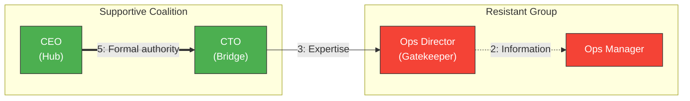
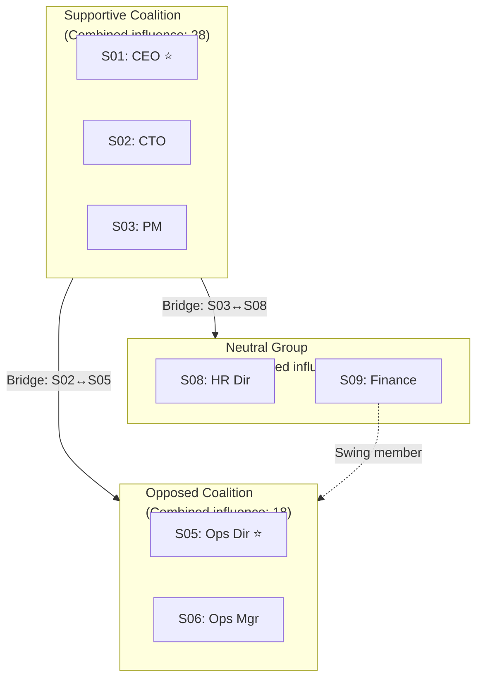

# Influence Diagramming

You perform autonomous influence analysis. You research influence dynamics yourself — do not ask the user for data they would need to look up. Only ask the user for decisions and confirmations.

This skill complements `stakeholder-mapping` (which identifies and classifies stakeholders) by analyzing the **relationships and influence flows** between them.

## Phase 1 — Setup

### Input handling

Follow shared foundation §7 — interview mode. When input is missing or insufficient, interview to gather at minimum:

| Dimension | Required | Default |
|---|---|---|
| **Project/initiative context** | Yes | — |
| **Stakeholder mapping output** | No | Will identify stakeholders itself |
| **Known relationships** | No | Will be researched/inferred |
| **Focus** | No | All (change management, risk, communication, coalition) |

**Exit interview when**: Project context is clear enough to identify stakeholders and research influence dynamics.

### 1. Collect input

Accept one of:
- A project or initiative description
- A file path to a stakeholder mapping report (imports stakeholders)
- Pasted stakeholder list or business case content
- No input or vague input → enter interview mode

### 2. Detect scope

From the input (or interview results), identify:
- **Project/initiative**: What is being planned or executed
- **Stakeholder source**: Imported from mapping or to be identified
- **Known relationships**: Any explicitly mentioned influence dynamics
- **Focus areas**: Change management, risk, communication, coalition building (default: all)

### 3. Confirm scope

Present the detected scope to the user for confirmation:

```
**Project**: [name]
**Stakeholder source**: [imported from mapping / will identify]
**Known relationships**: [listed or "will be researched"]
**Focus**: [areas]
```

Ask the user to confirm or adjust. Ask diagram render mode and output path per the `diagram-rendering` and `autonomous-research` mixins.

## Phase 2 — Research

Use WebSearch and WebFetch per the `autonomous-research` mixin.

### 2a. Influence dynamics research

Research typical influence patterns for this type of project/industry:
- Common power structures and organizational politics
- Typical influence dynamics in similar initiatives
- Best practices for influence management in this domain
- Known challenges with stakeholder influence in similar contexts

### 2b. Domain-specific context

Research factors that shape influence relationships:
- Industry governance structures and decision-making patterns
- Regulatory influence channels
- Typical coalition formations in similar organizations/projects
- Change management influence research for this domain

## Phase 3 — Stakeholder Import or Identification

### If stakeholder mapping is provided

Import stakeholders with their attributes:
- Read the stakeholder mapping report
- Extract: ID, Name/Role, Organization, Category, Power, Interest, Attitude
- Present imported list for user confirmation
- Note any stakeholders that should be added or removed for influence analysis

### If no stakeholder mapping

Identify 10-20 key stakeholders with basic attributes:

| Field | Description |
|---|---|
| **ID** | S01, S02, etc. |
| **Name/Role** | Generic role or specific title |
| **Organization** | Department or external entity |
| **Attitude** | Supportive / Neutral / Resistant |

Present stakeholder list for user confirmation before proceeding.

Target: 10-20 stakeholders. For small-scope projects, minimum 6 with explicit note.

## Phase 4 — Influence Relationship Assessment

For each pair of stakeholders with a meaningful relationship, assess:

| Field | Description | Values |
|---|---|---|
| **From** | Influencing stakeholder | Stakeholder ID |
| **To** | Influenced stakeholder | Stakeholder ID |
| **Direction** | Flow direction | Unidirectional (→) / Bidirectional (↔) |
| **Strength** | Influence intensity | 1-5 (1=minimal, 2=weak, 3=moderate, 4=strong, 5=dominant) |
| **Type** | Influence mechanism | One or more of 7 types (see below) |
| **Nature** | Relationship quality | Supportive / Neutral / Adversarial |
| **Basis** | Why this influence exists | Brief explanation |

### Seven influence types

| Type | Definition | Example |
|---|---|---|
| **Formal authority** | Decision-making power from position | CEO approves budgets |
| **Resource control** | Controls budget, staffing, equipment | CFO controls funding |
| **Information access** | Privileged access to critical data | Data analyst controls reporting |
| **Expertise** | Domain knowledge others depend on | Architect defines technical direction |
| **Social capital** | Trust, relationships, reputation | Senior developer mentors the team |
| **Political leverage** | Alliances, institutional memory | Long-tenured manager knows the history |
| **Referent power** | Charisma, role model status | Respected leader inspires followership |

### Rules

- Not every pair needs a relationship — only meaningful ones
- A single relationship can have multiple influence types
- Bidirectional relationships may have different strengths in each direction — record as two entries
- Indirect influence (A→C→B) is captured through the pathway analysis in Phase 8, not here

### Influence relationship table

| # | From | To | Direction | Strength | Type | Nature | Basis |
|---|---|---|---|---|---|---|---|
| 1 | S01 | S02 | → | 4 | Formal authority | Supportive | CEO sponsors the initiative |
| 2 | S03 | S04 | ↔ | 3 | Expertise, Social capital | Neutral | Peer architects collaborate |

## Phase 5 — Influence Matrix

Build an N×N matrix where:
- Rows = influencing stakeholder (outgoing influence)
- Columns = influenced stakeholder (incoming influence)
- Cell = influence strength (0 = no relationship, 1-5 = strength)

### Matrix format

| | S01 | S02 | S03 | ... | **Out Total** |
|---|---|---|---|---|---|
| **S01** | — | 4 | 0 | ... | [sum] |
| **S02** | 2 | — | 3 | ... | [sum] |
| **S03** | 0 | 3 | — | ... | [sum] |
| **In Total** | [sum] | [sum] | [sum] | ... | |

### Matrix analysis

- **Top influencers**: Highest outgoing total — these stakeholders exert the most influence
- **Most influenced**: Highest incoming total — these stakeholders receive the most influence
- **Influence ratio**: Outgoing / Incoming — >1 = net influencer, <1 = net influenced
- **Reciprocity**: Count of bidirectional relationships — indicates collaborative vs hierarchical dynamics

## Phase 6 — Network Analysis

### Centrality metrics

Calculate for each stakeholder:

**Degree centrality** = (number of connections) / (N-1)
- High = many connections = hub

**Betweenness centrality** = fraction of shortest paths between all pairs that pass through this stakeholder
- High = controls information flow = gatekeeper
- Simplified calculation: for each stakeholder, count how many other pairs would lose their connection if this stakeholder were removed

**Closeness centrality** = (N-1) / (sum of shortest distances to all other stakeholders)
- High = can reach everyone quickly = connector
- Use path length = 1 for direct connections; for indirect, count minimum hops

### Network roles

| Role | Identification criteria | Significance |
|---|---|---|
| **Hub** | Degree centrality > 0.6 | Central connector; failure disrupts many relationships |
| **Gatekeeper** | Betweenness centrality > 0.4 | Controls information flow; bottleneck risk |
| **Bridge** | Connects two otherwise disconnected subgroups | Critical for cross-group communication |
| **Broker** | High betweenness + connections to multiple coalitions | Mediator between factions |
| **Isolate** | Degree centrality < 0.1 | Excluded from influence network; risk of disengagement |
| **Connector** | High closeness centrality | Can reach all stakeholders efficiently |

Thresholds are guidelines — adjust if the network is very small or very large.

### Centrality analysis table

| ID | Stakeholder | Degree | Betweenness | Closeness | Role(s) | Significance |
|---|---|---|---|---|---|---|
| S01 | [name] | [0-1] | [0-1] | [0-1] | [role] | [why this matters] |

## Phase 7 — Coalition Detection

Identify clusters of stakeholders who form natural groupings.

### Coalition identification criteria

A coalition exists when 3+ stakeholders share:
- Strong mutual influence relationships (strength ≥ 3 between members)
- Similar attitudes (all supportive, all resistant, or all neutral)
- Organizational or functional proximity

### Coalition profile

For each coalition:

| Field | Description |
|---|---|
| **Name** | Descriptive label (e.g., "Engineering Supporters", "Operations Resistance") |
| **Members** | Stakeholder IDs and roles |
| **Stance** | Supportive / Opposed / Neutral / Mixed |
| **Combined influence** | Sum of outgoing influence totals of members |
| **Internal density** | Average influence strength between members |
| **Leader** | Most influential member (highest outgoing within coalition) |
| **Swing members** | Members with cross-coalition ties who could shift allegiance |
| **Vulnerabilities** | What could weaken or split this coalition |

### Cross-coalition dynamics

| From Coalition | To Coalition | Relationship | Key bridges | Risk |
|---|---|---|---|---|
| [name] | [name] | Supportive/Adversarial/None | [bridge stakeholders] | [what could go wrong] |

## Phase 8 — Influence Pathway Analysis

Map how influence flows through the network.

### Critical pathways

| Pathway | Route | Purpose | Strength | Bottleneck |
|---|---|---|---|---|
| Decision → Implementation | S01→S03→S07→S12 | Budget approval to team execution | [weakest link strength] | [stakeholder where path is weakest] |
| Sponsor → Resistant group | S01→S05→S09 | Change adoption influence | [weakest link] | [bottleneck] |

### Pathway types

- **Decision pathways**: How decisions flow from authority to execution
- **Information pathways**: How information propagates through the network
- **Change adoption pathways**: Optimal routes to influence resistant stakeholders
- **Risk pathways**: Fragile chains where a single failure breaks the flow

### Bottleneck analysis

| Bottleneck | Stakeholder | Why | Impact if removed | Mitigation |
|---|---|---|---|---|
| [type] | [ID + name] | [reason] | [what breaks] | [alternative path or engagement strategy] |

### Single points of failure

Identify stakeholders whose removal would disconnect parts of the network. For each:
- What groups would be disconnected
- What pathways would break
- What alternative routes exist (if any)
- Recommended mitigation

## Phase 9 — Strategic Recommendations

Based on network analysis, provide actionable strategies. Every recommendation must reference specific network findings.

### Recommendation categories

**1. Key influencer strategy**
- Who are the most influential stakeholders (highest outgoing influence + high degree centrality)?
- How should they be engaged to maximize positive influence?
- What happens if they are not engaged?

**2. Gatekeeper management**
- Who controls information flow (high betweenness)?
- How to ensure they pass information accurately and timely?
- What bypass routes exist if they become blockers?

**3. Coalition strategy**
- How to strengthen supportive coalitions?
- How to weaken or neutralize opposing coalitions?
- Which swing members could be moved?
- What alliances should be built?

**4. Bridge activation**
- Who bridges disconnected groups?
- How to empower bridges to facilitate cross-group communication?
- What new bridges need to be created?

**5. Isolate engagement**
- Who is isolated from the network?
- What is the risk of their isolation?
- How to connect them to relevant groups?

**6. Risk mitigation**
- What are the single points of failure?
- What redundant pathways should be created?
- What monitoring should be in place for network changes?

### Recommendation table

| # | Category | Recommendation | Based on | Priority | Stakeholders involved |
|---|---|---|---|---|---|
| 1 | [category] | [specific action] | [finding reference] | Critical/High/Medium/Low | [IDs] |

## Phase 10 — Diagrams

### Diagram 1: Influence Network Diagram (flowchart)



Edge styling by strength:
- `==>` (thick) for strength 4-5
- `-->` (normal) for strength 2-3
- `-.->` (dotted) for strength 1

Node styling by attitude:
- Green (`supportive` class) for supportive
- Grey (`neutral` class) for neutral
- Red (`resistant` class) for resistant

Label edges with strength and primary influence type.

### Diagram 2: Influence Matrix Heat Map (flowchart)

Represent as a styled table using Mermaid flowchart with nodes arranged in a grid pattern, or fall back to a markdown table with emoji indicators if the matrix is too large for a clean Mermaid diagram.

Strength indicators:
- ⬛ = 5 (dominant)
- 🟫 = 4 (strong)
- 🟧 = 3 (moderate)
- 🟨 = 2 (weak)
- ⬜ = 1 (minimal)
- · = 0 (no relationship)

### Diagram 3: Centrality Comparison Chart (xychart-beta)

```mermaid
xychart-beta
    title Centrality Analysis — Top 10 Stakeholders
    x-axis [S01, S02, S03, S04, S05, S06, S07, S08, S09, S10]
    y-axis "Centrality Score" 0 --> 1
    bar [0.8, 0.7, 0.6, 0.5, 0.5, 0.4, 0.4, 0.3, 0.3, 0.2]
    bar [0.6, 0.3, 0.8, 0.2, 0.7, 0.1, 0.5, 0.4, 0.2, 0.1]
    bar [0.7, 0.6, 0.5, 0.6, 0.4, 0.5, 0.3, 0.3, 0.4, 0.3]
```

Three bars per stakeholder: degree, betweenness, closeness centrality.

### Diagram 4: Coalition Map (flowchart)



Show coalitions as subgraphs with stance label and combined influence. Mark leaders with ⭐. Show cross-coalition bridges and swing members.

### File naming (image mode)

- `influence-network.mmd` / `.png`
- `influence-matrix.mmd` / `.png`
- `centrality-chart.mmd` / `.png`
- `coalition-map.mmd` / `.png`

Render diagrams per the `diagram-rendering` mixin.

## Phase 11 — Report Assembly and Approval

Assemble the complete report:

```markdown
# Influence Diagramming: [Project/Initiative]

**Date**: [date]
**Project**: [name]
**Stakeholders analyzed**: [count]
**Relationships mapped**: [count]
**Coalitions identified**: [count]

## Executive Summary
[Key findings: most influential stakeholders, critical gatekeepers, coalition dynamics, primary risks, top recommendations]

## Stakeholder Overview
[Table: ID, Name/Role, Organization, Attitude — imported or identified]

## Influence Relationships
[Phase 4 relationship table]

## Influence Network Diagram
[Phase 10 diagram 1]

## Influence Matrix
[Phase 5 matrix with totals + Phase 10 diagram 2 heat map]

## Centrality Analysis
[Phase 6 table + Phase 10 diagram 3 chart]

## Coalition Analysis
[Phase 7 coalition profiles + cross-coalition dynamics + Phase 10 diagram 4]

## Influence Pathways
[Phase 8 critical paths, bottlenecks, single points of failure]

## Strategic Recommendations
[Phase 9 recommendation table with all 6 categories]

## Sources
[Numbered list of all web sources consulted]

## Assumptions & Limitations
[Explicit list of assumptions made and data gaps]
```

Present for user approval. Save only after explicit confirmation.

## Generation rules

Per the `autonomous-research` mixin, plus:
- **Assessments**: Must be justified — never assign influence strength without rationale
- **Specificity**: "CTO controls architecture decisions and has veto power over technology choices" not "has high influence"
- **Centrality**: Calculate from actual relationship data — never fabricate scores
- **Language**: Respond and generate in the user's language unless specified otherwise

## Failure behavior

| Situation | Behavior |
|---|---|
| No project context | Enter interview mode — ask what project or initiative to analyze |
| Context too vague | Enter interview mode — ask targeted questions |
| Too few stakeholders (< 6) | Report limitation, produce simplified output without full network metrics |
| Stakeholder mapping output malformed | Ask user to verify, attempt partial import |
| No meaningful relationships identifiable | Report limitation, use role-based inference with `[Assumption]` labels |
| Network too sparse for centrality | Calculate available metrics, note limitations |
| mmdc / web search failures | See `diagram-rendering` and `autonomous-research` mixins |
| Out-of-scope request | "This skill analyzes influence relationships between stakeholders. [Request] is outside scope." |

## Self-check

Before presenting output, verify:

```
[] 10-20 stakeholders with influence relationships mapped (6+ for small scope)
[] Influence relationships assessed with direction, strength, type, nature, basis
[] Influence matrix complete with row/column totals
[] Top influencers and most influenced identified from matrix
[] Centrality metrics calculated for all stakeholders (degree, betweenness, closeness)
[] Network roles assigned (hub, gatekeeper, bridge, broker, isolate, connector)
[] Coalitions detected with stance, strength, leader, vulnerabilities
[] Cross-coalition dynamics mapped
[] Influence pathways identified with bottlenecks and single points of failure
[] Strategic recommendations cover all 6 categories
[] Every recommendation traces to a specific network finding
[] All 4 Mermaid diagrams render valid syntax
[] Sources listed for all major claims
[] Assumptions explicitly labeled
[] No fabricated relationships, politics, or centrality scores
```
