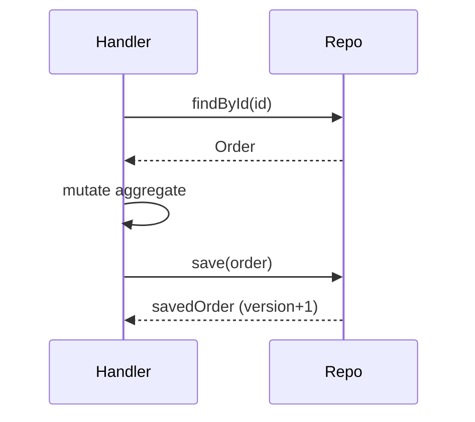
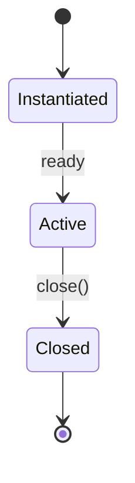

# Interface Specification

You specify a code-level interface (module API, library surface, port) so that implementers + callers agree on meaning, not just shape.

## Core rules

- **Types alone are not a contract** — add pre/postconditions
- **Errors are first-class** — every documented failure mode
- **Stability stated** — `stable` / `experimental` / `deprecated`
- **Examples mandatory** — at least one happy path + one edge
- **Ownership + lifetime** — who can call, when, how long references live
- **No fabricated behavior** — work from supplied semantics
- **Scope** — this is for code-level interfaces, not network APIs (see `api-contract-specification`)

## Input handling

| Dimension | Required | Default |
|---|---|---|
| **Interface name + owner component** | Yes | — |
| **Language + paradigm** | Yes | — |
| **Operations** | Yes | — |
| **Preferred stability target** | No | `stable` |

## Phase 1 — Setup

```
**Interface**: [name]
**Owning component**: [...]
**Language**: [TypeScript / Go / Python / ...]
**Stability target**: [stable / experimental / deprecated]
**Consumers**: [internal team / library users / plugin authors]
**Concurrency model**: [single-threaded / thread-safe / fiber]
**Async model**: [sync / Promise / async iterator / ...]
```

Ask render mode per `diagram-rendering` mixin and output path (default: `/documentation/[case]/interface-specification/[name]/`).

## Phase 2 — Interface surface

For each operation:

### Signature

```typescript
interface OrderRepository {
  /**
   * Persist or update an order aggregate.
   *
   * Preconditions:
   *   - `order.id` is non-empty
   *   - `order.version` equals the version this caller last loaded
   *
   * Postconditions:
   *   - On success, a subsequent `findById(order.id)` returns the saved order
   *     with `version + 1`
   *   - On conflict, throws `OptimisticLockError`; no state change
   *
   * Errors:
   *   - `OptimisticLockError` — version mismatch
   *   - `PersistenceError` — transient; retry may succeed
   *
   * Complexity: O(1) calls to the store; uses a single transaction.
   * Concurrency: safe across goroutines / threads.
   * Idempotent: yes, by (id, version).
   */
  save(order: Order): Promise<Order>;

  /**
   * Load an order by id.
   *
   * Preconditions: `id` non-empty.
   * Postconditions: returns the aggregate or null if not found.
   * Errors: `PersistenceError` on transient store issues.
   * Complexity: O(1) amortized.
   */
  findById(id: OrderId): Promise<Order | null>;
}
```

### Parameter + return semantics

- Parameter ownership: passed by reference vs ownership transferred
- Return ownership: caller owns / may not mutate / must dispose
- Nullability + absence: null vs not-found vs error

### Invariants

Invariants that hold across operations:
- `save` never returns an `Order` with a smaller `version` than the input
- `findById(x)` is a pure read — no state mutation anywhere

## Phase 3 — Error taxonomy

| Error | Category | When | Recovery |
|---|---|---|---|
| `OptimisticLockError` | Conflict | Concurrent modify | Reload + retry at caller |
| `PersistenceError` | Transient | Store down / timeout | Retry with backoff |
| `ValidationError` | Programmer | Precondition violated | Fix the call |
| `NotFoundError` | Expected | Entity absent | Handle as business case |

Errors are part of the contract, not implementation detail.

Hand off broader strategy to `system-error-handling-strategy`.

## Phase 4 — Concurrency + threading

- Thread safety per operation (safe / unsafe / serialize externally)
- Re-entrancy (can it call itself?)
- Cancellation model (context / signal / Promise cancel)
- Blocking vs non-blocking

## Phase 5 — Performance + complexity

- Time complexity per operation
- Space complexity
- Bounded vs unbounded memory
- I/O amplification
- Latency class (CPU-bound / I/O-bound / network)

## Phase 6 — Lifetime + ownership

- Instance lifetime (per-request / per-connection / singleton)
- Who creates, who disposes
- Resource cleanup — explicit `close()` or RAII / `using`
- Cancellation + partial-failure cleanup

## Phase 7 — Stability guarantees

| Label | Meaning |
|---|---|
| **Stable** | Signature + semantics fixed; breaking change needs major version |
| **Experimental** | May change without major version; consumers accept risk |
| **Deprecated** | Scheduled for removal; alternative referenced |
| **Internal** | Not for outside callers; no guarantees |

Version bump rules tied to the interface's owning component. Hand off to `api-versioning-strategy` (for external network counterparts) or internal versioning policy.

## Phase 8 — Examples

### Happy path

```typescript
const order = await repo.findById(id);
if (!order) throw new NotFoundError(id);
order.markPaid();
const saved = await repo.save(order);
assert(saved.version === order.version + 1);
```

### Concurrent modify (conflict)

```typescript
try {
  await repo.save(staleOrder);
} catch (e) {
  if (e instanceof OptimisticLockError) {
    const fresh = await repo.findById(staleOrder.id);
    // merge, retry
  } else throw e;
}
```

### Not found

```typescript
const order = await repo.findById('unknown');
assert(order === null); // not an error
```

At least one happy path + one edge + one failure example per non-trivial operation.

## Phase 9 — Testability

- Can this interface be mocked / stubbed? What's the test double shape?
- Behavior tests vs. state tests preferred?
- Fixtures needed
- Any nondeterminism requiring clocks / randomness ports?

## Phase 10 — Alternative designs considered

Short list, with one-line reject rationale:
- Returning `Result<T, E>` union instead of throwing — rejected: language idiom is exceptions; throwing keeps callers cleaner
- Passing `tx` handle explicitly — rejected: infra concern, hidden behind repo

## Phase 11 — Diagrams

### Collaboration



### State / lifetime



## Phase 12 — Diagram rendering

Per `diagram-rendering` mixin.

## Phase 13 — Report assembly and approval

```markdown
# Interface Specification: [Name]

**Date**: [date]
**Owning component**: [...]
**Language**: [...]
**Stability**: [stable / experimental / deprecated]

## Scope
## Interface Surface
[Per operation: signature, pre/post, errors, complexity, concurrency]

## Invariants
## Error Taxonomy
## Concurrency + Threading
## Performance + Complexity
## Lifetime + Ownership
## Stability Guarantees
## Examples
## Testability
## Alternative Designs
## Diagrams
## Hand-offs
## Assumptions & Limitations
```

Present for user approval. Save only after confirmation.

## Assessment + planning rules

- Signatures + semantics, not types alone
- Errors documented as contract
- Stability label stated
- Examples: happy + edge + failure
- Concurrency + lifetime explicit
- No fabricated semantics

## Failure behavior

| Situation | Behavior |
|---|---|
| No operations listed | Interview mode (§7) |
| Types only (no semantics) | Prompt for pre/post + errors |
| Network API requested | Redirect to `api-contract-specification` |
| Too many operations | Recommend splitting interface (ISP) |
| Stability unstated | Default to `experimental` with note |
| mmdc failure | See `diagram-rendering` mixin |
| Implementation request | "Specification only; implementation is engineering." |

## Self-check

```
[] Signatures + pre/post per operation
[] Invariants
[] Error taxonomy in contract
[] Concurrency + lifetime
[] Complexity bounds
[] Stability guarantee
[] Examples for happy / edge / failure
[] Testability notes
[] Alternatives considered
[] Diagrams valid
[] No fabricated semantics
[] Report follows output contract
```
