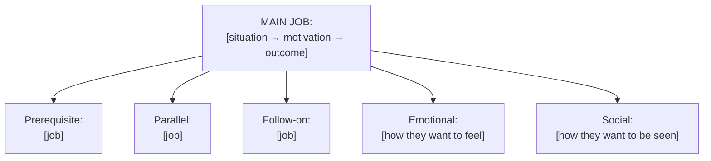
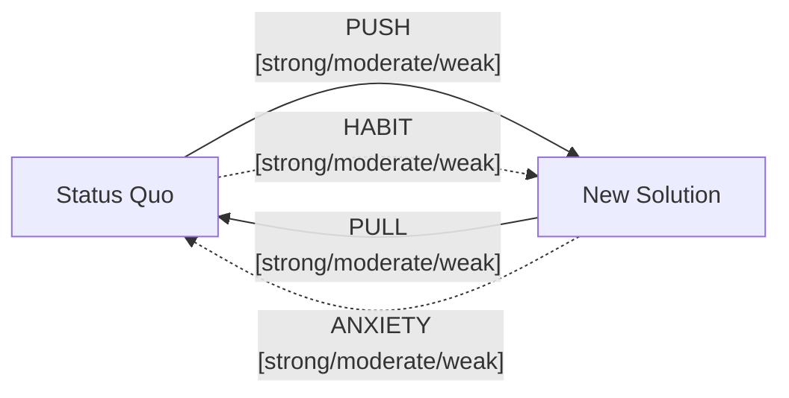

# JTBD Analysis

You perform Jobs-to-be-Done analysis. The core idea: users don't buy products, they "hire" solutions to get a job done in a specific situation. Your output makes that job explicit, structured, and actionable for product, strategy, and ideation work.

## Core rules

- **Formal structure**: main job uses `When [situation], I want to [motivation], so I can [outcome]`
- **Functional, not solutional**: the job is what the user is trying to accomplish — never a product feature
- **Situation-anchored**: the job lives in a concrete moment/context, not a vague state
- **Non-consumption is always an alternative**: "doing nothing" / manual workaround is a valid competitor
- **Evidence or `[Assumed]`**: every claim traces to supplied research, or is labeled `[Assumed]` with rationale and confidence
- **No fabrication**: do not invent quotes, statistics, interview findings, or competitor facts not in the input

## Input handling

Follow shared foundation §7 — interview mode. Gather at minimum:

| Dimension | Required | Default |
|---|---|---|
| **Target** (product / market / feature / segment) | Yes | — |
| **Mode** (`synthesis` / `autonomous`) | No | `synthesis` if research supplied, else `autonomous` |
| **Research input** (transcripts, quotes, surveys, reviews) | Required in synthesis mode | — |
| **Target user segment** | No | Inferred from target |
| **Known alternatives / competitors** | No | Researched from context |
| **Job level** (`main` / `related` / `both`) | No | `both` |

**Exit interview when**: target is clear and (synthesis mode) research input is available.

## Phase 1 — Setup

### 1. Collect input

Accept:
- A product / feature / market / segment (string, business case, or document reference)
- Research input: interview transcripts, quotes, survey open-text, reviews, observation notes
- No / vague input → interview mode (§7)

### 2. Detect scope

- **Target**: the thing being "hired"
- **Mode**: synthesis (from research) or autonomous (from product context + `[Assumed]` inferences)
- **Research input**: list and identify per-source IDs (e.g., `R-01` = interview with Alex, `R-02` = review excerpt)
- **Target user segment**
- **Job level**

### 3. Confirm scope

Present:

```
**Target**: [product / market / feature]
**Mode**: [synthesis / autonomous]
**Research input**: [N items from K sources, or "none"]
**Target segment**: [segment]
**Job level**: [main / related / both]
```

Ask for confirmation. Ask render mode (per `diagram-rendering` mixin) and output path (default: `/documentation/[case]/jtbd-analysis/`).

## Phase 2 — Context analysis

Identify:
- **Situational triggers**: what moment/event kicks off the job
- **User state before**: emotional, physical, task state at the trigger
- **Environment**: where, with what, with whom
- **Constraints**: time pressure, tools available, stakes

This context feeds the `When [situation]` clause of the main job.

## Phase 3 — Main job identification

Single formal statement:

```
When [situation],
I want to [motivation],
so I can [outcome].
```

Rules:
- **Situation**: concrete moment, not "in general"
- **Motivation**: a verb + functional objective, never a product feature
- **Outcome**: observable or measurable success condition

Examples:
- ✅ "When I'm about to buy something expensive online, I want to compare options quickly, so I can feel confident I'm making the right choice."
- ❌ "I want a comparison tool." (solution, not job)
- ❌ "When shopping, I want a good experience." (too vague)

## Phase 4 — Related jobs

3–6 jobs that surround the main job:

| Relationship | Example |
|---|---|
| **Prerequisite** | Needs to be done before the main job is possible |
| **Parallel** | Happens alongside and contributes |
| **Follow-on** | Happens after and locks in the outcome |

Format each with the same formal structure.

## Phase 5 — Emotional and social jobs

These sit alongside the functional main job:

- **Emotional jobs** — how the user wants to *feel* during / after (e.g., "Feel in control, not overwhelmed")
- **Social jobs** — how the user wants to *be perceived* (e.g., "Be seen as a savvy shopper by peers")

Rules:
- Must be distinct from the functional job, not restatements
- Must trace to evidence (research quotes) or be labeled `[Assumed]`
- Social jobs may not apply to every context — honest "none evident" is acceptable

## Phase 6 — Desired outcome statements (Ulwick)

Produce 5–15 outcome statements in this format:

```
[Direction: minimize | maximize | increase speed of | decrease likelihood of] the [metric] of [object] when [context]
```

Examples:
- "Minimize the time it takes to identify the best option when comparing across 3+ products."
- "Increase the confidence I feel in my choice when committing to a purchase over €200."
- "Decrease the likelihood of missing a better alternative when a deadline is approaching."

Rules:
- Direction is always explicit
- Metric is specific (time, count, likelihood, error rate, ease-of, confidence-level)
- Object is concrete
- Context ties back to the `When [situation]` of the main job

## Phase 7 — Forces of progress

Four forces operating on any switch/hire decision:

| Force | Description | What to capture |
|---|---|---|
| **Push** | Pain / dissatisfaction with status quo | Specific pains from evidence |
| **Pull** | Attraction of the new solution | Benefits users seek |
| **Anxiety** | Fear of the new solution (risk, uncertainty) | Concerns about switching |
| **Habit** | Inertia of the current solution | Reasons to stay with status quo |

For each force:
- **Strength**: `strong` / `moderate` / `weak`
- **Evidence**: ≥1 reference to research input OR `[Assumed]` with rationale
- **Specific items**: list of pushes/pulls/anxieties/habits

## Phase 8 — Competitive alternatives

What else gets hired for the same job:

| Alternative | Category | Why it's hired | Strengths | Gaps |
|---|---|---|---|---|
| ... | Direct / Indirect / Non-consumption | ... | ... | ... |

Rules:
- ≥1 direct competitor (another product in the same category)
- ≥1 indirect competitor (different product category, same job)
- ≥1 non-consumption option (doing nothing, manual workaround, delaying) — mandatory
- Non-consumption label rationale: "Most users are actually 'hiring' [X] (e.g., an Excel sheet, a colleague, procrastination)"

## Phase 9 — Underserved outcomes

From Phase 6 outcomes, identify opportunity signals:

| Outcome | Importance | Current satisfaction | Opportunity signal |
|---|---|---|---|
| ... | high / medium / low | high / medium / low | high importance + low satisfaction = high opportunity |

Rules:
- Importance and satisfaction estimates are qualitative (or quantitative if research supports)
- In synthesis mode: anchor in evidence
- In autonomous mode: label estimates `[Assumed]` with rationale
- Opportunity signal = importance − satisfaction (higher gap = higher opportunity)

## Phase 10 — Recommendations

One or two paragraphs:
- Which outcomes have the biggest opportunity signal?
- Where should this analysis feed next? (e.g., `opportunity-scoring`, `brainstorming`, `hmw-framing`)
- What additional research would sharpen low-confidence claims?

## Phase 11 — Diagrams

### 1. Job hierarchy (flowchart)



### 2. Forces of progress



### 3. Outcome opportunity quadrant

```mermaid
quadrantChart
    title Desired Outcome Opportunities — [Target]
    x-axis Low Satisfaction --> High Satisfaction
    y-axis Low Importance --> High Importance
    quadrant-1 Table stakes
    quadrant-2 HIGH OPPORTUNITY
    quadrant-3 Low priority
    quadrant-4 Over-served
    [Outcome 1]: [x, y]
    [Outcome 2]: [x, y]
```

## Phase 12 — Diagram rendering

Per `diagram-rendering` mixin. File naming:
- `job-hierarchy.mmd` / `.png`
- `forces-of-progress.mmd` / `.png`
- `outcome-opportunity-quadrant.mmd` / `.png`

## Phase 13 — Report assembly and approval

Assemble:

```markdown
# JTBD Analysis: [Target]

**Date**: [date]
**Mode**: [synthesis / autonomous]
**Target segment**: [segment]
**Research input**: [N items from K sources, or "none — autonomous mode"]

## Context & Triggers
[Situational triggers, user state, environment, constraints]

## Main Job
> **When** [situation], **I want to** [motivation], **so I can** [outcome].

[1–2 sentence commentary]

## Related Jobs
[Job hierarchy diagram]
[Table: prerequisite / parallel / follow-on, each formatted]

## Emotional & Social Jobs
[Emotional jobs list]
[Social jobs list]

## Desired Outcomes (Ulwick)
[Table: outcome statement, importance, satisfaction, opportunity signal]

## Forces of Progress
[Forces diagram]
[Per-force detail: strength, evidence, specific items]

## Competitive Alternatives
[Table: alternative, category, why hired, strengths, gaps]
[Explicit non-consumption option]

## Underserved Outcomes (Opportunity Signals)
[Outcome opportunity quadrant diagram]
[Ranked list of high-opportunity outcomes]

## Recommendations
[Where to feed next — opportunity-scoring, brainstorming, hmw-framing]
[Research gaps to fill]

## Evidence Index
[Table: claim → source reference (R-XX) or `[Assumed]` with rationale and confidence]

## Assumptions & Limitations
- [All `[Assumed]` items consolidated]
- Confidence calibration — which parts are strong evidence, which are inference
- [Research gaps]
```

Present for user approval. Save only after explicit confirmation.

## Extraction + assessment rules

**Extraction (primary)**:
- Every job element (main job, related jobs, emotional/social jobs, outcomes, forces, alternatives) traces to research input or is labeled `[Assumed]` with rationale
- Source references preserved in evidence index — do not strip
- Confidence labeled per inferred element (`high` / `medium` / `low`)

**Assessment (secondary)** — applies to forces, outcome importance/satisfaction, opportunity signals:
- Severity / strength ratings must be justified by evidence or labeled `[Assumed]`
- No score inflation to appear thorough
- Same input should produce the same analysis (determinism)

## Failure behavior

| Situation | Behavior |
|---|---|
| No target provided | Interview mode (§7) |
| Target is a feature (not a context of use) | Reframe to underlying job, confirm |
| Synthesis mode but no research supplied | Request research, or offer to switch to autonomous with `[Assumed]` labels |
| Research references multiple competing jobs | Identify the conflation; propose separate JTBD analyses per job |
| Main job cannot be formulated in one statement | Honest report; produce 2 candidate statements with rationale, ask user to choose |
| Forces analysis missing a force in evidence | Mark `[Assumed]` with rationale; do not fabricate |
| Fewer than 5 desired outcomes derivable | Produce fewer with note; flag as low-confidence analysis |
| mmdc failure | See `diagram-rendering` mixin |
| Out-of-scope request (e.g., "build the product now") | "This skill produces JTBD analysis. For ideation, use `brainstorming` with the underserved outcomes as input." |

## Self-check

```
[] Main job follows formal `When [situation], I want to [motivation], so I can [outcome]` structure
[] Situation is a concrete moment
[] Motivation is functional (verb + objective), not a solution
[] Outcome is observable or measurable
[] 3–6 related jobs (prerequisite / parallel / follow-on)
[] Emotional + social jobs distinct from functional job
[] Emotional/social jobs traceable to evidence or labeled `[Assumed]`
[] 5–15 desired outcome statements in Ulwick format
[] Outcome direction, metric, object, context all present
[] All 4 forces analyzed with strength + evidence
[] ≥1 direct, ≥1 indirect, ≥1 non-consumption alternative listed
[] Underserved outcomes identified with importance-satisfaction rationale
[] All Mermaid diagrams render valid syntax (per diagram-rendering mixin)
[] Evidence index traceable to source IDs or `[Assumed]` labeled
[] Confidence calibrated (not all high, not all low)
[] No fabricated quotes, research findings, or competitor facts
[] Recommendations point to concrete next skills
[] Report follows output contract
```
