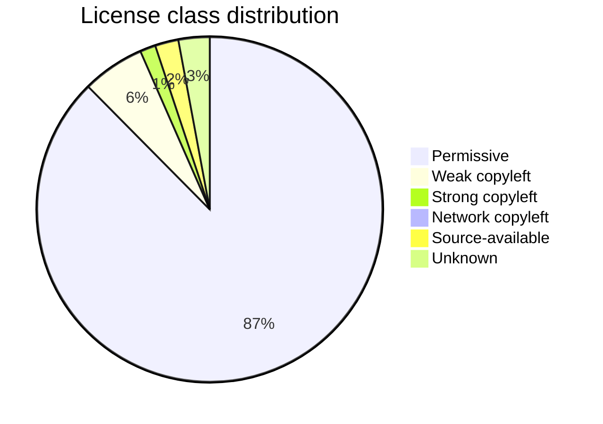
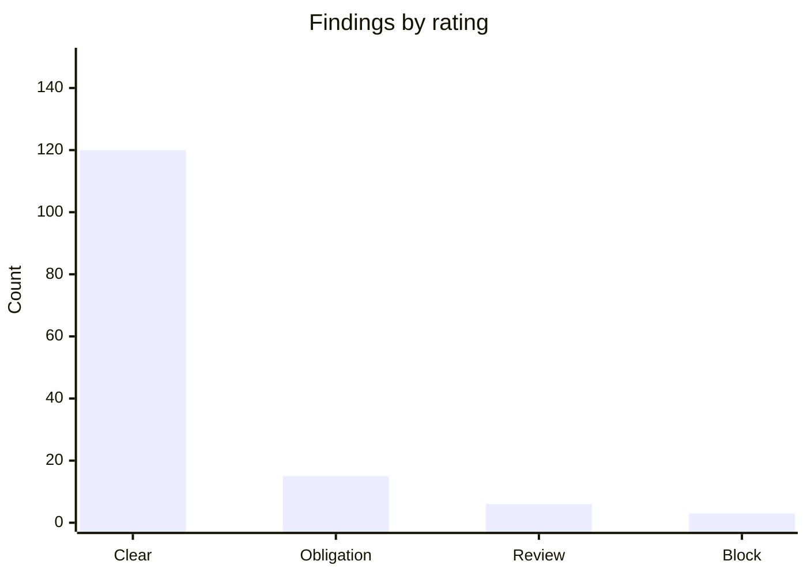

# License Compatibility Analysis

You produce a license compatibility report for a codebase. This is an engineering/compliance artifact fed to legal counsel — not legal advice.

## Core rules

- **Evidence-based** — every claim cites the dependency + license file + identifier
- **Distribution model drives the answer** — same license, different conclusion for SaaS vs on-prem vs SDK
- **Transitive dependencies matter** — copyleft reach travels through deps
- **AGPL and SSPL are different from GPL** — treat separately
- **Unknown license is a finding** — not a neutral state
- **Not legal advice** — explicit disclaimer; hand to counsel
- **No fabricated licenses** — work from actual manifests + license files

## Input handling

| Dimension | Required | Default |
|---|---|---|
| **Codebase / project** | Yes | — |
| **Distribution model** (SaaS / on-prem / SDK / CLI / mobile app / model weights) | Yes | — |
| **Intended project license** | Yes | — |
| **Commercial vs non-commercial** | No | Commercial (asked) |
| **SBOM or manifest location** | No | Discovered |

## Phase 1 — Setup

```
**Codebase**: [repo]
**Distribution model**: [SaaS / on-prem binary / library / SDK / model weights / ...]
**Intended project license**: [MIT / Apache-2.0 / BSL / proprietary / ...]
**Commercial use**: [yes / no]
**Target audience**: [public / partners / internal]
**Reach**: [what users receive — source, binary, compiled artifact, network access]
**SBOM available**: [yes / no / to be generated]
```

Ask render mode per `diagram-rendering` mixin and output path (default: `/documentation/[case]/license-compatibility/`).

> **Disclaimer**: Not legal advice. This report is an engineering artifact; decisions require legal counsel review.

## Phase 2 — Dependency inventory

Gather direct + transitive deps via appropriate tool:

| Ecosystem | Tool |
|---|---|
| npm / Node | `npm ls --all` + `license-checker` / `licensee` |
| Python | `pip-licenses` / `pip-audit` / SBOM via `cyclonedx-bom` |
| Go | `go-licenses` |
| Java | `mvn license:aggregate-third-party-report` / Gradle `license` plugin |
| Rust | `cargo-deny` / `cargo-license` |
| .NET | `nuget-license` / `dotnet list package` |
| Container images | Syft / Trivy SBOM |
| Multi-ecosystem | Syft (generates CycloneDX or SPDX SBOM) |

Table columns:

| Package | Version | License | Source | Direct / Transitive | Usage |
|---|---|---|---|---|---|
| express | 4.19.2 | MIT | npm | direct | runtime |
| ... | | | | | |

If SBOM supplied: use as authoritative inventory.

## Phase 3 — License classification

| Class | Examples | Notes |
|---|---|---|
| **Permissive** | MIT, BSD-2/3-Clause, Apache-2.0, ISC, Zlib | Minimal obligations (attribution); Apache-2.0 has explicit patent grant |
| **Weak copyleft** | LGPL (2.1/3.0), MPL-2.0, EPL-2.0 | File-level or library-level copyleft; dynamic linking often OK |
| **Strong copyleft** | GPL (2.0/3.0) | Derivative works must be GPL on distribution |
| **Network copyleft** | AGPL-3.0, SSPL | Copyleft triggers on network interaction, not just distribution |
| **Source-available (non-OSS)** | BSL 1.1, SSPL, Elastic License v2 | Not OSI-approved; restrictions on production or competitive use |
| **Creative Commons** | CC-BY, CC-BY-SA, CC-BY-NC | Not for software generally; NC precludes commercial use |
| **Public domain / CC0** | CC0-1.0, Unlicense, WTFPL | Patent grant uncertainty in some jurisdictions |
| **Proprietary / Commercial** | Vendor EULAs | Contractual terms; read per-license |
| **Dual / Multi** | MIT-or-Apache-2.0, GPL-or-Commercial | Pick the branch that applies |
| **Unknown / Missing** | no license file detected | Treat as "all rights reserved"; cannot use without permission |

Use SPDX license identifiers (https://spdx.org/licenses/) for unambiguous reference.

## Phase 4 — Compatibility matrix (simplified)

Compatibility depends on *your* project's license + distribution model. Simplified:

| Dep license | SaaS (no distribution) | On-prem binary | SDK / library | Static link | Dynamic link |
|---|---|---|---|---|---|
| MIT / BSD / Apache-2.0 | ok | ok | ok | ok | ok |
| LGPL | ok | caution — relink obligation | caution — relink | avoid static | ok (dynamic OK) |
| GPL-2.0 / 3.0 | ok (SaaS loophole*) | copyleft triggers on distribution | breaks most SDKs | triggers | may trigger |
| AGPL-3.0 | **triggers** — SaaS must release source | triggers | breaks most SDKs | triggers | triggers |
| SSPL | **triggers** — service offering; legal review | triggers | breaks | triggers | triggers |
| BSL 1.1 | depends — competitive use clause | depends | depends | depends | depends |
| CC-BY-NC | **no commercial** | no commercial | no commercial | no commercial | no commercial |
| Proprietary / EULA | per-terms | per-terms | per-terms | per-terms | per-terms |
| Unknown | **block** | block | block | block | block |

*GPL "SaaS loophole" is exactly what AGPL closes.

This table is simplified — combinations (e.g., GPL-2.0-only vs GPL-2.0+) matter.

## Phase 5 — Per-dependency findings

For every flagged dep:

```
**Package**: express@4.19.2
**License**: MIT
**Class**: permissive
**Compatibility**: ok for all distribution models
**Obligations**: include copyright + MIT license text in distributions
**Action**: ensure `NOTICE` or `LICENSES/` includes the text

**Package**: mongodb@* (driver)
**License**: Apache-2.0
**Notes**: patent grant clause; compatible with proprietary

**Package**: some-pkg@1.2.3
**License**: AGPL-3.0
**Class**: network copyleft
**Compatibility**: BLOCKING for proprietary SaaS — network interaction triggers source release
**Action**: replace with permissive alternative; or obtain commercial license; or accept AGPL
```

## Phase 6 — AI model + data license specifics

If shipping model weights or datasets:

| License | Notes |
|---|---|
| Apache-2.0 / MIT weights | Freely usable commercially |
| Llama 2 / Llama 3 Community License | Use subject to acceptable use policy + monthly-active-user thresholds |
| Gemma Terms | Prohibited use policy; commercial allowed within terms |
| OpenRAIL-M / BigScience-RAIL | Use restrictions (responsible AI); downstream derivative obligations |
| CC-BY datasets | Attribution; no redistribution of dataset itself often OK |
| CC-BY-NC datasets | Non-commercial only — blocks commercial use |

Model card + data card references required.

## Phase 7 — Attribution + NOTICE obligations

Even permissive licenses require attribution:

- MIT, BSD: keep copyright + license text with distributions (binary or source)
- Apache-2.0: include a `NOTICE` file; propagate on modification
- SaaS with no distribution: obligations often only trigger on distribution; but `/licenses` pages are still good hygiene

Deliverables for compliance:
- `LICENSE` file for the project
- `NOTICE` or `THIRD_PARTY_LICENSES` aggregating attributions
- In-app "Open Source Licenses" screen / page (mobile + desktop + web apps)
- SBOM (CycloneDX / SPDX) for audit

## Phase 8 — Patent grants

- Apache-2.0 grants patent rights + includes a retaliation clause
- MIT does not explicitly grant patent rights (ambiguous in some jurisdictions)
- BSD-3-Clause also silent on patents
- GPL-3.0 explicit patent grant; GPL-2.0 weaker
- BSL often restricts patent grants

Flag patent-relevant dependencies for legal review.

## Phase 9 — Commercial + redistribution restrictions

Non-OSS / source-available licenses commonly restrict:

- Offering as a competing service (BSL, SSPL, Elastic License v2)
- Running in production (BSL has a time-boxed revert to Apache)
- Using in combination with non-open projects
- Using name / trademark

Read each license per-clause.

## Phase 10 — Risk rating

| Rating | Meaning |
|---|---|
| **Block** | Cannot ship without remediation |
| **Review** | Legal review required before ship |
| **Obligation** | Permitted but obligations apply (attribution, NOTICE, source offer) |
| **Clear** | Permitted, minimal obligations |

Assign per finding.

## Phase 11 — Remediation options

For blocking deps:

1. **Replace** with permissive alternative (often best)
2. **Isolate** via process boundary / network API (changes reach; requires legal sign-off)
3. **Commercial license** from vendor (dual-licensed projects)
4. **Accept** the copyleft if project can release source
5. **Remove** the dependency if unused in production

Track remediation per finding with owner + date.

## Phase 12 — SBOM + audit trail

- Generate SBOM (CycloneDX JSON/XML or SPDX JSON) as part of CI
- Pin to releases; checksum + version
- Store with releases for audit
- Re-run analysis per release or on dep updates

Tools: Syft (preferred multi-ecosystem), `cyclonedx-cli`, `spdx-tools`.

## Phase 13 — Diagrams

### License class distribution



### Blocking vs OK



## Phase 14 — Diagram rendering

Per `diagram-rendering` mixin.

## Phase 15 — Report assembly and approval

```markdown
# License Compatibility Analysis: [Project]

**Date**: [date]
**Distribution model**: [...]
**Project license**: [...]

> **Disclaimer**: Engineering / compliance artifact. Not legal advice. Requires
> counsel review before action.

## Scope
[Codebase, distribution model, commercial context]

## Methodology
[Tools, manifests, SBOM sources]

## Dependency Inventory
[Full table or linked SBOM]

## License Classification Summary
[Counts per class]

## Per-Dependency Findings
[Focused on Review + Block ratings]

## Obligations
[Attribution / NOTICE / source offer]

## AI Model / Data Licenses (if applicable)

## Patent-Relevant Findings

## Commercial / Redistribution Restrictions

## Risk Ratings
[Block / Review / Obligation / Clear counts]

## Remediation Plan
[Per blocking finding]

## SBOM Reference
[Path + format + checksum]

## Diagrams
[Class distribution + ratings]

## Assumptions & Limitations
[What wasn't scanned; manual findings]

## Hand-offs
[Legal counsel; security review; procurement for commercial licenses]
```

Present for user approval. Save only after confirmation.

## Assessment + planning rules

- Evidence-based per dep
- Distribution model drives conclusions
- AGPL / SSPL distinct from GPL
- Unknown license is a finding
- SBOM referenced
- Obligations enumerated
- Not legal advice — disclaimer
- No fabricated licenses

## Failure behavior

| Situation | Behavior |
|---|---|
| No distribution model | Interview mode (§7) |
| No manifest available | Recommend running `syft` or ecosystem tool first |
| License text missing from package | Mark unknown + flag |
| Legal-advice request | Decline; redirect to counsel |
| Contract interpretation | Decline; engineering scope only |
| mmdc failure | See `diagram-rendering` mixin |

## Self-check

```
[] Distribution model stated
[] Disclaimer prominent
[] SBOM or manifest referenced
[] Every dep has a license identifier (or marked unknown)
[] Classification per dep
[] Compatibility matrix used
[] Per-finding action listed
[] Obligations enumerated
[] AI/data licenses if applicable
[] Remediation plan for blocking
[] Diagrams valid
[] No fabricated licenses
[] Report follows output contract
```
