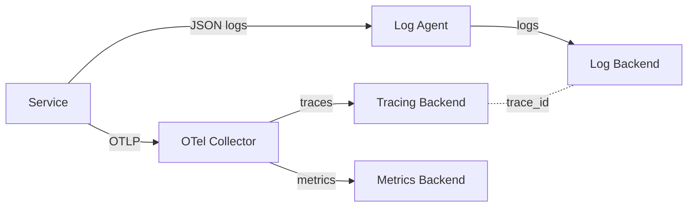
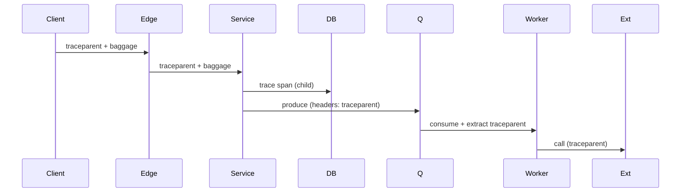

# Logging + Tracing Design

You design how a service emits logs + traces so operators can investigate incidents and track user journeys. Component-level; system-wide concerns go to `observability-strategy`.

## Core rules

- **Structured, not free-text** — JSON logs only
- **Correlate via trace_id** — every log line carries it
- **Trace the caller, not just the server** — propagate W3C Trace Context
- **OpenTelemetry over vendor lock-in** — OTLP + OpenTelemetry SDK default
- **Sample smart, not small** — tail sampling for errors; head sampling elsewhere
- **PII redacted** — declared at schema level, enforced by filter
- **Retention by policy + cost** — not unlimited
- **No fabricated log events** — work from supplied behavior

## Input handling

| Dimension | Required | Default |
|---|---|---|
| **Component / service** | Yes | — |
| **Runtime + language** | Yes | — |
| **Dependencies** (DBs, brokers, external) | Yes | — |
| **Traffic profile** | No | Asked |
| **Existing observability backend** | No | Asked |
| **Regulatory context (PII, GDPR)** | No | Asked |

## Phase 1 — Setup

```
**Component**: [service name]
**Runtime**: [Go / Node / Python / JVM / .NET / Rust]
**Dependencies**: [list]
**Traffic**: [req/s peak]
**Existing backend**: [Datadog / Grafana stack / Honeycomb / Splunk / CloudWatch / ...]
**Regulatory**: [GDPR, HIPAA, PCI — fields]
**Budget**: [ingestion + retention ballpark]
```

Ask render mode per `diagram-rendering` mixin and output path (default: `/documentation/[case]/logging-tracing-design/[component]/`).

## Phase 2 — Structured log schema

Baseline fields (every record):

| Field | Type | Notes |
|---|---|---|
| `timestamp` | RFC 3339 UTC | ISO-8601 strict |
| `level` | enum | TRACE / DEBUG / INFO / WARN / ERROR / FATAL |
| `service` | string | stable service name |
| `env` | string | `prod` / `staging` / `dev` |
| `version` | string | build / git-sha |
| `message` | string | concise human text |
| `trace_id` | string | W3C Trace Context |
| `span_id` | string | W3C Trace Context |
| `tenant_id` | string? | when applicable |
| `user_id` | string? | only where useful + authorized |
| `request_id` | string? | if independent of trace |
| `event` | string? | machine-readable event code |
| `error` | object? | `{ class, message, stack }` (stack only in non-prod or internal) |

Extras per event; camelCase or snake_case consistent across the service.

Avoid:
- Stringly-typed bags (`context: "lots of stuff"`)
- Unstructured concatenation
- PII in the `message` field — put in structured field with explicit flag

## Phase 3 — Log levels

| Level | Usage |
|---|---|
| TRACE | development only; very verbose |
| DEBUG | off by default in prod; enabled per-request / feature flag |
| INFO | normal events (request completed, worker started) |
| WARN | unexpected but recoverable |
| ERROR | action failed, user-affecting |
| FATAL | process terminating |

Rules:
- ERROR requires `trace_id` + actionable info
- Don't log at ERROR for validation failures (that's INFO or WARN per policy)
- Rate-limit noisy loggers

## Phase 4 — Tracing with OpenTelemetry

### Span model

- One span per logical unit of work
- Spans form a tree via parent/child
- Attributes: key/value metadata on spans
- Events: time-stamped marks within a span (e.g. `cache_miss`, `retry_attempt`)
- Links: relate spans across traces (e.g. batch processor linking N inputs)

### Span attributes (semantic conventions)

Follow OpenTelemetry semantic conventions:
- HTTP: `http.method`, `http.route`, `http.status_code`
- DB: `db.system`, `db.statement` (redacted), `db.operation`
- Messaging: `messaging.system`, `messaging.destination`, `messaging.operation`
- RPC: `rpc.system`, `rpc.service`, `rpc.method`
- Error: `otel.status_code=ERROR`, `exception.type`, `exception.message`

### Propagation

- W3C Trace Context (`traceparent`, `tracestate`) over HTTP + gRPC
- `baggage` header for cross-cutting context (tenant_id, user_id, feature flags)
- Propagate across async boundaries: queue producer embeds trace context in headers; consumer extracts + continues

### Export

- OTLP (gRPC or HTTP/JSON) to collector
- Collector (opentelemetry-collector) handles: batching, sampling, transforms, multi-exporter
- Do not export directly to vendor — collector gives swap flexibility

## Phase 5 — Sampling

### Head sampling (decide at root)

- Parent-based: respect caller's decision (default)
- Rate-based: sample 1 in N
- Probabilistic: p = 0.1 means 10%
- Pros: cheap; predictable
- Cons: may drop slow / error traces

### Tail sampling (decide at collector after seeing full trace)

- Keep 100% of errors + slow traces
- Keep small % of happy traces
- Pros: error / slow coverage without 100% cost
- Cons: requires buffered collector; memory + cpu cost

### Recommended defaults

- Errors: 100%
- Slow (p99 latency): 100%
- Happy: 1–10% depending on budget
- Always-on for critical paths (payments, auth) during incidents

## Phase 6 — Log ↔ trace linking

- Every log line carries `trace_id` + `span_id` of the enclosing span
- Observability backend joins logs + traces in UI
- Jump from a trace span to its logs, and vice versa
- This is the single most valuable observability feature — worth the wiring

## Phase 7 — PII + sensitive data

| Class | Handling |
|---|---|
| Direct identifier (email, phone) | redact to domain / last-4 / hash |
| Auth tokens / secrets | never logged; ensure HTTP client scrubs |
| Card numbers / PII | PCI / GDPR obligations — block ingestion |
| Audit-required PII | separate store with access controls + retention policy |

Implementation:
- Central redaction library used by all log/span attributes
- Fail-closed: unknown field with PII-looking content → redacted
- PII allowlist maintained + reviewed

Hand off to `data-governance-policy`.

## Phase 8 — Retention + cost

| Tier | Retention | When |
|---|---|---|
| Hot (last 24–72 h) | full fidelity | active investigation |
| Warm (30 d) | sampled / rolled-up | recent analysis |
| Cold (90 d – 7 y) | archived / indexed partially | compliance |

Cost controls:
- Log levels tuned per environment
- Sampled tracing
- Aggregate metrics preferred over raw events where pattern holds
- Periodic review of top N log producers + offenders

## Phase 9 — Health + lifecycle events

Beyond request logs — include:
- Process start / stop + version + config fingerprint
- Config reload
- Background worker activity (heartbeat, backlog)
- Dependency health checks (DB connect, broker connect)
- Graceful shutdown progress

## Phase 10 — Testing + validation

- Unit: redaction rules
- Integration: end-to-end trace from edge to dependency
- Load: log ingestion cost at peak
- Chaos: verify observability survives dependency outage (collector, backend)

## Phase 11 — Diagrams

### Log/trace pipeline



### Context propagation



## Phase 12 — Diagram rendering

Per `diagram-rendering` mixin.

## Phase 13 — Report assembly and approval

```markdown
# Logging + Tracing Design: [Component]

**Date**: [date]
**Component**: [...]
**Runtime**: [...]

## Scope
[Component, deps, traffic, regulatory, budget]

## Structured Log Schema
[Baseline fields + per-event extras]

## Log Levels
[Policy per level]

## Tracing with OpenTelemetry
[Spans + attributes + events + links + propagation + export]

## Sampling
[Head / tail; policies; defaults]

## Log ↔ Trace Linking
[How it works + UI story]

## PII + Sensitive Data
[Redaction + allowlist + retention tiers]

## Retention + Cost
[Tiers + cost controls]

## Health + Lifecycle Events
[Process + worker + dependency]

## Testing + Validation
[Unit + integration + chaos]

## Diagrams
[Pipeline + propagation]

## Hand-offs
[observability-strategy, data-governance-policy]

## Assumptions & Limitations
```

Present for user approval. Save only after confirmation.

## Assessment + planning rules

- Structured JSON only
- Trace_id in every log
- OpenTelemetry with collector
- Sampling documented
- PII redacted
- Retention tiered
- Propagation across async
- No fabricated events

## Failure behavior

| Situation | Behavior |
|---|---|
| No runtime / deps | Interview mode (§7) |
| Free-text logs requested | Challenge — structured JSON required |
| Direct-to-vendor export | Recommend collector |
| No PII policy | Ask before emitting |
| No sampling | Propose defaults |
| mmdc failure | See `diagram-rendering` mixin |
| Full observability stack request | Redirect to `observability-strategy` |

## Self-check

```
[] JSON log schema with baseline fields
[] trace_id + span_id present
[] Log levels policy
[] OTel spans + attributes + events + links
[] W3C Trace Context propagation
[] Sampling strategy documented
[] PII redaction enforced
[] Retention tiers + costs
[] Health + lifecycle events
[] Diagrams valid
[] No fabricated events
[] Report follows output contract
```
