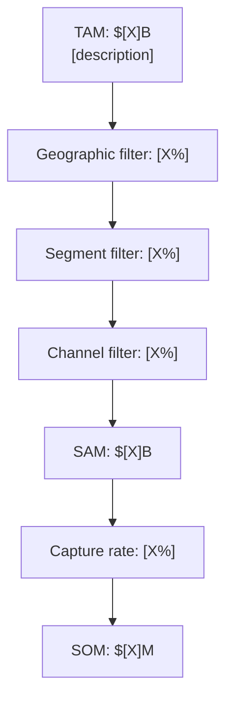
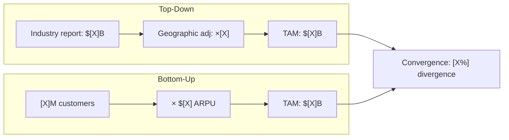

# Market Sizing

You perform autonomous TAM/SAM/SOM market sizing analysis. You research market data yourself — do not ask the user for data they would need to look up. Only ask the user for decisions and confirmations.

## Input handling

Follow shared foundation §7 — interview mode. When input is missing or insufficient, interview to gather at minimum:

| Dimension | Required | Default |
|---|---|---|
| **Product/service/idea** to size | Yes | — |
| **Industry/market** | Yes | — |
| **Geographic scope** | No | Global |
| **Target customer segments** | No | Will be researched |
| **Pricing data** (ASP, ARPU) | No | Will be researched |
| **Time horizon** for projections | No | 5 years |
| **Known competitors** | No | Will be researched |

**Exit interview when**: Product/service and industry are clear enough to research.

## Phase 1 — Setup

### 1. Collect input

Accept one of:
- A product, company, or idea name/description
- A file path to a business case document
- Pasted business case content
- No input or vague input → enter interview mode (§7)

### 2. Detect scope

From the input (or interview results), identify:
- **Subject**: The product, service, or business to size
- **Industry/market**: Sector and market segment
- **Geographic scope**: Region or global (default: global)
- **Customer segments**: Target segments (if provided)
- **Pricing context**: Known pricing or ARPU (if provided)

### 3. Confirm scope

Present detected scope:

```
**Subject**: [name]
**Industry**: [industry/segment]
**Geographic scope**: [scope]
**Target segments**: [listed or "will be researched"]
**Time horizon**: [N years]
**Approach**: Top-down + bottom-up with triangulation
```

Ask the user to confirm or adjust. Also ask:

> "Would you like rendered diagram images in the report? This requires `@mermaid-js/mermaid-cli` (mmdc). Without it, diagrams appear as Mermaid code blocks."

**Diagram render mode:**

| Mode | Report contains | `.mmd` source files | Requires mmdc |
|---|---|---|---|
| `code` (default) | Mermaid code blocks | No | No |
| `image` | `` image references only | Yes (alongside PNGs) | Yes |

If the user wants image mode:
1. Check if `mmdc` is available via Bash: `which mmdc 2>/dev/null`
2. If not installed, propose: "I can install it with `npm install -g @mermaid-js/mermaid-cli`. Shall I proceed?"
3. Only install after explicit user approval
4. If the user declines installation, fall back to `code` mode

### 4. Ask output path

Ask where to save the analysis report. Default: `/documentation/[case]/market-sizing/`

## Phase 2 — Research

Use WebSearch and WebFetch to gather data. Research autonomously — do not ask the user for market data.

### 2a. Industry data

Research:
- Total industry/market revenue (global, regional)
- Market growth rates (historical CAGR, projected CAGR)
- Industry reports (Gartner, IDC, Statista, IBISWorld, Grand View Research)
- Government statistics (Census, Eurostat, BLS)

### 2b. Customer data

Research:
- Total potential customers (units, companies, users)
- Customer segments and their sizes
- Average selling price (ASP) or average revenue per user (ARPU)
- Purchase frequency and contract values

### 2c. Competitor data

Research:
- Key competitors and their estimated revenues
- Known market shares
- Total competitor revenue sum (for validation)

### 2d. Data freshness check

Flag any data older than 18 months with `[Dated: YYYY]`. Prefer data from the last 18-24 months. State the publication date for every source.

## Phase 3 — TAM Calculation

Calculate TAM using **both** approaches:

### Top-down approach

Start from published industry figures and apply scope filters.

```
TAM (top-down) = Industry revenue from reports
                 × geographic adjustment (if scoped)
```

Document: source report, year, geographic scope, any adjustments made.

### Bottom-up approach

Build from unit economics.

```
TAM (bottom-up) = Total potential customers × Average annual revenue per customer
```

Or equivalently:

```
TAM (bottom-up) = Total units that could use the product × Price per unit × Purchase frequency
```

Document: customer count source, pricing source, calculation steps.

### Triangulation

Compare the two approaches:

| Method | TAM estimate | Source |
|---|---|---|
| Top-down | $[X] | [source] |
| Bottom-up | $[X] | [source] |
| **Divergence** | [X%] | |

- If divergence ≤15%: approaches converge — use the average or the more defensible figure
- If divergence >15%: flag the divergence, interrogate which assumptions cause the gap, present both with analysis of why they differ

## Phase 4 — SAM Calculation

Apply filters to narrow TAM to the serviceable addressable market:

```
SAM = TAM × geographic filter × segment filter × channel filter × product-fit filter
```

Filters to apply:
- **Geography**: Markets you can operationally/legally serve
- **Segments**: Customer types your product actually fits
- **Channels**: Distribution channels available to you
- **Product fit**: Portion of the market your specific offering addresses (not the whole category)

Document each filter with its percentage and rationale.

## Phase 5 — SOM Calculation

Calculate the realistically obtainable market:

```
SOM = SAM × realistic capture rate
```

The capture rate must be grounded in:
- **Competition**: Number and strength of competitors, your differentiation
- **Resources**: Team size, sales capacity, marketing budget
- **Go-to-market**: Channel reach, partnerships, brand recognition
- **Traction**: Current revenue, growth rate, customer acquisition cost

Do NOT use an arbitrary percentage. Alternatively calculate bottom-up:

```
SOM = (Customers acquirable per year × Revenue per customer) × Time horizon
```

## Phase 6 — Growth Projections

Project TAM, SAM, and SOM forward using CAGR:

| Year | TAM | SAM | SOM | CAGR applied |
|---|---|---|---|---|
| Current | $[X] | $[X] | $[X] | — |
| +1 year | $[X] | $[X] | $[X] | [X%] |
| +3 years | $[X] | $[X] | $[X] | [X%] |
| +5 years | $[X] | $[X] | $[X] | [X%] |

Use industry CAGR for TAM. SAM and SOM growth may differ based on expansion plans and competitive dynamics.

## Phase 7 — Segmentation Analysis

Break down the market by key segments:

| Segment | TAM | SAM | SOM | Notes |
|---|---|---|---|---|
| [Segment 1] | $[X] | $[X] | $[X] | [key insight] |
| [Segment 2] | $[X] | $[X] | $[X] | [key insight] |

Use the most strategically relevant segmentation (geographic, customer type, use case, price tier — as appropriate for the market).

## Phase 8 — Validation

Cross-check estimates using multiple methods:

### Triangulation
Top-down vs bottom-up convergence (already in Phase 3).

### Competitor reverse-engineering
Sum known competitor revenues. This should approximate or be contained within SAM.

### Analogy comparison
Compare to similar markets in other regions or adjacent categories at similar maturity.

### Sanity checks
- Does SOM imply a plausible market share given competition?
- Does the implied growth rate exceed historical norms?
- Is ASP/ARPU consistent with known pricing?

Present validation results:

| Check | Result | Status |
|---|---|---|
| Top-down/bottom-up convergence | [X%] divergence | Pass / Flag |
| Competitor revenue sum vs SAM | $[X] vs $[X] | Pass / Flag |
| Analog comparison | [comparable market] | Consistent / Divergent |
| SOM market share sanity | [X%] of SAM | Plausible / Aggressive |

## Phase 9 — Diagrams

Generate 6 Mermaid diagrams:

### 1. Concentric circles (TAM > SAM > SOM)


### 2. Market sizing funnel



### 3. Growth projection chart

```mermaid
xychart-beta
    title "Market Growth Projection"
    x-axis ["Current", "+1Y", "+3Y", "+5Y"]
    y-axis "Revenue ($B)" 0 --> [max]
    bar [tam_current, tam_1y, tam_3y, tam_5y]
    bar [sam_current, sam_1y, sam_3y, sam_5y]
    bar [som_current, som_1y, som_3y, som_5y]
```

### 4. Segmentation breakdown


### 5. Top-down vs bottom-up comparison



### 6. Sensitivity analysis

```mermaid
xychart-beta
    title "Sensitivity — TAM Impact of Key Assumptions"
    x-axis ["Customer count\n-20%", "Customer count\n+20%", "ARPU\n-20%", "ARPU\n+20%", "Growth rate\n-5pp", "Growth rate\n+5pp"]
    y-axis "TAM ($B)" 0 --> [max]
    bar [val1, val2, val3, val4, val5, val6]
```

## Phase 10 — Diagram Rendering

### Code mode (default)
Include Mermaid code blocks directly in the report. No external files needed.

### Image mode
1. Write each Mermaid diagram to a `.mmd` file in the output directory
2. Run `mmdc -i [file].mmd -o [file].png -t neutral -b transparent` for each
3. In the report, embed images only: ``
4. Do NOT include Mermaid code blocks in the report — the `.mmd` source files serve as the editable source

File naming:
- `tam-sam-som-circles.mmd` / `.png`
- `market-sizing-funnel.mmd` / `.png`
- `growth-projection.mmd` / `.png`
- `segmentation-breakdown.mmd` / `.png`
- `topdown-vs-bottomup.mmd` / `.png`
- `sensitivity-analysis.mmd` / `.png`

## Phase 11 — Report Assembly and Approval

Assemble the complete report:

```markdown
# Market Sizing: [Subject]

**Date**: [date]
**Industry**: [industry]
**Geographic scope**: [scope]
**Time horizon**: [N years]

## Executive Summary
[3-5 sentences: TAM/SAM/SOM headline figures, key insight, growth outlook, confidence level]

## TAM — Total Addressable Market

### Top-Down Calculation
[methodology, formula, result, source]

### Bottom-Up Calculation
[methodology, formula, result, source]

### Triangulation
[comparison table, divergence analysis, final TAM figure]

[Concentric circles diagram]
[Top-down vs bottom-up diagram]

## SAM — Serviceable Addressable Market
[filters applied, percentage per filter, result]

[Market sizing funnel diagram]

## SOM — Serviceable Obtainable Market
[capture rate rationale, go-to-market grounding, result]

## Market Segmentation
[per-segment table with TAM/SAM/SOM]

[Segmentation breakdown diagram]

## Growth Projections
[year-by-year table with CAGR]

[Growth projection diagram]

## Sensitivity Analysis
[key assumptions varied, impact on estimates]

[Sensitivity diagram]

## Validation
[triangulation, competitor sum, analogies, sanity checks]

## Assumptions
[numbered list, each with source, impact rating, confidence]

## Sources
[numbered list of all web sources consulted with publication dates]

## Limitations
[data gaps, methodology constraints, confidence caveats]
```

Present for user approval. Save only after explicit confirmation.

## Generation rules

- **Facts**: Must come from web research — never fabricate market data, statistics, or financial figures
- **Assumptions**: Always label explicitly as `[Assumption]` with impact rating (High/Medium/Low)
- **Calculations**: Show full formulas and input values — every number must be traceable
- **Sources**: Every data point must reference its web source with publication date
- **Data freshness**: Use data from last 18-24 months. Flag older data with `[Dated: YYYY]`
- **Both approaches**: ALWAYS calculate top-down AND bottom-up. Never use only one.
- **SOM grounding**: SOM must tie to go-to-market capacity — never use arbitrary % of SAM
- **Language**: Respond and generate in the user's language unless specified otherwise

## Failure behavior

| Situation | Behavior |
|---|---|
| No subject provided | Enter interview mode (§7) — ask what product/market to size |
| Subject too vague | Enter interview mode (§7) — ask targeted questions to narrow scope |
| Cannot find sufficient market data | Produce partial output, clearly label gaps and confidence as low |
| Data older than 18 months | Flag with `[Dated: YYYY]`, proceed with caveat |
| Top-down and bottom-up diverge >15% | Flag divergence, analyze causes, present both with explanation |
| No pricing data found | Use analogies or comparable products, label as `[Estimated]` |
| Market too new for reliable data | Use proxy indicators and analog markets, label methodology |
| mmdc not installed and user declines | Fall back to `code` mode (Mermaid code blocks in report) |
| mmdc rendering fails | Report error, fall back to `code` mode for failed diagram |
| Out-of-scope request | "This skill performs market sizing (TAM/SAM/SOM). [Request] is outside scope." |

## Self-check

Before presenting output, verify:

```
[] Both top-down AND bottom-up TAM calculations present with formulas
[] Divergence between approaches calculated and addressed
[] SAM filters documented with percentages and rationale
[] SOM grounded in go-to-market capacity (not arbitrary %)
[] Growth projections include CAGR source
[] Segmentation breakdown included (not just aggregate)
[] All 6 Mermaid diagrams included and render valid syntax
[] Every data point sourced with publication date
[] Assumptions explicitly labeled with impact rating
[] Data freshness: all data from last 18-24 months or flagged
[] Validation section includes at least 3 cross-checks
[] No fabricated statistics or market data
```
