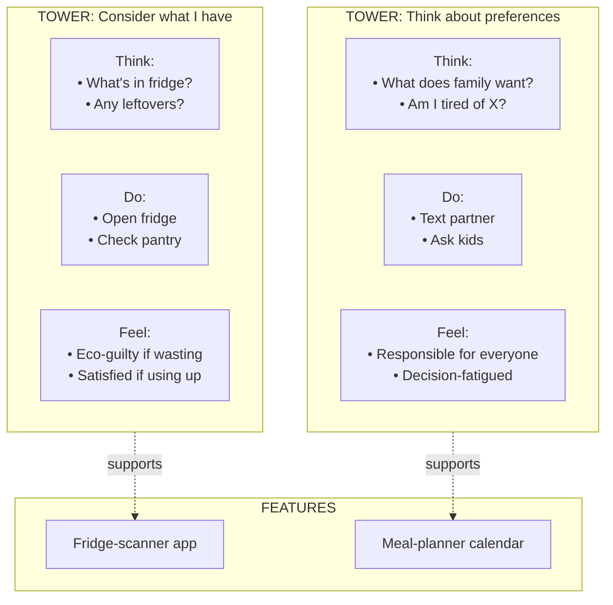
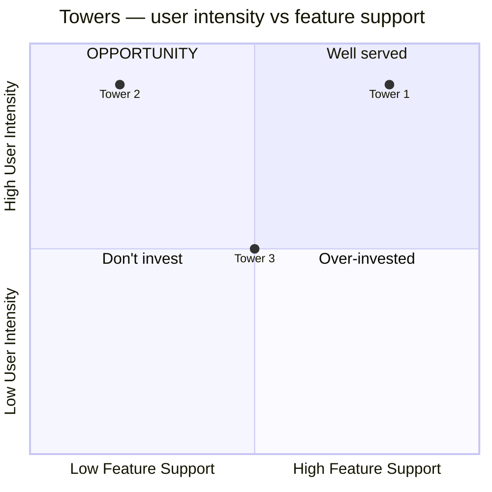

# Mental Model Diagramming

You produce an Indi Young-style mental model diagram for a problem domain. Captures *what users think, do, and feel* as they approach a domain — not about one persona's moment, but the domain's space of user behaviors and reactions — organized into vertical "towers" with features aligned below.

Distinct from:
- `empathy-mapping` (individual persona at a moment in a specific context)
- `jtbd-analysis` (formal job statement + desired outcomes)
- `user-journey-management` (sequential journey through touchpoints)

Mental model is **horizontal, domain-wide, stable over time** — users' thinking/feeling/doing in a domain, regardless of product.

## Core rules

- **Domain, not product**: mental model describes the problem space, not the current product's features
- **Verb-led, user-language quotes**: rows are what users actually do / think / feel, in their own words
- **Evidence-based**: every row traces to research or is labeled `[Assumed]`
- **Towers are task spaces**: groups of related behaviors, not features
- **Feature alignment optional but powerful**: shows existing features + gaps vs user mental space
- **No fabricated quotes**: never invent user quotes; use summaries if necessary
- **Stable**: the domain mental model changes slowly; unlike journeys or features

## Input handling

| Dimension | Required | Default |
|---|---|---|
| **Domain / problem space** | Yes | — |
| **Research input** (interview transcripts, quotes, observations) | Yes (for synthesis) | — |
| **Mode** (`synthesis` / `autonomous`) | No | `synthesis` if research; else `autonomous` |
| **Features for alignment** (optional) | No | None |

## Phase 1 — Setup

```
**Domain**: [problem space — e.g., "Deciding what to cook for dinner", "Planning a vacation", "Managing personal finances"]
**Mode**: [synthesis / autonomous]
**Research input**: [N items from K sources, or "none — autonomous inference"]
**Feature alignment**: [product features list OR "not in scope"]
```

Ask render mode per `diagram-rendering` mixin and output path (default: `/documentation/[case]/mental-model-diagramming/`).

## Phase 2 — Root-level synthesis

### Gather user behaviors

From research input, extract all user actions / thoughts / feelings in the domain. Normalize to verb-led short statements:

- ✅ "Check what ingredients are in the fridge"
- ✅ "Worry about wasting food"
- ✅ "Feel stuck when I can't decide"
- ❌ "Ingredients" (not verb-led)
- ❌ "User dissatisfaction with indecision" (not user-language)

Grouping types (will become row categories):
- **Thinking** (mental reasoning, considering, wondering)
- **Doing** (observable actions, steps taken)
- **Feeling** (emotional reactions, mood states)

Mark each with source ID or `[Assumed]`.

## Phase 3 — Tower grouping

Cluster normalized behaviors into vertical "towers" = task spaces.

Towers are the high-level ways users engage with the domain. Typical: 4–10 towers per domain.

Example towers for "Deciding what to cook":
- Consider what I have on hand
- Think about what people want / feel like
- Plan for upcoming days
- Avoid repetition
- Manage dietary constraints
- Save leftovers for later

Rules:
- Tower name is a verb phrase (what users DO mentally / emotionally / practically)
- Towers are peers (no hierarchy between them)
- 4–10 towers — fewer = too coarse, more = over-fragmented
- No catch-all / misc tower

## Phase 4 — Row content per tower

Each tower has rows of content grouped by category:

| Row category | Content |
|---|---|
| **Things users think** | Mental statements ("I wonder what's in the freezer", "Did I already cook that last week?") |
| **Things users do** | Observable actions ("Open the fridge", "Text partner asking what they want", "Scroll recipe site") |
| **Things users feel** | Emotional states ("Frustrated if I can't decide quickly", "Relieved when I find a winner", "Guilty about throwing out leftovers") |
| **Guiding principles** (optional) | User heuristics / rules of thumb ("Use the oldest ingredients first", "If it's after 7pm, pick something < 20min") |

Per row item:
- Short, verb-led, in user language
- Source reference (interview ID / observation) or `[Assumed]`

## Phase 5 — Feature alignment (if features in scope)

Below the mental model (ground line), add feature rows showing how current / proposed features map to the mental space.

| Row | Content |
|---|---|
| **Existing features** | Current product capabilities aligned under towers they support |
| **Proposed features** | Candidate new features aligned under towers they would support |
| **Competitor features** (optional) | External features for benchmarking |

Rules:
- Feature appears UNDER the tower(s) it supports
- Features can appear under multiple towers (services multi-task spaces)
- Towers with NO features underneath = **opportunity gaps** (user-space the product doesn't serve)
- Features appearing between towers or orphaned = **misaligned features** (built for reasons not in user mental model)

## Phase 6 — Opportunity & misalignment analysis

### Opportunities

Towers without feature support → opportunities. Per gap:
- **Tower name**
- **Why users care** (from research)
- **Nothing currently does this** — source evidence
- **Candidate responses** (features / content / service / partnerships)

### Misalignments

Features not under any tower → either:
- (a) Wrong — feature built for reasons unrelated to user mental space; consider deprecation
- (b) Right-but-uncommunicated — feature serves a real need we missed; add tower
- (c) Category-error — feature serves adjacent domain; scope review

## Phase 7 — Summary synthesis

- **Domain framing**: one paragraph on how users think about this domain
- **Dominant towers**: which 1–3 get most behaviors mentioned
- **Surprising towers**: underestimated user concerns
- **Biggest opportunity gaps**: prioritized
- **Evidence strength**: high / medium / low per tower

## Phase 8 — Diagrams

### 1. Mental model overview



### 2. Opportunity heat map



## Phase 9 — Diagram rendering

Per `diagram-rendering` mixin. File names:
- `mental-model.mmd` / `.png`
- `opportunity-heatmap.mmd` / `.png`

## Phase 10 — Report assembly and approval

```markdown
# Mental Model: [Domain]

**Date**: [date]
**Domain**: [problem space]
**Mode**: [synthesis / autonomous]
**Research input**: [count or "none"]
**Towers**: [N]

## Scope
[Domain, mode, research input, feature alignment scope]

## Domain Framing
[1 paragraph on how users approach this space]

## Towers
[Per tower: name + row contents (think / do / feel / guiding principles) + source references]

## Feature Alignment (if applicable)
[Existing / proposed / competitor features aligned under towers]

## Opportunities
[Towers without feature support + candidate responses]

## Misalignments
[Features not under any tower + root cause]

## Summary Synthesis
[Dominant / surprising towers + biggest opportunities + evidence strength per tower]

## Diagrams
[Mental model overview + opportunity heatmap]

## Evidence Index
[Row → source reference or `[Assumed]` rationale]

## Assumptions & Limitations
[Research gaps, autonomous-mode limitations]
```

Present for user approval. Save only after confirmation.

## Extraction + generation rules

- Every row traces to evidence or `[Assumed]`
- User language preserved (no jargon substitution)
- No fabricated quotes
- Towers are verb phrases
- Features placed under towers they support; multi-tower mapping allowed
- Opportunity gaps named explicitly with evidence
- Deterministic on same input

## Failure behavior

| Situation | Behavior |
|---|---|
| No domain | Interview mode (§7) |
| Synthesis without research | Offer autonomous mode with `[Assumed]` labels; flag confidence low |
| Research covers multiple domains | Propose separate mental models per domain |
| Features supplied but no research | Alignment is speculative; flag as such |
| Few towers (<4) emerging | Flag possibly-too-coarse; re-cluster at finer grain |
| Many towers (>10) | Flag possibly-over-fragmented; merge similar |
| mmdc failure | See `diagram-rendering` mixin |
| Out-of-scope ("design the feature") | "Mental model only; feature design is downstream work." |

## Self-check

```
[] Domain clearly stated
[] 4–10 towers (or honest deviation noted)
[] Every row verb-led, user-language
[] Every row traced to source or `[Assumed]`
[] Think / do / feel categories per tower
[] Guiding principles where applicable
[] Feature alignment shown if in scope
[] Opportunities named with evidence
[] Misalignments called out
[] Summary synthesis produced
[] Evidence index complete
[] Diagrams valid
[] No fabricated quotes
[] Report follows output contract
```
