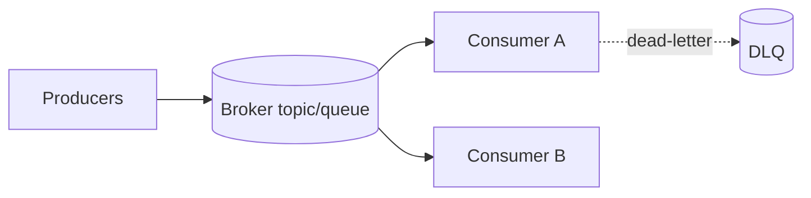

# Message Broker Selection

You pick a message broker for a workload. No broker is universal; each has sweet spots. Trade-offs stated honestly.

## Core rules

- **No default broker** — workload-driven
- **Ordering, delivery, durability are trade-offs** — not stackable without cost
- **Managed vs self-hosted matters** — ops burden is real
- **Replay is a superpower** — log-based vs queue-based is a fundamental divide
- **Hybrid valid** — different brokers per workload class is common
- **No fabricated workload** — work from supplied facts

## Input handling

| Dimension | Required | Default |
|---|---|---|
| **Workload description** | Yes | — |
| **Expected throughput** | Yes | — |
| **Delivery guarantee needed** | Yes | — |
| **Ordering requirement** | No | Asked |
| **Replay needs** | No | Asked |
| **Multi-consumer / fan-out** | No | Asked |
| **Cloud vs on-prem** | No | Asked |
| **Team operational capacity** | No | Asked |

## Phase 1 — Setup

```
**Workload**: [what messages, what volume]
**Throughput**: [msg/s peak + sustained]
**Message size**: [bytes typical / max]
**Delivery**: [at-most-once / at-least-once / exactly-once]
**Ordering**: [global / per-key / none]
**Replay**: [needed / not needed]
**Fan-out**: [1:1 / 1:N / N:N]
**Retention**: [hours / days / weeks]
**Cloud**: [AWS / GCP / Azure / on-prem / multi-cloud]
**Team capacity**: [managed-only / some ops / full ops]
**Existing ecosystem**: [any broker already in use]
```

Ask render mode per `diagram-rendering` mixin and output path (default: `/documentation/[case]/message-broker-selection/`).

## Phase 2 — Broker catalog

### Apache Kafka

**When to use**: high throughput / replay critical / event streaming / log-based retention / ordered per-partition
**When not**: very low throughput / simple work-queue / team without Kafka ops capacity (or use managed — Confluent Cloud / MSK / Aiven)
**Delivery**: at-least-once default; exactly-once via idempotent producer + transactions (within Kafka scope only)
**Ordering**: per-partition
**Replay**: yes (log-based, tunable retention)
**Ops burden**: high self-hosted; low managed
**Cost model**: node-hours + storage + egress; can be expensive at scale

### RabbitMQ

**When to use**: work queues / complex routing (topic/direct/fanout/headers) / RPC-over-queue / moderate throughput
**When not**: streaming / replay needed / very high throughput
**Delivery**: at-least-once via ack + publisher confirms
**Ordering**: per-queue
**Replay**: no (delete-after-consume unless using streams plugin)
**Ops burden**: moderate; plugins increase it
**Cost model**: node-hours; cheap at small-to-mid scale

### NATS + JetStream

**When to use**: low-latency / lightweight / Kubernetes-native / edge / streams + key-value + object-store combined
**When not**: massive retention / complex routing preferences
**Delivery**: at-most-once (core NATS); at-least-once + exactly-once (JetStream)
**Ordering**: per-stream + per-subject
**Replay**: yes via JetStream
**Ops burden**: low; single binary
**Cost model**: node-hours; efficient

### AWS SQS + SNS

**When to use**: AWS-native / simple queue (SQS) + fan-out (SNS) / zero-ops / low-to-moderate throughput
**When not**: replay / strict ordering beyond FIFO queues / very high per-partition throughput
**Delivery**: at-least-once (standard), exactly-once (FIFO)
**Ordering**: none (standard); per-group (FIFO)
**Replay**: no (once consumed, gone; use DLQ for failures)
**Ops burden**: minimal (managed)
**Cost model**: per-request + data transfer; cheap at low volume

### Google Pub/Sub

**When to use**: GCP-native / global / high throughput / push + pull / zero-ops
**When not**: strict ordering across topic (use ordered delivery per key but cost rises) / replay beyond retention window
**Delivery**: at-least-once; exactly-once subscription mode available
**Ordering**: with ordering keys (opt-in, perf impact)
**Replay**: seek + snapshots within retention
**Ops burden**: minimal
**Cost model**: per-GB + per-op

### Azure Service Bus

**When to use**: Azure-native / sessions + scheduled + dead-letter / transactional messaging
**When not**: high-throughput streaming (use Event Hubs)
**Delivery**: at-least-once; peek-lock ack model
**Ordering**: per-session
**Replay**: no (queue semantics)
**Ops burden**: minimal
**Cost model**: tier + ops; moderate

### Redis Streams

**When to use**: simple streaming / already running Redis / low-latency
**When not**: durability-critical workloads (Redis HA is possible but less robust than Kafka) / large retention
**Delivery**: at-least-once via consumer groups + XACK
**Ordering**: per-stream
**Replay**: yes within retention
**Ops burden**: moderate; AOF + replication discipline required
**Cost model**: memory-bound; cheap at small scale

### Apache Pulsar

**When to use**: multi-tenant / geo-replication / tiered storage / both queue + stream semantics
**When not**: small team (operational complexity) / simple workloads (Kafka / RabbitMQ simpler)
**Delivery**: at-least-once; exactly-once
**Ordering**: per-partition
**Replay**: yes (tiered storage enables long retention at lower cost)
**Ops burden**: high (BookKeeper + ZooKeeper / metadata store)
**Cost model**: node-hours; tiered storage reduces long-retention cost

### AWS Kinesis (Data Streams)

**When to use**: AWS-native streaming / Kafka-like semantics / KCL consumers
**When not**: non-AWS / very low throughput (SQS cheaper)
**Delivery**: at-least-once
**Ordering**: per-shard
**Replay**: yes within retention (up to 365 days)
**Ops burden**: minimal (managed)
**Cost model**: shard-hour + PUT payload

## Phase 3 — Decision factors

| Factor | What it captures |
|---|---|
| **Throughput fit** | Can broker handle sustained + peak msg/s? |
| **Ordering match** | Matches required ordering? |
| **Delivery match** | Provides required guarantee? |
| **Replay capability** | Log-based vs queue-based |
| **Fan-out model** | 1:N / N:N support |
| **Durability** | Replication + fsync options |
| **Operational burden** | Ops capacity vs broker complexity |
| **Cloud fit** | Native option available? |
| **Cost envelope** | Cost per msg + retention cost |
| **Ecosystem fit** | Already-used broker / team familiarity |

Score each broker 1–5 per factor against the workload.

## Phase 4 — Hybrid consideration

Multi-broker is common:
- **Kafka for event streaming + SQS for work queues**
- **Pub/Sub for ingestion + BigQuery for analytics**
- **NATS for internal + webhooks / REST for external**

Recommend splits when one broker doesn't fit all workload classes.

## Phase 5 — Recommendation

One paragraph:
- **Chosen broker (or hybrid)**
- **Why**: top 2–3 factors
- **Trade-offs accepted**: what the choice gives up
- **Escape hatch**: migration path if wrong
- **Managed vs self-hosted**: explicit call

## Phase 6 — Diagrams

### Broker-fit radar

```mermaid
xychart-beta
    title "Brokers across decision factors (1-5)"
    x-axis ["Throughput", "Ordering", "Delivery", "Replay", "Fan-out", "Ops", "Cost", "Cloud"]
    y-axis "Score" 0 --> 5
    bar [5, 4, 5, 5, 4, 2, 3, 4]
    bar [3, 4, 4, 1, 5, 4, 4, 4]
    bar [3, 2, 4, 1, 5, 5, 5, 5]
```



Bars = Kafka / RabbitMQ / SQS+SNS (or fill based on candidates).

### Topology



## Phase 7 — Diagram rendering

Per `diagram-rendering` mixin.

## Phase 8 — Report assembly and approval

```markdown
# Message Broker Selection: [Workload]

**Date**: [date]
**Workload**: [...]
**Recommended broker**: [...]
**Managed / self-hosted**: [...]

## Scope
[Workload, throughput, delivery, ordering, retention, cloud, team]

## Broker Catalog
[Options evaluated]

## Decision Factors
[Per-factor scoring]

## Hybrid Assessment
[If hybrid]

## Recommendation
[Chosen + trade-offs + escape hatch]

## Topology
[Producers, broker, consumers, DLQ]

## Diagrams
[Broker-fit radar + topology]

## Hand-offs
[Event schema, integration pattern, rate limiting]

## Assumptions & Limitations
```

Present for user approval. Save only after confirmation.

## Assessment + planning rules

- Workload facts drive selection
- Trade-offs explicit
- Managed vs self-hosted stated
- Hybrid valid
- Escape hatch included
- No fabricated workload

## Failure behavior

| Situation | Behavior |
|---|---|
| No workload context | Interview mode (§7) |
| "Kafka by default" | Challenge with ops + cost analysis |
| Exactly-once requested without nuance | Explain scope — within broker vs end-to-end |
| Replay needed + RabbitMQ requested | Flag — RabbitMQ streams plugin or switch broker |
| mmdc failure | See `diagram-rendering` mixin |
| Implementation request | "Selection only; impl is engineering." |

## Self-check

```
[] Workload declared
[] Brokers scored against factors
[] Delivery + ordering + replay discussed
[] Managed vs self-hosted stated
[] Hybrid assessed
[] Recommendation with trade-offs + escape hatch
[] Diagrams valid
[] No fabricated workload
[] Report follows output contract
```
