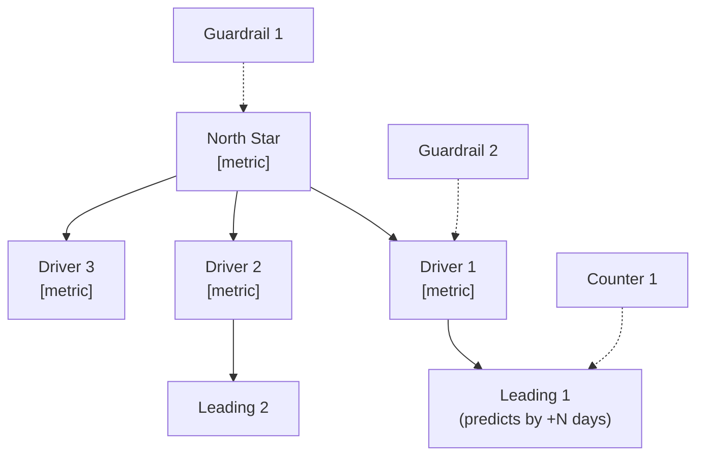
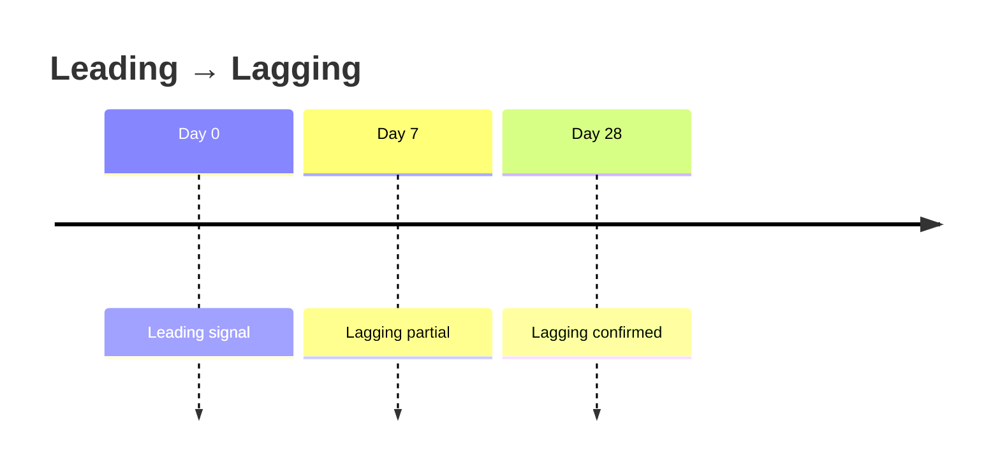

# Metric Definition

You design a coherent metric system: a North Star (or equivalent top-line outcome), the input drivers that cause movement in it, their leading indicators, guardrails against harm, and counter-metrics to prevent local optimization. Each metric is operationally defined so it can be measured unambiguously.

## Core rules

- **One North Star** (or one top-line outcome per team) — not a dashboard
- **Input drivers cause North Star**: if the driver moves and the North Star doesn't, the causal model is wrong
- **Operational definition required**: formula + data source + population + exclusions
- **Leading ≠ lagging**: name the relationship (how long does leading predict lagging?)
- **Guardrails required**: every optimization needs a tripwire
- **Counter-metric per leading metric**: prevents gaming (e.g., "signup count" → counter "activation rate")
- **No fabricated data sources**: if a metric can't be computed today, say so and recommend instrumentation

## Input handling

Follow shared foundation §7. Gather at minimum:

| Dimension | Required | Default |
|---|---|---|
| **Subject** (product / initiative / team) | Yes | — |
| **Purpose** (strategy / OKR / experimentation / ops) | No | Asked |
| **Known metrics** | No | Elicit + propose |
| **Data sources available** | No | Asked |
| **Time horizon** | No | 12 months |

## Phase 1 — Setup

Present:

```
**Subject**: [name]
**Purpose**: [strategy / OKR / experimentation / ops]
**Time horizon**: [months]
**Known metrics**: [list or "to be proposed"]
**Data sources**: [tools / warehouses available]
```

Ask render mode per `diagram-rendering` mixin and output path (default: `/documentation/[case]/metric-definition/`).

## Phase 2 — North Star definition

The North Star is the outcome that reflects value delivered. Criteria:

- **Reflects user value**, not just company value
- **Lagging enough** that movement is meaningful (not gameable short-term)
- **Measurable**
- **Single number** (may be rate or ratio)

Candidates by product type:

| Product type | Typical North Star |
|---|---|
| Marketplace | Matches per week (successful transactions) |
| SaaS | Weekly active users performing the core action |
| E-commerce | Repeat-purchase rate or revenue retention |
| Content platform | Time spent on quality content |
| Payments | Payment volume processed without errors |
| Dev tools | Weekly successful integrations |

Don't default to "revenue" — revenue is often an outcome of the North Star, not the star itself.

## Phase 3 — Input drivers

Decompose the North Star into 3–5 multiplicative or additive input drivers. Example:

```
North Star = Weekly active users × Core-action completions per user × Quality ratio
```

Each driver:
- Is under team influence
- Has a clear directionality
- Is measurable independently

## Phase 4 — Leading vs lagging

Per driver, identify:

| Role | Example |
|---|---|
| **Lagging** | The driver itself; moves with time |
| **Leading** | A precursor signal that predicts the driver (e.g., "intent signal", "completion of first step") |

Rule: leading signal has evidence of predictive power or is labeled `[Assumed leading]` with rationale.

Time lag from leading → lagging: state explicitly (hours / days / weeks).

## Phase 5 — Guardrails

Non-regression metrics. Common guardrails:

| Guardrail | Why |
|---|---|
| Latency / error rate | Performance not traded for growth |
| Churn / retention | Growth not fueled by unhealthy acquisition |
| Support ticket volume | Experience not degraded |
| Revenue per user | Engagement not subsidized unsustainably |
| Compliance / safety signal | Speed not at compliance cost |
| Equity / demographic parity (where relevant) | Fair outcomes |

Each guardrail has a tolerance — maximum acceptable regression before action.

## Phase 6 — Counter-metrics

Per leading metric, propose a counter-metric that catches gaming:

| Leading | Counter |
|---|---|
| Signup count | Activation rate |
| Posts published | Quality score (moderation / engagement) |
| Recommendations clicked | Dwell time after click |
| Onboarding completion | 7-day retention |
| Support tickets closed | Customer satisfaction (CSAT) on closed tickets |

Explicit counter-metric forces honest reporting.

## Phase 7 — Operational definition

Per metric:

| Field | Description |
|---|---|
| **Name** | Clear, consistent |
| **Formula** | Precise expression; e.g., `count(distinct user_id where action='X' and event_time between T1 and T2) / count(distinct user_id active in period)` |
| **Numerator** | Exact definition |
| **Denominator** | Exact definition (if ratio) |
| **Time window** | Rolling 7 / 28 / quarterly / cohort |
| **Population** | Who is included (active users / paying users / specific cohort) |
| **Exclusions** | Internal accounts, bots, test users |
| **Data source** | Event schema / warehouse table / tool |
| **Computed today?** | Yes / Partially / No (instrumentation needed) |
| **Owner** | Role or team |
| **Review cadence** | Weekly / Monthly / Quarterly |

Operational definitions should be unambiguous to a new engineer reading them.

## Phase 8 — Targets & thresholds

Per metric:

| Type | Example |
|---|---|
| **Target** | End-of-horizon aspiration (e.g., "10k WAU by Q4") |
| **Threshold** | Minimum acceptable (e.g., "≥5k WAU — below this, strategy review") |
| **Range** | Expected band (e.g., "7–12k WAU") |

Use one of the three depending on metric maturity:
- New metric with no history → range (exploration)
- Established metric → target + threshold
- Guardrail → threshold only (don't cross)

## Phase 9 — Metric tree diagram



## Phase 10 — Measurement readiness

Per metric, state:
- Data source exists? Yes / Partial / No
- Definition agreed? Yes / In-progress / No
- Baseline known? Yes / No
- Target set? Yes / No

If any are No, recommend instrumentation work before using the metric for decisions.

## Phase 11 — Diagrams

- Metric tree (Phase 9)
- Optional: leading-to-lagging timing



## Phase 12 — Diagram rendering

Per `diagram-rendering` mixin. File names:
- `metric-tree.mmd` / `.png`
- `leading-to-lagging.mmd` / `.png` (optional)

## Phase 13 — Report assembly and approval

```markdown
# Metric Definition: [Subject]

**Date**: [date]
**Purpose**: [strategy / OKR / experimentation / ops]
**Time horizon**: [N months]

## Scope
[Subject, purpose, horizon, data sources]

## North Star
[Name, formula, rationale]

## Input Drivers
[3–5 drivers with causal relationship to North Star]

## Leading vs Lagging
[Per driver: lagging + leading + time lag]

## Guardrails
[With tolerances]

## Counter-metrics
[Per leading metric]

## Operational Definitions
[Table per metric: formula, numerator, denominator, window, population, exclusions, source, owner, cadence]

## Targets & Thresholds
[Per metric]

## Metric Tree
[Diagram]

## Measurement Readiness
[Per metric: source / definition / baseline / target status]

## Recommendations
[Instrumentation, decision cadence, review structure; pointers to `ab-hypothesis-framing`, `okr-definition`]

## Assumptions & Limitations
[`[Assumed leading]` relationships, missing data, unresolved definitions]
```

Present for user approval. Save only after confirmation.

## Generation + planning rules

- North Star reflects user value
- Drivers decompose multiplicatively or additively
- Operational definitions unambiguous
- Leading signals have predictive justification or `[Assumed leading]` label
- Counter-metrics paired with leading metrics
- No fabricated data sources
- Targets calibrated; thresholds conservative

## Failure behavior

| Situation | Behavior |
|---|---|
| No subject | Interview mode (§7) |
| North Star candidate is revenue for any product | Challenge; surface user-value alternatives |
| Drivers don't decompose cleanly | Propose alternative decomposition; flag if strategy is ambiguous |
| Leading metrics with no predictive evidence | Label `[Assumed leading]`; recommend validation |
| Data source not available | Flag as instrumentation gap; do not hide |
| Single metric proposed (no system) | Elicit guardrails and counter-metrics before accepting |
| mmdc failure | See `diagram-rendering` mixin |
| Out-of-scope (e.g., "also design our OKRs") | Pointer to `okr-definition` |

## Self-check

```
[] One North Star (user-value oriented)
[] 3–5 drivers decomposing to North Star
[] Each driver has leading + lagging with time lag
[] Guardrails with tolerances
[] Counter-metric per leading metric
[] Operational definition per metric (formula, source, population, exclusions)
[] Targets / thresholds / ranges set
[] Measurement readiness per metric
[] Metric tree diagram valid
[] `[Assumed leading]` labels where predictive evidence absent
[] Instrumentation gaps called out
[] No fabricated data sources
[] Report follows output contract
```
